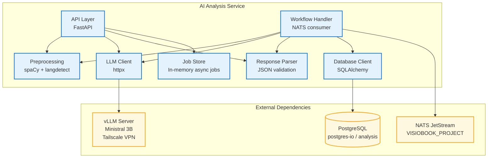

# API Documentation - AI Analysis Service

## Vue d'ensemble du service

### Role et responsabilites

Le **AI Analysis Service** analyse semantiquement les textes soumis par les utilisateurs et en extrait les scenes, personnages, analyse narrative, sentiment et resume. Il constitue la premiere etape du pipeline de generation VisioBook.

### Informations techniques

| Propriete | Valeur |
|-----------|--------|
| **Port** | 8083 |
| **Stack** | Python 3.12 + FastAPI + vLLM + spaCy |
| **LLM** | Ministral 3B Instruct (via vLLM, API OpenAI-compatible) |
| **Preprocessing** | spaCy (fr_core_news_lg, en_core_web_lg) |
| **Database** | PostgreSQL (postgres-io / analysis) via SQLAlchemy + asyncpg |
| **Messaging** | NATS JetStream |
| **Version API** | v1 |

## Architecture du service



## Schema de base de donnees

### Table: `analysis_results`

```sql
CREATE TABLE analysis_results (
    id UUID PRIMARY KEY DEFAULT gen_random_uuid(),
    project_id VARCHAR(255) NOT NULL,
    version_id VARCHAR(255) NOT NULL,
    execution_id VARCHAR(255) NOT NULL UNIQUE,
    user_id VARCHAR(255) NOT NULL,
    status VARCHAR(50) NOT NULL DEFAULT 'completed',
    scenes JSONB,
    characters JSONB,
    narrative JSONB,
    sentiment JSONB,
    summary JSONB,
    text_stats JSONB,
    language VARCHAR(10),
    processing_time_ms FLOAT,
    error TEXT,
    correlation_id VARCHAR(255),
    created_at TIMESTAMP WITH TIME ZONE DEFAULT NOW(),
    updated_at TIMESTAMP WITH TIME ZONE DEFAULT NOW()
);

CREATE INDEX ix_analysis_results_project_id ON analysis_results(project_id);
CREATE INDEX ix_analysis_results_version_id ON analysis_results(version_id);
CREATE UNIQUE INDEX ix_analysis_results_execution_id ON analysis_results(execution_id);
CREATE INDEX ix_analysis_results_user_id ON analysis_results(user_id);
CREATE INDEX ix_analysis_results_project_version ON analysis_results(project_id, version_id);
```

**Migrations**: Alembic (`alembic/versions/001_create_analysis_results.py`)

## Variables d'environnement

| Variable | Default | Description |
|----------|---------|-------------|
| `APP_NAME` | ai-analysis-service | Nom du service |
| `APP_PORT` | 8083 | Port HTTP |
| `VLLM_BASE_URL` | `http://localhost:8000` | URL serveur vLLM |
| `VLLM_MODEL_NAME` | `mistralai/Ministral-3-3B-Instruct-2512-BF16` | Modele LLM |
| `VLLM_API_KEY` | EMPTY | Token bearer pour vLLM |
| `VLLM_TIMEOUT` | 120.0 | Timeout appel LLM (secondes) |
| `VLLM_MAX_TOKENS` | 4096 | Max tokens en sortie |
| `VLLM_TEMPERATURE` | 0.1 | Temperature LLM (0.1 = deterministe) |
| `DATABASE_URL` | - | Connection string PostgreSQL |
| `DATABASE_POOL_SIZE` | 5 | Taille pool connexions DB |
| `DATABASE_MAX_OVERFLOW` | 10 | Connexions supplementaires max |
| `NATS_URL` | `nats://nats:4222` | URL NATS JetStream |
| `NATS_USER` | - | Utilisateur NATS (optionnel) |
| `NATS_PASSWORD` | - | Mot de passe NATS (optionnel) |
| `NATS_STREAM_NAME` | VISIOBOOK_PROJECT | Nom du stream JetStream |

## Authentification et securite

- **Pas de validation JWT** dans le service
- Istio ingress gateway valide le JWT et injecte le header `x-user-id`
- Le decorator `get_current_user` (FastAPI Dependency) extrait `x-user-id` du header
- **Retourne 404 (pas 403)** pour les ressources non possedees (prevention enumeration)
- Endpoints de sante (`/health`, `/ready`, `/metrics`) sont publics

## Endpoints HTTP

### POST `/api/v1/analyze`

Soumet un texte pour analyse asynchrone. Retourne un `job_id` pour polling.

**Request:**
```json
{
  "text": "Il etait une fois un roi...",
  "language": "auto",
  "options": {
    "characters": true,
    "scenes": true,
    "narrative": true,
    "summary": true,
    "mask_pii": true,
    "remove_links": false,
    "max_summary_length": 200
  }
}
```

**Response (202 Accepted):**
```json
{
  "job_id": "uuid",
  "status": "pending"
}
```

**Limites:** Max 500 000 caracteres par texte.

---

### GET `/api/v1/jobs/{job_id}`

Consulter le statut d'un job d'analyse.

**Response (200):**
```json
{
  "job_id": "uuid",
  "status": "completed",
  "step": null,
  "result": {
    "language": "fr",
    "text_stats": {
      "original_length": 5000,
      "cleaned_length": 4800,
      "sentence_count": 45,
      "word_count": 800,
      "quality_score": 0.85,
      "quality_assessment": "good"
    },
    "characters": [
      {
        "name": "Alice",
        "role": "protagonist",
        "physical_description": "jeune fille aux cheveux blonds",
        "personality_traits": ["brave", "curieuse"],
        "emotions": ["hopeful"],
        "motivations": [],
        "actions": ["marche dans la foret"],
        "relationships": []
      }
    ],
    "scenes": [
      {
        "scene_id": "1",
        "title": "La foret sombre",
        "text_excerpt": "Alice marcha dans la foret...",
        "characters_present": ["Alice"],
        "setting": {
          "location": "foret",
          "time_period": "moyen age",
          "time_of_day": "matin"
        },
        "atmosphere": {
          "mood": "mysterious",
          "lighting": "dim",
          "weather": "fog",
          "colors": ["green", "grey"],
          "sounds_textures": {
            "sounds": ["oiseaux"],
            "textures": ["feuilles"]
          }
        },
        "key_events": ["Alice entre dans la foret"],
        "objects": ["arbres", "sentier"]
      }
    ],
    "narrative": {
      "themes": ["aventure", "decouverte"],
      "tone": "mysterious",
      "style": "conte",
      "point_of_view": "third person",
      "tension_level": "medium",
      "pacing": "moderate",
      "literary_devices": ["metaphore"]
    },
    "sentiment": {
      "overall": "neutral",
      "polarity": 0.1,
      "nuances": ["curiosite", "apprehension"],
      "emotional_arc": "ascending"
    },
    "summary": {
      "summary": "Alice explore une foret mysterieuse...",
      "key_points": ["depart aventure", "rencontre"],
      "original_length": 5000,
      "summary_length": 120
    },
    "processing_time_ms": 15234.5
  },
  "error": null,
  "created_at": "2026-04-02T15:00:00Z",
  "updated_at": "2026-04-02T15:00:15Z"
}
```

**Statuts possibles:** `pending` → `processing` → `completed` | `failed`

> **Note:** Les jobs sont stockes en memoire et supprimes automatiquement apres 1 heure.

---

### POST `/api/v1/analyze/batch`

Analyse synchrone de plusieurs textes (max 50).

**Request:**
```json
{
  "texts": ["Texte 1...", "Texte 2..."],
  "language": "auto",
  "options": { "characters": true, "scenes": true }
}
```

**Response (200):**
```json
{
  "results": [ /* Array of AnalyzeResponse */ ],
  "total_processing_time_ms": 30000.0,
  "success_count": 2,
  "error_count": 0
}
```

---

### GET `/api/v1/results/{execution_id}`

Recuperer un resultat d'analyse persiste (issu du workflow NATS).

**Headers:** `x-user-id` (requis)

**Response (200):**
```json
{
  "execution_id": "uuid",
  "project_id": "uuid",
  "version_id": "uuid",
  "status": "completed",
  "scenes": [ /* mapped scenes */ ],
  "characters": [ /* mapped characters */ ],
  "narrative": { /* ... */ },
  "sentiment": { /* ... */ },
  "summary": { /* ... */ },
  "text_stats": { /* ... */ },
  "language": "fr",
  "processing_time_ms": 15234.5,
  "error": null
}
```

**Erreurs:** 404 si inexistant ou non possede par l'utilisateur.

---

### GET `/api/v1/results/project/{project_id}`

Lister toutes les analyses d'un projet (triees par date decroissante).

**Headers:** `x-user-id` (requis)

**Response (200):** Array de `AnalysisResultResponse`.

---

### GET `/health`

Liveness check. Toujours 200.

### GET `/ready`

Readiness check. Verifie vLLM + Database.

```json
{
  "status": "ready",
  "service": "ai-analysis-service",
  "version": "2.0.0",
  "timestamp": "2026-04-02T15:00:00Z",
  "checks": {
    "api": true,
    "vllm": true,
    "database": true
  }
}
```

### GET `/metrics`

Metriques systeme (CPU, RAM, disque).

## Contrats NATS JetStream

### Subscribe: `visiobook.project.workflow.started`

- **Stream:** VISIOBOOK_PROJECT
- **Consumer durable:** `ai-analysis-workflow-started`
- **Ack policy:** Explicit

**Payload:**
```json
{
  "projectId": "uuid",
  "versionId": "uuid",
  "executionId": "uuid",
  "userId": "uuid",
  "contentText": "Texte complet a analyser",
  "config": { "language": "fr", "style": "realistic" },
  "correlationId": "uuid"
}
```

### Publish: `visiobook.ai.analysis.completed`

```json
{
  "projectId": "uuid",
  "versionId": "uuid",
  "executionId": "uuid",
  "userId": "uuid",
  "scenes": [
    {
      "order": 0,
      "text": "extrait",
      "description": "titre",
      "imagePrompt": "prompt pour generation image",
      "duration": 5,
      "sentiment": "mysterious"
    }
  ],
  "characters": [
    {
      "name": "Alice",
      "description": "protagonist. jeune fille",
      "aliases": [],
      "traits": ["brave"]
    }
  ],
  "correlationId": "uuid"
}
```

### Publish: `visiobook.ai.analysis.failed`

```json
{
  "projectId": "uuid",
  "versionId": "uuid",
  "executionId": "uuid",
  "userId": "uuid",
  "error": "LLM analysis failed: timeout",
  "correlationId": "uuid"
}
```

### Publish: `visiobook.ai.progress`

```json
{
  "projectId": "uuid",
  "versionId": "uuid",
  "executionId": "uuid",
  "step": "analysis",
  "progress": 80,
  "correlationId": "uuid"
}
```

## Sante et monitoring

| Endpoint | Methode | Description |
|----------|---------|-------------|
| `/health` | GET | Liveness — toujours 200 |
| `/ready` | GET | Readiness — verifie vLLM + DB |
| `/metrics` | GET | CPU, RAM, disque (psutil) |
