# Patterns de Déploiement Helm et Istio : Guide Complet

## Table des Matières

1. [Introduction](#introduction)
2. [Pattern 1 : Charts Helm par Service](#pattern-1--charts-helm-par-service)
3. [Pattern 2 : Charts Centralisés](#pattern-2--charts-centralisés)
4. [Comparaison Détaillée](#comparaison-détaillée)
5. [Patterns Industriels](#patterns-industriels)
6. [Recommandations](#recommandations)
7. [Stratégie de Migration](#stratégie-de-migration)

## Introduction

Dans l'écosystème Kubernetes, il existe **deux dimensions indépendantes** à
considérer :

1. **Gestion des déploiements** : Comment organiser les charts Helm
2. **Architecture de communication** : Comment les services communiquent entre
   eux

Ces deux dimensions se combinent pour créer **4 patterns possibles**. Ce
document analyse toutes ces combinaisons pour vous aider à choisir la meilleure
approche pour votre service de base de données centralisé.

## Matrice Complète des Possibilités

### Vue d'Ensemble des 4 Combinaisons

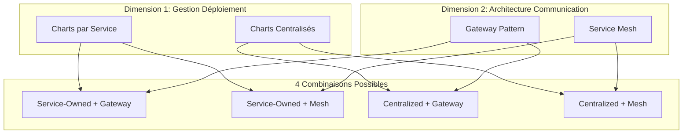

### Votre Situation Actuelle (Point de Départ)

**Avant implémentation :**

- ❌ Pas de charts Helm standardisés
- ❌ Architecture de communication non définie
- ✅ Liberté totale de choix
- ✅ Opportunité d'adopter les meilleures pratiques

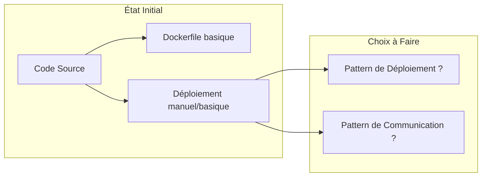

## Combinaison 1 : Charts par Service + Gateway Pattern

### Architecture

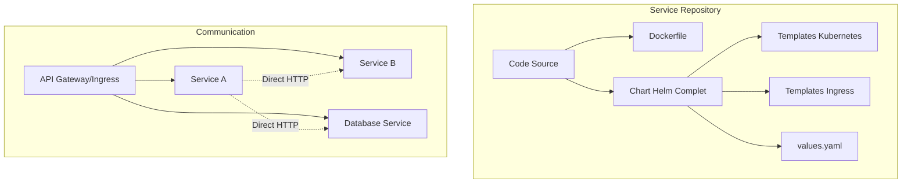

**Caractéristiques :**

- Chaque service gère son propre chart Helm
- Communication via API Gateway traditionnel
- Pas de service mesh (communication directe)

## Combinaison 2 : Charts par Service + Service Mesh

### Architecture

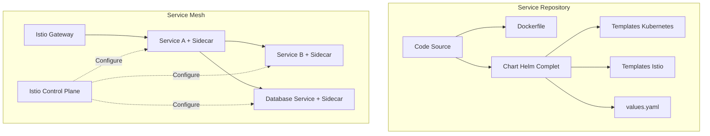

**Caractéristiques :**

- Chaque service gère son propre chart Helm avec ressources Istio
- Communication via service mesh avec sidecars
- Observabilité et sécurité avancées

## Combinaison 3 : Charts Centralisés + Gateway Pattern

### Architecture

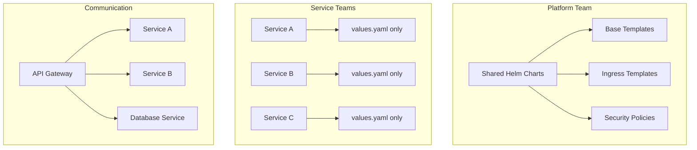

**Caractéristiques :**

- Platform team gère les charts avec templates Ingress
- Services fournissent uniquement leurs configurations
- Communication traditionnelle via API Gateway

## Combinaison 4 : Charts Centralisés + Service Mesh

### Architecture

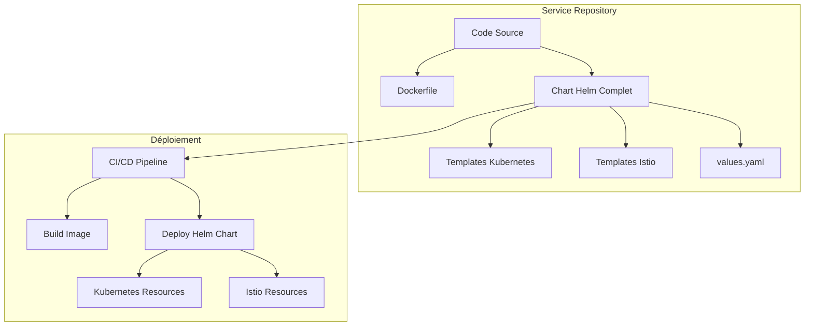

### Structure du Repository

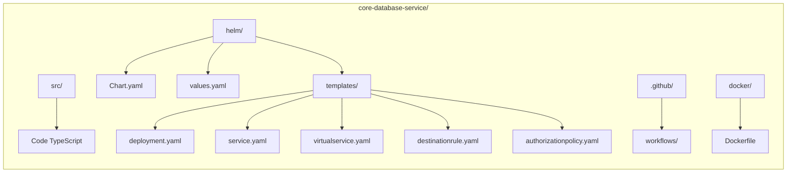

### Flux de Déploiement

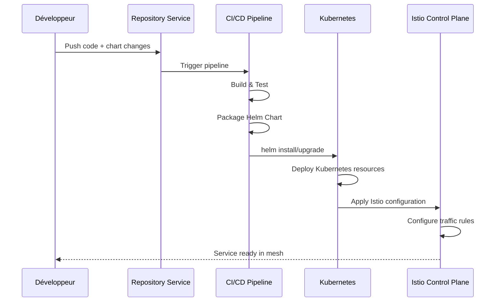

### Avantages et Inconvénients

| Aspect          | Avantages ✅                                | Inconvénients ❌                        |
| --------------- | ------------------------------------------- | --------------------------------------- |
| **Autonomie**   | Équipes indépendantes, déploiements rapides | Risque de divergence entre services     |
| **Versioning**  | Chart couplé à l'application                | Gestion complexe des dépendances        |
| **Maintenance** | Contrôle total par l'équipe                 | Duplication de configuration            |
| **Évolutivité** | Adaptation rapide aux besoins               | Mise à jour Istio sur tous les services |

## Combinaison 4 : Charts Centralisés + Service Mesh (Suite)

### Architecture

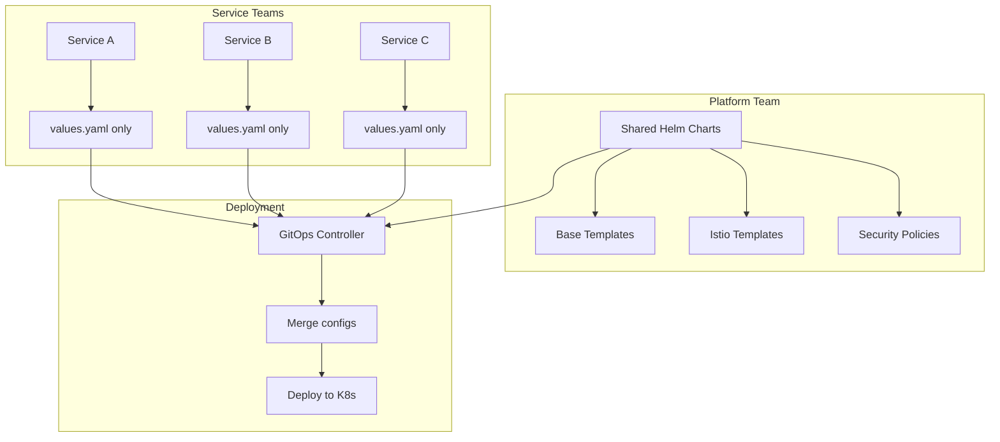

### Structure Organisationnelle

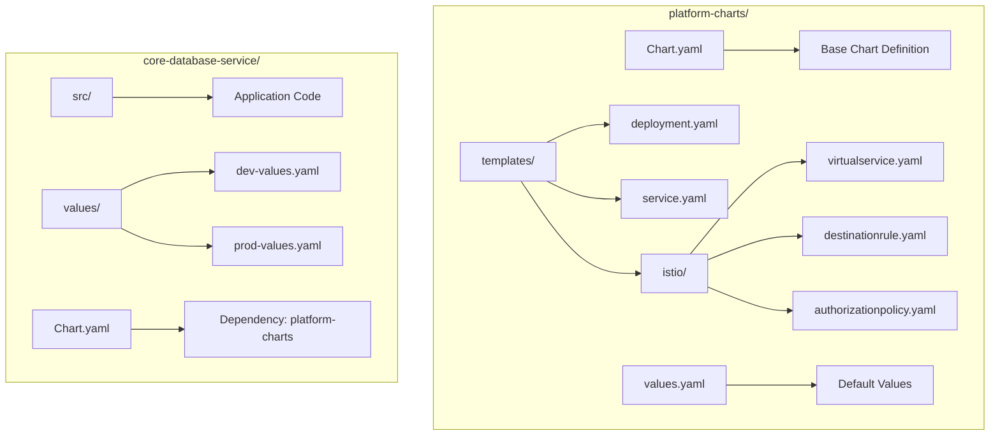

### Flux de Déploiement Centralisé

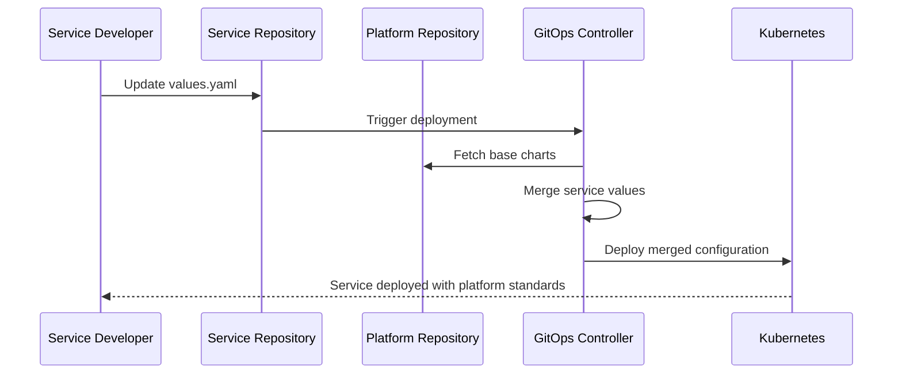

**Caractéristiques :**

- Platform team gère les charts avec templates Istio
- Services fournissent uniquement leurs configurations
- Communication via service mesh géré centralement

### Avantages et Inconvénients

| Aspect          | Avantages ✅                                  | Inconvénients ❌                              |
| --------------- | --------------------------------------------- | --------------------------------------------- |
| **Consistance** | Configuration uniforme, standards appliqués   | Moins de flexibilité par service              |
| **Maintenance** | Mise à jour centralisée, expertise concentrée | Goulot d'étranglement sur l'équipe plateforme |
| **Sécurité**    | Politiques uniformes, audit centralisé        | Délais pour changements spécifiques           |
| **Évolutivité** | Montée en charge simplifiée                   | Complexité initiale élevée                    |

## Comparaison des 4 Combinaisons

### Matrice de Décision Complète

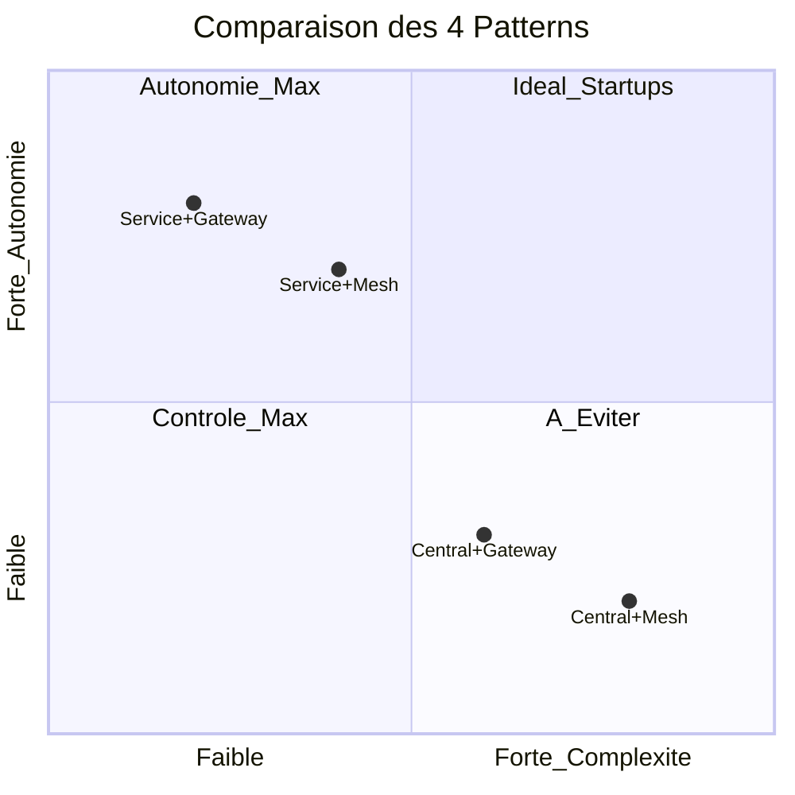

### Tableau Comparatif Détaillé

| Critère                 | Service+Gateway      | Service+Mesh        | Central+Gateway  | Central+Mesh         |
| ----------------------- | -------------------- | ------------------- | ---------------- | -------------------- |
| **Complexité initiale** | ⭐ Très faible       | ⭐⭐ Faible         | ⭐⭐⭐ Moyenne   | ⭐⭐⭐⭐ Élevée      |
| **Autonomie équipes**   | ⭐⭐⭐⭐ Maximale    | ⭐⭐⭐⭐ Maximale   | ⭐⭐ Limitée     | ⭐ Très limitée      |
| **Observabilité**       | ⭐ Basique           | ⭐⭐⭐⭐ Excellente | ⭐⭐ Moyenne     | ⭐⭐⭐⭐ Excellente  |
| **Sécurité**            | ⭐⭐ Manuelle        | ⭐⭐⭐ Automatique  | ⭐⭐⭐ Contrôlée | ⭐⭐⭐⭐ Maximale    |
| **Maintenance**         | ⭐ Coûteuse          | ⭐⭐ Modérée        | ⭐⭐⭐ Optimisée | ⭐⭐⭐⭐ Centralisée |
| **Time to Market**      | ⭐⭐⭐⭐ Très rapide | ⭐⭐⭐ Rapide       | ⭐⭐ Modéré      | ⭐ Lent              |

### Critères de Choix par Contexte

| Contexte Organisation              | Recommandation  | Justification                       |
| ---------------------------------- | --------------- | ----------------------------------- |
| **Startup < 5 services**           | Service+Gateway | Simplicité maximale, focus produit  |
| **Scale-up 5-15 services**         | Service+Mesh    | Autonomie + observabilité           |
| **Enterprise 15-50 services**      | Central+Gateway | Gouvernance + simplicité            |
| **Large Enterprise > 50 services** | Central+Mesh    | Contrôle maximal + observabilité    |
| **Équipe DevOps junior**           | Service+Gateway | Courbe d'apprentissage douce        |
| **Équipe DevOps experte**          | Central+Mesh    | Exploitation maximale des capacités |

## Chemins d'Évolution depuis Votre Point de Départ

### Roadmap de Choix Architectural

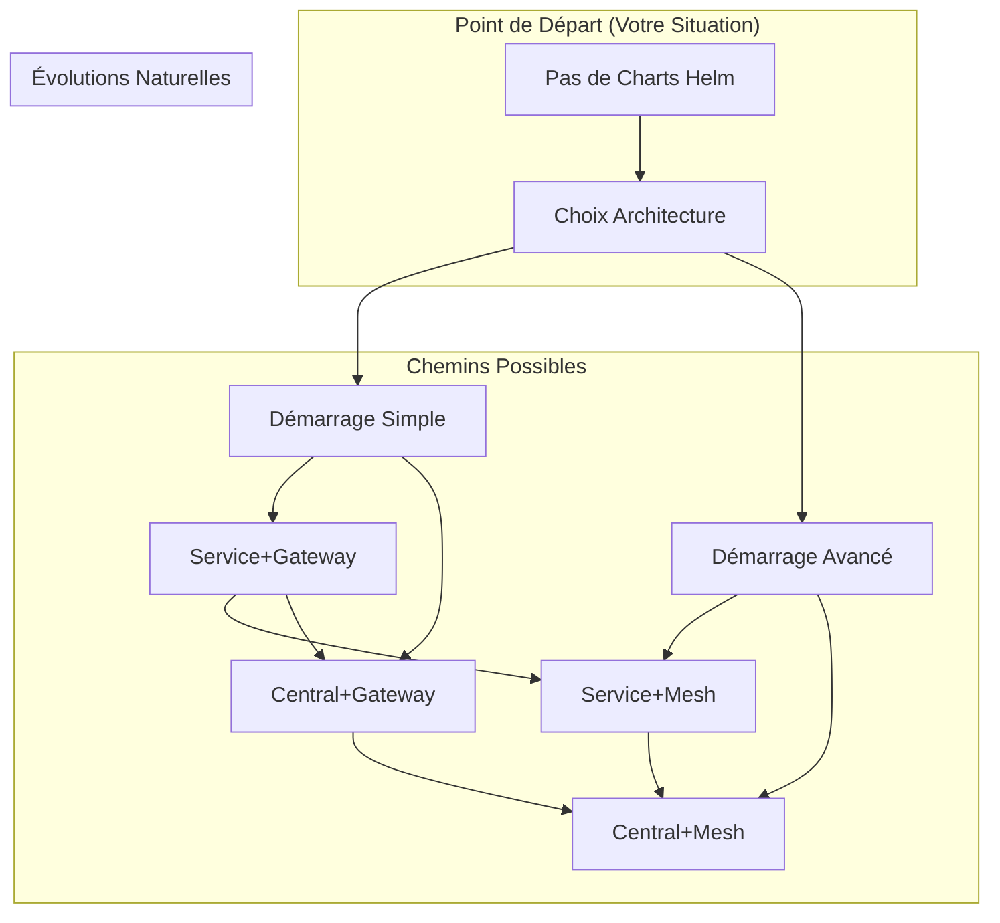

### Recommandation Spécifique pour Votre Contexte

**Votre service de base de données centralisé** a des besoins particuliers :

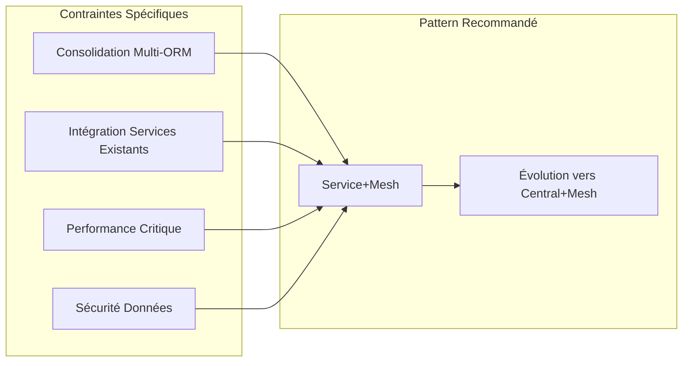

**Justification du choix Service+Mesh :**

1. **Autonomie initiale** : Développement rapide sans dépendance plateforme
2. **Observabilité critique** : Traçabilité des requêtes de consolidation
3. **Sécurité renforcée** : mTLS automatique pour données sensibles
4. **Évolutivité** : Migration future vers centralisation facilitée

## Patterns Industriels

### Gateway Pattern (Traditionnel)

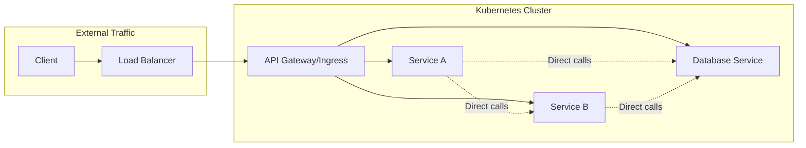

**Caractéristiques :**

- Point d'entrée unique
- Communication interne directe
- Observabilité limitée entre services
- Configuration centralisée au gateway

### Service Mesh Pattern (Moderne)

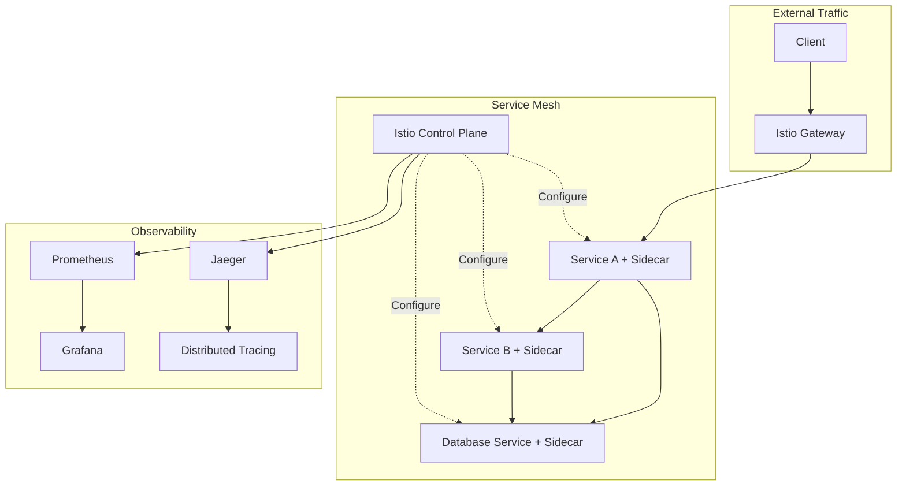

**Caractéristiques :**

- Chaque service dans le mesh
- Observabilité complète
- Sécurité mTLS automatique
- Gestion de trafic avancée

## Recommandations

### Pour le Service de Base de Données Centralisé

Compte tenu de votre contexte spécifique :

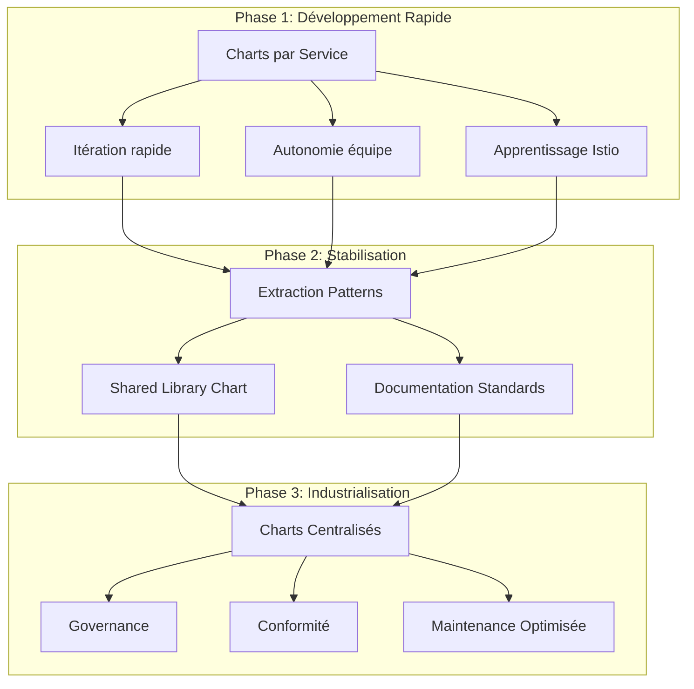

### Approche Hybride Recommandée

1. **Démarrage** : Charts par service pour la vélocité
2. **Patterns communs** : Extraction vers une librairie partagée
3. **Évolution** : Migration progressive vers centralisation

### Configuration Spécifique Database Service

```yaml
# values.yaml - Configuration service-specific
database:
  type: 'postgresql'
  consolidation:
    enabled: true
    sources:
      - nestjs-services
      - fastapi-services
      - go-services

istio:
  virtualService:
    routes:
      - match: '/api/v1/databases/*'
        destination: 'core-database-service'
  destinationRule:
    trafficPolicy:
      circuitBreaker:
        enabled: true
      retries:
        attempts: 3
```

## Stratégie de Migration

### Roadmap de Transition

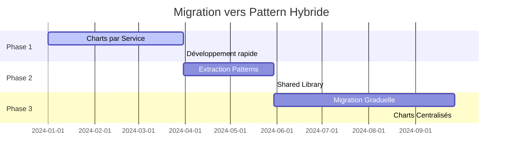

### Étapes de Migration

| Étape               | Durée      | Actions                | Livrables            |
| ------------------- | ---------- | ---------------------- | -------------------- |
| **1. Analyse**      | 2 semaines | Audit charts existants | Rapport patterns     |
| **2. Extraction**   | 4 semaines | Créer shared library   | Chart commun         |
| **3. Pilote**       | 3 semaines | Migrer 1-2 services    | Validation approche  |
| **4. Déploiement**  | 8 semaines | Migration progressive  | Tous services migrés |
| **5. Optimisation** | 4 semaines | Ajustements finaux     | Documentation finale |

### Critères de Succès

- ✅ Réduction 50% duplication configuration
- ✅ Temps déploiement < 5 minutes
- ✅ Conformité sécurité 100%
- ✅ Satisfaction équipes > 80%

---

## Conclusion

Pour votre service de base de données centralisé, l'approche **hybride** offre
le meilleur équilibre entre vélocité de développement et gouvernance à long
terme. Commencez par des charts par service pour itérer rapidement, puis évoluez
vers une centralisation progressive basée sur les patterns éprouvés.

Cette stratégie vous permettra de :

- Livrer rapidement votre MVP
- Apprendre les bonnes pratiques Istio
- Construire une base solide pour l'industrialisation
- Maintenir l'autonomie des équipes tout en assurant la cohérence
