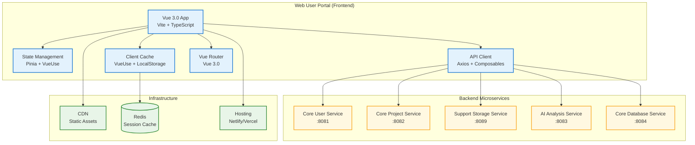
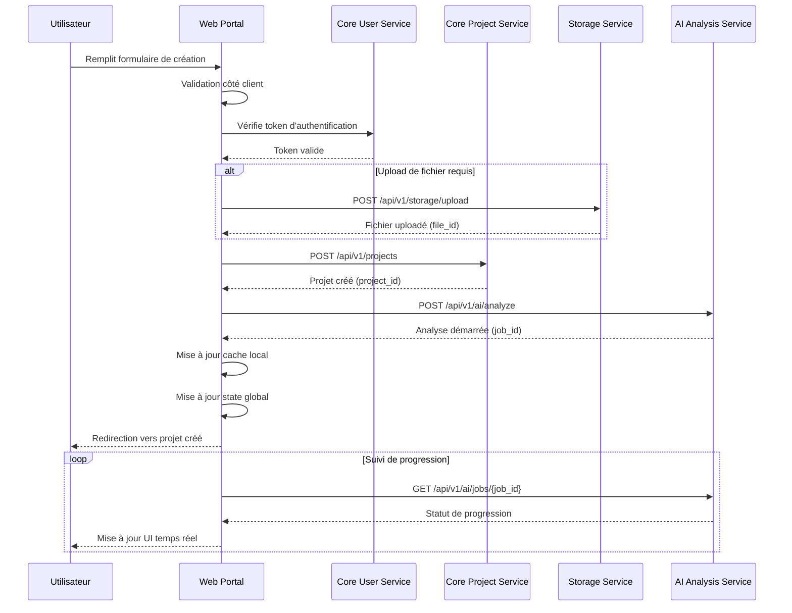
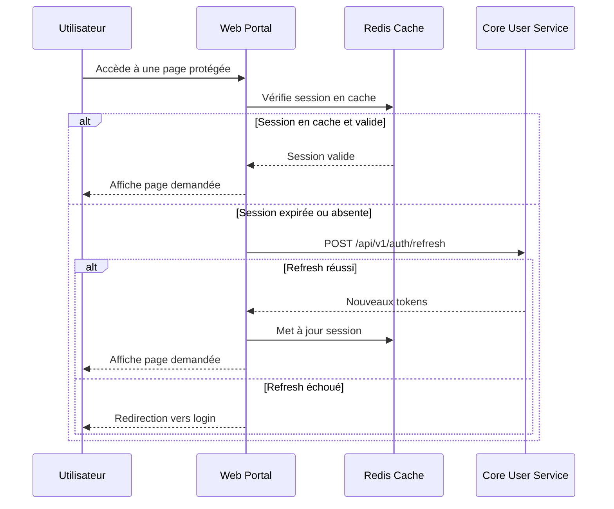
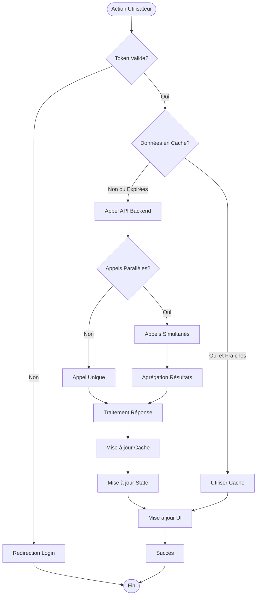

# API Documentation - Web User Portal

## Vue d'ensemble du service

### Rôle et responsabilités
Le **Web User Portal** est l'interface utilisateur frontend de Visiobook. Il orchestre les appels vers les microservices backend pour offrir une expérience utilisateur fluide. Ce service ne gère pas de données directement mais consomme les APIs des autres microservices.

### Justification de l'atomisation
- **Séparation des préoccupations** : Interface utilisateur découplée de la logique métier
- **Évolutivité frontend** : Mise à jour de l'UI indépendamment des services backend
- **Performance** : Optimisation spécifique pour l'expérience utilisateur (SSR, cache edge)
- **Déploiement** : Déploiement indépendant avec CDN et cache edge

### Informations techniques
- **Port** : 3000 (dev), 80/443 (prod)
- **Technology Stack** : Vue 3.0 + Vite + TypeScript + TailwindCSS
- **State Management** : Pinia + VueUse + Axios
- **Authentication** : Délégué au Core User Service
- **Version API** : v1

## Architecture du service



### Schémas de données côté client

#### Cache Redis - Sessions utilisateur
```sql
-- Session cache structure (Redis)
KEY: session:{user_id}
VALUE: {
  "user": {
    "id": "user_123456789",
    "email": "user@example.com",
    "role": "premium",
    "subscription_type": "premium"
  },
  "tokens": {
    "access_token": "jwt_token_here",
    "refresh_token": "refresh_token_here",
    "expires_at": "2024-01-15T11:30:00Z"
  },
  "preferences": {
    "theme": "dark",
    "language": "fr"
  }
}
TTL: 86400 (24h)

-- Project cache
KEY: projects:{user_id}
VALUE: [
  {
    "id": "proj_123",
    "title": "Mon Projet",
    "status": "active",
    "updated_at": "2024-01-15T10:30:00Z"
  }
]
TTL: 300 (5min)
```

#### State Management - Pinia Stores
```typescript
// User Store (Pinia)
export const useUserStore = defineStore('user', {
  state: () => ({
    user: null as User | null,
    isAuthenticated: false,
    isLoading: false
  }),

  getters: {
    userRole: (state) => state.user?.role,
    subscriptionType: (state) => state.user?.subscription_type
  },

  actions: {
    async login(credentials: LoginCredentials) {
      this.isLoading = true;
      // Appel API vers Core User Service
    },

    async logout() {
      this.user = null;
      this.isAuthenticated = false;
    },

    async refreshToken() {
      // Appel API de refresh
    }
  }
});

// Project Store (Pinia)
export const useProjectStore = defineStore('project', {
  state: () => ({
    projects: [] as Project[],
    currentProject: null as Project | null,
    isLoading: false
  }),

  actions: {
    async fetchProjects() {
      // Appel API vers Core Project Service
    },

    async createProject(data: CreateProjectData) {
      // Appel API de création
    },

    async updateProject(id: string, data: UpdateProjectData) {
      // Appel API de mise à jour
    }
  }
});

// UI Store (Pinia)
export const useUIStore = defineStore('ui', {
  state: () => ({
    sidebarOpen: false,
    theme: 'light' as 'light' | 'dark',
    notifications: [] as Notification[]
  }),

  actions: {
    setSidebarOpen(open: boolean) {
      this.sidebarOpen = open;
    },

    setTheme(theme: 'light' | 'dark') {
      this.theme = theme;
    }
  }
});
```

### Variables d'environnement

```bash
# Application
VITE_APP_URL=https://app.visiobook.com
NODE_ENV=production

# Backend Services URLs
VITE_USER_SERVICE_URL=https://api.visiobook.com:8081
VITE_PROJECT_SERVICE_URL=https://api.visiobook.com:8082
VITE_STORAGE_SERVICE_URL=https://api.visiobook.com:8089
VITE_AI_SERVICE_URL=https://api.visiobook.com:8083
VITE_DATABASE_SERVICE_URL=https://api.visiobook.com:8084

# CDN & Assets
VITE_CDN_URL=https://cdn.visiobook.com
VITE_UPLOAD_MAX_SIZE=100MB

# Cache & Performance
REDIS_URL=redis://localhost:6379
VITE_CACHE_TTL=300

# Analytics & Monitoring
VITE_ANALYTICS_ID=your-analytics-id
VITE_SENTRY_DSN=your-sentry-dsn

# Feature Flags
VITE_ENABLE_AI_FEATURES=true
VITE_ENABLE_COLLABORATION=true
VITE_ENABLE_PREMIUM_FEATURES=true

# Development
VITE_DEV_MODE=true
VITE_API_TIMEOUT=30000
```

## Authentification et sécurité

### Délégation au Core User Service
Le Web User Portal ne gère pas l'authentification directement. Tous les appels d'authentification sont délégués au Core User Service.

### Headers pour appels sortants
```http
Authorization: Bearer <jwt_token_from_core_user_service>
Content-Type: application/json
X-Client-Version: 1.0.0
X-Request-ID: <unique_request_id>
X-User-Agent: VisioBook-WebPortal/1.0.0
```

### Gestion des tokens côté client
```typescript
// Token management
interface TokenManager {
  getAccessToken(): string | null;
  getRefreshToken(): string | null;
  setTokens(tokens: TokenPair): void;
  clearTokens(): void;
  isTokenExpired(token: string): boolean;
  refreshAccessToken(): Promise<string>;
}
```

## Endpoints API (Appels sortants vers microservices)

### Health & Monitoring

#### GET /api/health
**Description** : Health check du frontend et connectivité aux microservices

**Permissions** : Aucune

**Appels sortants** :
- `GET {USER_SERVICE_URL}/health`
- `GET {PROJECT_SERVICE_URL}/health`
- `GET {STORAGE_SERVICE_URL}/health`
- `GET {AI_SERVICE_URL}/health`
- `GET {DATABASE_SERVICE_URL}/health`

**Réponse** :
```json
{
  "status": "UP",
  "timestamp": "2024-01-15T10:30:00Z",
  "service": "web-user-portal",
  "version": "1.0.0",
  "backend_services": {
    "core_user_service": {
      "status": "UP",
      "url": "https://api.visiobook.com:8081",
      "responseTime": "45ms"
    },
    "core_project_service": {
      "status": "UP",
      "url": "https://api.visiobook.com:8082",
      "responseTime": "32ms"
    },
    "support_storage_service": {
      "status": "UP",
      "url": "https://api.visiobook.com:8089",
      "responseTime": "67ms"
    },
    "ai_analysis_service": {
      "status": "UP",
      "url": "https://api.visiobook.com:8083",
      "responseTime": "123ms"
    },
    "core_database_service": {
      "status": "UP",
      "url": "https://api.visiobook.com:8084",
      "responseTime": "28ms"
    }
  },
  "cache": {
    "redis_connected": true,
    "cached_sessions": 1247
  }
}
```

### Authentication (Délégué au Core User Service)

#### Action: User Login
**Description** : Connexion utilisateur via le Core User Service

**Appel sortant** :
```http
POST {USER_SERVICE_URL}/api/v1/auth/login
Content-Type: application/json

{
  "email": "user@example.com",
  "password": "SecurePassword123!",
  "remember_me": true,
  "device_info": {
    "device_type": "web",
    "browser": "Chrome",
    "os": "Windows 10"
  }
}
```

**Traitement côté frontend** :
1. Validation des données côté client
2. Appel au Core User Service
3. Stockage des tokens en cache sécurisé
4. Mise à jour du state global
5. Redirection vers dashboard

**Réponse traitée** :
```json
{
  "success": true,
  "user": {
    "id": "user_123456789",
    "email": "user@example.com",
    "role": "premium",
    "subscription_type": "premium"
  },
  "tokens": {
    "access_token": "eyJhbGciOiJIUzI1NiIsInR5cCI6IkpXVCJ9...",
    "refresh_token": "refresh_token_here",
    "expires_in": 86400
  },
  "redirect_url": "/dashboard"
}
```

#### Action: User Registration
**Description** : Inscription utilisateur via le Core User Service

**Appel sortant** :
```http
POST {USER_SERVICE_URL}/api/v1/auth/register
Content-Type: application/json

{
  "email": "user@example.com",
  "password": "SecurePassword123!",
  "username": "johndoe",
  "first_name": "John",
  "last_name": "Doe",
  "language": "fr",
  "accept_terms": true,
  "marketing_consent": false
}
```

#### Action: Token Refresh
**Description** : Renouvellement automatique des tokens

**Appel sortant** :
```http
POST {USER_SERVICE_URL}/api/v1/auth/refresh
Content-Type: application/json

{
  "refresh_token": "refresh_token_here"
}
```

### User Management (Délégué au Core User Service)

#### Action: Get User Profile
**Description** : Récupération du profil utilisateur

**Appel sortant** :
```http
GET {USER_SERVICE_URL}/api/v1/users/profile
Authorization: Bearer <access_token>
```

**Cache côté frontend** :
- **TTL** : 300 secondes (5 minutes)
- **Invalidation** : Lors de la mise à jour du profil
- **Stratégie** : Cache-first avec revalidation en arrière-plan

#### Action: Update User Profile
**Description** : Mise à jour du profil utilisateur

**Appel sortant** :
```http
PUT {USER_SERVICE_URL}/api/v1/users/profile
Authorization: Bearer <access_token>
Content-Type: application/json

{
  "first_name": "John",
  "last_name": "Smith",
  "bio": "Créateur de contenu",
  "preferences": {
    "theme": "dark",
    "language": "fr"
  }
}
```

**Post-traitement** :
1. Invalidation du cache utilisateur
2. Mise à jour du state global
3. Notification de succès
4. Revalidation des données

### Project Management (Délégué au Core Project Service)

#### Action: List Projects
**Description** : Récupération de la liste des projets

**Appel sortant** :
```http
GET {PROJECT_SERVICE_URL}/api/v1/projects?page=1&limit=20&status=active
Authorization: Bearer <access_token>
```

**Cache côté frontend** :
- **TTL** : 60 secondes
- **Invalidation** : Création/modification de projet
- **Pagination** : Gérée côté client avec cache par page

#### Action: Create Project
**Description** : Création d'un nouveau projet

**Séquence d'appels** :
1. **Upload du fichier** (si nécessaire) :
```http
POST {STORAGE_SERVICE_URL}/api/v1/storage/upload
Authorization: Bearer <access_token>
Content-Type: multipart/form-data
```

2. **Création du projet** :
```http
POST {PROJECT_SERVICE_URL}/api/v1/projects
Authorization: Bearer <access_token>
Content-Type: application/json

{
  "title": "Mon Nouveau Projet",
  "description": "Description du projet",
  "content": "Contenu textuel ou file_id",
  "settings": {
    "style": "realistic",
    "language": "fr",
    "duration": "medium"
  }
}
```

3. **Démarrage de l'analyse IA** :
```http
POST {AI_SERVICE_URL}/api/v1/ai/analyze
Authorization: Bearer <access_token>
Content-Type: application/json

{
  "project_id": "proj_123456789",
  "analysis_type": "content_analysis",
  "priority": "normal"
}
```

#### Action: Get Project Details
**Description** : Récupération des détails d'un projet

**Séquence d'appels parallèles** :
1. **Données du projet** :
```http
GET {PROJECT_SERVICE_URL}/api/v1/projects/{project_id}
Authorization: Bearer <access_token>
```

2. **Fichiers associés** :
```http
GET {STORAGE_SERVICE_URL}/api/v1/storage/files?project_id={project_id}
Authorization: Bearer <access_token>
```

3. **Statut des analyses IA** :
```http
GET {AI_SERVICE_URL}/api/v1/ai/jobs?project_id={project_id}
Authorization: Bearer <access_token>
```

### File Management (Délégué au Support Storage Service)

#### Action: Upload File
**Description** : Upload de fichier avec suivi de progression

**Appel sortant** :
```http
POST {STORAGE_SERVICE_URL}/api/v1/storage/upload
Authorization: Bearer <access_token>
Content-Type: multipart/form-data

--boundary123
Content-Disposition: form-data; name="file"; filename="document.pdf"
Content-Type: application/pdf

[binary data]
--boundary123
Content-Disposition: form-data; name="metadata"

{
  "project_id": "proj_123456789",
  "description": "Document source",
  "tags": ["document", "source"]
}
--boundary123--
```

**Gestion côté frontend** :
- Barre de progression en temps réel
- Support de l'upload resumable pour gros fichiers
- Validation côté client avant upload
- Retry automatique en cas d'échec

#### Action: Download File
**Description** : Téléchargement de fichier

**Appel sortant** :
```http
GET {STORAGE_SERVICE_URL}/api/v1/storage/download/{file_id}
Authorization: Bearer <access_token>
```

**Optimisations** :
- Utilisation des URLs CDN quand disponibles
- Cache des URLs de téléchargement
- Support du streaming pour les gros fichiers

### AI Processing (Délégué au AI Analysis Service)

#### Action: Start Content Analysis
**Description** : Démarrage de l'analyse de contenu

**Appel sortant** :
```http
POST {AI_SERVICE_URL}/api/v1/ai/analyze
Authorization: Bearer <access_token>
Content-Type: application/json

{
  "project_id": "proj_123456789",
  "content": "Texte à analyser...",
  "analysis_type": "full_analysis",
  "options": {
    "extract_scenes": true,
    "generate_summary": true,
    "detect_themes": true
  }
}
```

#### Action: Generate Animation
**Description** : Génération d'animation

**Appel sortant** :
```http
POST {AI_SERVICE_URL}/api/v1/ai/generate
Authorization: Bearer <access_token>
Content-Type: application/json

{
  "project_id": "proj_123456789",
  "generation_type": "video_animation",
  "parameters": {
    "style": "realistic",
    "duration": 120,
    "resolution": "1080p",
    "format": "mp4"
  }
}
```

**Suivi en temps réel** :
- WebSocket ou Server-Sent Events pour les mises à jour
- Polling de fallback toutes les 5 secondes
- Notifications push quand la génération est terminée

#### Action: Get Job Status
**Description** : Suivi du statut des tâches IA

**Appel sortant** :
```http
GET {AI_SERVICE_URL}/api/v1/ai/jobs/{job_id}
Authorization: Bearer <access_token>
```

**Mise à jour automatique** :
- Polling intelligent (fréquence adaptée au statut)
- Cache des statuts avec invalidation automatique
- Notifications utilisateur sur changement de statut

## Flux de transactions CRUD

### Diagramme de séquence - Création de projet complète



### Diagramme de séquence - Authentification et navigation



### Diagramme de flux - Orchestration des microservices



## Parcours utilisateurs détaillés

### Milestone 1: Importer un contenu

**US 1.1 - Import de fichiers**
```
Frontend: Page /projects/create
1. Validation côté client (type, taille)
2. POST {STORAGE_SERVICE}/api/v1/storage/upload
3. POST {PROJECT_SERVICE}/api/v1/projects
4. POST {AI_SERVICE}/api/v1/ai/analyze
5. Redirection vers /projects/{id}
```

**US 1.2 - Scan de texte (OCR)**
```
Frontend: Page /projects/create (onglet OCR)
1. POST {STORAGE_SERVICE}/api/v1/storage/upload (image)
2. POST {STORAGE_SERVICE}/api/v1/storage/transform (OCR)
3. GET {STORAGE_SERVICE}/api/v1/storage/transform/{id} (polling)
4. POST {PROJECT_SERVICE}/api/v1/projects (avec texte extrait)
```

**US 1.3 - Prévisualisation et résumé**
```
Frontend: Page /projects/{id}
1. GET {PROJECT_SERVICE}/api/v1/projects/{id}
2. GET {AI_SERVICE}/api/v1/ai/jobs?project_id={id}
3. Affichage temps réel des analyses
4. Polling pour mises à jour
```

### Milestone 2: Personnaliser le style de l'animation

**US 2.1 - Choix du style graphique**
```
Frontend: Page /projects/{id}/style
1. GET {STORAGE_SERVICE}/api/v1/storage/files?type=style_template
2. Prévisualisation via CDN
3. PUT {PROJECT_SERVICE}/api/v1/projects/{id} (nouveau style)
4. POST {AI_SERVICE}/api/v1/ai/regenerate (si nécessaire)
```

**US 2.2 - Choix de la langue audio**
```
Frontend: Page /projects/{id}/audio
1. GET {AI_SERVICE}/api/v1/ai/voices?language=fr
2. POST {AI_SERVICE}/api/v1/ai/generate-audio (preview)
3. PUT {PROJECT_SERVICE}/api/v1/projects/{id} (paramètres audio)
```

### Milestone 3: Générer et visualiser une animation

**US 3.1 - Génération automatique**
```
Frontend: Page /projects/{id}/generate
1. POST {AI_SERVICE}/api/v1/ai/generate (animation complète)
2. WebSocket ou polling pour progression
3. GET {AI_SERVICE}/api/v1/ai/jobs/{job_id} (statut)
4. Notifications push de fin
```

**US 3.2 - Visualisation dans l'application**
```
Frontend: Page /projects/{id}/preview
1. GET {STORAGE_SERVICE}/api/v1/storage/files?project_id={id}&type=video
2. GET {STORAGE_SERVICE}/api/v1/storage/stream/{file_id} (streaming)
3. Lecteur vidéo avec contrôles avancés
```

### Milestone 4: Exporter et partager l'animation

**US 4.1 - Télécharger la vidéo**
```
Frontend: Page /projects/{id}/export
1. GET {STORAGE_SERVICE}/api/v1/storage/download/{file_id}
2. Gestion du téléchargement côté client
3. Suivi de progression
```

**US 4.3 - Choix du format d'export**
```
Frontend: Page /projects/{id}/export/format
1. POST {STORAGE_SERVICE}/api/v1/storage/transform (conversion)
2. GET {STORAGE_SERVICE}/api/v1/storage/transform/{id} (polling)
3. Téléchargement du fichier converti
```

### Milestone 5: Historique et réutilisation

**US 5.1 - Accéder à l'historique**
```
Frontend: Page /projects
1. GET {PROJECT_SERVICE}/api/v1/projects?page=1&limit=20
2. Cache avec pagination
3. Filtres et recherche côté client
```

**US 5.3 - Dupliquer un projet**
```
Frontend: Page /projects/{id}/duplicate
1. GET {PROJECT_SERVICE}/api/v1/projects/{id} (données source)
2. POST {PROJECT_SERVICE}/api/v1/projects (nouveau projet)
3. Copie des fichiers si nécessaire
```

## Codes d'erreur

| Code | Message | Description |
|------|---------|-------------|
| 200 | Success | Opération réussie |
| 400 | Bad Request | Données invalides côté client |
| 401 | Unauthorized | Token expiré ou invalide |
| 403 | Forbidden | Permissions insuffisantes |
| 404 | Not Found | Ressource non trouvée |
| 429 | Too Many Requests | Limite de taux dépassée |
| 500 | Internal Server Error | Erreur serveur backend |
| 502 | Bad Gateway | Service backend indisponible |
| 503 | Service Unavailable | Maintenance en cours |

### Format d'erreur standardisé côté frontend
```json
{
  "error": {
    "code": "BACKEND_SERVICE_ERROR",
    "message": "Unable to connect to project service",
    "details": {
      "service": "core-project-service",
      "endpoint": "/api/v1/projects",
      "status": 503,
      "retry_after": 30
    },
    "timestamp": "2024-01-15T10:30:00Z",
    "request_id": "req_123456789"
  },
  "fallback": {
    "use_cache": true,
    "show_offline_mode": true
  }
}
```

### Codes d'erreur spécifiques au frontend
```json
{
  "NETWORK_ERROR": "Unable to connect to backend services",
  "TOKEN_REFRESH_FAILED": "Session expired, please log in again",
  "UPLOAD_INTERRUPTED": "File upload was interrupted, resuming...",
  "CACHE_MISS": "Data not available offline",
  "SERVICE_DEGRADED": "Some features may be limited due to service issues",
  "QUOTA_WARNING": "Approaching usage limits",
  "BROWSER_UNSUPPORTED": "Browser version not supported"
}
```

## Gestion du cache et performance

### Stratégies de cache
```json
{
  "cache_strategies": {
    "user_profile": {
      "ttl": 300,
      "strategy": "cache_first",
      "invalidation": ["profile_update", "logout"]
    },
    "project_list": {
      "ttl": 60,
      "strategy": "stale_while_revalidate",
      "invalidation": ["project_create", "project_update"]
    },
    "project_details": {
      "ttl": 120,
      "strategy": "cache_first",
      "invalidation": ["project_update", "generation_complete"]
    },
    "static_assets": {
      "ttl": 86400,
      "strategy": "cache_first",
      "invalidation": ["version_update"]
    }
  }
}
```

### Optimisations de performance
```json
{
  "optimizations": {
    "code_splitting": {
      "pages": "automatic",
      "components": "manual_lazy_loading",
      "libraries": "vendor_chunks"
    },
    "image_optimization": {
      "formats": ["webp", "avif"],
      "sizes": [640, 750, 828, 1080, 1200, 1920],
      "quality": 85
    },
    "api_calls": {
      "batching": true,
      "deduplication": true,
      "retry_strategy": "exponential_backoff"
    }
  }
}
```

## Versioning et migration

### Convention v1
- **Pages** : Routing Vue Router standard
- **API Calls** : Préfixe `/api/v1/` pour tous les appels backend
- **Cache Keys** : Préfixe `v1:` pour toutes les clés de cache
- **Rétrocompatibilité** : Maintenue pendant 12 mois minimum

### Stratégie de migration frontend
1. **Déploiement progressif** : Feature flags pour nouvelles fonctionnalités
2. **Cache invalidation** : Invalidation automatique lors des mises à jour
3. **Fallback** : Mode dégradé si services backend indisponibles
4. **Migration transparente** : Pas d'interruption de service utilisateur

### Exemple de migration v1 → v2
```json
{
  "migration": {
    "from_version": "v1",
    "to_version": "v2",
    "changes": [
      {
        "type": "api_endpoint_change",
        "old_endpoint": "/api/v1/projects",
        "new_endpoint": "/api/v2/projects",
        "migration_strategy": "parallel_calls"
      },
      {
        "type": "cache_key_change",
        "old_prefix": "v1:",
        "new_prefix": "v2:",
        "migration_strategy": "gradual_invalidation"
      }
    ],
    "rollback_plan": {
      "feature_flags": true,
      "cache_fallback": true,
      "api_fallback": true
    }
  }
}
