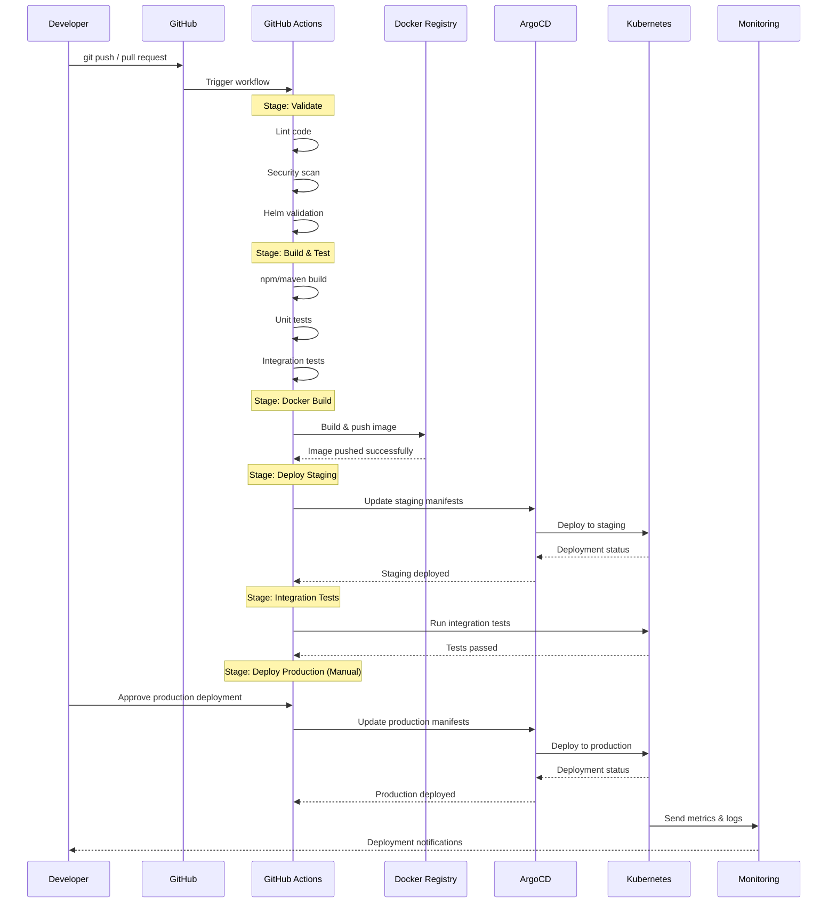
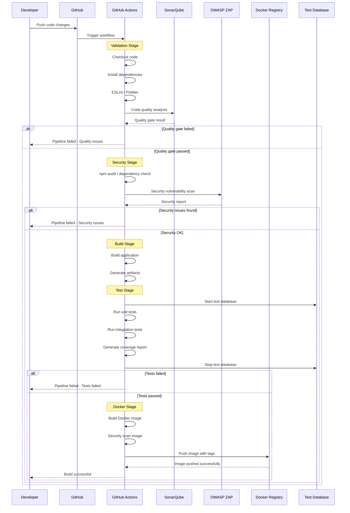
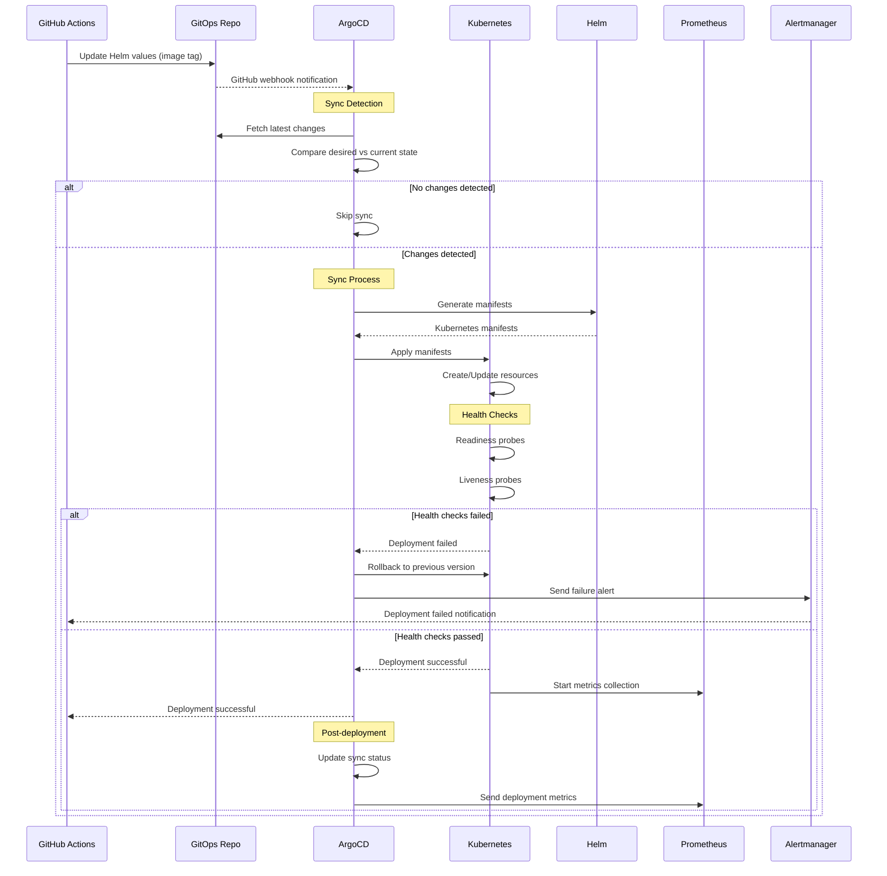
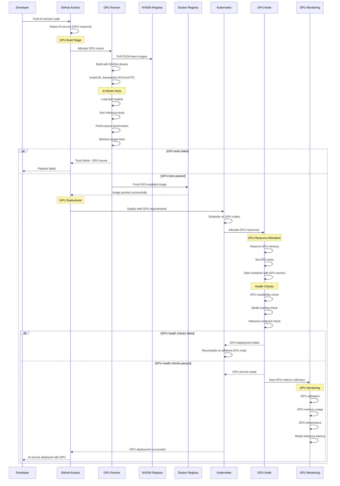
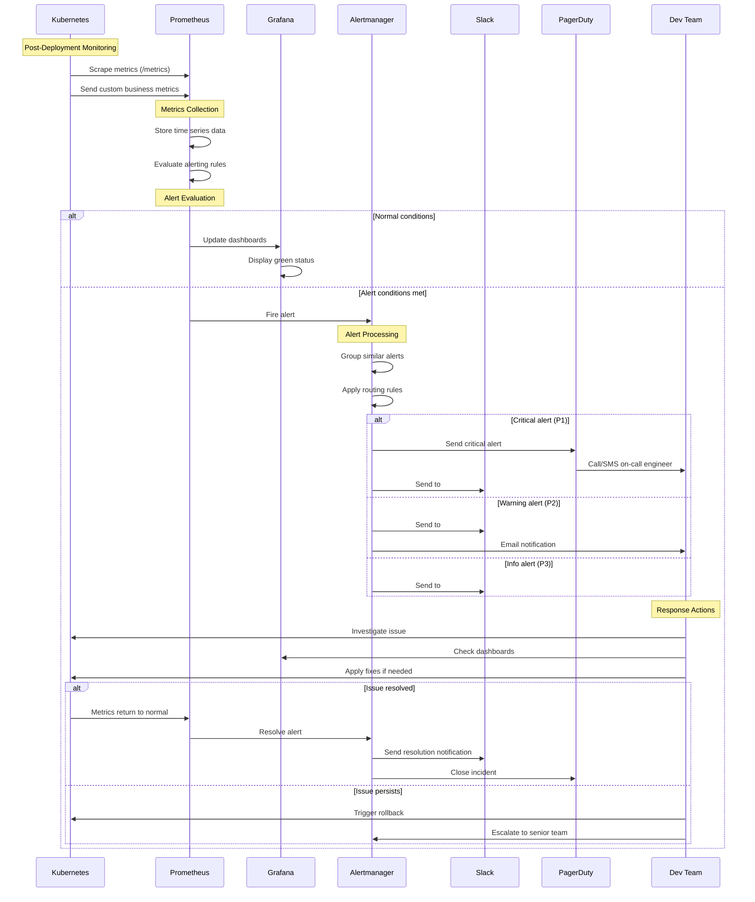
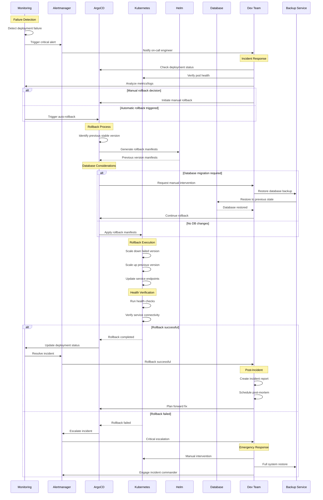

# Diagrammes de Séquence CI/CD - Projet Visiobook

Ce document contient les diagrammes de séquence Mermaid expliquant les différents flux CI/CD du projet Visiobook.

## 1. Flux CI/CD Principal - Vue d'ensemble

## 2. Flux de Build et Tests Détaillé

## 3. Flux de Déploiement avec ArgoCD

## 4. Flux Spécifique Services IA avec GPU

## 5. Flux de Monitoring et Alerting

## 6. Flux de Rollback et Recovery

## Légende des Acteurs

| Acteur | Description |
|--------|-------------|
| **Developer** | Développeur qui pousse le code |
| **GitHub** | Plateforme Git et déclencheur de workflow |
| **GitHub Actions** | Moteur d'exécution des workflows |
| **Docker Registry** | Registre d'images Docker (GHCR + DockerHub) |
| **ArgoCD** | Outil GitOps pour le déploiement |
| **Kubernetes** | Orchestrateur de conteneurs |
| **GPU Runner** | Runner CI/CD avec GPU |
| **GPU Node** | Nœud Kubernetes avec GPU |
| **Prometheus** | Système de monitoring |
| **Alertmanager** | Gestionnaire d'alertes |
| **Grafana** | Dashboards de visualisation |

## Notes Techniques

### Spécificités GPU
- Les services IA nécessitent des runners avec GPU NVIDIA
- Images Docker basées sur CUDA runtime
- Tests de performance obligatoires avant déploiement
- Monitoring spécifique des métriques GPU

### Sécurité
- Scans de sécurité à chaque étape
- Validation des images Docker
- Secrets gérés via Azure Key Vault
- Accès restreint aux environnements de production

### Résilience
- Rollback automatique en cas d'échec
- Health checks complets
- Monitoring proactif
- Alerting multi-canal (Slack, PagerDuty, Email)
