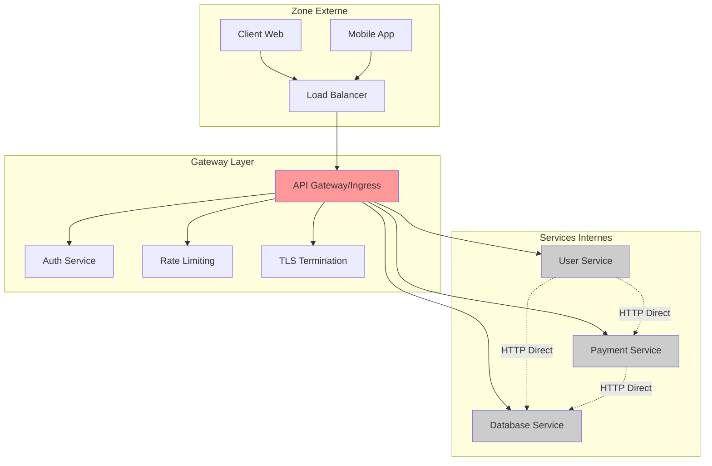
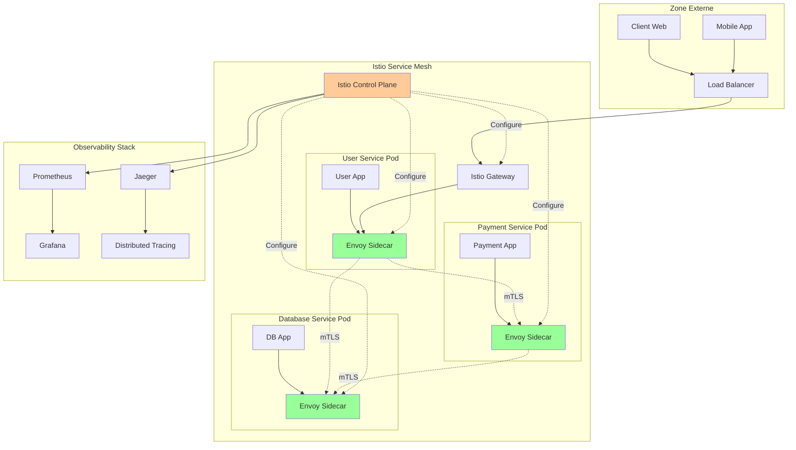
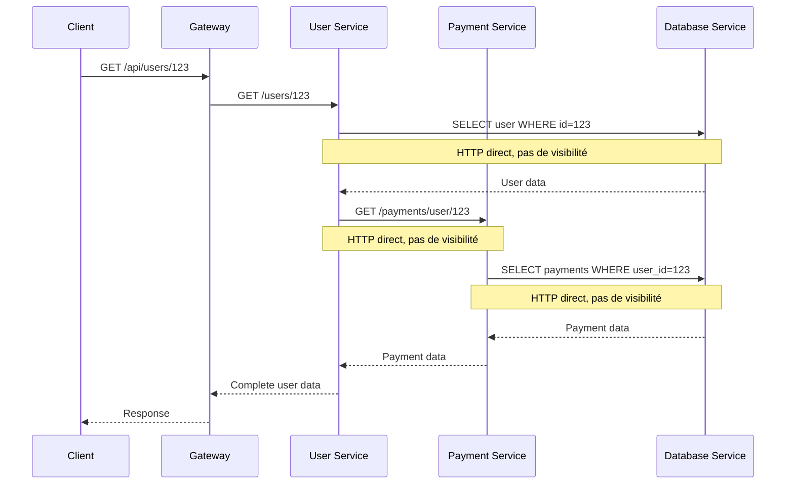
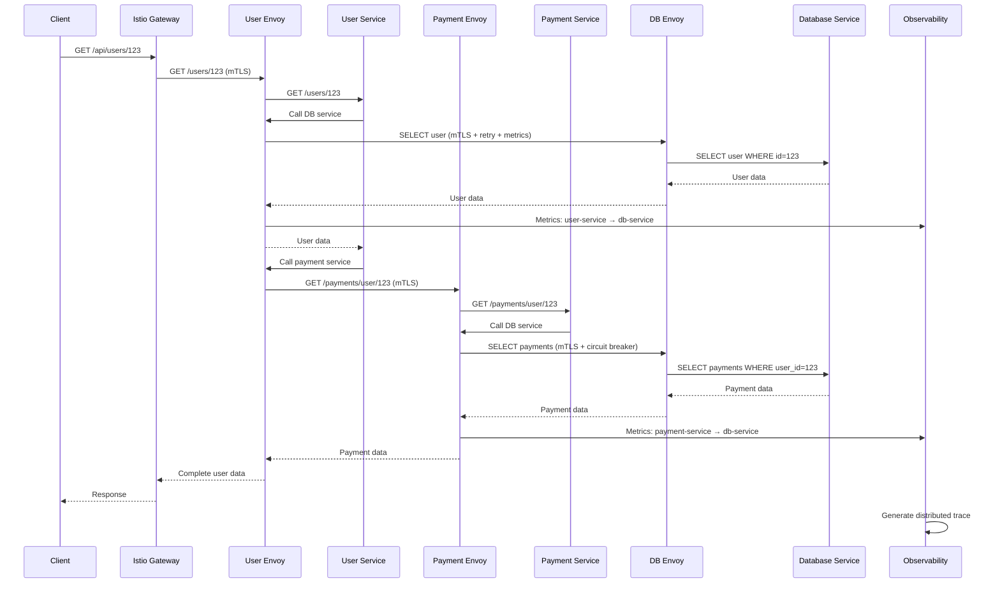
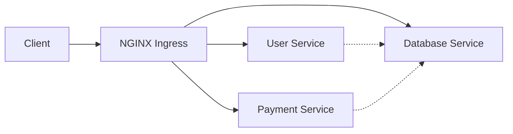
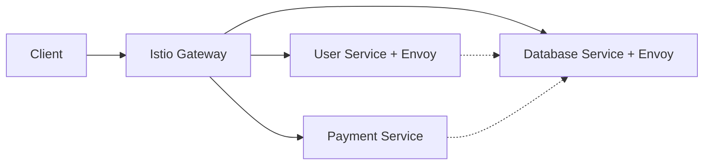
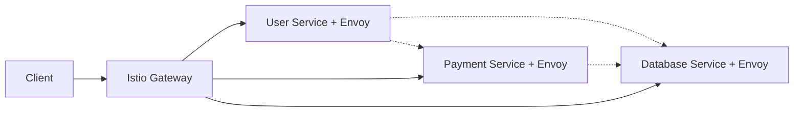

# Gateway Centralisée vs Service Mesh : Différences Concrètes

## Table des Matières

1. [Introduction](#introduction)
2. [Gateway Centralisée Pure](#gateway-centralisée-pure)
3. [Service Mesh (Istio)](#service-mesh-istio)
4. [Comparaison Concrète](#comparaison-concrète)
5. [Cas d'Usage Spécifiques](#cas-dusage-spécifiques)
6. [Impact pour Votre Service Database](#impact-pour-votre-service-database)
7. [Migration Progressive](#migration-progressive)

## Introduction

La confusion entre Gateway centralisée et Service Mesh est fréquente car les
deux gèrent le trafic réseau. Cependant, ils opèrent à des niveaux complètement
différents et résolvent des problèmes distincts.

**Question clé :** Où se situe l'intelligence réseau ?

## Gateway Centralisée Pure

### Architecture



### Caractéristiques Techniques

**Point d'entrée unique :**

- Toute la logique réseau est concentrée au gateway
- Services internes communiquent directement (HTTP/gRPC)
- Pas de proxy entre les services

**Capacités :**

- Routage basé sur l'URL (`/api/users` → user-service)
- TLS termination (HTTPS → HTTP interne)
- Authentification/autorisation centralisée
- Rate limiting global
- Load balancing vers les services

**Technologies typiques :**

- NGINX Ingress Controller
- Kong Gateway
- AWS Application Load Balancer
- Traefik
- Envoy Gateway

### Exemple Concret

```yaml
# Ingress NGINX
apiVersion: networking.k8s.io/v1
kind: Ingress
metadata:
  name: api-gateway
  annotations:
    nginx.ingress.kubernetes.io/rate-limit: '100'
    nginx.ingress.kubernetes.io/auth-url: 'http://auth-service/verify'
spec:
  rules:
    - host: api.example.com
      http:
        paths:
          - path: /api/users
            backend:
              service:
                name: user-service
                port:
                  number: 80
          - path: /api/payments
            backend:
              service:
                name: payment-service
                port:
                  number: 80
```

**Flux de requête :**

```
1. Client → Gateway (HTTPS)
2. Gateway → Auth Service (vérification)
3. Gateway → User Service (HTTP direct)
4. User Service → Payment Service (HTTP direct, pas de visibilité)
```

### Avantages

- **Simplicité** : Architecture facile à comprendre
- **Performance** : Pas de proxy supplémentaire entre services
- **Coût** : Moins de ressources consommées
- **Debugging** : Point central pour les logs d'entrée

### Limites

- **Angle mort** : Aucune visibilité sur les communications inter-services
- **Sécurité** : Trafic interne en clair (HTTP)
- **Resilience** : Pas de retry/circuit breaker entre services
- **Observabilité** : Impossible de tracer les appels internes

## Service Mesh (Istio)

### Architecture



### Caractéristiques Techniques

**Sidecar Pattern :**

- Chaque pod contient un proxy Envoy
- TOUT le trafic réseau passe par le proxy
- Control plane configure tous les proxies

**Capacités avancées :**

- **mTLS automatique** : Chiffrement entre tous les services
- **Observabilité complète** : Métriques sur chaque lien
- **Traffic management** : Retry, circuit breaker, timeout
- **Security policies** : Autorisation granulaire
- **Distributed tracing** : Suivi des requêtes end-to-end

### Exemple Concret

```yaml
# VirtualService pour routage
apiVersion: networking.istio.io/v1beta1
kind: VirtualService
metadata:
  name: database-service
spec:
  hosts:
    - database-service
  http:
    - match:
        - uri:
            prefix: '/api/v1/databases'
      route:
        - destination:
            host: database-service
      retries:
        attempts: 3
        perTryTimeout: 30s
      fault:
        delay:
          percentage:
            value: 0.1
          fixedDelay: 5s

---
# DestinationRule pour policies
apiVersion: networking.istio.io/v1beta1
kind: DestinationRule
metadata:
  name: database-service
spec:
  host: database-service
  trafficPolicy:
    circuitBreaker:
      consecutiveErrors: 5
      interval: 30s
      baseEjectionTime: 30s
    loadBalancer:
      simple: LEAST_CONN

---
# AuthorizationPolicy pour sécurité
apiVersion: security.istio.io/v1beta1
kind: AuthorizationPolicy
metadata:
  name: database-access
spec:
  selector:
    matchLabels:
      app: database-service
  rules:
    - from:
        - source:
            principals: ['cluster.local/ns/default/sa/user-service']
        - source:
            principals: ['cluster.local/ns/default/sa/payment-service']
      to:
        - operation:
            methods: ['GET', 'POST']
```

**Flux de requête :**

```
1. Client → Istio Gateway (HTTPS)
2. Gateway → User Service Envoy (mTLS)
3. User Service App → User Service Envoy
4. User Service Envoy → Payment Service Envoy (mTLS + retry + circuit breaker)
5. Payment Service Envoy → Payment Service App
6. Toutes les métriques → Prometheus
7. Tous les traces → Jaeger
```

### Avantages

- **Observabilité totale** : Visibilité sur chaque appel
- **Sécurité automatique** : mTLS sans modification du code
- **Resilience patterns** : Retry, circuit breaker, timeout
- **Traffic management** : Canary, blue/green, traffic splitting
- **Zero-trust security** : Policies granulaires

### Limites

- **Complexité** : Courbe d'apprentissage élevée
- **Performance** : Latence supplémentaire (1-2ms par hop)
- **Ressources** : CPU/RAM pour chaque sidecar
- **Debugging** : Plus de composants à analyser

## Comparaison Concrète

### Observabilité

| Aspect                        | Gateway Centralisée          | Service Mesh                             |
| ----------------------------- | ---------------------------- | ---------------------------------------- |
| **Visibilité entrante**       | ✅ Complète                  | ✅ Complète                              |
| **Visibilité inter-services** | ❌ Aucune                    | ✅ Complète                              |
| **Métriques disponibles**     | Requêtes gateway uniquement  | Toutes les communications                |
| **Distributed tracing**       | ❌ Non                       | ✅ Automatique                           |
| **Debugging**                 | "Ça marche pas quelque part" | "user-service → payment-service timeout" |

### Sécurité

| Aspect               | Gateway Centralisée     | Service Mesh                      |
| -------------------- | ----------------------- | --------------------------------- |
| **TLS externe**      | ✅ Au gateway           | ✅ Au gateway                     |
| **TLS interne**      | ❌ HTTP en clair        | ✅ mTLS automatique               |
| **Authentification** | ✅ Centralisée          | ✅ Distribuée + centralisée       |
| **Autorisation**     | ✅ Basique              | ✅ Granulaire par service         |
| **Audit**            | Logs gateway uniquement | Logs de toutes les communications |

### Resilience

| Pattern             | Gateway Centralisée    | Service Mesh                   |
| ------------------- | ---------------------- | ------------------------------ |
| **Retry**           | ❌ Manuel dans le code | ✅ Automatique configurable    |
| **Circuit Breaker** | ❌ Manuel dans le code | ✅ Automatique par destination |
| **Timeout**         | ❌ Manuel dans le code | ✅ Configurable par route      |
| **Rate Limiting**   | ✅ Global au gateway   | ✅ Granulaire par service      |
| **Load Balancing**  | ✅ Vers les services   | ✅ Entre tous les services     |

### Performance

| Métrique             | Gateway Centralisée | Service Mesh      |
| -------------------- | ------------------- | ----------------- |
| **Latence**          | Baseline            | +1-2ms par hop    |
| **Throughput**       | Maximum             | 95-98% du maximum |
| **CPU overhead**     | Minimal             | +10-20% par pod   |
| **Memory overhead**  | Minimal             | +50-100MB par pod |
| **Network overhead** | Minimal             | +5-10% (mTLS)     |

## Cas d'Usage Spécifiques

### Quand Choisir Gateway Centralisée

**Contexte idéal :**

- Applications monolithiques ou peu de services
- Équipe DevOps junior
- Budget/ressources limités
- Performance critique (latence ultra-faible)
- Architecture simple et stable

**Exemples :**

- Site e-commerce avec 3-5 services
- API publique avec backend simple
- Prototype/MVP rapide
- Legacy migration

### Quand Choisir Service Mesh

**Contexte idéal :**

- Architecture microservices complexe (>10 services)
- Besoins de sécurité élevés
- Observabilité critique pour le business
- Équipe DevOps expérimentée
- Compliance/audit requis

**Exemples :**

- Plateforme financière
- Service de base de données centralisé (votre cas !)
- Architecture multi-tenant
- Système distribué critique

## Impact pour Votre Service Database

### Avec Gateway Centralisée



**Problèmes pour votre service :**

- Impossible de savoir qui appelle votre DB service
- Pas de rate limiting par service appelant
- Pas de retry automatique si votre service est lent
- Sécurité basée sur la confiance réseau

### Avec Service Mesh



**Avantages pour votre service :**

- Visibilité complète sur qui vous appelle et à quelle fréquence
- Rate limiting automatique par service appelant
- Circuit breaker si votre service devient lent
- mTLS automatique pour sécuriser les données sensibles
- Métriques détaillées pour optimiser les performances

### Configuration Spécifique pour Database Service

```yaml
# Rate limiting par service appelant
apiVersion: networking.istio.io/v1beta1
kind: EnvoyFilter
metadata:
  name: database-rate-limit
spec:
  workloadSelector:
    labels:
      app: database-service
  configPatches:
    - applyTo: HTTP_FILTER
      match:
        context: SIDECAR_INBOUND
      patch:
        operation: INSERT_BEFORE
        value:
          name: envoy.filters.http.local_ratelimit
          typed_config:
            '@type': type.googleapis.com/udpa.type.v1.TypedStruct
            type_url: type.googleapis.com/envoy.extensions.filters.http.local_ratelimit.v3.LocalRateLimit
            value:
              stat_prefix: database_rate_limiter
              token_bucket:
                max_tokens: 100
                tokens_per_fill: 100
                fill_interval: 60s

---
# Autorisation granulaire
apiVersion: security.istio.io/v1beta1
kind: AuthorizationPolicy
metadata:
  name: database-access-control
spec:
  selector:
    matchLabels:
      app: database-service
  rules:
    - from:
        - source:
            principals: ['cluster.local/ns/default/sa/user-service']
      to:
        - operation:
            methods: ['GET', 'POST']
            paths: ['/api/v1/users/*']
    - from:
        - source:
            principals: ['cluster.local/ns/default/sa/payment-service']
      to:
        - operation:
            methods: ['GET', 'POST', 'PUT']
            paths: ['/api/v1/payments/*']
    - from:
        - source:
            principals: ['cluster.local/ns/default/sa/admin-service']
      to:
        - operation:
            methods: ['*']
            paths: ['*']

---
# Circuit breaker pour protéger votre service
apiVersion: networking.istio.io/v1beta1
kind: DestinationRule
metadata:
  name: database-service-protection
spec:
  host: database-service
  trafficPolicy:
    circuitBreaker:
      consecutiveErrors: 5
      interval: 30s
      baseEjectionTime: 30s
      maxEjectionPercent: 50
    outlierDetection:
      consecutive5xxErrors: 3
      interval: 30s
      baseEjectionTime: 30s
```

## Migration Progressive

### Étape 1 : Gateway Centralisée (Point de Départ)



**Avantages :** Simple, rapide à mettre en place **Inconvénients :** Pas de
visibilité interne

### Étape 2 : Istio Gateway + Sidecar Progressif



**Migration :** Installer Istio, migrer service par service **Bénéfices
immédiats :** Observabilité partielle

### Étape 3 : Service Mesh Complet



**Résultat :** Observabilité complète, sécurité mTLS, resilience patterns

### Plan de Migration pour Votre Contexte

**Phase 1 (1-2 semaines) :** Installation Istio

- Installer Istio control plane
- Configurer Istio gateway
- Migrer le trafic externe vers Istio gateway

**Phase 2 (2-3 semaines) :** Sidecar Database Service

- Activer injection sidecar pour votre service
- Configurer VirtualService et DestinationRule
- Tester les métriques et traces

**Phase 3 (3-4 semaines) :** Sidecar Services Clients

- Migrer progressivement les services qui appellent votre DB
- Configurer les AuthorizationPolicy
- Optimiser les performances

**Phase 4 (1-2 semaines) :** Optimisation

- Ajuster les circuit breakers
- Configurer le rate limiting
- Documentation et formation équipe

## Conclusion

Pour votre service de base de données centralisé, le **Service Mesh** apporte
des avantages critiques :

**Observabilité :** Comprendre qui utilise votre service et comment **Sécurité
:** Protéger les données sensibles avec mTLS automatique **Resilience :**
Protéger votre service contre les surcharges **Governance :** Contrôler finement
l'accès aux données

La migration peut être progressive, en commençant par votre service puis en
étendant aux services clients. L'investissement initial en complexité est
largement compensé par les gains en observabilité et sécurité pour un service
aussi critique.
