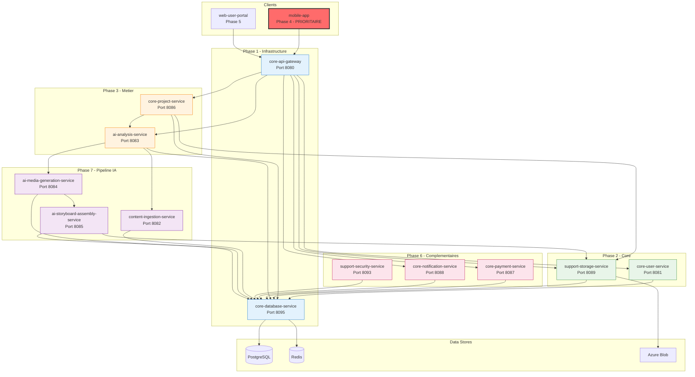
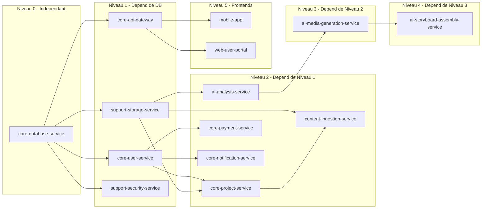

# Documentation Microservices - VisioBook

## Vue d'ensemble

Cette documentation detaille les responsabilites de chaque microservice de l'architecture VisioBook, leurs communications inter-services, et les strategies de test.

## Table des matieres

| Document | Service | Phase | Description |
|----------|---------|-------|-------------|
| [core-database-service.md](./core-database-service.md) | Database | 1 | Gestion centralisee des bases de donnees |
| [core-api-gateway.md](./core-api-gateway.md) | Gateway | 1 | Point d'entree unique, routage, auth |
| [core-user-service.md](./core-user-service.md) | User | 2 | Authentification, profils, permissions |
| [support-storage-service.md](./support-storage-service.md) | Storage | 2 | Stockage fichiers, OCR, streaming |
| [core-project-service.md](./core-project-service.md) | Project | 3 | Gestion projets, workflows |
| [ai-analysis-service.md](./ai-analysis-service.md) | AI Analysis | 3 | Analyse semantique, extraction scenes |
| [mobile-app.md](./mobile-app.md) | Mobile | **4** | **App mobile (PRIORITAIRE)** |
| [web-user-portal.md](./web-user-portal.md) | Web | 5 | Application web utilisateur |
| [core-payment-service.md](./core-payment-service.md) | Payment | 6 | Paiements, abonnements |
| [core-notification-service.md](./core-notification-service.md) | Notification | 6 | Emails, push, in-app |
| [support-security-service.md](./support-security-service.md) | Security | 6 | Encryption, audit, policies |
| [content-ingestion-service.md](./content-ingestion-service.md) | Ingestion | 7 | Pre-processing contenu |
| [ai-media-generation-service.md](./ai-media-generation-service.md) | Media Gen | 7 | Generation images/audio |
| [ai-storyboard-assembly-service.md](./ai-storyboard-assembly-service.md) | Assembly | 7 | Assemblage video |

## Architecture Globale

## Matrice Flow -> Microservice

| Flow | Owner Principal | Services Impliques |
|------|-----------------|-------------------|
| **Flow 1: Auth** | core-user-service | api-gateway, database, notification |
| **Flow 2: Import fichier** | core-project-service | storage, ingestion, database |
| **Flow 3: OCR Scanner** | support-storage-service | project, ingestion, database |
| **Flow 4: Configuration** | core-project-service | database |
| **Flow 5: Generation** | ai-analysis-service | media-gen, assembly, storage, project |
| **Flow 6: Player** | support-storage-service | project, assembly |
| **Flow 7: Export/Partage** | core-project-service | storage |
| **Flow 8: Historique** | core-project-service | database |

## Matrice des Dependances

## Ports et Technologies

| Service | Port | Stack | Repository |
|---------|------|-------|------------|
| core-api-gateway | 8080 | Kong/Docker | core-api-gateway |
| core-user-service | 8081 | Python/FastAPI | core-user-service |
| content-ingestion-service | 8082 | Python/FastAPI | content-ingestion-service |
| ai-analysis-service | 8083 | Python/FastAPI/PyTorch | ai-analysis-service |
| ai-media-generation-service | 8084 | Python/FastAPI/GPU | ai-media-generation-service |
| ai-storyboard-assembly-service | 8085 | Node.js | ai-storyboard-assembly-service |
| core-project-service | 8086 | Node.js/NestJS | core-project-service |
| core-payment-service | 8087 | Node.js/NestJS | core-payment-service |
| core-notification-service | 8088 | Node.js/NestJS | core-notification-service |
| support-storage-service | 8089 | Python/FastAPI | support-storage-service |
| support-security-service | 8093 | Java/Spring | support-security-service |
| core-database-service | 8095 | TypeScript/Node.js | core-database-service |
| web-user-portal | 3000 | TypeScript/Vue.js | web-user-portal |
| mobile-app | - | Mobile natif | mobile-app |

## Services Exclus du Scope MVP

Les services suivants sont redondants avec les outils Kubernetes/Azure natifs:

| Service | Alternative |
|---------|-------------|
| ~~support-config-service~~ | Kubernetes ConfigMaps/Secrets |
| ~~support-monitoring-service~~ | Prometheus/Grafana via Helm |
| ~~support-logging-service~~ | Azure Monitor/Log Analytics |
| ~~support-analytics-service~~ | Services tiers (Mixpanel, etc.) |

## Liens vers Documentation UX

- [User Journey Mapping](../ux/01-user-journey-mapping.md)
- [User Flows](../ux/02-user-flows.md)
- [Screen Flows](../ux/03-screen-flows.md)
- [MVP Screens](../ux/04-mvp-screens.md)
- [Interaction Sequences](../ux/05-interaction-sequences.md)

## Liens vers Documentation API

- [Core User Service API](../api/core-user-service.md)
- [Core Project Service API](../api/core-project-service.md)
- [Support Storage Service API](../api/support-storage-service.md)
- [AI Analysis Service API](../api/ai-analysis-service.md)

## Liens vers Documentation Architecture

- [Architecture Prioritaire](../architecture/visiobook-priority-architecture.md)
