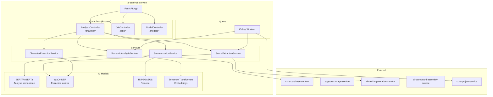
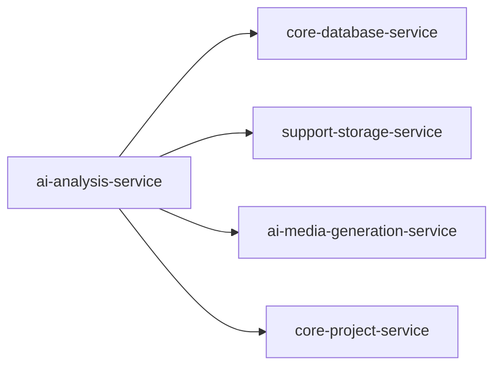
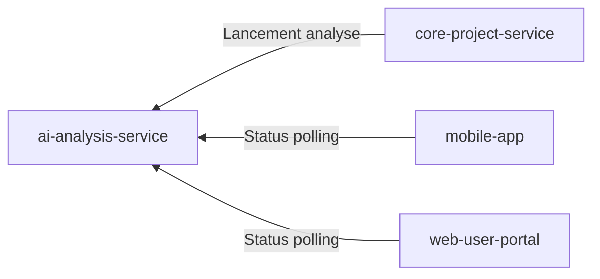
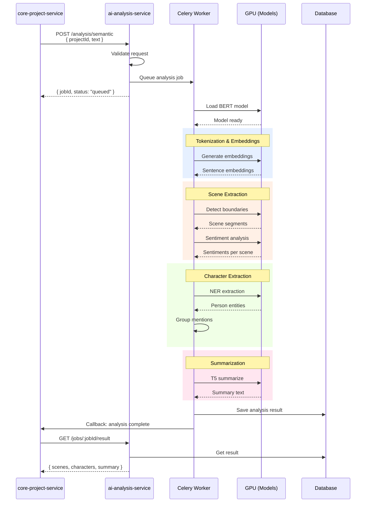
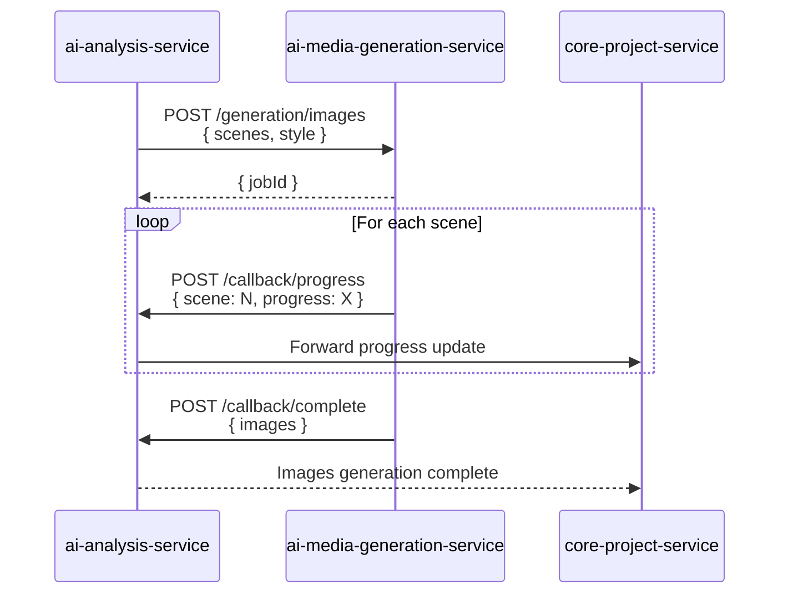

# ai-analysis-service

## Informations generales

| Propriete | Valeur |
|-----------|--------|
| **Repository** | ai-analysis-service |
| **Port** | 8083 |
| **Stack** | Python / FastAPI / PyTorch |
| **Phase** | 3 - Services Metier |
| **Priorite** | PRIORITE IA (coeur valeur metier) |

## Flows/Journeys concernes

| Flow | Role | Responsabilite |
|------|------|----------------|
| **Flow 5: Generation** | **Owner** | Orchestration complete du pipeline IA |

### Sous-phases du Flow 5

| Phase | Progression | Description |
|-------|-------------|-------------|
| Phase 1 | 0-20% | Analyse semantique du texte |
| Phase 2 | 20-60% | Generation des images (deleguee a media-generation) |
| Phase 3 | 60-80% | Synthese audio (deleguee a media-generation) |
| Phase 4 | 80-100% | Assemblage video (deleguee a storyboard-assembly) |

## Architecture interne



## Controllers et Endpoints

### AnalysisController (`/api/v1/analysis`)

| Methode | Endpoint | Description | Auth |
|---------|----------|-------------|------|
| POST | `/semantic` | Analyse semantique complete | Oui |
| POST | `/extract-scenes` | Extraction des scenes | Oui |
| POST | `/extract-characters` | Extraction personnages | Oui |
| POST | `/summarize` | Generation resume | Oui |
| POST | `/embeddings` | Generation embeddings | Oui |

```python
# POST /api/v1/analysis/semantic
class SemanticAnalysisRequest(BaseModel):
    projectId: str
    text: str
    language: str = "fr"
    options: Optional[AnalysisOptions] = None

class AnalysisOptions(BaseModel):
    extractScenes: bool = True
    extractCharacters: bool = True
    generateSummary: bool = True
    maxScenes: int = 20
    minSceneLength: int = 50

class SemanticAnalysisResponse(BaseModel):
    jobId: str
    status: Literal["queued", "processing", "completed", "failed"]
    result: Optional[AnalysisResult]

class AnalysisResult(BaseModel):
    scenes: List[Scene]
    characters: List[Character]
    summary: str
    metadata: AnalysisMetadata

class Scene(BaseModel):
    id: str
    order: int
    text: str
    startPosition: int
    endPosition: int
    sentiment: Literal["positive", "negative", "neutral"]
    intensity: float  # 0-1
    imagePrompt: str  # Generated prompt for image generation

class Character(BaseModel):
    id: str
    name: str
    aliases: List[str]
    description: str
    appearances: List[str]  # Scene IDs
    traits: List[str]

class AnalysisMetadata(BaseModel):
    wordCount: int
    sentenceCount: int
    averageSentenceLength: float
    readingTime: int  # minutes
    dominantSentiment: str
    processingTime: float  # seconds
```

### JobController (`/api/v1/jobs`)

| Methode | Endpoint | Description | Auth |
|---------|----------|-------------|------|
| GET | `/` | Lister jobs utilisateur | Oui |
| GET | `/:jobId` | Status d'un job | Oui |
| POST | `/:jobId/cancel` | Annuler un job | Oui |
| GET | `/:jobId/result` | Resultat d'un job | Oui |

```python
# GET /api/v1/jobs/:jobId
class JobStatus(BaseModel):
    jobId: str
    type: Literal["analysis", "generation"]
    status: Literal["queued", "processing", "completed", "failed", "cancelled"]
    progress: int  # 0-100
    currentStep: Optional[str]
    createdAt: datetime
    startedAt: Optional[datetime]
    completedAt: Optional[datetime]
    error: Optional[str]
```

### ModelController (`/api/v1/models`)

| Methode | Endpoint | Description | Auth |
|---------|----------|-------------|------|
| GET | `/` | Liste des modeles | Oui |
| GET | `/:modelId/status` | Status d'un modele | Oui |
| POST | `/:modelId/load` | Charger un modele | Admin |
| POST | `/:modelId/unload` | Decharger un modele | Admin |

```python
# GET /api/v1/models
class ModelInfo(BaseModel):
    id: str
    name: str
    type: Literal["nlp", "embedding", "summarization"]
    status: Literal["loaded", "unloaded", "loading", "error"]
    memoryUsage: int  # MB
    gpuMemory: Optional[int]  # MB
    lastUsed: datetime
```

## Methodes et Fonctions

### SemanticAnalysisService

```python
class SemanticAnalysisService:
    def __init__(
        self,
        bert_model: BertModel,
        scene_extractor: SceneExtractionService,
        character_extractor: CharacterExtractionService,
        summarizer: SummarizationService
    ):
        self.bert = bert_model
        self.scene_extractor = scene_extractor
        self.character_extractor = character_extractor
        self.summarizer = summarizer

    async def analyze(
        self,
        text: str,
        language: str,
        options: AnalysisOptions
    ) -> AnalysisResult:
        """Analyse semantique complete d'un texte"""

        # 1. Preprocessing
        sentences = self._tokenize_sentences(text)
        embeddings = await self._generate_embeddings(sentences)

        # 2. Extraction des scenes
        scenes = await self.scene_extractor.extract(
            text, embeddings, options.maxScenes
        )

        # 3. Extraction des personnages
        characters = await self.character_extractor.extract(text, scenes)

        # 4. Generation du resume
        summary = await self.summarizer.summarize(text, scenes)

        # 5. Generation des prompts pour images
        for scene in scenes:
            scene.imagePrompt = await self._generate_image_prompt(
                scene, characters
            )

        return AnalysisResult(
            scenes=scenes,
            characters=characters,
            summary=summary,
            metadata=self._compute_metadata(text, sentences)
        )

    async def _generate_image_prompt(
        self,
        scene: Scene,
        characters: List[Character]
    ) -> str:
        """Generer un prompt optimise pour Stable Diffusion"""
        # Identifier les personnages dans la scene
        scene_characters = [c for c in characters if scene.id in c.appearances]

        # Construire le prompt
        prompt_parts = [
            f"Scene: {scene.text[:200]}",
            f"Style: illustration, detailed, high quality",
            f"Characters: {', '.join(c.name for c in scene_characters)}"
        ]

        return " | ".join(prompt_parts)
```

### SceneExtractionService

```python
class SceneExtractionService:
    async def extract(
        self,
        text: str,
        embeddings: np.ndarray,
        max_scenes: int
    ) -> List[Scene]:
        """Extraire les scenes d'un texte"""

        # 1. Segmentation semantique
        # Utiliser les embeddings pour detecter les changements de contexte
        boundaries = self._detect_scene_boundaries(embeddings)

        # 2. Extraction des segments
        segments = self._split_text(text, boundaries)

        # 3. Analyse du sentiment par segment
        scenes = []
        for i, segment in enumerate(segments[:max_scenes]):
            sentiment = await self._analyze_sentiment(segment)
            scenes.append(Scene(
                id=f"scene-{i+1}",
                order=i,
                text=segment,
                sentiment=sentiment["label"],
                intensity=sentiment["score"]
            ))

        return scenes

    def _detect_scene_boundaries(self, embeddings: np.ndarray) -> List[int]:
        """Detecter les changements de scene via cosine similarity"""
        similarities = []
        for i in range(len(embeddings) - 1):
            sim = cosine_similarity(
                embeddings[i].reshape(1, -1),
                embeddings[i + 1].reshape(1, -1)
            )[0][0]
            similarities.append(sim)

        # Trouver les points de changement (faible similarite)
        threshold = np.percentile(similarities, 20)
        boundaries = [i for i, sim in enumerate(similarities) if sim < threshold]

        return boundaries
```

### CharacterExtractionService

```python
class CharacterExtractionService:
    def __init__(self):
        self.nlp = spacy.load("fr_core_news_lg")

    async def extract(
        self,
        text: str,
        scenes: List[Scene]
    ) -> List[Character]:
        """Extraire les personnages du texte"""

        # 1. NER pour trouver les entites PERSON
        doc = self.nlp(text)
        person_entities = [ent for ent in doc.ents if ent.label_ == "PER"]

        # 2. Grouper les mentions (coreference)
        characters = self._group_mentions(person_entities)

        # 3. Enrichir avec descriptions
        for char in characters:
            char.description = await self._extract_description(text, char.name)
            char.appearances = self._find_appearances(char, scenes)

        return characters

    def _group_mentions(self, entities) -> List[Character]:
        """Grouper les differentes mentions d'un meme personnage"""
        # Utiliser similarite de string pour grouper
        # "Jean", "M. Dupont", "le professeur" -> meme personnage
        pass
```

## Communications Inter-services

### Appels sortants



| Service cible | Endpoint | Objectif |
|---------------|----------|----------|
| core-database-service | `/api/v1/query` | Stockage resultats analyse |
| support-storage-service | `/api/v1/storage/files` | Recuperation contenu |
| ai-media-generation-service | `/api/v1/generation/*` | Delegation generation images/audio |
| core-project-service | `/api/v1/projects/:id` | Callbacks progression |

### Appels entrants



## Diagrammes de sequence

### Sequence: Analyse semantique complete



### Sequence: Generation images avec callbacks



## Mocks pour tests

### Mock GPU Models

```python
# tests/mocks/models_mock.py
class MockBertModel:
    def encode(self, sentences: List[str]) -> np.ndarray:
        """Retourner des embeddings pre-calcules"""
        return np.random.rand(len(sentences), 768)

    def predict_sentiment(self, text: str) -> dict:
        return {
            "label": "positive",
            "score": 0.85
        }

class MockT5Model:
    def summarize(self, text: str, max_length: int = 150) -> str:
        return "Resume genere par le mock pour les tests."

class MockSpacyNLP:
    def __call__(self, text: str):
        return MockDoc([
            MockEntity("Jean", "PER"),
            MockEntity("Paris", "LOC"),
        ])

# Fixtures pytest
@pytest.fixture
def mock_bert():
    return MockBertModel()

@pytest.fixture
def mock_t5():
    return MockT5Model()

@pytest.fixture
def mock_nlp():
    return MockSpacyNLP()
```

### Mock Media Generation Service

```python
# tests/mocks/media_generation_mock.py
class MockMediaGenerationClient:
    async def generate_images(self, scenes: List[Scene], style: str) -> List[str]:
        """Retourner des URLs d'images mockees"""
        return [
            f"https://mock-storage.com/image_{scene.id}.png"
            for scene in scenes
        ]

    async def generate_audio(self, text: str, voice: str) -> str:
        return "https://mock-storage.com/narration.mp3"
```

## Configuration GPU

```python
# src/config/gpu_config.py
import torch

GPU_CONFIG = {
    "device": "cuda" if torch.cuda.is_available() else "cpu",
    "memory_fraction": 0.8,  # Utiliser 80% de la VRAM
    "batch_size": {
        "embedding": 32,
        "sentiment": 16,
        "summarization": 4,
    },
    "models": {
        "bert": {
            "name": "camembert/camembert-large",
            "cache_dir": "/models/bert",
            "fp16": True,  # Mixed precision
        },
        "t5": {
            "name": "google/mt5-base",
            "cache_dir": "/models/t5",
            "fp16": True,
        },
        "spacy": {
            "name": "fr_core_news_lg",
        }
    }
}

def configure_gpu():
    if torch.cuda.is_available():
        torch.cuda.set_per_process_memory_fraction(
            GPU_CONFIG["memory_fraction"]
        )
        torch.backends.cudnn.benchmark = True
```

## Exemple d'implementation

### FastAPI App avec Celery

```python
# src/main.py
from fastapi import FastAPI
from celery import Celery
from src.routers import analysis_router, job_router, model_router
from src.config import settings

app = FastAPI(title="ai-analysis-service")

# Celery configuration
celery_app = Celery(
    "ai_analysis",
    broker=settings.REDIS_URL,
    backend=settings.REDIS_URL
)

celery_app.conf.update(
    task_serializer="json",
    result_serializer="json",
    accept_content=["json"],
    task_track_started=True,
    worker_prefetch_multiplier=1,  # Important pour GPU tasks
)

app.include_router(analysis_router, prefix="/api/v1/analysis")
app.include_router(job_router, prefix="/api/v1/jobs")
app.include_router(model_router, prefix="/api/v1/models")

@app.on_event("startup")
async def load_models():
    """Pre-charger les modeles au demarrage"""
    from src.services import model_manager
    await model_manager.load_models()
```

## Metriques de succes

| Metrique | Objectif | Description |
|----------|----------|-------------|
| Analysis time | < 30s/page | Temps d'analyse par page |
| Accuracy | > 85% | Precision extraction scenes |
| GPU utilization | 70-90% | Utilisation GPU |
| Memory | < 80% VRAM | Utilisation memoire GPU |
| Availability | > 99.5% | Disponibilite service |
