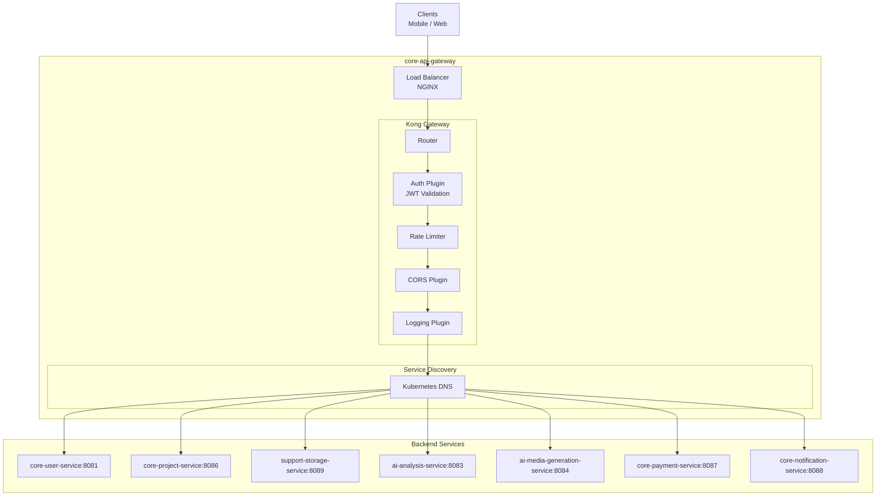
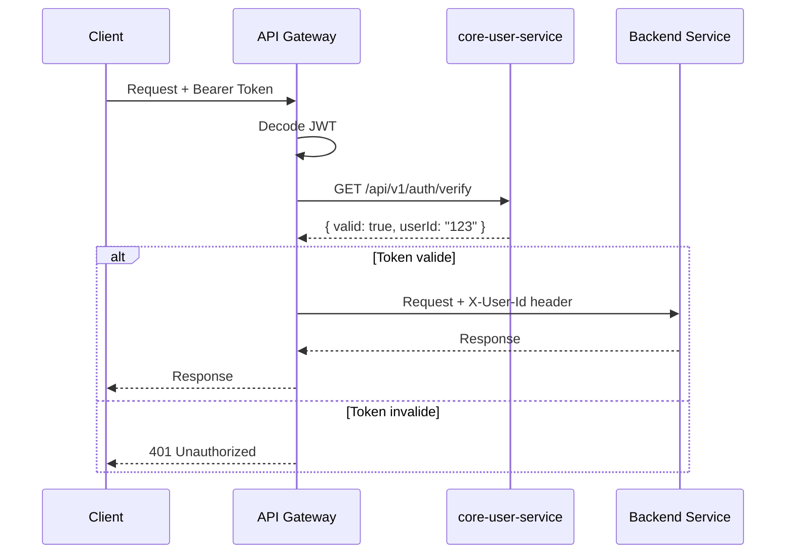
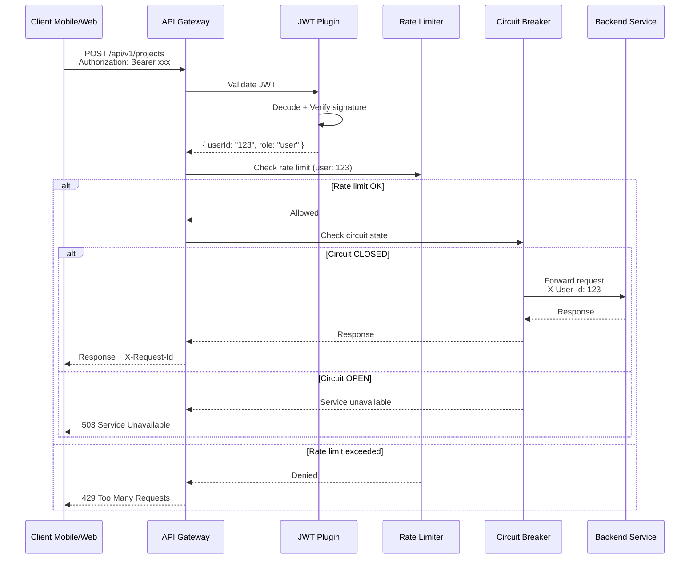
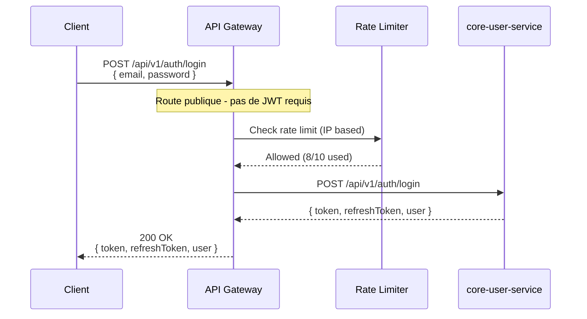

# core-api-gateway

## Informations generales

| Propriete | Valeur |
|-----------|--------|
| **Repository** | core-api-gateway |
| **Port** | 8080 |
| **Stack** | Kong / Docker / Istio |
| **Phase** | 1 - Infrastructure Critique |
| **Priorite** | CRITIQUE (point d'entree unique) |

## Flows/Journeys concernes

Ce service est le **point d'entree unique** pour tous les flows:

| Flow | Routes | Services cibles |
|------|--------|-----------------|
| Flow 1: Auth | `/api/v1/auth/*` | core-user-service |
| Flow 2: Import | `/api/v1/projects/*`, `/api/v1/storage/*` | project, storage |
| Flow 3: OCR | `/api/v1/storage/ocr/*` | support-storage-service |
| Flow 4: Config | `/api/v1/projects/*/config` | core-project-service |
| Flow 5: Generation | `/api/v1/generation/*`, `/api/v1/jobs/*` | ai-analysis-service |
| Flow 6: Player | `/api/v1/stream/*` | support-storage-service |
| Flow 7: Export | `/api/v1/projects/*/export` | core-project-service |
| Flow 8: Historique | `/api/v1/projects` | core-project-service |

## Architecture interne



## Routes et Configuration

### Table de routage

| Route Pattern | Method | Target Service | Auth Required | Rate Limit |
|---------------|--------|----------------|---------------|------------|
| `/api/v1/auth/register` | POST | core-user-service | Non | 5/min |
| `/api/v1/auth/login` | POST | core-user-service | Non | 10/min |
| `/api/v1/auth/logout` | POST | core-user-service | Oui | 100/min |
| `/api/v1/auth/refresh` | POST | core-user-service | Non | 20/min |
| `/api/v1/users/*` | ALL | core-user-service | Oui | 100/min |
| `/api/v1/projects/*` | ALL | core-project-service | Oui | 100/min |
| `/api/v1/storage/*` | ALL | support-storage-service | Oui | 50/min |
| `/api/v1/analysis/*` | ALL | ai-analysis-service | Oui | 20/min |
| `/api/v1/generation/*` | ALL | ai-media-generation-service | Oui | 10/min |
| `/api/v1/jobs/*` | ALL | ai-analysis-service | Oui | 100/min |
| `/api/v1/payments/*` | ALL | core-payment-service | Oui | 50/min |
| `/api/v1/notifications/*` | ALL | core-notification-service | Oui | 100/min |
| `/health` | GET | self | Non | - |
| `/metrics` | GET | self | Non | - |

### Configuration Kong

```yaml
# kong.yaml
_format_version: "3.0"

services:
  - name: user-service
    url: http://core-user-service:8081
    routes:
      - name: auth-routes
        paths:
          - /api/v1/auth
        strip_path: false
      - name: user-routes
        paths:
          - /api/v1/users
        strip_path: false

  - name: project-service
    url: http://core-project-service:8086
    routes:
      - name: project-routes
        paths:
          - /api/v1/projects
        strip_path: false

  - name: storage-service
    url: http://support-storage-service:8089
    routes:
      - name: storage-routes
        paths:
          - /api/v1/storage
        strip_path: false

  - name: ai-analysis-service
    url: http://ai-analysis-service:8083
    routes:
      - name: analysis-routes
        paths:
          - /api/v1/analysis
          - /api/v1/jobs
        strip_path: false

  - name: media-generation-service
    url: http://ai-media-generation-service:8084
    routes:
      - name: generation-routes
        paths:
          - /api/v1/generation
        strip_path: false

  - name: payment-service
    url: http://core-payment-service:8087
    routes:
      - name: payment-routes
        paths:
          - /api/v1/payments
        strip_path: false

  - name: notification-service
    url: http://core-notification-service:8088
    routes:
      - name: notification-routes
        paths:
          - /api/v1/notifications
        strip_path: false

plugins:
  - name: jwt
    config:
      claims_to_verify:
        - exp
      key_claim_name: kid
      secret_is_base64: false

  - name: rate-limiting
    config:
      minute: 100
      policy: local

  - name: cors
    config:
      origins:
        - "*"
      methods:
        - GET
        - POST
        - PUT
        - PATCH
        - DELETE
        - OPTIONS
      headers:
        - Authorization
        - Content-Type
      exposed_headers:
        - X-Request-Id
      credentials: true
      max_age: 3600

  - name: request-transformer
    config:
      add:
        headers:
          - X-Request-Id:$(uuid)
          - X-Forwarded-Proto:https
```

## Fonctionnalites

### 1. Validation JWT



### 2. Rate Limiting

```yaml
# Configuration par route
rate_limiting:
  auth_routes:
    login: 10/minute
    register: 5/minute
    refresh: 20/minute

  api_routes:
    default: 100/minute
    generation: 10/minute  # Operations couteuses
    upload: 50/minute

  strategies:
    - type: sliding_window
    - storage: redis
    - key_type: user_id  # ou ip si non authentifie
```

### 3. Circuit Breaker

```yaml
circuit_breaker:
  default:
    failure_threshold: 5
    success_threshold: 3
    timeout: 30s
    half_open_requests: 3

  per_service:
    ai-analysis-service:
      failure_threshold: 3
      timeout: 60s  # Plus long pour services IA
```

### 4. Request/Response Transformation

```yaml
transformations:
  request:
    add_headers:
      - X-Request-Id: "$(uuid)"
      - X-Timestamp: "$(now)"
      - X-Client-Version: "$(header.X-App-Version)"

  response:
    remove_headers:
      - Server
      - X-Powered-By
    add_headers:
      - X-Response-Time: "$(latency)"
```

## Communications Inter-services

### Appels sortants

| Service cible | Objectif |
|---------------|----------|
| core-user-service | Validation JWT, infos utilisateur |
| Tous services backend | Routage des requetes |

### Appels entrants

| Source | Description |
|--------|-------------|
| mobile-app | Application mobile |
| web-user-portal | Application web |

## Diagrammes de sequence

### Sequence: Requete authentifiee complete



### Sequence: Requete non authentifiee (login)



## Mocks pour tests

### Mock Kong pour tests unitaires

```typescript
// tests/mocks/kong.mock.ts
export const mockKongRouter = {
  routes: new Map(),

  addRoute(path: string, service: string) {
    this.routes.set(path, service);
  },

  resolveRoute(path: string): string | null {
    for (const [pattern, service] of this.routes) {
      if (path.startsWith(pattern)) {
        return service;
      }
    }
    return null;
  },
};

// Mock JWT validation
export const mockJwtPlugin = {
  validate: jest.fn().mockResolvedValue({
    valid: true,
    payload: {
      sub: 'user-123',
      role: 'user',
      exp: Date.now() + 3600000,
    },
  }),
};
```

### Tests d'integration avec Docker Compose

```yaml
# docker-compose.test.yml
version: '3.8'
services:
  kong:
    image: kong:3.4
    environment:
      KONG_DATABASE: "off"
      KONG_DECLARATIVE_CONFIG: /kong/kong.yaml
    volumes:
      - ./kong.yaml:/kong/kong.yaml
    ports:
      - "8080:8080"

  mock-user-service:
    image: mockserver/mockserver
    environment:
      MOCKSERVER_INITIALIZATION_JSON_PATH: /config/user-service.json
    volumes:
      - ./mocks:/config
```

## Configuration Kubernetes

### Service et Deployment

```yaml
# k8s/api-gateway.yaml
apiVersion: v1
kind: Service
metadata:
  name: api-gateway
  namespace: visiobook
spec:
  type: LoadBalancer
  ports:
    - name: http
      port: 80
      targetPort: 8080
    - name: https
      port: 443
      targetPort: 8443
  selector:
    app: api-gateway
---
apiVersion: apps/v1
kind: Deployment
metadata:
  name: api-gateway
  namespace: visiobook
spec:
  replicas: 3
  selector:
    matchLabels:
      app: api-gateway
  template:
    metadata:
      labels:
        app: api-gateway
    spec:
      containers:
        - name: kong
          image: kong:3.4
          ports:
            - containerPort: 8080
            - containerPort: 8443
          env:
            - name: KONG_DATABASE
              value: "off"
            - name: KONG_DECLARATIVE_CONFIG
              value: /kong/kong.yaml
          resources:
            requests:
              cpu: "500m"
              memory: "512Mi"
            limits:
              cpu: "1000m"
              memory: "1Gi"
          readinessProbe:
            httpGet:
              path: /status
              port: 8080
            initialDelaySeconds: 5
            periodSeconds: 10
          livenessProbe:
            httpGet:
              path: /status
              port: 8080
            initialDelaySeconds: 15
            periodSeconds: 20
```

## Metriques de succes

| Metrique | Objectif | Description |
|----------|----------|-------------|
| Latency P95 | < 10ms | Latence ajoutee par le gateway |
| Throughput | > 10k req/s | Capacite de traitement |
| Availability | > 99.95% | Disponibilite du service |
| Error rate | < 0.1% | Taux d'erreur gateway |
| JWT validation time | < 5ms | Temps de validation des tokens |
