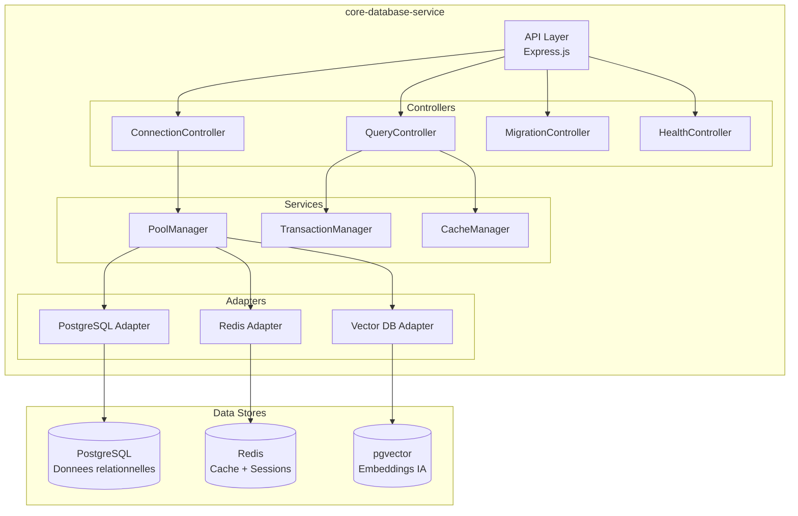
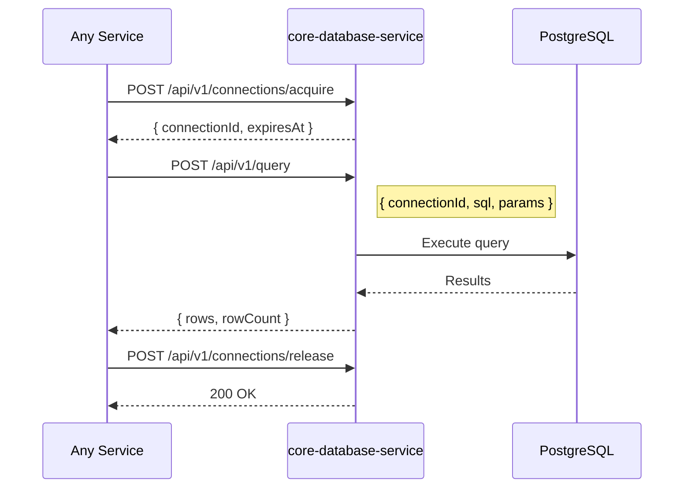
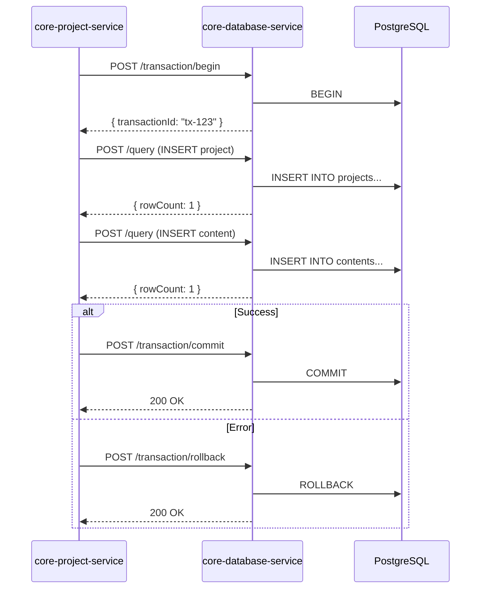
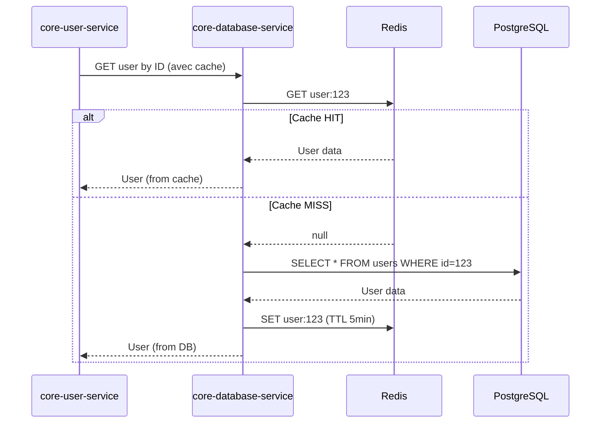

# core-database-service

## Informations generales

| Propriete | Valeur |
|-----------|--------|
| **Repository** | core-database-service |
| **Port** | 8095 |
| **Stack** | TypeScript / Node.js |
| **Phase** | 1 - Infrastructure Critique |
| **Priorite** | CRITIQUE (bloque tous les autres services) |

## Flows/Journeys concernes

Ce service est **transversal** et supporte tous les flows:

| Flow | Role |
|------|------|
| Flow 1: Auth | Stockage users, sessions, tokens |
| Flow 2: Import | Stockage projets, metadata fichiers |
| Flow 3: OCR Scanner | Stockage resultats OCR |
| Flow 4: Configuration | Stockage preferences projet |
| Flow 5: Generation | Stockage jobs, resultats IA, progress |
| Flow 6: Player | Lecture metadata videos |
| Flow 7: Export/Partage | Stockage share links |
| Flow 8: Historique | Requetes liste projets |

## Architecture interne



## Controllers et Endpoints

### ConnectionController

| Methode | Endpoint | Description |
|---------|----------|-------------|
| POST | `/api/v1/connections/acquire` | Acquiert une connexion du pool |
| POST | `/api/v1/connections/release` | Libere une connexion |
| GET | `/api/v1/connections/stats` | Statistiques du pool |

```typescript
// POST /api/v1/connections/acquire
interface AcquireRequest {
  database: 'postgresql' | 'redis' | 'vector';
  timeout?: number; // ms, default 5000
}

interface AcquireResponse {
  connectionId: string;
  database: string;
  acquiredAt: string;
  expiresAt: string;
}
```

### QueryController

| Methode | Endpoint | Description |
|---------|----------|-------------|
| POST | `/api/v1/query` | Execute une requete |
| POST | `/api/v1/query/batch` | Execute plusieurs requetes |
| POST | `/api/v1/transaction/begin` | Demarre une transaction |
| POST | `/api/v1/transaction/commit` | Commit une transaction |
| POST | `/api/v1/transaction/rollback` | Rollback une transaction |

```typescript
// POST /api/v1/query
interface QueryRequest {
  connectionId?: string;
  sql: string;
  params?: any[];
  timeout?: number;
}

interface QueryResponse {
  rows: any[];
  rowCount: number;
  duration: number; // ms
}

// POST /api/v1/transaction/begin
interface TransactionResponse {
  transactionId: string;
  connectionId: string;
  startedAt: string;
}
```

### MigrationController

| Methode | Endpoint | Description |
|---------|----------|-------------|
| GET | `/api/v1/migrations/status` | Status des migrations |
| POST | `/api/v1/migrations/run` | Execute les migrations pending |
| POST | `/api/v1/migrations/rollback` | Rollback derniere migration |

```typescript
// GET /api/v1/migrations/status
interface MigrationStatus {
  current: string; // version actuelle
  pending: string[]; // migrations en attente
  history: MigrationEntry[];
}

interface MigrationEntry {
  version: string;
  name: string;
  appliedAt: string;
  duration: number;
}
```

### HealthController

| Methode | Endpoint | Description |
|---------|----------|-------------|
| GET | `/health` | Health check simple |
| GET | `/health/ready` | Readiness check |
| GET | `/health/live` | Liveness check |
| GET | `/metrics` | Metriques Prometheus |

## Methodes et Fonctions

### PoolManager

```typescript
class PoolManager {
  // Gestion des pools de connexions
  async acquireConnection(database: DatabaseType): Promise<Connection>;
  async releaseConnection(connectionId: string): Promise<void>;

  // Configuration
  setPoolSize(database: DatabaseType, size: number): void;
  setIdleTimeout(database: DatabaseType, timeout: number): void;

  // Monitoring
  getPoolStats(database: DatabaseType): PoolStats;
  getActiveConnections(): Connection[];
}
```

### TransactionManager

```typescript
class TransactionManager {
  // Transactions simples
  async beginTransaction(connectionId: string): Promise<Transaction>;
  async commit(transactionId: string): Promise<void>;
  async rollback(transactionId: string): Promise<void>;

  // Transactions distribuees (saga)
  async beginSaga(steps: SagaStep[]): Promise<Saga>;
  async compensate(sagaId: string): Promise<void>;
}
```

### CacheManager

```typescript
class CacheManager {
  // Operations cache
  async get<T>(key: string): Promise<T | null>;
  async set<T>(key: string, value: T, ttl?: number): Promise<void>;
  async delete(key: string): Promise<void>;
  async invalidatePattern(pattern: string): Promise<number>;

  // Cache-aside pattern
  async getOrSet<T>(key: string, factory: () => Promise<T>, ttl?: number): Promise<T>;
}
```

## Communications Inter-services

### Appels entrants

Tous les services appellent core-database-service pour leurs operations DB:



### Appels sortants

Ce service n'appelle aucun autre microservice - il est au niveau le plus bas de la stack.

## Diagrammes de sequence

### Sequence: Transaction multi-tables



### Sequence: Cache-aside pattern



## Mocks pour tests

### Mock PostgreSQL

```typescript
// tests/mocks/postgresql.mock.ts
import { Pool } from 'pg';

export const mockPostgreSQLPool = {
  query: jest.fn(),
  connect: jest.fn().mockResolvedValue({
    query: jest.fn(),
    release: jest.fn(),
  }),
  end: jest.fn(),
};

// Usage dans les tests
jest.mock('pg', () => ({
  Pool: jest.fn(() => mockPostgreSQLPool),
}));
```

### Mock Redis

```typescript
// tests/mocks/redis.mock.ts
import Redis from 'ioredis';

export const mockRedis = {
  get: jest.fn(),
  set: jest.fn(),
  del: jest.fn(),
  keys: jest.fn(),
  expire: jest.fn(),
  pipeline: jest.fn().mockReturnValue({
    exec: jest.fn(),
  }),
};

jest.mock('ioredis', () => jest.fn(() => mockRedis));
```

### Tests d'integration avec DB en memoire

```typescript
// tests/integration/database.test.ts
import { GenericContainer } from 'testcontainers';

describe('Database Integration', () => {
  let postgresContainer;
  let redisContainer;

  beforeAll(async () => {
    // Demarrer PostgreSQL en container
    postgresContainer = await new GenericContainer('postgres:15')
      .withEnvironment({
        POSTGRES_USER: 'test',
        POSTGRES_PASSWORD: 'test',
        POSTGRES_DB: 'testdb',
      })
      .withExposedPorts(5432)
      .start();

    // Demarrer Redis en container
    redisContainer = await new GenericContainer('redis:7')
      .withExposedPorts(6379)
      .start();
  });

  afterAll(async () => {
    await postgresContainer?.stop();
    await redisContainer?.stop();
  });

  it('should execute query', async () => {
    // Test avec vraie DB
  });
});
```

## Exemple d'implementation

### Configuration des pools

```typescript
// src/config/database.config.ts
export const databaseConfig = {
  postgresql: {
    host: process.env.PG_HOST || 'localhost',
    port: parseInt(process.env.PG_PORT || '5432'),
    database: process.env.PG_DATABASE || 'visiobook',
    user: process.env.PG_USER || 'postgres',
    password: process.env.PG_PASSWORD,
    max: parseInt(process.env.PG_POOL_SIZE || '20'),
    idleTimeoutMillis: 30000,
    connectionTimeoutMillis: 5000,
    ssl: process.env.PG_SSL === 'true' ? { rejectUnauthorized: false } : false,
  },
  redis: {
    host: process.env.REDIS_HOST || 'localhost',
    port: parseInt(process.env.REDIS_PORT || '6379'),
    password: process.env.REDIS_PASSWORD,
    maxRetriesPerRequest: 3,
    retryDelayMs: 100,
  },
};
```

### Circuit breaker

```typescript
// src/services/circuit-breaker.ts
import CircuitBreaker from 'opossum';

export function createCircuitBreaker<T>(
  operation: () => Promise<T>,
  options = {}
): CircuitBreaker<[], T> {
  return new CircuitBreaker(operation, {
    timeout: 5000, // 5 secondes
    errorThresholdPercentage: 50,
    resetTimeout: 30000, // 30 secondes
    ...options,
  });
}

// Usage
const queryBreaker = createCircuitBreaker(async () => {
  return pool.query(sql, params);
});

queryBreaker.on('open', () => {
  logger.warn('Circuit breaker opened - database unavailable');
});
```

## Metriques de succes

| Metrique | Objectif | Description |
|----------|----------|-------------|
| Response time P95 | < 50ms | Temps de reponse des queries |
| Pool utilization | < 80% | Utilisation du pool de connexions |
| Error rate | < 0.1% | Taux d'erreur des requetes |
| Availability | > 99.9% | Disponibilite du service |
| Connection leaks | 0 | Pas de fuite de connexions |
