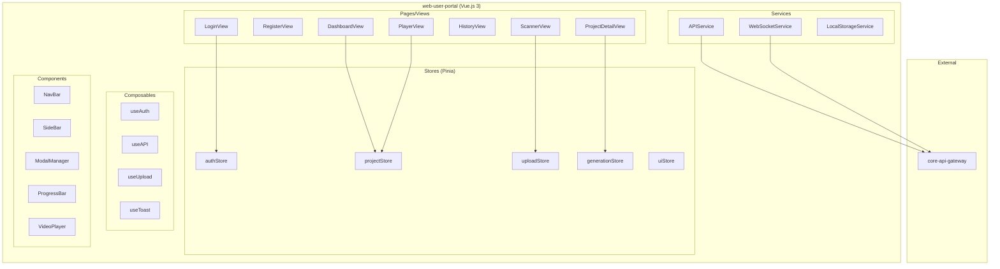

# web-user-portal

## Informations generales

| Propriete | Valeur |
|-----------|--------|
| **Repository** | web-user-portal |
| **Port** | 3000 |
| **Stack** | TypeScript / Vue.js 3 / Pinia |
| **Phase** | 5 - Frontend Secondaire |
| **Priorite** | Secondaire (apres mobile-app) |

## Flows/Journeys concernes

Le portail web est une interface **secondaire** (apres mobile) pour tous les flows:

| Flow | Role | Pages impliquees |
|------|------|------------------|
| Flow 1: Auth | UI Web | Login, Register |
| Flow 2-8 | UI Web | Dashboard, Scanner, Detail, Player |

## Architecture interne



## Pages/Views

### LoginView / RegisterView

```typescript
// src/views/auth/LoginView.vue
interface LoginState {
  email: string;
  password: string;
  rememberMe: boolean;
  isLoading: boolean;
  error: string | null;
}

// Actions
const authStore = useAuthStore();
await authStore.login({ email, password });
router.push('/dashboard');
```

### DashboardView

```typescript
// src/views/DashboardView.vue
interface DashboardState {
  recentProjects: Project[];
  stats: UserStats;
}

// Composition API
const projectStore = useProjectStore();
const { user } = useAuthStore();

onMounted(async () => {
  await projectStore.fetchRecentProjects();
});
```

### ScannerView

```typescript
// src/views/ScannerView.vue
interface ScannerState {
  mode: 'upload' | 'camera' | 'text';
  files: File[];
  textInput: string;
  isProcessing: boolean;
}

// File upload with drag & drop
const uploadStore = useUploadStore();
const handleFileDrop = async (files: File[]) => {
  await uploadStore.uploadFiles(files);
};
```

### ProjectDetailView

```typescript
// src/views/ProjectDetailView.vue
interface ProjectDetailState {
  project: Project;
  isEditing: boolean;
  config: ProjectConfig;
  workflowStatus: WorkflowStatus | null;
}

// Real-time status updates
const generationStore = useGenerationStore();
watch(
  () => generationStore.getStatus(projectId),
  (status) => {
    if (status?.status === 'completed') {
      showSuccessToast('VisioBook pret!');
    }
  }
);
```

### PlayerView

```typescript
// src/views/PlayerView.vue
interface PlayerState {
  visioBook: VisioBook;
  isPlaying: boolean;
  currentTime: number;
  volume: number;
}

// Video.js integration
const videoRef = ref<HTMLVideoElement>();
const { play, pause, seek } = useVideoControls(videoRef);
```

## Stores (Pinia)

### authStore

```typescript
// src/stores/auth.ts
export const useAuthStore = defineStore('auth', () => {
  // State
  const user = ref<User | null>(null);
  const accessToken = ref<string | null>(null);
  const refreshToken = ref<string | null>(null);

  // Getters
  const isAuthenticated = computed(() => !!accessToken.value);

  // Actions
  async function login(credentials: LoginCredentials) {
    const response = await api.post('/auth/login', credentials);
    user.value = response.user;
    accessToken.value = response.accessToken;
    refreshToken.value = response.refreshToken;
    localStorage.setItem('accessToken', response.accessToken);
  }

  async function logout() {
    await api.post('/auth/logout');
    user.value = null;
    accessToken.value = null;
    refreshToken.value = null;
    localStorage.removeItem('accessToken');
  }

  async function refreshAccessToken() {
    const response = await api.post('/auth/refresh', {
      refreshToken: refreshToken.value,
    });
    accessToken.value = response.accessToken;
  }

  return {
    user,
    accessToken,
    isAuthenticated,
    login,
    logout,
    refreshAccessToken,
  };
});
```

### projectStore

```typescript
// src/stores/project.ts
export const useProjectStore = defineStore('project', () => {
  // State
  const projects = ref<Project[]>([]);
  const currentProject = ref<Project | null>(null);
  const isLoading = ref(false);

  // Actions
  async function fetchProjects(filters?: ProjectFilters) {
    isLoading.value = true;
    try {
      const response = await api.get('/projects', { params: filters });
      projects.value = response.projects;
    } finally {
      isLoading.value = false;
    }
  }

  async function createProject(data: CreateProjectData) {
    const project = await api.post('/projects', data);
    projects.value.unshift(project);
    return project;
  }

  async function startGeneration(projectId: string, config: ProjectConfig) {
    await api.post(`/projects/${projectId}/workflow/start`, { config });
  }

  return {
    projects,
    currentProject,
    isLoading,
    fetchProjects,
    createProject,
    startGeneration,
  };
});
```

### uploadStore

```typescript
// src/stores/upload.ts
export const useUploadStore = defineStore('upload', () => {
  // State
  const uploads = ref<Map<string, Upload>>(new Map());

  // Actions
  async function uploadFile(file: File): Promise<UploadResult> {
    const uploadId = generateId();
    uploads.value.set(uploadId, {
      id: uploadId,
      filename: file.name,
      progress: 0,
      status: 'uploading',
    });

    try {
      const formData = new FormData();
      formData.append('file', file);

      const result = await api.post('/storage/upload', formData, {
        onUploadProgress: (event) => {
          const progress = Math.round((event.loaded * 100) / event.total);
          uploads.value.get(uploadId)!.progress = progress;
        },
      });

      uploads.value.get(uploadId)!.status = 'completed';
      return result;
    } catch (error) {
      uploads.value.get(uploadId)!.status = 'failed';
      throw error;
    }
  }

  return { uploads, uploadFile };
});
```

### generationStore

```typescript
// src/stores/generation.ts
export const useGenerationStore = defineStore('generation', () => {
  // State
  const statuses = ref<Map<string, WorkflowStatus>>(new Map());
  const wsConnections = ref<Map<string, WebSocket>>(new Map());

  // Actions
  function subscribeToGeneration(projectId: string) {
    const ws = new WebSocket(
      `${WS_URL}/projects/${projectId}/workflow/subscribe`
    );

    ws.onmessage = (event) => {
      const status = JSON.parse(event.data);
      statuses.value.set(projectId, status);
    };

    wsConnections.value.set(projectId, ws);
  }

  function unsubscribe(projectId: string) {
    wsConnections.value.get(projectId)?.close();
    wsConnections.value.delete(projectId);
  }

  function getStatus(projectId: string): WorkflowStatus | null {
    return statuses.value.get(projectId) || null;
  }

  return { statuses, subscribeToGeneration, unsubscribe, getStatus };
});
```

### uiStore

```typescript
// src/stores/ui.ts
export const useUIStore = defineStore('ui', () => {
  // State
  const isLoading = ref(false);
  const toasts = ref<Toast[]>([]);
  const modals = ref<Modal[]>([]);

  // Actions
  function showToast(toast: Omit<Toast, 'id'>) {
    const id = generateId();
    toasts.value.push({ ...toast, id });
    setTimeout(() => removeToast(id), toast.duration || 5000);
  }

  function removeToast(id: string) {
    const index = toasts.value.findIndex((t) => t.id === id);
    if (index > -1) toasts.value.splice(index, 1);
  }

  function showModal(modal: Modal) {
    modals.value.push(modal);
  }

  function closeModal(id: string) {
    const index = modals.value.findIndex((m) => m.id === id);
    if (index > -1) modals.value.splice(index, 1);
  }

  return { isLoading, toasts, modals, showToast, showModal, closeModal };
});
```

## Composables

### useAuth

```typescript
// src/composables/useAuth.ts
export function useAuth() {
  const authStore = useAuthStore();
  const router = useRouter();

  const isAuthenticated = computed(() => authStore.isAuthenticated);

  async function requireAuth() {
    if (!isAuthenticated.value) {
      router.push('/login');
      return false;
    }
    return true;
  }

  async function login(credentials: LoginCredentials) {
    await authStore.login(credentials);
    router.push('/dashboard');
  }

  async function logout() {
    await authStore.logout();
    router.push('/login');
  }

  return { isAuthenticated, requireAuth, login, logout };
}
```

### useAPI

```typescript
// src/composables/useAPI.ts
export function useAPI() {
  const authStore = useAuthStore();
  const uiStore = useUIStore();

  const api = axios.create({
    baseURL: import.meta.env.VITE_API_URL,
  });

  // Request interceptor
  api.interceptors.request.use((config) => {
    if (authStore.accessToken) {
      config.headers.Authorization = `Bearer ${authStore.accessToken}`;
    }
    return config;
  });

  // Response interceptor
  api.interceptors.response.use(
    (response) => response.data,
    async (error) => {
      if (error.response?.status === 401) {
        try {
          await authStore.refreshAccessToken();
          return api.request(error.config);
        } catch {
          await authStore.logout();
        }
      }
      uiStore.showToast({
        type: 'error',
        message: error.response?.data?.message || 'Erreur reseau',
      });
      throw error;
    }
  );

  return { api };
}
```

## Components

### VideoPlayer.vue

```vue
<!-- src/components/VideoPlayer.vue -->
<script setup lang="ts">
import { ref, onMounted, onUnmounted } from 'vue';
import Hls from 'hls.js';

const props = defineProps<{
  src: string;
  poster?: string;
}>();

const videoRef = ref<HTMLVideoElement>();
let hls: Hls | null = null;

onMounted(() => {
  if (Hls.isSupported() && props.src.endsWith('.m3u8')) {
    hls = new Hls();
    hls.loadSource(props.src);
    hls.attachMedia(videoRef.value!);
  }
});

onUnmounted(() => {
  hls?.destroy();
});
</script>

<template>
  <video
    ref="videoRef"
    :src="src"
    :poster="poster"
    controls
    class="video-player"
  />
</template>
```

### ProgressBar.vue

```vue
<!-- src/components/ProgressBar.vue -->
<script setup lang="ts">
defineProps<{
  progress: number;
  status: string;
  steps?: { name: string; progress: number }[];
}>();
</script>

<template>
  <div class="progress-container">
    <div class="progress-bar">
      <div class="progress-fill" :style="{ width: `${progress}%` }" />
    </div>
    <span class="progress-text">{{ progress }}% - {{ status }}</span>
    <div v-if="steps" class="steps">
      <div v-for="step in steps" :key="step.name" class="step">
        {{ step.name }}
      </div>
    </div>
  </div>
</template>
```

## Communications avec Backend

### Configuration API

```typescript
// src/services/api.ts
import axios from 'axios';

export const api = axios.create({
  baseURL: import.meta.env.VITE_API_URL || 'http://localhost:8080/api/v1',
  timeout: 30000,
  headers: {
    'Content-Type': 'application/json',
  },
});
```

### WebSocket pour temps reel

```typescript
// src/services/websocket.ts
export class WebSocketService {
  private socket: WebSocket | null = null;

  connect(url: string): void {
    this.socket = new WebSocket(url);

    this.socket.onopen = () => {
      console.log('WebSocket connected');
    };

    this.socket.onclose = () => {
      console.log('WebSocket disconnected');
      // Auto-reconnect after 5s
      setTimeout(() => this.connect(url), 5000);
    };
  }

  subscribe(event: string, callback: (data: any) => void): void {
    if (!this.socket) return;
    this.socket.addEventListener('message', (msg) => {
      const data = JSON.parse(msg.data);
      if (data.event === event) {
        callback(data.payload);
      }
    });
  }

  disconnect(): void {
    this.socket?.close();
    this.socket = null;
  }
}
```

## Mocks pour tests

### Mock API

```typescript
// tests/mocks/api.mock.ts
import { vi } from 'vitest';

export const mockApi = {
  get: vi.fn(),
  post: vi.fn(),
  put: vi.fn(),
  patch: vi.fn(),
  delete: vi.fn(),
};

vi.mock('@/services/api', () => ({
  api: mockApi,
}));
```

### Mock Stores

```typescript
// tests/mocks/stores.mock.ts
import { setActivePinia, createPinia } from 'pinia';

export function setupTestPinia() {
  setActivePinia(createPinia());
}

export const mockAuthStore = {
  user: { id: 'user-123', email: 'test@example.com' },
  isAuthenticated: true,
  login: vi.fn(),
  logout: vi.fn(),
};
```

## Configuration

### Vite Config

```typescript
// vite.config.ts
import { defineConfig } from 'vite';
import vue from '@vitejs/plugin-vue';
import path from 'path';

export default defineConfig({
  plugins: [vue()],
  resolve: {
    alias: {
      '@': path.resolve(__dirname, './src'),
    },
  },
  server: {
    port: 3000,
    proxy: {
      '/api': {
        target: 'http://localhost:8080',
        changeOrigin: true,
      },
    },
  },
});
```

### Environment Variables

```env
# .env
VITE_API_URL=http://localhost:8080/api/v1
VITE_WS_URL=ws://localhost:8080/ws
VITE_CDN_URL=https://cdn.visiobook.com
```

## Metriques de succes

| Metrique | Objectif | Description |
|----------|----------|-------------|
| Load time | < 2s | Temps chargement initial |
| Lighthouse | > 90 | Score performance |
| Bundle size | < 500KB | Taille JS gzipped |
| Accessibility | WCAG AA | Conformite accessibilite |
