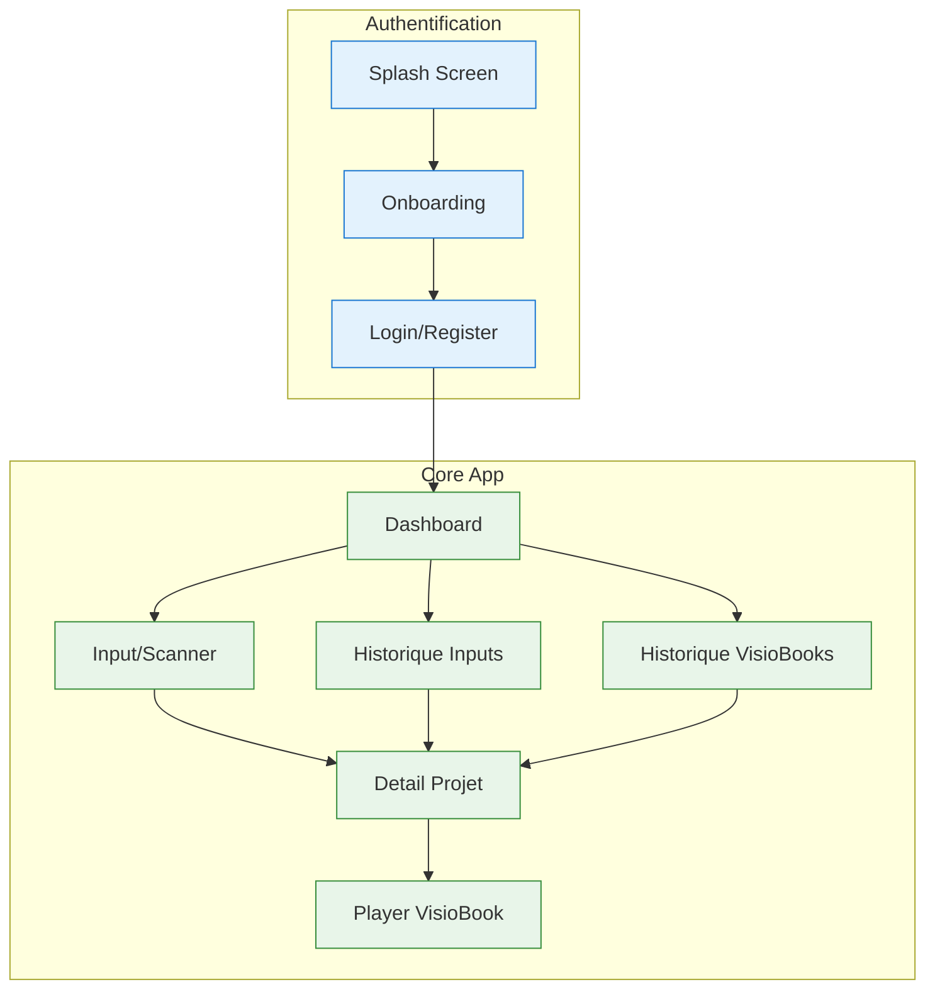

# Documentation UX - VisioBook Mobile App

## Vue d'ensemble

Cette documentation decrit l'experience utilisateur (UX) de l'application mobile VisioBook, une application permettant de transformer des livres en experiences audiovisuelles interactives grace a l'intelligence artificielle.

## Table des matieres

| Document | Description |
|----------|-------------|
| [01-user-journey-mapping.md](./01-user-journey-mapping.md) | Parcours utilisateur complets par persona |
| [02-user-flows.md](./02-user-flows.md) | Flux utilisateur detailles avec flowcharts |
| [03-screen-flows.md](./03-screen-flows.md) | Enchainements d'ecrans et navigation |
| [04-mvp-screens.md](./04-mvp-screens.md) | Specifications detaillees des ecrans MVP |
| [05-interaction-sequences.md](./05-interaction-sequences.md) | Diagrammes de sequence avec les services |

## Personas cibles

### Persona 1: Nouvel Utilisateur - "Marie"

```yaml
Profil:
  Age: 28 ans
  Profession: Enseignante
  Contexte: Decouvre l'application pour la premiere fois

Objectifs:
  - Comprendre rapidement ce que fait l'application
  - Creer son premier VisioBook facilement
  - Partager le resultat avec ses eleves

Pain Points:
  - Manque de temps pour lire
  - Difficulte a engager les eleves avec la lecture traditionnelle

Attentes UX:
  - Onboarding clair et rapide
  - Interface intuitive sans formation
  - Resultats impressionnants des la premiere utilisation
```

### Persona 2: Utilisateur Regulier - "Thomas"

```yaml
Profil:
  Age: 35 ans
  Profession: Parent de 2 enfants
  Contexte: Utilise l'app regulierement pour ses enfants

Objectifs:
  - Creer des histoires visuelles pour le coucher
  - Retrouver facilement ses creations precedentes
  - Personnaliser les styles selon les preferences des enfants

Pain Points:
  - Les enfants s'ennuient avec les memes histoires
  - Peu de temps le soir pour preparer du contenu

Attentes UX:
  - Acces rapide a l'historique
  - Generation rapide et fiable
  - Variete de styles visuels
```

### Persona 3: Utilisateur Premium - "Sophie"

```yaml
Profil:
  Age: 42 ans
  Profession: Auteure independante
  Contexte: Utilise l'app pour promouvoir ses livres

Objectifs:
  - Creer des teasers visuels pour ses romans
  - Exporter en haute qualite pour les reseaux sociaux
  - Personnaliser finement le rendu

Pain Points:
  - Besoin d'un rendu professionnel
  - Veut controler les details de generation

Attentes UX:
  - Options avancees de personnalisation
  - Export haute qualite
  - Pas de filigrane ni limitations
```

## Principes UX du projet

### 1. Simplicite avant tout

```
L'utilisateur doit pouvoir creer son premier VisioBook en moins de 5 minutes
sans avoir besoin de tutoriel.
```

- Interface epuree avec actions principales visibles
- Parcours lineaire pour la premiere utilisation
- Options avancees masquees par defaut

### 2. Feedback immediat

```
L'utilisateur ne doit jamais se demander "est-ce que ca marche?"
```

- Indicateurs de progression clairs pendant la generation
- Previsualisations rapides avant generation complete
- Messages d'etat explicites

### 3. Confiance et transparence

```
L'utilisateur doit comprendre ce qui se passe avec son contenu.
```

- Explication claire des traitements IA
- Estimation du temps avant generation
- Historique complet et accessible

### 4. Mobile-first

```
L'experience est concue pour le mobile avec adaptation desktop.
```

- Navigation par gestes naturels
- Bottom navigation accessible au pouce
- Contenu adaptatif selon l'orientation

## Architecture des ecrans MVP



## Navigation principale

### Bottom Tab Bar (MVP)

| Tab | Icone | Ecran | Description |
|-----|-------|-------|-------------|
| Accueil | `home` | Dashboard | Hub central |
| Scanner | `camera` | Input/Scanner | Ajout de contenu |
| Mes Textes | `file-text` | Historique Inputs | Textes importes |
| Mes VisioBooks | `play-circle` | Historique VisioBooks | Animations generees |

### Navigation secondaire

- **Header**: Retour, titre, actions contextuelles
- **Modales**: Settings, partage, confirmation
- **Sheets**: Options de personnalisation

## Correspondance Milestones <-> Ecrans

| Milestone | User Stories | Ecrans concernes |
|-----------|--------------|------------------|
| **M1: Import contenu** | US 1.1, 1.2, 1.3, 1.4, 1.5 | Input/Scanner, Detail |
| **M2: Personnalisation** | US 2.1, 2.2, 2.3, 2.4, 2.5 | Detail (settings) |
| **M3: Generation** | US 3.1, 3.2, 3.3, 3.4, 3.5 | Detail, Player |
| **M4: Export/Partage** | US 4.1, 4.2, 4.3, 4.4, 4.5 | Player, Detail |
| **M5: Historique** | US 5.1, 5.2, 5.3, 5.4, 5.5 | Historiques, Dashboard |

## Stack technique frontend

```yaml
Framework: React Native / Expo
Navigation: React Navigation v6
State Management: Redux Toolkit / Zustand
UI Components: React Native Paper / NativeBase
Video Player: expo-av
Camera: expo-camera
File Picker: expo-document-picker
```

## Liens utiles

- [Architecture Microservices](../architecture/visiobook-priority-architecture.md)
- [API Core User Service](../api/core-user-service.md)
- [API Core Project Service](../api/core-project-service.md)
- [API Support Storage Service](../api/support-storage-service.md)
- [API AI Analysis Service](../api/ai-analysis-service.md)
- [Epics et Features](../epics/features.md)
- [User Stories](../epics/user_stories.md)
