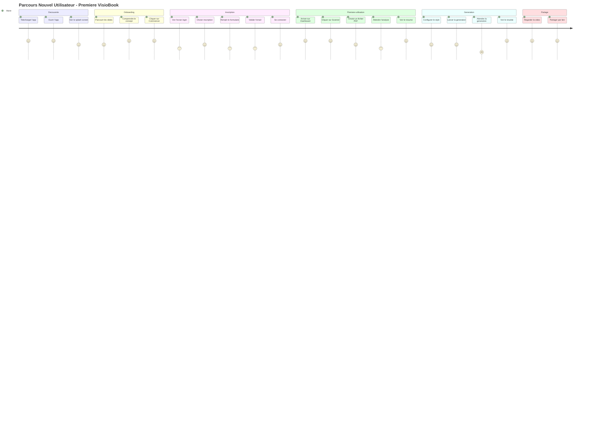
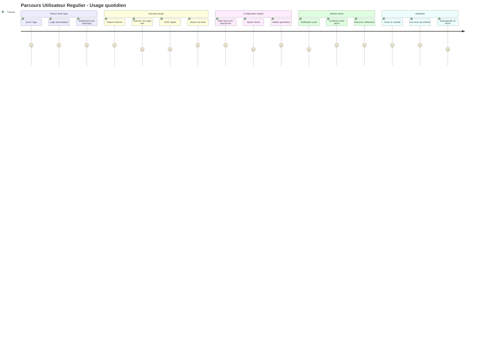
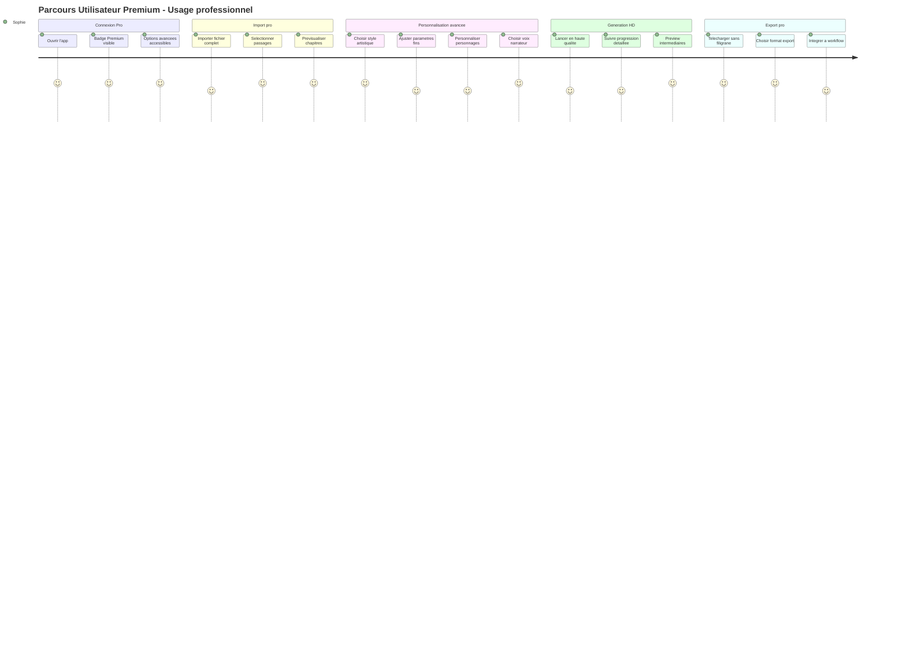
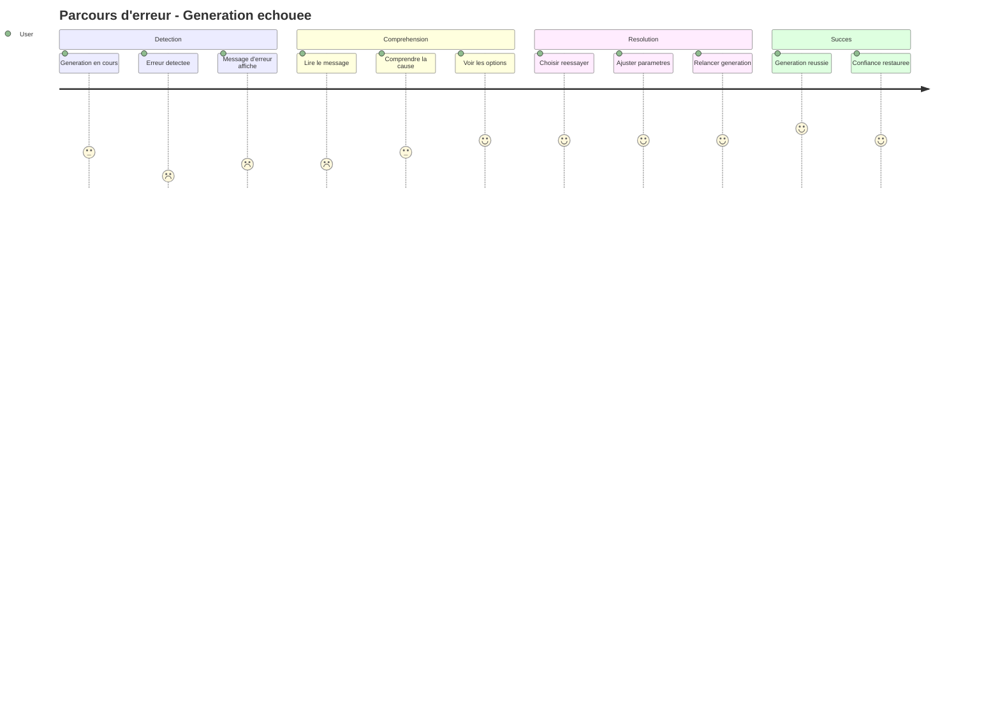
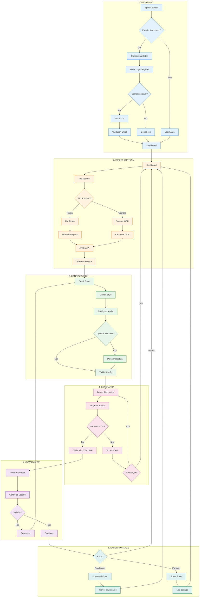
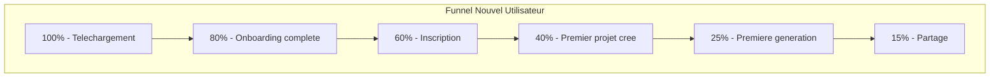

# User Journey Mapping - VisioBook Mobile

## Vue d'ensemble

Ce document presente les parcours utilisateur (User Journeys) pour l'application mobile VisioBook. Chaque journey est decrit selon les phases, points de contact, emotions et opportunites d'amelioration.

## Journey 1: Nouvel Utilisateur - Premiere Experience

### Scenario
Marie, enseignante, decouvre VisioBook et souhaite creer sa premiere animation a partir d'un livre pour ses eleves.

### Journey Map



### Detail par phase

#### Phase 1: Decouverte (Pre-app)

| Etape | Point de contact | Emotion | Action | Opportunite |
|-------|-----------------|---------|--------|-------------|
| Decouverte | Store (App Store/Play Store) | Curieuse | Recherche "livre animation" | SEO, mots-cles pertinents |
| Evaluation | Page store | Interessee | Lit les avis et description | Screenshots attractifs |
| Telechargement | Bouton installer | Enthousiaste | Telecharge l'app | Taille d'app reduite |

#### Phase 2: Onboarding

| Etape | Ecran | Emotion | Action | Opportunite |
|-------|-------|---------|--------|-------------|
| Splash | Splash screen | Neutre | Attend | Animation engageante < 2s |
| Slide 1 | Onboarding | Curieuse | Swipe | Message clair sur la valeur |
| Slide 2 | Onboarding | Interessee | Swipe | Demo visuelle du resultat |
| Slide 3 | Onboarding | Motivee | Tap "Commencer" | CTA visible et attractif |

#### Phase 3: Inscription

| Etape | Ecran | Emotion | Action | Pain Point | Solution |
|-------|-------|---------|--------|------------|----------|
| Choix methode | Login | Hesitante | Choisit email | Trop d'options | Social login en priorite |
| Formulaire | Register | Frustrée | Remplit champs | Formulaire long | Minimum de champs |
| Validation | Email | Impatiente | Verifie email | Delai reception | Lien magique ou code |
| Connexion | Login | Soulagee | Se connecte | - | Connexion auto apres validation |

#### Phase 4: Premiere utilisation

| Etape | Ecran | Emotion | Action | Pain Point | Solution |
|-------|-------|---------|--------|------------|----------|
| Dashboard vide | Dashboard | Perdue | Cherche quoi faire | Ecran vide intimidant | CTA prominent + guide |
| Import | Input/Scanner | Curieuse | Choisit fichier | Format non supporte | Liste claire des formats |
| Upload | Input/Scanner | Impatiente | Attend upload | Temps d'attente | Progress bar + estimation |
| Analyse | Detail | Interessee | Voit le resume | Resume incorrect | Option d'edition |

#### Phase 5: Generation

| Etape | Ecran | Emotion | Action | Pain Point | Solution |
|-------|-------|---------|--------|------------|----------|
| Configuration | Detail | Excitee | Choisit style | Trop d'options | Defaults intelligents |
| Lancement | Detail | Enthousiaste | Clique generer | Cout/credits | Premier gratuit |
| Attente | Detail | Anxieuse | Attend | Temps long | Notifications + temps estime |
| Resultat | Player | Emerveillée | Voit le resultat | - | Celebration UI |

#### Phase 6: Partage

| Etape | Ecran | Emotion | Action | Pain Point | Solution |
|-------|-------|---------|--------|------------|----------|
| Visionnage | Player | Ravie | Regarde | Qualite video | Options qualite |
| Partage | Player | Fiere | Partage lien | Processus complexe | Share sheet native |
| Feedback | - | Satisfaite | Recommande | - | Demande d'avis |

---

## Journey 2: Utilisateur Regulier - Creation rapide

### Scenario
Thomas utilise VisioBook regulierement pour creer des histoires pour ses enfants avant le coucher.

### Journey Map



### Points cles pour l'utilisateur regulier

```yaml
Attentes:
  - Login automatique (biometrie)
  - Acces rapide au scanner
  - Preferences memorisees
  - Historique organise
  - Notifications fiables

Optimisations UX:
  - Shortcut direct vers scanner depuis home screen
  - Templates de style favoris
  - Generation en arriere-plan
  - Hors-ligne pour consultation historique
```

### Metriques cibles

| Metrique | Objectif | Mesure |
|----------|----------|--------|
| Time-to-scan | < 10 secondes | Du lancement au debut scan |
| Time-to-generate | < 30 secondes | De la validation au lancement IA |
| Retention J7 | > 40% | Utilisateurs revenant a J+7 |
| Sessions/semaine | > 3 | Moyenne par utilisateur actif |

---

## Journey 3: Utilisateur Premium - Usage professionnel

### Scenario
Sophie, auteure, utilise VisioBook pour creer des teasers visuels de ses romans pour les reseaux sociaux.

### Journey Map



### Fonctionnalites Premium differenciantes

| Fonctionnalite | Standard | Premium |
|----------------|----------|---------|
| Resolution export | 720p | 4K |
| Filigrane | Oui | Non |
| Styles disponibles | 5 | 20+ |
| Personnalisation personnages | Non | Oui |
| Voix narrateur | 2 | 10+ |
| Generations/mois | 5 | Illimite |
| Support | Email | Prioritaire |

---

## Journey 4: Parcours d'erreur - Gestion des echecs

### Scenario
Un utilisateur rencontre une erreur pendant la generation.

### Journey Map



### Matrice des erreurs et solutions UX

| Type d'erreur | Message utilisateur | Action proposee | Prevention |
|---------------|---------------------|-----------------|------------|
| Timeout generation | "La generation prend plus de temps que prevu" | Reessayer / Notifier quand pret | Estimation realiste du temps |
| Contenu trop long | "Le texte depasse la limite" | Raccourcir / Decoouper | Avertir avant upload |
| Format non supporte | "Ce format n'est pas pris en charge" | Voir formats acceptes | Liste visible a l'import |
| Quota atteint | "Vous avez utilise vos credits" | Passer Premium / Attendre | Compteur visible |
| Erreur serveur | "Un probleme est survenu" | Reessayer plus tard | Monitoring proactif |
| Connexion perdue | "Connexion internet perdue" | Reconnecter | Mode offline partiel |

---

## Journey 5: Parcours complet MVP - De A a Z

### Diagramme du parcours complet



---

## Metriques et KPIs par Journey

### Funnel de conversion



### KPIs par phase

| Phase | KPI | Objectif MVP | Objectif v2 |
|-------|-----|--------------|-------------|
| Onboarding | Taux completion | > 80% | > 90% |
| Inscription | Taux conversion | > 50% | > 70% |
| Premier projet | Time-to-first-project | < 5 min | < 3 min |
| Generation | Taux de succes | > 95% | > 99% |
| Retention | J1 | > 30% | > 50% |
| Retention | J7 | > 15% | > 30% |
| NPS | Score | > 30 | > 50 |

---

## Recommandations UX par Journey

### Nouvel Utilisateur

1. **Onboarding gamifie** : Montrer un exemple de resultat des le debut
2. **Zero friction signup** : Social login + email magic link
3. **Premier projet guide** : Wizard step-by-step avec exemple
4. **Celebration du succes** : Animation de felicitation au premier VisioBook

### Utilisateur Regulier

1. **Quick actions** : Raccourcis vers les actions frequentes
2. **Smart defaults** : Memoriser les preferences de style
3. **Background processing** : Generation sans bloquer l'UI
4. **Notifications intelligentes** : Pas de spam, que l'essentiel

### Utilisateur Premium

1. **Onboarding premium** : Tour des fonctionnalites avancees
2. **Export pro** : Formats professionnels (ProRes, etc.)
3. **Analytics** : Stats sur ses creations
4. **Priority queue** : Generation prioritaire garantie
