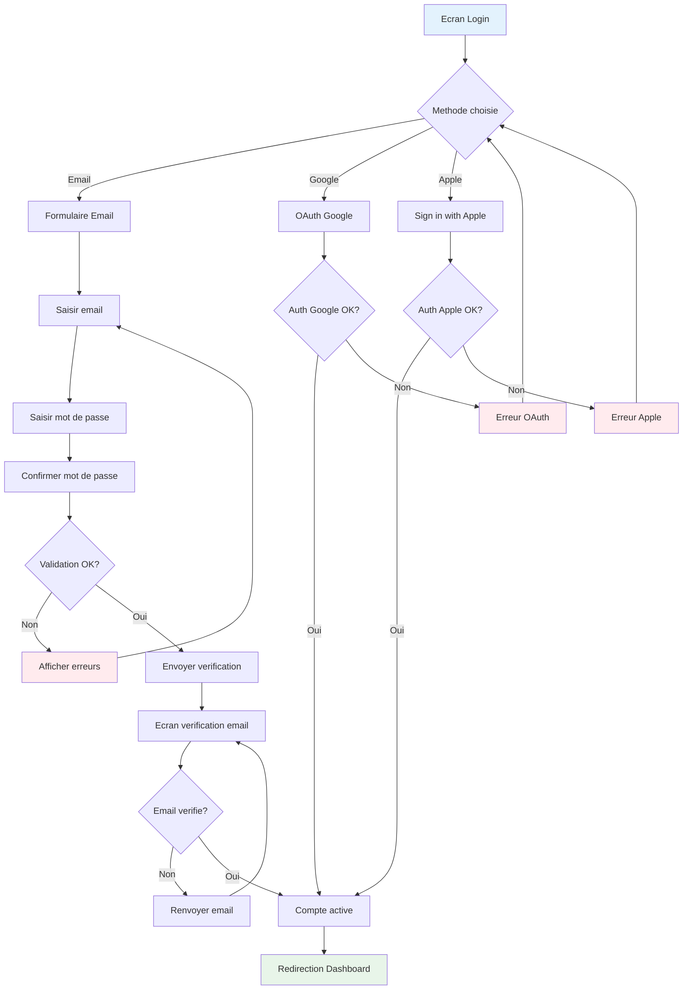
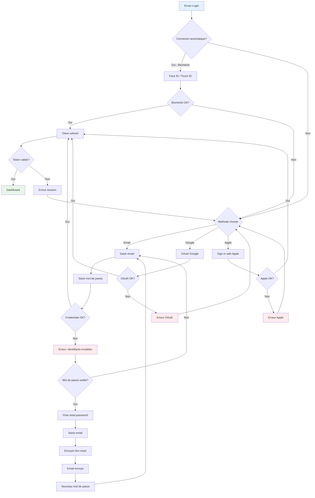
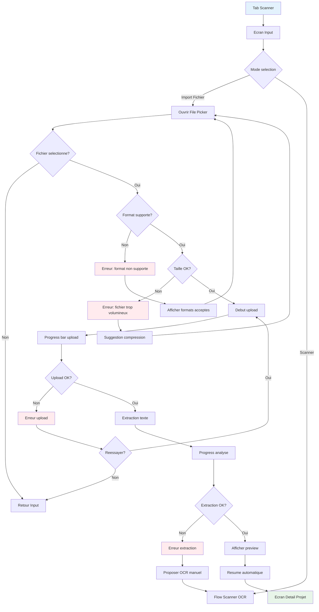
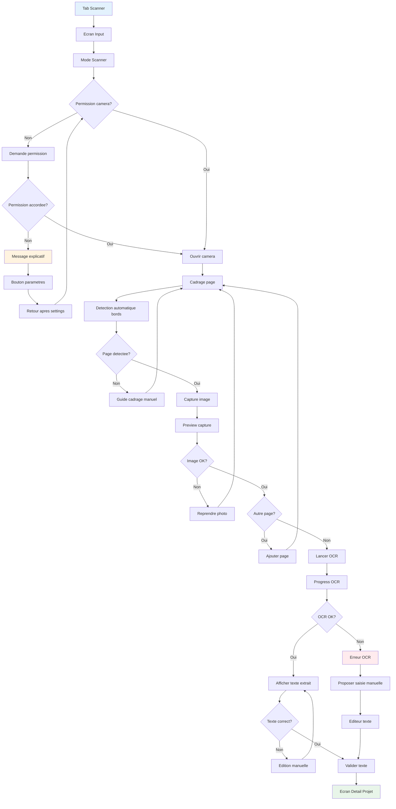
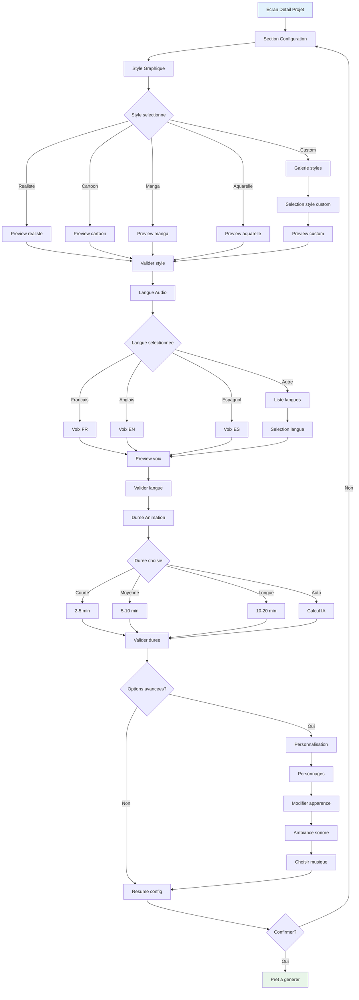
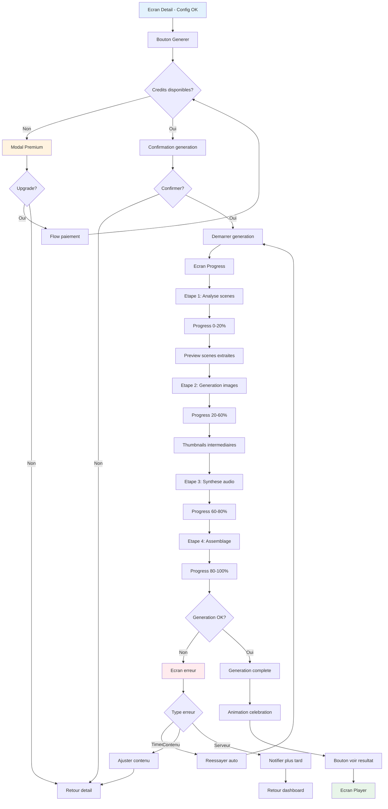
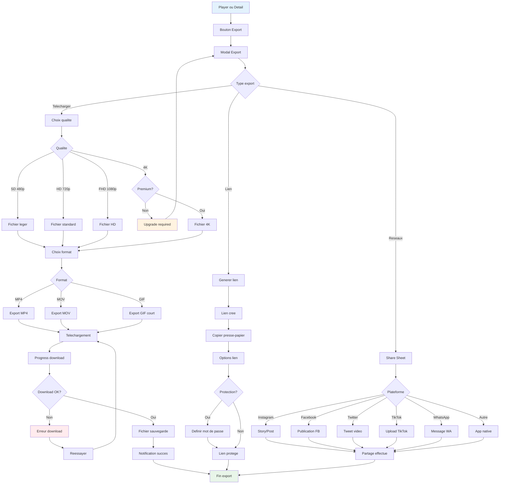
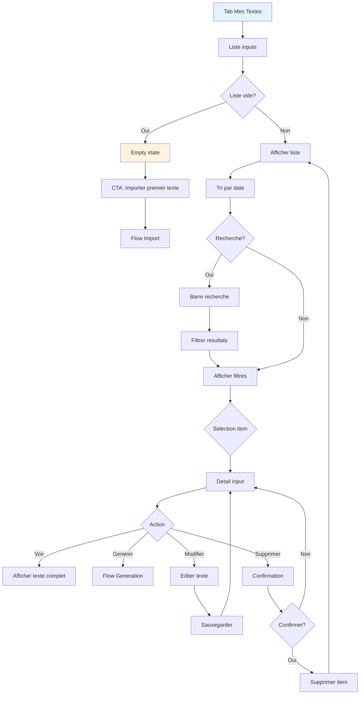
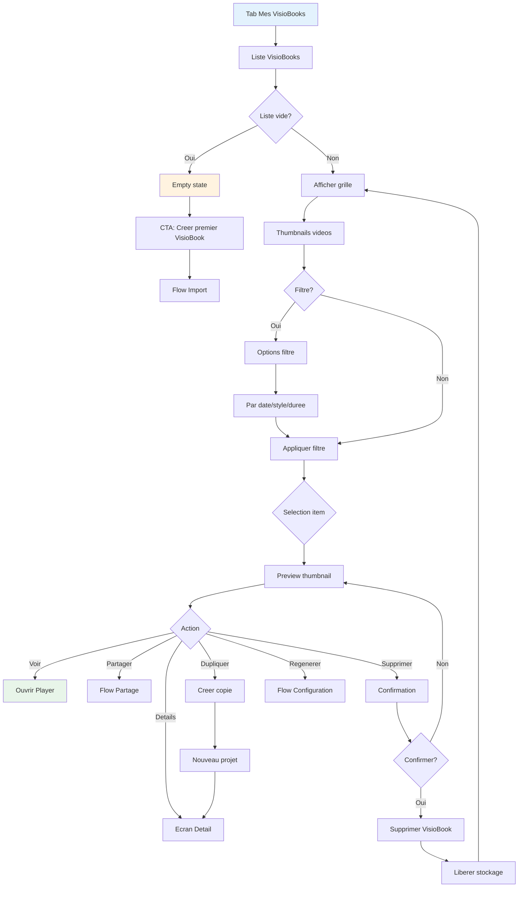

# User Flows - VisioBook Mobile

## Vue d'ensemble

Ce document presente les flux utilisateur (User Flows) detailles de l'application mobile VisioBook. Chaque flow correspond a une fonctionnalite cle et est illustre par des diagrammes Mermaid.

---

## Flow 1: Inscription et Connexion

### US Associees
- **US P5.1** - Creation de compte (MUST)
- **US 5.1** - Authentification

### Flow d'inscription



### Flow de connexion



### Validation des champs

| Champ | Regles | Message d'erreur |
|-------|--------|------------------|
| Email | Format email valide | "Adresse email invalide" |
| Password | Min 8 chars, 1 maj, 1 chiffre | "Le mot de passe doit contenir..." |
| Confirm | Egal au password | "Les mots de passe ne correspondent pas" |

---

## Flow 2: Import de Contenu (Fichier)

### US Associees
- **US 1.1** - Import de fichiers (MUST)
- **US 1.3** - Previsualisation et resume (SHOULD)

### Flow import fichier



### Formats supportes

| Format | Extension | Taille max | Notes |
|--------|-----------|------------|-------|
| PDF | .pdf | 50 MB | Texte extractible |
| Texte | .txt | 10 MB | UTF-8 |
| Word | .docx | 25 MB | Via conversion |
| EPUB | .epub | 50 MB | Extraction chapitres |

---

## Flow 3: Import de Contenu (Scanner OCR)

### US Associees
- **US 1.2** - Scan de texte (SHOULD)

### Flow scanner OCR



### Parametres OCR

| Parametre | Valeur | Description |
|-----------|--------|-------------|
| Langues | FR, EN, ES, DE | Detection automatique |
| Resolution | 300 DPI | Minimum pour OCR fiable |
| Format sortie | Texte brut | Nettoyage automatique |
| Multi-page | Oui | Jusqu'a 50 pages |

---

## Flow 4: Configuration et Personnalisation

### US Associees
- **US 2.1** - Choix du style graphique (MUST)
- **US 2.2** - Choix de la langue audio (SHOULD)
- **US 2.3** - Definir la duree (COULD)
- **US 2.4** - Personnalisation personnages (COULD)
- **US 2.5** - Choix ambiance sonore (COULD)

### Flow configuration projet



### Options de style

| Style | Description | Premium |
|-------|-------------|---------|
| Realiste | Rendu photoréaliste | Non |
| Cartoon | Style dessin anime occidental | Non |
| Manga | Style manga japonais | Non |
| Aquarelle | Effet peinture aquarelle | Non |
| Pixel Art | Retro gaming | Oui |
| Art Nouveau | Style artistique classique | Oui |
| Custom | Import de style personnel | Oui |

---

## Flow 5: Generation de VisioBook

### US Associees
- **US 3.1** - Generation automatique (MUST)
- **US 3.3** - Suivi de la progression (SHOULD)
- **US 3.4** - Previsualisation scenes (SHOULD)

### Flow generation



### Etapes de generation

| Etape | Description | Duree estimee | Progress |
|-------|-------------|---------------|----------|
| 1. Analyse | Extraction scenes et personnages | 10-30s | 0-20% |
| 2. Images | Generation images IA | 1-5 min | 20-60% |
| 3. Audio | Synthese vocale + musique | 30s-2min | 60-80% |
| 4. Assemblage | Montage video final | 20-60s | 80-100% |

---

## Flow 6: Visualisation (Player)

### US Associees
- **US 3.2** - Visualisation dans l'application (MUST)
- **US 3.5** - Controles de lecture (MUST)

### Flow player

```mermaid
flowchart TD
    A[Ouvrir VisioBook] --> B[Ecran Player]
    B --> C[Chargement video]
    C --> D{Stream OK?}

    D -->|Non| E[Erreur chargement]
    E --> F{Connexion?}
    F -->|Non| G[Mode hors-ligne]
    G --> H{Cache disponible?}
    H -->|Oui| I[Lecture cache]
    H -->|Non| J[Message: telecharger d'abord]

    F -->|Oui| K[Reessayer stream]
    K --> C

    D -->|Oui| L[Afficher video]

    L --> M[Controles visibles]
    M --> N{Action utilisateur}

    N -->|Play/Pause| O[Toggle lecture]
    N -->|Seek| P[Deplacer timeline]
    N -->|Volume| Q[Ajuster son]
    N -->|Fullscreen| R[Mode plein ecran]
    N -->|Vitesse| S[Changer vitesse]
    N -->|Sous-titres| T[Toggle sous-titres]

    O & P & Q & R & S & T --> M

    N -->|Terminer| U[Fin video}
    U --> V[Ecran fin]
    V --> W{Action suivante}

    W -->|Rejouer| L
    W -->|Partager| X[Flow partage]
    W -->|Telecharger| Y[Flow download]
    W -->|Fermer| Z[Retour detail]

    I --> L
    J --> Z

    style B fill:#e3f2fd
    style L fill:#e8f5e9
    style E fill:#ffebee
```

### Controles du player

| Controle | Geste/Action | Description |
|----------|--------------|-------------|
| Play/Pause | Tap centre | Toggle lecture |
| Seek | Drag timeline | Navigation temporelle |
| Volume | Slider ou boutons physiques | Ajustement son |
| Fullscreen | Tap icone ou rotation | Plein ecran |
| Skip 10s | Double tap gauche/droite | Avance/recul rapide |
| Vitesse | Menu 0.5x, 1x, 1.5x, 2x | Vitesse lecture |
| Sous-titres | Toggle CC | Afficher/masquer |

---

## Flow 7: Export et Partage

### US Associees
- **US 4.1** - Telecharger la video (MUST)
- **US 4.2** - Partage reseaux sociaux (COULD)
- **US 4.3** - Choix format export (SHOULD)
- **US 4.4** - Generation lien partage (SHOULD)

### Flow export



### Options d'export

| Option | Standard | Premium |
|--------|----------|---------|
| 480p SD | Oui | Oui |
| 720p HD | Oui | Oui |
| 1080p FHD | Non | Oui |
| 4K UHD | Non | Oui |
| Sans filigrane | Non | Oui |
| Lien protege | Non | Oui |

---

## Flow 8: Consultation Historique

### US Associees
- **US 5.1** - Acceder a l'historique (SHOULD)
- **US 5.2** - Modifier un projet (COULD)
- **US 5.3** - Dupliquer un projet (COULD)
- **US 5.5** - Supprimer un projet (SHOULD)

### Flow historique inputs



### Flow historique VisioBooks



### Tri et filtres disponibles

| Critere | Options |
|---------|---------|
| Date | Plus recent, Plus ancien |
| Style | Tous, Realiste, Cartoon, etc. |
| Duree | Court (<5min), Moyen, Long |
| Statut | Tous, Termine, En cours, Echec |

---

## Resume des flows par User Story

| US | Flow principal | Ecrans impliques |
|----|----------------|------------------|
| US P5.1 | Flow 1: Inscription | Login, Register, Validation |
| US 1.1 | Flow 2: Import fichier | Input, File Picker, Detail |
| US 1.2 | Flow 3: Scanner OCR | Input, Camera, OCR, Detail |
| US 1.3 | Flow 2 & 3: Preview | Detail (resume) |
| US 2.1-2.5 | Flow 4: Configuration | Detail (config) |
| US 3.1-3.4 | Flow 5: Generation | Detail, Progress, Player |
| US 3.5 | Flow 6: Player | Player |
| US 4.1-4.4 | Flow 7: Export | Player, Modal Export |
| US 5.1-5.5 | Flow 8: Historique | Historiques, Detail |
