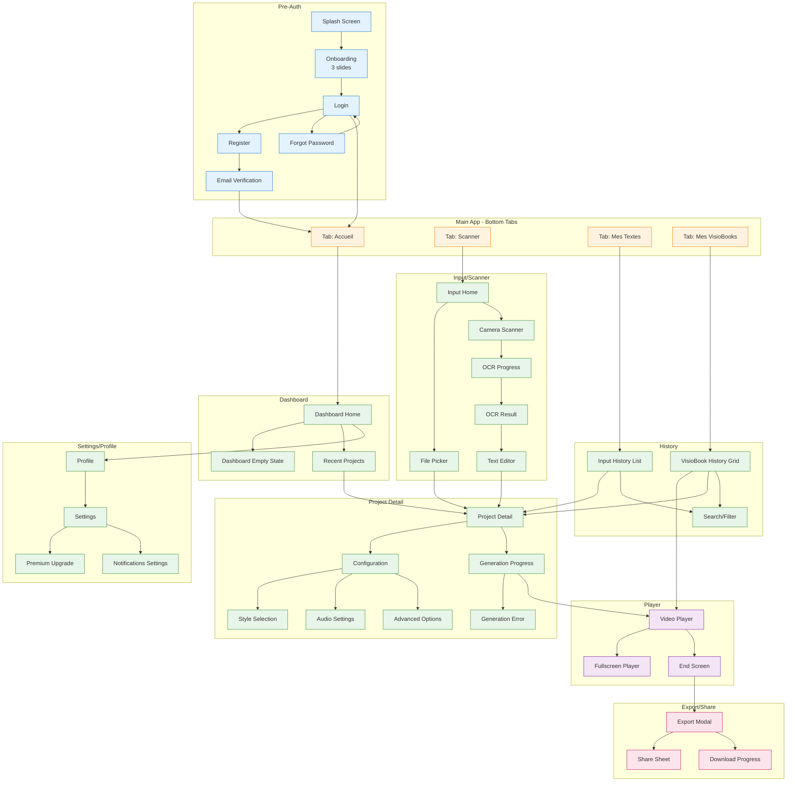
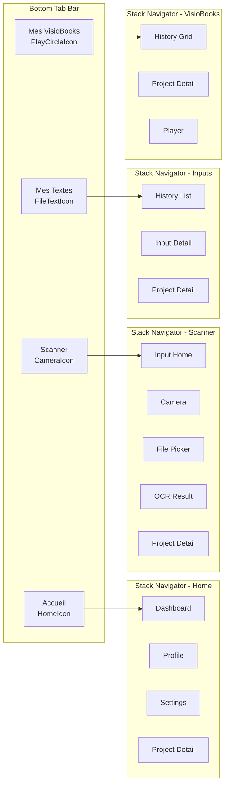
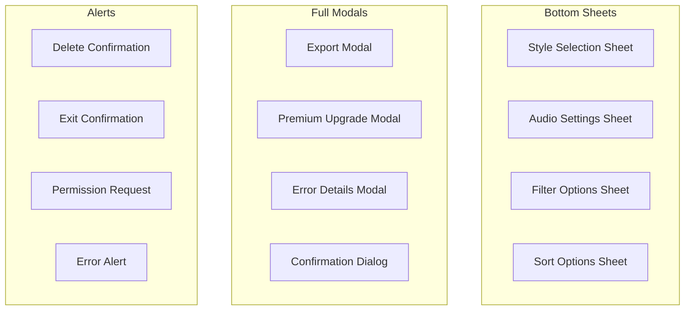
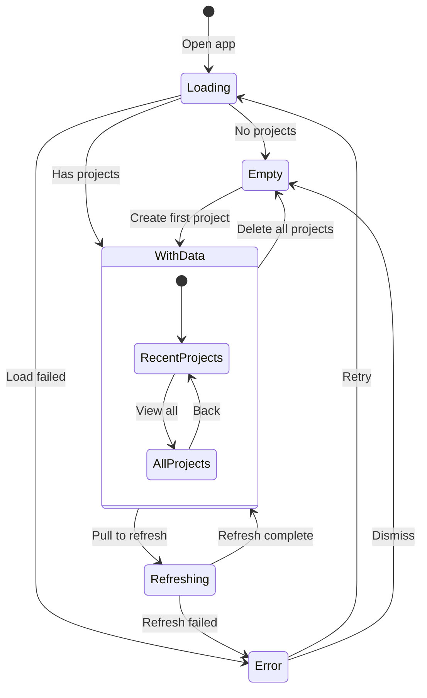
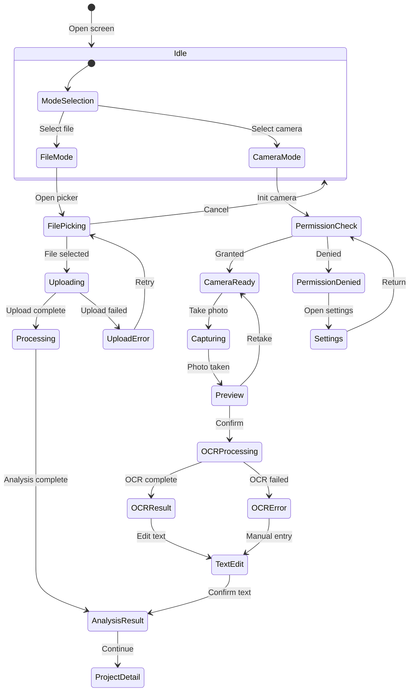
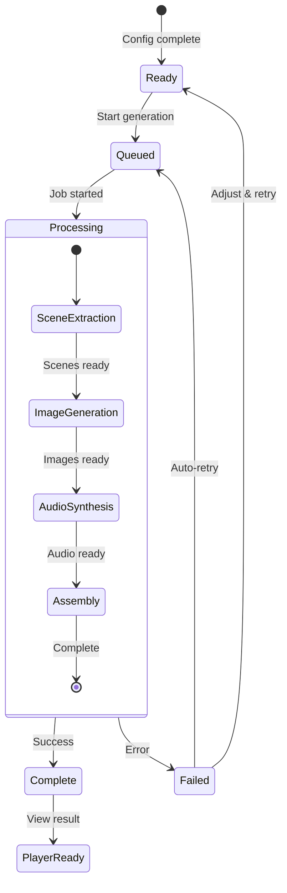
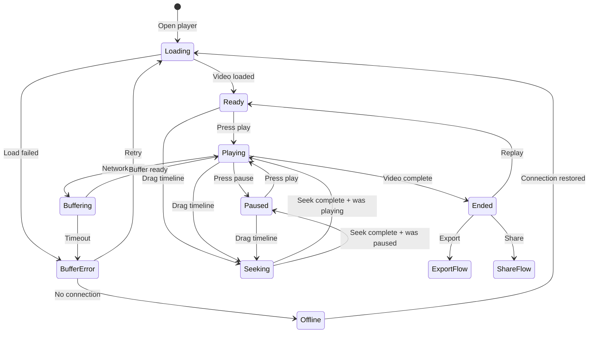

# Screen Flows - VisioBook Mobile

## Vue d'ensemble

Ce document presente les enchainements d'ecrans (Screen Flows), la navigation et les etats des interfaces de l'application mobile VisioBook.

---

## Arborescence complete des ecrans (Sitemap)



---

## Navigation principale

### Structure de navigation



### Configuration React Navigation

```typescript
// Navigation structure
const TabNavigator = {
  Home: {
    screen: HomeStack,
    icon: 'home',
    label: 'Accueil'
  },
  Scanner: {
    screen: ScannerStack,
    icon: 'camera',
    label: 'Scanner'
  },
  Inputs: {
    screen: InputsStack,
    icon: 'file-text',
    label: 'Mes Textes'
  },
  VisioBooks: {
    screen: VisioBooksStack,
    icon: 'play-circle',
    label: 'Mes VisioBooks'
  }
};
```

---

## Navigation secondaire

### Header Navigation

| Ecran | Left Action | Title | Right Actions |
|-------|-------------|-------|---------------|
| Dashboard | Menu/Profile | "VisioBook" | Notifications |
| Input | Back | "Nouveau" | - |
| Camera | Close | "Scanner" | Flash, Settings |
| History | - | "Mes Textes" | Search, Filter |
| Detail | Back | Titre projet | More (menu) |
| Player | Close | - | Share, Download |
| Settings | Back | "Parametres" | - |

### Modales et Sheets



---

## Etats des ecrans

### Dashboard - Etats



### Composants d'etat Dashboard

```yaml
Loading State:
  Components:
    - Skeleton cards (3x)
    - Loading indicator subtle
  Duration: Max 3s puis timeout

Empty State:
  Components:
    - Illustration vide
    - Titre: "Aucun projet"
    - Description: "Creez votre premier VisioBook"
    - CTA: "Commencer" -> Tab Scanner

WithData State:
  Components:
    - Header avec stats (X projets, Y VisioBooks)
    - Section "Recents" (3 derniers)
    - Section "En cours" (si applicable)
    - CTA "Nouveau projet"

Error State:
  Components:
    - Icone erreur
    - Message explicatif
    - Bouton "Reessayer"
    - Lien "Aide"
```

### Input/Scanner - Etats



### Generation - Etats



### Composants d'etat Generation

```yaml
Ready State:
  Components:
    - Resume configuration
    - Estimation temps
    - Bouton "Generer"
    - Info credits restants

Queued State:
  Components:
    - Animation attente
    - Position dans la queue
    - Option annuler
    - Estimation attente

Processing State:
  Components:
    - Progress bar globale
    - Etape actuelle avec description
    - Pourcentage completion
    - Thumbnails intermediaires (si dispo)
    - Temps restant estime
    - Option "Notifier quand pret"

Complete State:
  Components:
    - Animation celebration
    - Preview thumbnail
    - Stats generation (duree, scenes, etc.)
    - CTA "Voir le resultat"
    - Options rapides (partager, telecharger)

Failed State:
  Components:
    - Icone erreur
    - Message d'erreur comprehensible
    - Cause probable
    - Actions: Reessayer, Ajuster, Support
```

### Player - Etats



---

## Transitions et animations

### Types de transitions

| Transition | Type | Duree | Ecrans |
|------------|------|-------|--------|
| Tab switch | Fade | 150ms | Entre tabs |
| Push screen | Slide right | 300ms | Stack navigation |
| Pop screen | Slide left | 300ms | Retour arriere |
| Modal open | Slide up | 350ms | Modales full |
| Modal close | Slide down | 300ms | Fermeture modale |
| Sheet open | Slide up | 250ms | Bottom sheets |
| Sheet close | Slide down | 200ms | Fermeture sheet |

### Animations specifiques

```yaml
Splash Screen:
  - Logo fade in: 500ms
  - Logo scale up: 300ms
  - Transition vers onboarding: slide left 400ms

Onboarding Slides:
  - Swipe horizontal entre slides
  - Indicators dot animation
  - Image parallax effect

Generation Progress:
  - Progress bar smooth animation
  - Step icons pulse when active
  - Confetti animation on complete

Player Controls:
  - Fade in/out on tap: 200ms
  - Auto-hide after 3s
  - Timeline thumb scale on drag

Card Interactions:
  - Press scale down: 0.98 over 100ms
  - Release scale up: 1.0 over 100ms
  - Shadow elevation change

Delete Actions:
  - Swipe to reveal delete
  - Red background slide in
  - Item slide out on confirm
```

---

## Navigation par gestes

### Gestes globaux

| Geste | Action | Contexte |
|-------|--------|----------|
| Swipe right | Retour arriere | Stack screens |
| Swipe down | Fermer modal | Modales |
| Pull down | Refresh | Listes |
| Long press | Menu contextuel | Cards, items |
| Pinch | Zoom | Images, Player |

### Gestes specifiques

```yaml
Player:
  - Single tap: Toggle controls
  - Double tap left: -10 secondes
  - Double tap right: +10 secondes
  - Swipe up/down: Volume
  - Pinch: Zoom video

Camera Scanner:
  - Tap: Focus
  - Long press: Lock exposure
  - Pinch: Zoom

History Grid:
  - Long press card: Select mode
  - Drag: Reorder (collections)
```

---

## Deep linking

### Schema de liens

```
visiobook://

Routes:
  visiobook://login
  visiobook://register
  visiobook://dashboard
  visiobook://project/{projectId}
  visiobook://project/{projectId}/play
  visiobook://scanner
  visiobook://history/inputs
  visiobook://history/visiobooks
  visiobook://settings
  visiobook://premium
```

### Exemples de liens partageables

```
# Lien vers un VisioBook (public)
https://visiobook.app/share/abc123

# Lien vers un VisioBook (protege)
https://visiobook.app/share/abc123?protected=true

# Lien d'invitation
https://visiobook.app/invite/xyz789
```

---

## Responsive et orientations

### Breakpoints

| Device | Width | Layout |
|--------|-------|--------|
| Phone portrait | < 428px | Default |
| Phone landscape | < 926px | Adapted |
| Tablet portrait | < 834px | 2 columns |
| Tablet landscape | < 1194px | 3 columns |

### Adaptations par ecran

```yaml
Dashboard:
  Phone: Single column, cards stacked
  Tablet: 2-3 columns grid

History Grid:
  Phone Portrait: 2 columns
  Phone Landscape: 3 columns
  Tablet: 4-5 columns

Player:
  Phone Portrait: 16:9 top, controls bottom
  Phone Landscape: Fullscreen auto
  Tablet: Picture-in-picture option

Scanner:
  Phone: Portrait optimized
  Tablet: Camera preview larger
```

### Support orientation

| Ecran | Portrait | Landscape |
|-------|----------|-----------|
| Splash | Oui | Non |
| Onboarding | Oui | Non |
| Login | Oui | Oui |
| Dashboard | Oui | Oui |
| Scanner | Oui | Oui |
| Player | Oui | Oui (preferred) |
| Detail | Oui | Oui |
| Settings | Oui | Oui |

---

## Accessibilite

### Labels et hints

```yaml
Tous les ecrans:
  - Labels descriptifs pour VoiceOver/TalkBack
  - Hints pour les actions
  - Focus order logique
  - Zones touch minimum 44x44pt

Player:
  - "Lecture" / "Pause" toggle
  - "Position: X minutes Y secondes"
  - "Avancer de 10 secondes"
  - "Reculer de 10 secondes"

Scanner:
  - "Prendre une photo du texte"
  - "Flash: Active/Desactive"
  - "Cadrage detecte, appuyez pour capturer"

Progress:
  - "Generation en cours, X pourcent complete"
  - "Etape Y sur Z"
  - Announcements automatiques a chaque etape
```

### Themes et contraste

| Element | Light Mode | Dark Mode | Contrast Ratio |
|---------|------------|-----------|----------------|
| Text primary | #1A1A1A | #FFFFFF | > 7:1 |
| Text secondary | #666666 | #AAAAAA | > 4.5:1 |
| Background | #FFFFFF | #1A1A1A | - |
| Primary action | #2196F3 | #64B5F6 | > 4.5:1 |
| Error | #D32F2F | #EF5350 | > 4.5:1 |
| Success | #388E3C | #66BB6A | > 4.5:1 |
