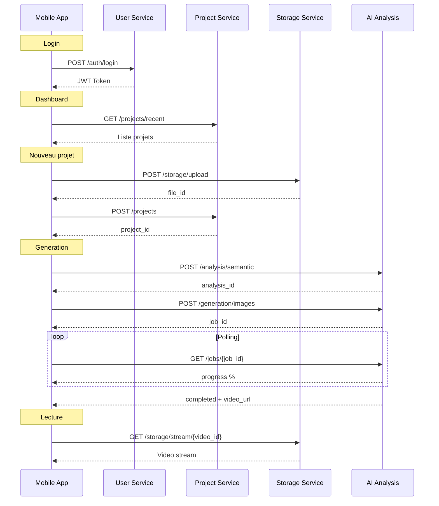

# Ecrans MVP - VisioBook Mobile

## Vue d'ensemble

Ce document presente les specifications detaillees des 8 ecrans principaux du MVP de l'application mobile VisioBook.

---

## Ecran 1: Splash & Onboarding

### 1.1 Splash Screen

```
+----------------------------------+
|                                  |
|                                  |
|                                  |
|            [Logo]                |
|          VisioBook               |
|                                  |
|        Transformez vos           |
|       livres en animations       |
|                                  |
|                                  |
|          [Loading...]            |
|                                  |
+----------------------------------+
```

#### Specifications

| Element | Description |
|---------|-------------|
| **Logo** | Logo VisioBook anime (fade in + scale) |
| **Tagline** | "Transformez vos livres en animations" |
| **Loading** | Indicateur discret pendant chargement |
| **Duree** | 2s max, puis transition auto |
| **Background** | Gradient brand colors |

#### Comportement

```yaml
Au lancement:
  - Afficher logo avec animation
  - Verifier token d'auth en background
  - Si token valide: -> Dashboard
  - Si premier lancement: -> Onboarding
  - Si token invalide: -> Login
```

### 1.2 Onboarding (3 slides)

```
+----------------------------------+
|                                  |
|       [Illustration 1]           |
|                                  |
|                                  |
|    Importez votre texte          |
|                                  |
|   Scannez ou importez n'importe  |
|   quel livre ou document texte   |
|                                  |
|          o  .  .                 |
|                                  |
|        [Passer]  [Suivant]       |
+----------------------------------+
```

#### Slides

| Slide | Titre | Description | Illustration |
|-------|-------|-------------|--------------|
| 1 | Importez votre texte | Scannez ou importez n'importe quel livre | Import/Scan icon |
| 2 | L'IA cree la magie | Notre IA transforme le texte en animation | AI/Magic icon |
| 3 | Regardez et partagez | Profitez de votre VisioBook anime | Play/Share icon |

#### Actions

- **Passer** : Skip vers Login
- **Suivant/Commencer** : Slide suivante ou Login
- **Swipe** : Navigation entre slides
- **Dots** : Indicateur de position

---

## Ecran 2: Login / Register

### 2.1 Login Screen

```
+----------------------------------+
|         [X Fermer]               |
|                                  |
|            [Logo]                |
|                                  |
|         Connexion                |
|                                  |
| +------------------------------+ |
| |  Email                       | |
| +------------------------------+ |
|                                  |
| +------------------------------+ |
| |  Mot de passe           [O]  | |
| +------------------------------+ |
|                                  |
|    [Mot de passe oublie ?]       |
|                                  |
| +------------------------------+ |
| |      Se connecter            | |
| +------------------------------+ |
|                                  |
|         ---- ou ----             |
|                                  |
| [G] Continuer avec Google        |
| [] Continuer avec Apple         |
|                                  |
|  Pas de compte ? S'inscrire      |
|                                  |
+----------------------------------+
```

#### Composants UI

| Composant | Type | Validation |
|-----------|------|------------|
| Email input | TextInput | Email format |
| Password input | SecureTextInput | Min 8 chars |
| Toggle password | IconButton | Show/Hide |
| Login button | Primary Button | Enabled si valide |
| Google button | Social Button | OAuth flow |
| Apple button | Social Button | Sign in with Apple |
| Forgot link | Text Link | -> Reset flow |
| Register link | Text Link | -> Register screen |

#### Etats

```yaml
Default:
  - Inputs vides
  - Bouton login desactive

Filling:
  - Validation en temps reel
  - Indicateurs d'erreur inline

Submitting:
  - Bouton avec loader
  - Inputs desactives

Error:
  - Message d'erreur en haut
  - Inputs avec bordure rouge
  - Shake animation

Success:
  - Transition vers Dashboard
```

### 2.2 Register Screen

```
+----------------------------------+
|      [< Retour]                  |
|                                  |
|         Inscription              |
|                                  |
| +------------------------------+ |
| |  Prenom                      | |
| +------------------------------+ |
|                                  |
| +------------------------------+ |
| |  Email                       | |
| +------------------------------+ |
|                                  |
| +------------------------------+ |
| |  Mot de passe           [O]  | |
| +------------------------------+ |
|   8 caracteres minimum           |
|                                  |
| [x] J'accepte les CGU            |
|                                  |
| +------------------------------+ |
| |      Creer mon compte        | |
| +------------------------------+ |
|                                  |
|         ---- ou ----             |
|                                  |
| [G] Continuer avec Google        |
| [] Continuer avec Apple         |
|                                  |
+----------------------------------+
```

#### Validation

| Champ | Regles | Message erreur |
|-------|--------|----------------|
| Prenom | Non vide, 2-50 chars | "Prenom requis" |
| Email | Format email valide | "Email invalide" |
| Password | Min 8, 1 maj, 1 chiffre | "Mot de passe trop faible" |
| CGU | Doit etre coche | "Veuillez accepter les CGU" |

---

## Ecran 3: Dashboard Principal

### 3.1 Layout Dashboard

```
+----------------------------------+
| [=]  VisioBook           [Bell]  |
+----------------------------------+
|                                  |
|  Bonjour, Marie !                |
|                                  |
|  +----------------------------+  |
|  |  [+] Nouveau VisioBook     |  |
|  +----------------------------+  |
|                                  |
|  Projets recents                 |
|  +------------+ +------------+   |
|  | [Thumb]    | | [Thumb]    |   |
|  | Titre 1    | | Titre 2    |   |
|  | En cours   | | Termine    |   |
|  +------------+ +------------+   |
|                                  |
|  +------------+ +------------+   |
|  | [Thumb]    | | [+]        |   |
|  | Titre 3    | | Voir tout  |   |
|  | Termine    | |            |   |
|  +------------+ +------------+   |
|                                  |
|  Statistiques                    |
|  +----------------------------+  |
|  | 5 VisioBooks | 12 Textes   |  |
|  +----------------------------+  |
|                                  |
+----------------------------------+
| [Home] [Scan] [Texts] [Videos]   |
+----------------------------------+
```

#### Sections

| Section | Contenu |
|---------|---------|
| **Header** | Menu burger, Logo, Notifications |
| **Greeting** | "Bonjour, [Prenom] !" |
| **CTA Principal** | Bouton "Nouveau VisioBook" |
| **Projets recents** | Grid 2x2 des derniers projets |
| **Stats** | Compteurs VisioBooks et Textes |
| **Tab Bar** | Navigation principale |

#### Composant ProjectCard

```yaml
ProjectCard:
  Thumbnail: Image preview ou placeholder
  Title: Titre du projet (max 2 lignes)
  Status: Badge (En cours, Termine, Echec)
  Date: Date relative (il y a 2h, hier, etc.)
  Actions:
    - Tap: Ouvrir detail
    - Long press: Menu contextuel
```

### 3.2 Empty State Dashboard

```
+----------------------------------+
| [=]  VisioBook           [Bell]  |
+----------------------------------+
|                                  |
|                                  |
|       [Illustration]             |
|                                  |
|    Bienvenue sur VisioBook !     |
|                                  |
|   Creez votre premier VisioBook  |
|   en important un texte          |
|                                  |
|  +----------------------------+  |
|  |    Commencer               |  |
|  +----------------------------+  |
|                                  |
|                                  |
+----------------------------------+
| [Home] [Scan] [Texts] [Videos]   |
+----------------------------------+
```

---

## Ecran 4: Input / Scanner

### 4.1 Mode Selection

```
+----------------------------------+
|    [< Retour]    Nouveau         |
+----------------------------------+
|                                  |
|   Comment voulez-vous ajouter    |
|        votre texte ?             |
|                                  |
|  +----------------------------+  |
|  |                            |  |
|  |      [Camera Icon]         |  |
|  |                            |  |
|  |    Scanner un document     |  |
|  |                            |  |
|  |  Prenez en photo une page  |  |
|  |  et notre OCR extraira     |  |
|  |  le texte automatiquement  |  |
|  |                            |  |
|  +----------------------------+  |
|                                  |
|  +----------------------------+  |
|  |                            |  |
|  |      [File Icon]           |  |
|  |                            |  |
|  |    Importer un fichier     |  |
|  |                            |  |
|  |  PDF, TXT, DOCX, EPUB      |  |
|  |  jusqu'a 50 MB             |  |
|  |                            |  |
|  +----------------------------+  |
|                                  |
+----------------------------------+
| [Home] [Scan] [Texts] [Videos]   |
+----------------------------------+
```

### 4.2 Camera Scanner

```
+----------------------------------+
|  [X]                    [Flash]  |
+----------------------------------+
|                                  |
|  +----------------------------+  |
|  |                            |  |
|  |                            |  |
|  |     [Camera Preview]       |  |
|  |                            |  |
|  |   +------------------+     |  |
|  |   |                  |     |  |
|  |   |  Zone detection  |     |  |
|  |   |                  |     |  |
|  |   +------------------+     |  |
|  |                            |  |
|  |                            |  |
|  +----------------------------+  |
|                                  |
|   Cadrez la page de texte        |
|                                  |
|         [O Capturer]             |
|                                  |
|   Pages capturees: 0             |
|                                  |
+----------------------------------+
```

#### Fonctionnalites Scanner

| Fonctionnalite | Description |
|----------------|-------------|
| **Auto-detection** | Detection automatique des bords du document |
| **Multi-page** | Capture plusieurs pages avant OCR |
| **Flash** | Toggle on/off |
| **Zoom** | Pinch to zoom |
| **Focus** | Tap to focus |

### 4.3 OCR Result

```
+----------------------------------+
|  [< Retour]   Texte extrait      |
+----------------------------------+
|                                  |
|  +----------------------------+  |
|  |                            |  |
|  | Il etait une fois, dans    |  |
|  | un royaume lointain, un    |  |
|  | jeune prince courageux     |  |
|  | qui revait d'aventures...  |  |
|  |                            |  |
|  | La nuit, il regardait les  |  |
|  | etoiles depuis sa fenetre  |  |
|  | et imaginait des mondes    |  |
|  | fantastiques...            |  |
|  |                            |  |
|  +----------------------------+  |
|                                  |
|  245 mots detectes               |
|                                  |
|  [Modifier le texte]             |
|                                  |
|  +----------------------------+  |
|  |       Continuer            |  |
|  +----------------------------+  |
|                                  |
+----------------------------------+
```

---

## Ecran 5: Historique des Inputs

### 5.1 Liste des textes importes

```
+----------------------------------+
|      Mes Textes          [Search]|
+----------------------------------+
| [Tous] [Recents] [Utilises]      |
+----------------------------------+
|                                  |
|  +----------------------------+  |
|  | [Doc]  Le petit prince     |  |
|  |        245 mots            |  |
|  |        Importe il y a 2h   |  |
|  |        [>]                 |  |
|  +----------------------------+  |
|                                  |
|  +----------------------------+  |
|  | [Scan] Page chapitre 3     |  |
|  |        189 mots            |  |
|  |        Scanne hier         |  |
|  |        [>]                 |  |
|  +----------------------------+  |
|                                  |
|  +----------------------------+  |
|  | [Doc]  Mon histoire        |  |
|  |        1,245 mots          |  |
|  |        Importe le 12/01    |  |
|  |        [>]                 |  |
|  +----------------------------+  |
|                                  |
+----------------------------------+
| [Home] [Scan] [Texts] [Videos]   |
+----------------------------------+
```

#### Composant InputItem

```yaml
InputItem:
  Icon: Type (document/scan)
  Title: Nom ou premiers mots
  WordCount: "X mots"
  Date: Date relative ou absolue
  Actions:
    - Tap: Detail/Preview
    - Swipe left: Delete
    - Long press: Menu
```

#### Filtres

| Filtre | Description |
|--------|-------------|
| Tous | Tous les inputs |
| Recents | 7 derniers jours |
| Utilises | Deja utilises pour un VisioBook |

---

## Ecran 6: Historique des VisioBooks

### 6.1 Grille des VisioBooks

```
+----------------------------------+
|    Mes VisioBooks     [Filter]   |
+----------------------------------+
|                                  |
|  +------------+ +------------+   |
|  | [Thumb]    | | [Thumb]    |   |
|  |            | |            |   |
|  | [>] 2:34   | | [>] 5:12   |   |
|  +------------+ +------------+   |
|  | Le prince  | | Aventure   |   |
|  | il y a 2h  | | hier       |   |
|  +------------+ +------------+   |
|                                  |
|  +------------+ +------------+   |
|  | [Thumb]    | | [Thumb]    |   |
|  |            | |            |   |
|  | [>] 3:45   | | [>] 1:20   |   |
|  +------------+ +------------+   |
|  | Conte      | | Test       |   |
|  | 12/01      | | 10/01      |   |
|  +------------+ +------------+   |
|                                  |
|  +------------+ +------------+   |
|  | [Thumb]    | | [Thumb]    |   |
|  | ...        | | ...        |   |
|  +------------+ +------------+   |
|                                  |
+----------------------------------+
| [Home] [Scan] [Texts] [Videos]   |
+----------------------------------+
```

#### Composant VisioBookCard

```yaml
VisioBookCard:
  Thumbnail: Preview image de la video
  Duration: Badge avec duree "X:XX"
  PlayIcon: Overlay icon play
  Title: Titre du projet
  Date: Date relative
  Status: Badge si en cours
  Actions:
    - Tap: Ouvrir Player
    - Long press: Menu contextuel
```

#### Options Menu Contextuel

| Action | Icone | Description |
|--------|-------|-------------|
| Lire | play | Ouvrir le player |
| Partager | share | Flow partage |
| Telecharger | download | Download local |
| Dupliquer | copy | Creer une copie |
| Supprimer | trash | Confirmation + delete |

---

## Ecran 7: Detail Projet / VisioBook

### 7.1 Detail avec configuration

```
+----------------------------------+
|  [< Retour]        [...]         |
+----------------------------------+
|                                  |
|  +----------------------------+  |
|  |                            |  |
|  |     [Preview Image]        |  |
|  |                            |  |
|  |        [> Play]            |  |
|  |                            |  |
|  +----------------------------+  |
|                                  |
|  Le petit prince                 |
|  Cree il y a 2 heures            |
|                                  |
|  Resume                          |
|  +----------------------------+  |
|  | Histoire d'un jeune prince |  |
|  | qui quitte son asteroide   |  |
|  | pour explorer l'univers... |  |
|  +----------------------------+  |
|                                  |
|  Configuration                   |
|  +----------------------------+  |
|  | Style: Aquarelle       [>] |  |
|  | Langue: Francais       [>] |  |
|  | Duree: Moyenne (~5min) [>] |  |
|  +----------------------------+  |
|                                  |
|  +----------------------------+  |
|  |     Generer VisioBook      |  |
|  +----------------------------+  |
|                                  |
+----------------------------------+
```

### 7.2 Generation en cours

```
+----------------------------------+
|  [X Annuler]                     |
+----------------------------------+
|                                  |
|       Generation en cours        |
|                                  |
|  +----------------------------+  |
|  |                            |  |
|  |    [Animation Loading]     |  |
|  |                            |  |
|  +----------------------------+  |
|                                  |
|  ============================    |
|  [====================    ] 65%  |
|                                  |
|  Etape 3/4: Synthese audio       |
|                                  |
|  Temps restant: ~2 minutes       |
|                                  |
|  +----------------------------+  |
|  |                            |  |
|  | [Thumb1] [Thumb2] [Thumb3] |  |
|  |  Scene 1  Scene 2  Scene 3 |  |
|  |                            |  |
|  +----------------------------+  |
|                                  |
|  [Me notifier quand c'est pret]  |
|                                  |
+----------------------------------+
```

#### Etapes de generation

| Etape | Nom | Description |
|-------|-----|-------------|
| 1/4 | Analyse | Extraction des scenes |
| 2/4 | Images | Generation des visuels |
| 3/4 | Audio | Synthese vocale |
| 4/4 | Assemblage | Montage final |

---

## Ecran 8: Player VisioBook (Lecture)

### 8.1 Player en mode normal

```
+----------------------------------+
|  [X]           Titre     [Share] |
+----------------------------------+
|                                  |
|  +----------------------------+  |
|  |                            |  |
|  |                            |  |
|  |                            |  |
|  |       [Video Frame]        |  |
|  |                            |  |
|  |                            |  |
|  |                            |  |
|  +----------------------------+  |
|                                  |
|  +----------------------------+  |
|  |                            |  |
|  | [<<]  [>||]  [>>]          |  |
|  |                            |  |
|  | 1:23 =========o---- 5:34   |  |
|  |                            |  |
|  | [CC] [Speed] [Full]        |  |
|  |                            |  |
|  +----------------------------+  |
|                                  |
+----------------------------------+
```

### 8.2 Player en mode fullscreen

```
+--------------------------------------------------+
|                                                  |
|                                                  |
|                                                  |
|                                                  |
|               [Video Frame]                      |
|                                                  |
|                                                  |
|                                                  |
|                                                  |
+--------------------------------------------------+
| [X]  1:23 ========o------ 5:34  [CC][Spd][><]    |
|      [<<]      [>||]      [>>]                   |
+--------------------------------------------------+
```

### Composants Player

#### Controles principaux

| Controle | Icon | Action |
|----------|------|--------|
| Close | X | Fermer player |
| Rewind | << | -10 secondes |
| Play/Pause | >/\|\| | Toggle lecture |
| Forward | >> | +10 secondes |
| Share | share | Ouvrir partage |
| Fullscreen | expand | Toggle fullscreen |

#### Controles secondaires

| Controle | Options | Default |
|----------|---------|---------|
| Sous-titres | On/Off | Off |
| Vitesse | 0.5x, 1x, 1.5x, 2x | 1x |
| Qualite | Auto, 480p, 720p, 1080p | Auto |

#### Timeline

```yaml
Timeline:
  Position actuelle: Temps ecoule
  Duration: Duree totale
  Progress bar: Draggable
  Buffering: Indicateur de chargement
  Chapters: Markers pour les scenes (optionnel)
```

### 8.3 Ecran de fin

```
+----------------------------------+
|                                  |
|  +----------------------------+  |
|  |                            |  |
|  |     [Last Frame]           |  |
|  |                            |  |
|  +----------------------------+  |
|                                  |
|       VisioBook termine !        |
|                                  |
|  +------------+ +------------+   |
|  | [Replay]   | | [Partager] |   |
|  +------------+ +------------+   |
|                                  |
|  +----------------------------+  |
|  |      Telecharger           |  |
|  +----------------------------+  |
|                                  |
|  Vous avez aime ?                |
|  [*] [*] [*] [*] [ ]             |
|                                  |
|  [Retour au projet]              |
|                                  |
+----------------------------------+
```

#### Actions fin de lecture

| Action | Description |
|--------|-------------|
| Replay | Relancer depuis le debut |
| Partager | Ouvrir share sheet |
| Telecharger | Download local |
| Noter | Feedback qualite (optionnel) |
| Retour | Retour a l'ecran detail |

---

## Interactions avec les Microservices

### Resume des endpoints par ecran

| Ecran | Service | Endpoints |
|-------|---------|-----------|
| **Login/Register** | User Service | POST /auth/login, POST /auth/register |
| **Dashboard** | Project Service | GET /projects, GET /projects/recent |
| **Input (File)** | Storage Service | POST /storage/upload |
| **Input (OCR)** | Storage Service | POST /storage/transform |
| **Detail** | Project Service | GET /projects/{id}, PUT /projects/{id} |
| **Generation** | AI Analysis | POST /analysis/semantic, POST /generation/images |
| **Player** | Storage Service | GET /storage/stream/{id} |
| **Export** | Storage Service | GET /storage/download/{id} |
| **History** | Project Service | GET /projects, GET /projects/inputs |

### Exemple de flux complet


