# Diagrammes de Sequence - VisioBook Mobile

## Vue d'ensemble

Ce document presente les diagrammes de sequence detailles montrant les interactions entre l'application mobile et les differents microservices de l'architecture VisioBook.

---

## Services impliques

| Service | Port | Role |
|---------|------|------|
| **Core User Service** | 8081 | Authentification, profils, sessions |
| **Core Project Service** | 8086 | Gestion projets, workflows |
| **Support Storage Service** | 8089 | Upload, stockage, streaming |
| **AI Analysis Service** | 8083 | Analyse IA, generation contenu |

---

## Sequence 1: Authentification Complete

### 1.1 Inscription nouvel utilisateur

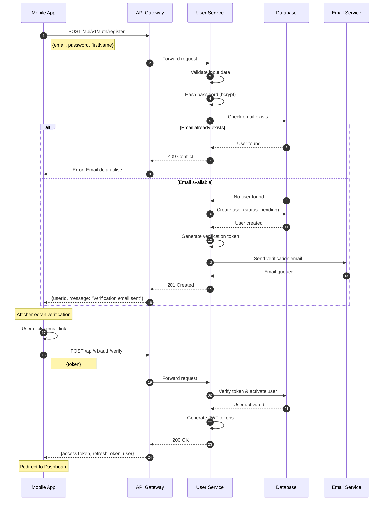
```mermaid
sequenceDiagram
    autonumber
    participant App as Mobile App
    participant GW as API Gateway
    participant User as User Service
    participant DB as Database
    participant Email as Email Service

    App->>GW: POST /api/v1/auth/register
    Note right of App: {email, password, firstName}

    GW->>User: Forward request
    User->>User: Validate input data
    User->>User: Hash password (bcrypt)
    User->>DB: Check email exists

    alt Email already exists
        DB-->>User: User found
        User-->>GW: 409 Conflict
        GW-->>App: Error: Email deja utilise
    else Email available
        DB-->>User: No user found
        User->>DB: Create user (status: pending)
        DB-->>User: User created
        User->>User: Generate verification token
        User->>Email: Send verification email
        Email-->>User: Email queued
        User-->>GW: 201 Created
        GW-->>App: {userId, message: "Verification email sent"}
    end

    Note over App: Afficher ecran verification

    App->>App: User clicks email link
    App->>GW: POST /api/v1/auth/verify
    Note right of App: {token}

    GW->>User: Forward request
    User->>DB: Verify token & activate user
    DB-->>User: User activated
    User->>User: Generate JWT tokens
    User-->>GW: 200 OK
    GW-->>App: {accessToken, refreshToken, user}

    Note over App: Redirect to Dashboard
```

### 1.2 Connexion utilisateur existant

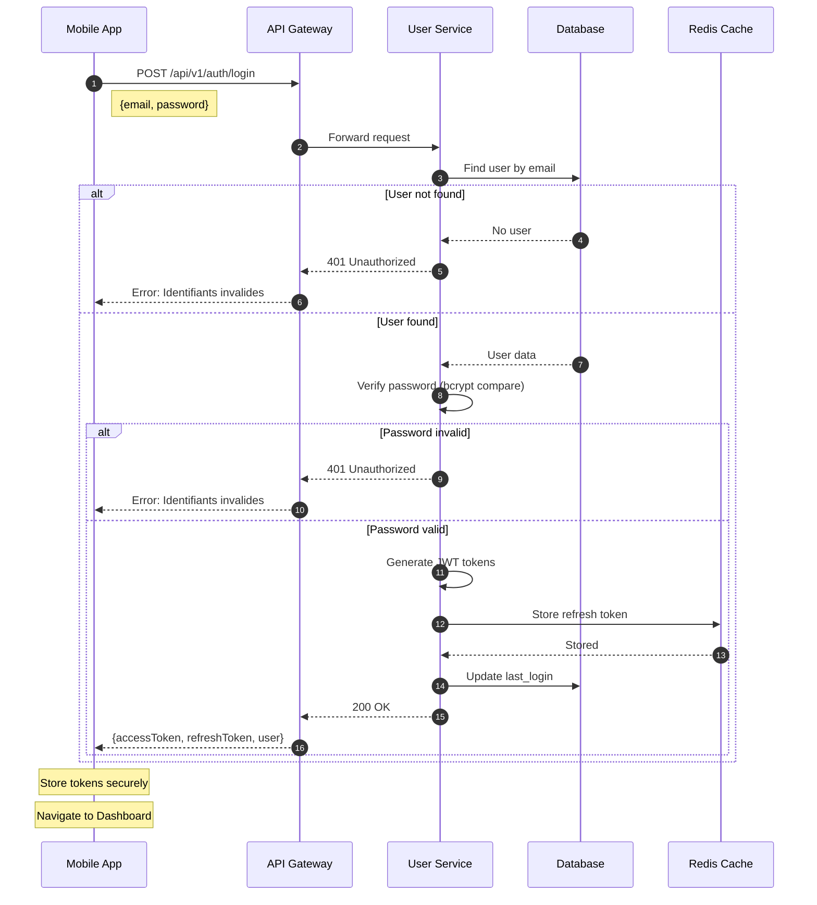
```mermaid
sequenceDiagram
    autonumber
    participant App as Mobile App
    participant GW as API Gateway
    participant User as User Service
    participant DB as Database
    participant Cache as Redis Cache

    App->>GW: POST /api/v1/auth/login
    Note right of App: {email, password}

    GW->>User: Forward request
    User->>DB: Find user by email

    alt User not found
        DB-->>User: No user
        User-->>GW: 401 Unauthorized
        GW-->>App: Error: Identifiants invalides
    else User found
        DB-->>User: User data
        User->>User: Verify password (bcrypt compare)

        alt Password invalid
            User-->>GW: 401 Unauthorized
            GW-->>App: Error: Identifiants invalides
        else Password valid
            User->>User: Generate JWT tokens
            User->>Cache: Store refresh token
            Cache-->>User: Stored
            User->>DB: Update last_login
            User-->>GW: 200 OK
            GW-->>App: {accessToken, refreshToken, user}
        end
    end

    Note over App: Store tokens securely
    Note over App: Navigate to Dashboard
```

### 1.3 Refresh Token

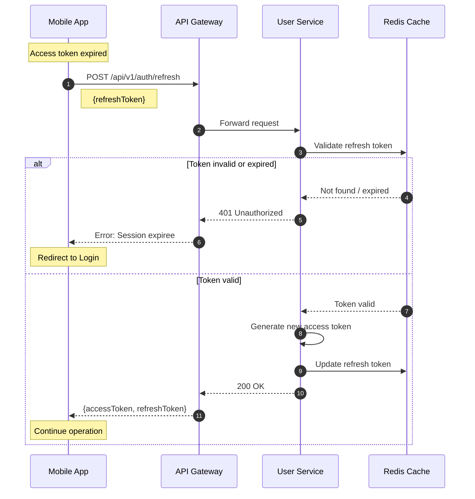
```mermaid
sequenceDiagram
    autonumber
    participant App as Mobile App
    participant GW as API Gateway
    participant User as User Service
    participant Cache as Redis Cache

    Note over App: Access token expired

    App->>GW: POST /api/v1/auth/refresh
    Note right of App: {refreshToken}

    GW->>User: Forward request
    User->>Cache: Validate refresh token

    alt Token invalid or expired
        Cache-->>User: Not found / expired
        User-->>GW: 401 Unauthorized
        GW-->>App: Error: Session expiree
        Note over App: Redirect to Login
    else Token valid
        Cache-->>User: Token valid
        User->>User: Generate new access token
        User->>Cache: Update refresh token
        User-->>GW: 200 OK
        GW-->>App: {accessToken, refreshToken}
        Note over App: Continue operation
    end
```

---

## Sequence 2: Import Fichier

### 2.1 Upload et analyse de fichier

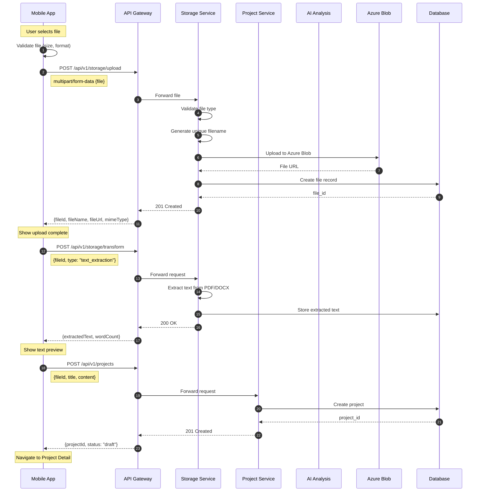
```mermaid
sequenceDiagram
    autonumber
    participant App as Mobile App
    participant GW as API Gateway
    participant Storage as Storage Service
    participant Project as Project Service
    participant AI as AI Analysis
    participant Blob as Azure Blob
    participant DB as Database

    Note over App: User selects file

    App->>App: Validate file (size, format)
    App->>GW: POST /api/v1/storage/upload
    Note right of App: multipart/form-data {file}

    GW->>Storage: Forward file
    Storage->>Storage: Validate file type
    Storage->>Storage: Generate unique filename
    Storage->>Blob: Upload to Azure Blob
    Blob-->>Storage: File URL

    Storage->>DB: Create file record
    DB-->>Storage: file_id

    Storage-->>GW: 201 Created
    GW-->>App: {fileId, fileName, fileUrl, mimeType}

    Note over App: Show upload complete

    App->>GW: POST /api/v1/storage/transform
    Note right of App: {fileId, type: "text_extraction"}

    GW->>Storage: Forward request
    Storage->>Storage: Extract text from PDF/DOCX
    Storage->>DB: Store extracted text
    Storage-->>GW: 200 OK
    GW-->>App: {extractedText, wordCount}

    Note over App: Show text preview

    App->>GW: POST /api/v1/projects
    Note right of App: {fileId, title, content}

    GW->>Project: Forward request
    Project->>DB: Create project
    DB-->>Project: project_id
    Project-->>GW: 201 Created
    GW-->>App: {projectId, status: "draft"}

    Note over App: Navigate to Project Detail
```

---

## Sequence 3: Scan OCR

### 3.1 Capture et OCR

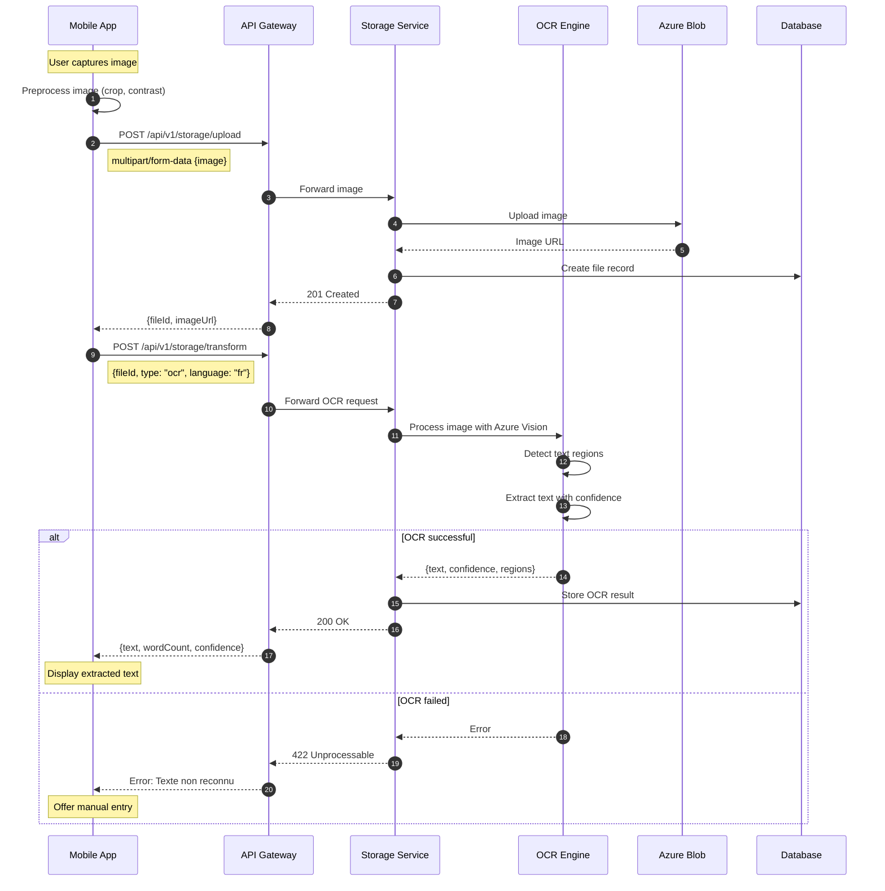
```mermaid
sequenceDiagram
    autonumber
    participant App as Mobile App
    participant GW as API Gateway
    participant Storage as Storage Service
    participant OCR as OCR Engine
    participant Blob as Azure Blob
    participant DB as Database

    Note over App: User captures image

    App->>App: Preprocess image (crop, contrast)
    App->>GW: POST /api/v1/storage/upload
    Note right of App: multipart/form-data {image}

    GW->>Storage: Forward image
    Storage->>Blob: Upload image
    Blob-->>Storage: Image URL
    Storage->>DB: Create file record
    Storage-->>GW: 201 Created
    GW-->>App: {fileId, imageUrl}

    App->>GW: POST /api/v1/storage/transform
    Note right of App: {fileId, type: "ocr", language: "fr"}

    GW->>Storage: Forward OCR request
    Storage->>OCR: Process image with Azure Vision
    OCR->>OCR: Detect text regions
    OCR->>OCR: Extract text with confidence

    alt OCR successful
        OCR-->>Storage: {text, confidence, regions}
        Storage->>DB: Store OCR result
        Storage-->>GW: 200 OK
        GW-->>App: {text, wordCount, confidence}
        Note over App: Display extracted text
    else OCR failed
        OCR-->>Storage: Error
        Storage-->>GW: 422 Unprocessable
        GW-->>App: Error: Texte non reconnu
        Note over App: Offer manual entry
    end
```

### 3.2 Multi-page OCR

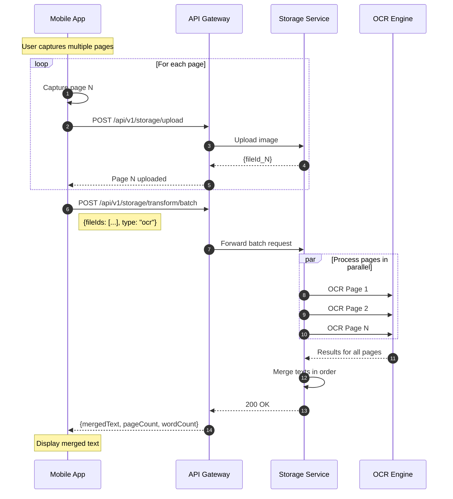
```mermaid
sequenceDiagram
    autonumber
    participant App as Mobile App
    participant GW as API Gateway
    participant Storage as Storage Service
    participant OCR as OCR Engine

    Note over App: User captures multiple pages

    loop For each page
        App->>App: Capture page N
        App->>GW: POST /api/v1/storage/upload
        GW->>Storage: Upload image
        Storage-->>GW: {fileId_N}
        GW-->>App: Page N uploaded
    end

    App->>GW: POST /api/v1/storage/transform/batch
    Note right of App: {fileIds: [...], type: "ocr"}

    GW->>Storage: Forward batch request

    par Process pages in parallel
        Storage->>OCR: OCR Page 1
        Storage->>OCR: OCR Page 2
        Storage->>OCR: OCR Page N
    end

    OCR-->>Storage: Results for all pages
    Storage->>Storage: Merge texts in order
    Storage-->>GW: 200 OK
    GW-->>App: {mergedText, pageCount, wordCount}

    Note over App: Display merged text
```

---

## Sequence 4: Generation VisioBook

### 4.1 Lancement de la generation

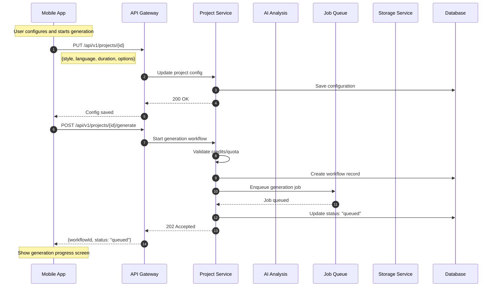
```mermaid
sequenceDiagram
    autonumber
    participant App as Mobile App
    participant GW as API Gateway
    participant Project as Project Service
    participant AI as AI Analysis
    participant Queue as Job Queue
    participant Storage as Storage Service
    participant DB as Database

    Note over App: User configures and starts generation

    App->>GW: PUT /api/v1/projects/{id}
    Note right of App: {style, language, duration, options}

    GW->>Project: Update project config
    Project->>DB: Save configuration
    Project-->>GW: 200 OK
    GW-->>App: Config saved

    App->>GW: POST /api/v1/projects/{id}/generate
    GW->>Project: Start generation workflow

    Project->>Project: Validate credits/quota
    Project->>DB: Create workflow record
    Project->>Queue: Enqueue generation job
    Queue-->>Project: Job queued
    Project->>DB: Update status: "queued"
    Project-->>GW: 202 Accepted
    GW-->>App: {workflowId, status: "queued"}

    Note over App: Show generation progress screen
```

### 4.2 Pipeline de generation complet

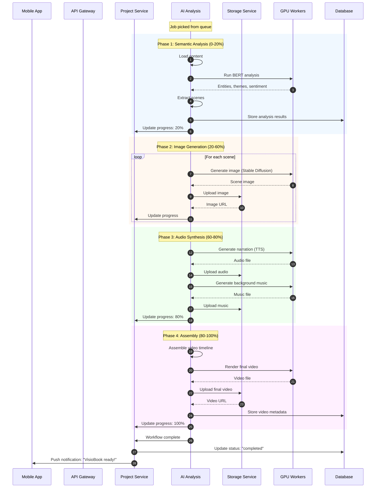
```mermaid
sequenceDiagram
    autonumber
    participant App as Mobile App
    participant GW as API Gateway
    participant Project as Project Service
    participant AI as AI Analysis
    participant Storage as Storage Service
    participant GPU as GPU Workers
    participant DB as Database

    Note over AI: Job picked from queue

    rect rgb(240, 248, 255)
        Note over AI: Phase 1: Semantic Analysis (0-20%)
        AI->>AI: Load content
        AI->>GPU: Run BERT analysis
        GPU-->>AI: Entities, themes, sentiment
        AI->>AI: Extract scenes
        AI->>DB: Store analysis results
        AI->>Project: Update progress: 20%
    end

    rect rgb(255, 248, 240)
        Note over AI: Phase 2: Image Generation (20-60%)
        loop For each scene
            AI->>GPU: Generate image (Stable Diffusion)
            GPU-->>AI: Scene image
            AI->>Storage: Upload image
            Storage-->>AI: Image URL
            AI->>Project: Update progress
        end
    end

    rect rgb(240, 255, 240)
        Note over AI: Phase 3: Audio Synthesis (60-80%)
        AI->>GPU: Generate narration (TTS)
        GPU-->>AI: Audio file
        AI->>Storage: Upload audio
        AI->>GPU: Generate background music
        GPU-->>AI: Music file
        AI->>Storage: Upload music
        AI->>Project: Update progress: 80%
    end

    rect rgb(255, 240, 255)
        Note over AI: Phase 4: Assembly (80-100%)
        AI->>AI: Assemble video timeline
        AI->>GPU: Render final video
        GPU-->>AI: Video file
        AI->>Storage: Upload final video
        Storage-->>AI: Video URL
        AI->>DB: Store video metadata
        AI->>Project: Update progress: 100%
    end

    AI->>Project: Workflow complete
    Project->>DB: Update status: "completed"
    Project->>App: Push notification: "VisioBook ready!"
```

### 4.3 Polling de progression

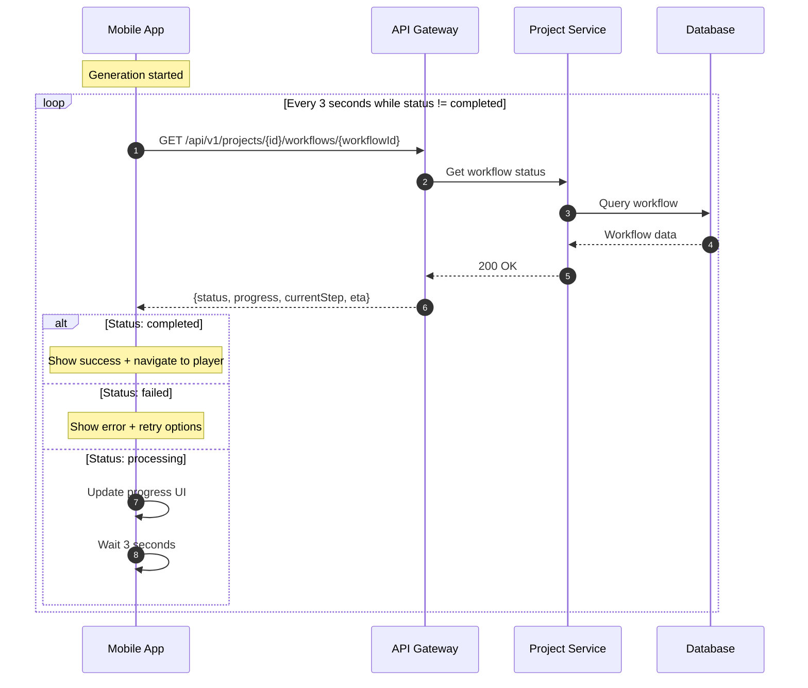
```mermaid
sequenceDiagram
    autonumber
    participant App as Mobile App
    participant GW as API Gateway
    participant Project as Project Service
    participant DB as Database

    Note over App: Generation started

    loop Every 3 seconds while status != completed
        App->>GW: GET /api/v1/projects/{id}/workflows/{workflowId}
        GW->>Project: Get workflow status
        Project->>DB: Query workflow
        DB-->>Project: Workflow data
        Project-->>GW: 200 OK
        GW-->>App: {status, progress, currentStep, eta}

        alt Status: completed
            Note over App: Show success + navigate to player
        else Status: failed
            Note over App: Show error + retry options
        else Status: processing
            App->>App: Update progress UI
            App->>App: Wait 3 seconds
        end
    end
```

---

## Sequence 5: Visualisation (Player)

### 5.1 Chargement et streaming video

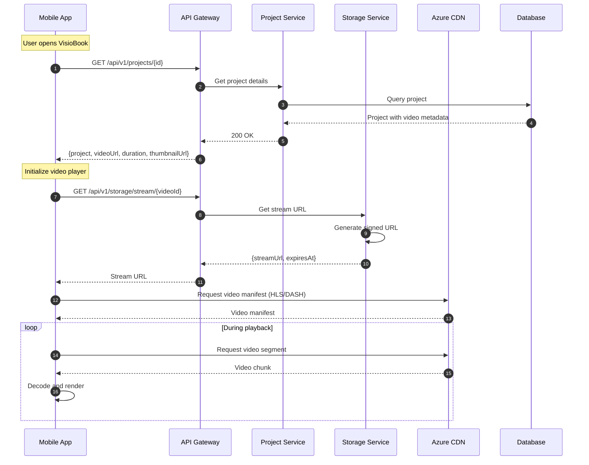
```mermaid
sequenceDiagram
    autonumber
    participant App as Mobile App
    participant GW as API Gateway
    participant Project as Project Service
    participant Storage as Storage Service
    participant CDN as Azure CDN
    participant DB as Database

    Note over App: User opens VisioBook

    App->>GW: GET /api/v1/projects/{id}
    GW->>Project: Get project details
    Project->>DB: Query project
    DB-->>Project: Project with video metadata
    Project-->>GW: 200 OK
    GW-->>App: {project, videoUrl, duration, thumbnailUrl}

    Note over App: Initialize video player

    App->>GW: GET /api/v1/storage/stream/{videoId}
    GW->>Storage: Get stream URL
    Storage->>Storage: Generate signed URL
    Storage-->>GW: {streamUrl, expiresAt}
    GW-->>App: Stream URL

    App->>CDN: Request video manifest (HLS/DASH)
    CDN-->>App: Video manifest

    loop During playback
        App->>CDN: Request video segment
        CDN-->>App: Video chunk
        App->>App: Decode and render
    end
```

### 5.2 Controles de lecture

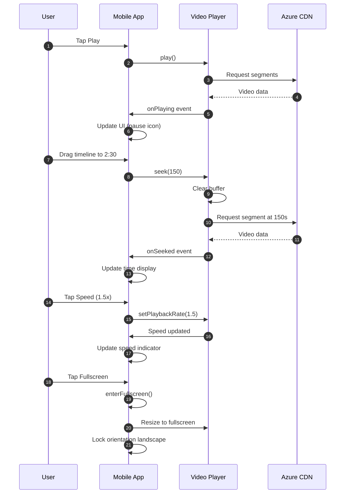
```mermaid
sequenceDiagram
    autonumber
    participant User as User
    participant App as Mobile App
    participant Player as Video Player
    participant CDN as Azure CDN

    User->>App: Tap Play
    App->>Player: play()
    Player->>CDN: Request segments
    CDN-->>Player: Video data
    Player->>App: onPlaying event
    App->>App: Update UI (pause icon)

    User->>App: Drag timeline to 2:30
    App->>Player: seek(150)
    Player->>Player: Clear buffer
    Player->>CDN: Request segment at 150s
    CDN-->>Player: Video data
    Player->>App: onSeeked event
    App->>App: Update time display

    User->>App: Tap Speed (1.5x)
    App->>Player: setPlaybackRate(1.5)
    Player->>App: Speed updated
    App->>App: Update speed indicator

    User->>App: Tap Fullscreen
    App->>App: enterFullscreen()
    App->>Player: Resize to fullscreen
    App->>App: Lock orientation landscape
```

---

## Sequence 6: Export et Partage

### 6.1 Telechargement de video

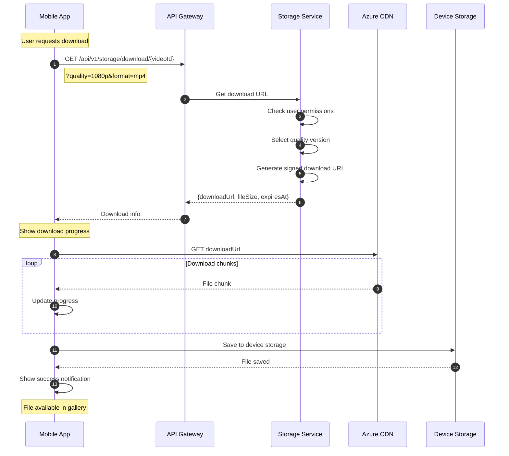
```mermaid
sequenceDiagram
    autonumber
    participant App as Mobile App
    participant GW as API Gateway
    participant Storage as Storage Service
    participant CDN as Azure CDN
    participant Device as Device Storage

    Note over App: User requests download

    App->>GW: GET /api/v1/storage/download/{videoId}
    Note right of App: ?quality=1080p&format=mp4

    GW->>Storage: Get download URL
    Storage->>Storage: Check user permissions
    Storage->>Storage: Select quality version
    Storage->>Storage: Generate signed download URL
    Storage-->>GW: {downloadUrl, fileSize, expiresAt}
    GW-->>App: Download info

    Note over App: Show download progress

    App->>CDN: GET downloadUrl
    loop Download chunks
        CDN-->>App: File chunk
        App->>App: Update progress
    end

    App->>Device: Save to device storage
    Device-->>App: File saved
    App->>App: Show success notification

    Note over App: File available in gallery
```

### 6.2 Generation de lien de partage

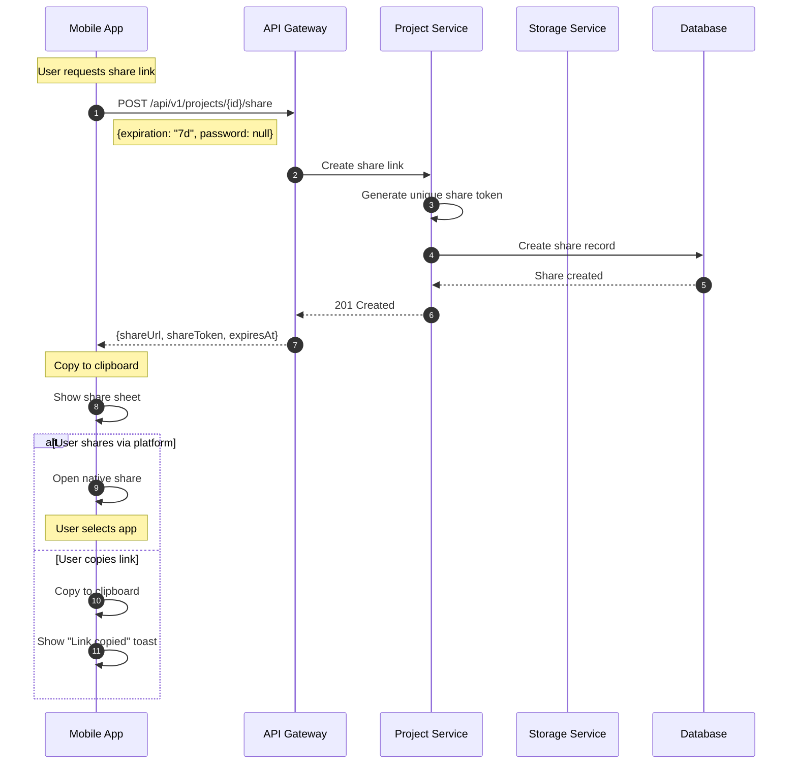
```mermaid
sequenceDiagram
    autonumber
    participant App as Mobile App
    participant GW as API Gateway
    participant Project as Project Service
    participant Storage as Storage Service
    participant DB as Database

    Note over App: User requests share link

    App->>GW: POST /api/v1/projects/{id}/share
    Note right of App: {expiration: "7d", password: null}

    GW->>Project: Create share link
    Project->>Project: Generate unique share token
    Project->>DB: Create share record
    DB-->>Project: Share created
    Project-->>GW: 201 Created
    GW-->>App: {shareUrl, shareToken, expiresAt}

    Note over App: Copy to clipboard

    App->>App: Show share sheet

    alt User shares via platform
        App->>App: Open native share
        Note over App: User selects app
    else User copies link
        App->>App: Copy to clipboard
        App->>App: Show "Link copied" toast
    end
```

### 6.3 Partage avec protection par mot de passe

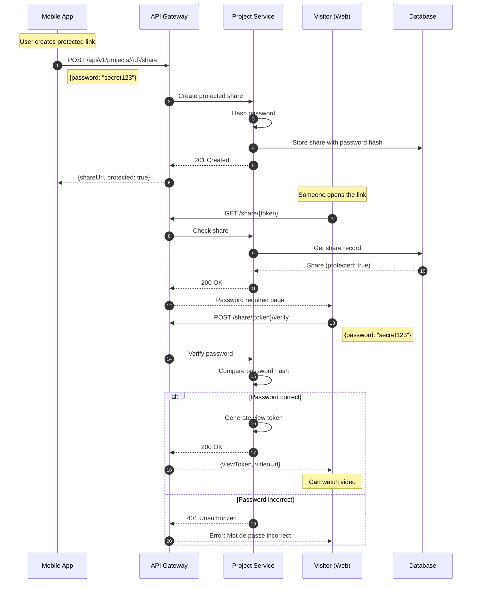
```mermaid
sequenceDiagram
    autonumber
    participant App as Mobile App
    participant GW as API Gateway
    participant Project as Project Service
    participant Visitor as Visitor (Web)
    participant DB as Database

    Note over App: User creates protected link

    App->>GW: POST /api/v1/projects/{id}/share
    Note right of App: {password: "secret123"}

    GW->>Project: Create protected share
    Project->>Project: Hash password
    Project->>DB: Store share with password hash
    Project-->>GW: 201 Created
    GW-->>App: {shareUrl, protected: true}

    Note over Visitor: Someone opens the link

    Visitor->>GW: GET /share/{token}
    GW->>Project: Check share
    Project->>DB: Get share record
    DB-->>Project: Share (protected: true)
    Project-->>GW: 200 OK
    GW-->>Visitor: Password required page

    Visitor->>GW: POST /share/{token}/verify
    Note right of Visitor: {password: "secret123"}

    GW->>Project: Verify password
    Project->>Project: Compare password hash

    alt Password correct
        Project->>Project: Generate view token
        Project-->>GW: 200 OK
        GW-->>Visitor: {viewToken, videoUrl}
        Note over Visitor: Can watch video
    else Password incorrect
        Project-->>GW: 401 Unauthorized
        GW-->>Visitor: Error: Mot de passe incorrect
    end
```

---

## Sequence 7: Gestion de l'historique

### 7.1 Chargement de l'historique

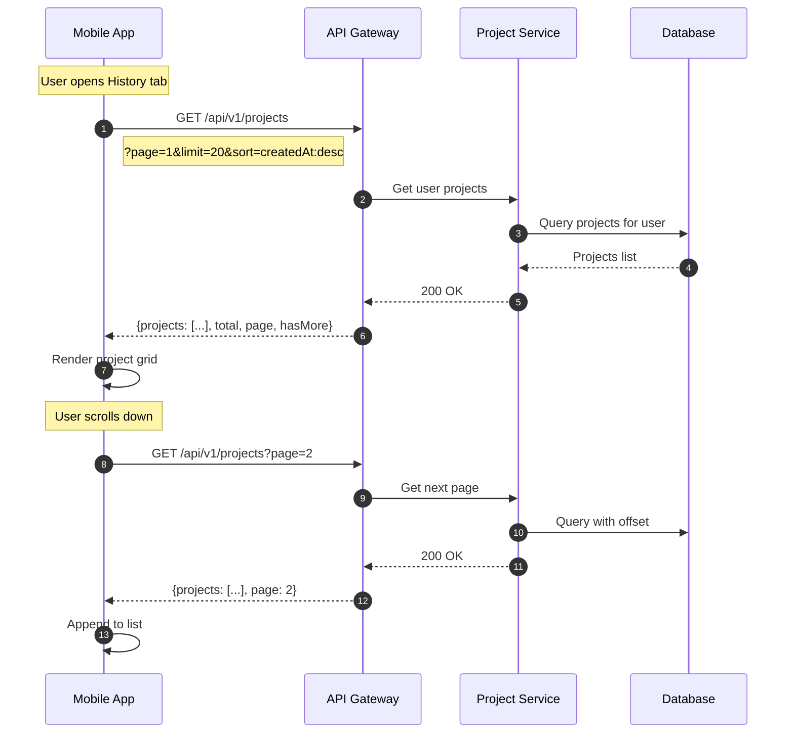
```mermaid
sequenceDiagram
    autonumber
    participant App as Mobile App
    participant GW as API Gateway
    participant Project as Project Service
    participant DB as Database

    Note over App: User opens History tab

    App->>GW: GET /api/v1/projects
    Note right of App: ?page=1&limit=20&sort=createdAt:desc

    GW->>Project: Get user projects
    Project->>DB: Query projects for user
    DB-->>Project: Projects list
    Project-->>GW: 200 OK
    GW-->>App: {projects: [...], total, page, hasMore}

    App->>App: Render project grid

    Note over App: User scrolls down

    App->>GW: GET /api/v1/projects?page=2
    GW->>Project: Get next page
    Project->>DB: Query with offset
    Project-->>GW: 200 OK
    GW-->>App: {projects: [...], page: 2}

    App->>App: Append to list
```

### 7.2 Recherche et filtrage

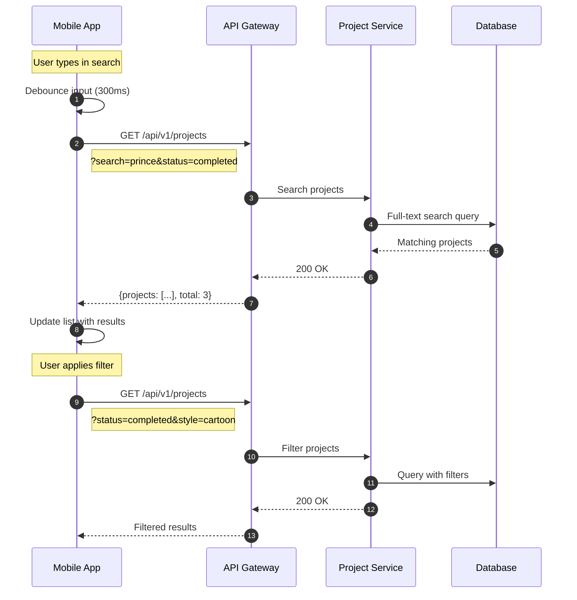
```mermaid
sequenceDiagram
    autonumber
    participant App as Mobile App
    participant GW as API Gateway
    participant Project as Project Service
    participant DB as Database

    Note over App: User types in search

    App->>App: Debounce input (300ms)

    App->>GW: GET /api/v1/projects
    Note right of App: ?search=prince&status=completed

    GW->>Project: Search projects
    Project->>DB: Full-text search query
    DB-->>Project: Matching projects
    Project-->>GW: 200 OK
    GW-->>App: {projects: [...], total: 3}

    App->>App: Update list with results

    Note over App: User applies filter

    App->>GW: GET /api/v1/projects
    Note right of App: ?status=completed&style=cartoon

    GW->>Project: Filter projects
    Project->>DB: Query with filters
    Project-->>GW: 200 OK
    GW-->>App: Filtered results
```

### 7.3 Suppression de projet

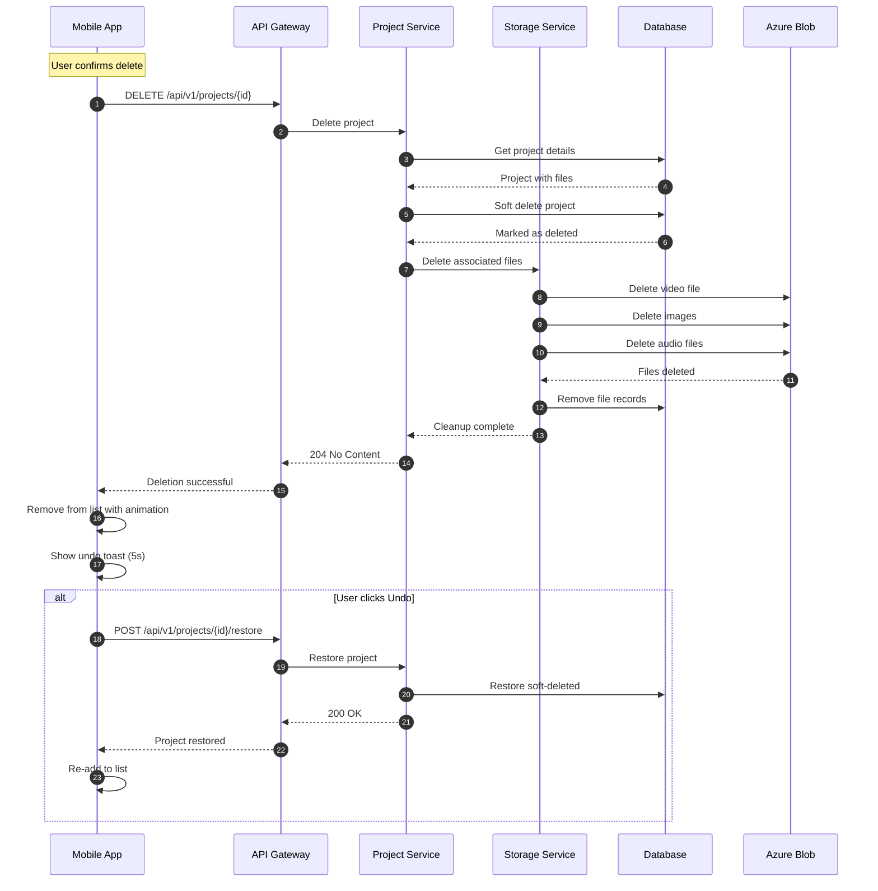
```mermaid
sequenceDiagram
    autonumber
    participant App as Mobile App
    participant GW as API Gateway
    participant Project as Project Service
    participant Storage as Storage Service
    participant DB as Database
    participant Blob as Azure Blob

    Note over App: User confirms delete

    App->>GW: DELETE /api/v1/projects/{id}
    GW->>Project: Delete project

    Project->>DB: Get project details
    DB-->>Project: Project with files

    Project->>DB: Soft delete project
    DB-->>Project: Marked as deleted

    Project->>Storage: Delete associated files
    Storage->>Blob: Delete video file
    Storage->>Blob: Delete images
    Storage->>Blob: Delete audio files
    Blob-->>Storage: Files deleted
    Storage->>DB: Remove file records
    Storage-->>Project: Cleanup complete

    Project-->>GW: 204 No Content
    GW-->>App: Deletion successful

    App->>App: Remove from list with animation
    App->>App: Show undo toast (5s)

    alt User clicks Undo
        App->>GW: POST /api/v1/projects/{id}/restore
        GW->>Project: Restore project
        Project->>DB: Restore soft-deleted
        Project-->>GW: 200 OK
        GW-->>App: Project restored
        App->>App: Re-add to list
    end
```

---

## Gestion des erreurs

### Patterns de retry et fallback

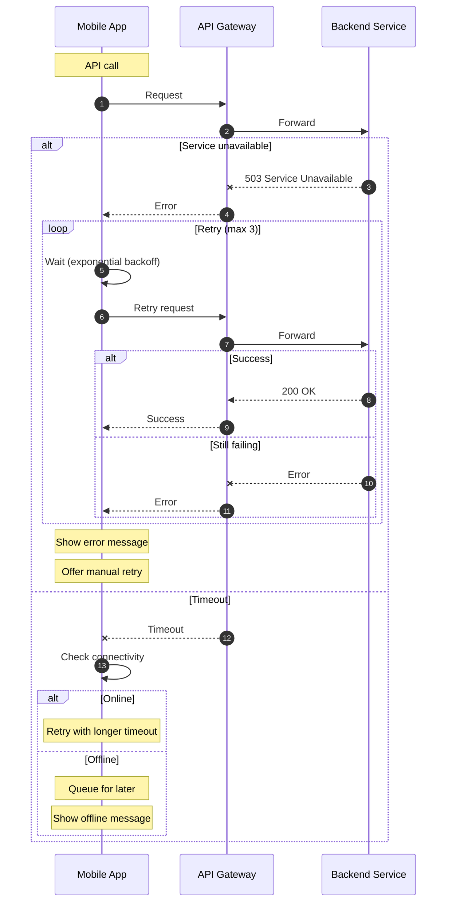
```mermaid
sequenceDiagram
    autonumber
    participant App as Mobile App
    participant GW as API Gateway
    participant Service as Backend Service

    Note over App: API call

    App->>GW: Request
    GW->>Service: Forward

    alt Service unavailable
        Service--xGW: 503 Service Unavailable
        GW-->>App: Error

        loop Retry (max 3)
            App->>App: Wait (exponential backoff)
            App->>GW: Retry request
            GW->>Service: Forward

            alt Success
                Service-->>GW: 200 OK
                GW-->>App: Success
            else Still failing
                Service--xGW: Error
                GW-->>App: Error
            end
        end

        Note over App: Show error message
        Note over App: Offer manual retry
    else Timeout
        GW--xApp: Timeout
        App->>App: Check connectivity
        alt Online
            Note over App: Retry with longer timeout
        else Offline
            Note over App: Queue for later
            Note over App: Show offline message
        end
    end
```

### Codes d'erreur et actions UI

| Code | Message | Action UI |
|------|---------|-----------|
| 400 | Bad Request | Afficher erreur de validation |
| 401 | Unauthorized | Redirect vers Login |
| 403 | Forbidden | Afficher message d'acces refuse |
| 404 | Not Found | Afficher "Element introuvable" |
| 409 | Conflict | Afficher message de conflit |
| 413 | Payload Too Large | Afficher limite de taille |
| 422 | Unprocessable | Afficher erreur de traitement |
| 429 | Too Many Requests | Afficher message rate limit |
| 500 | Server Error | Afficher erreur generique + retry |
| 503 | Service Unavailable | Afficher maintenance + retry |
