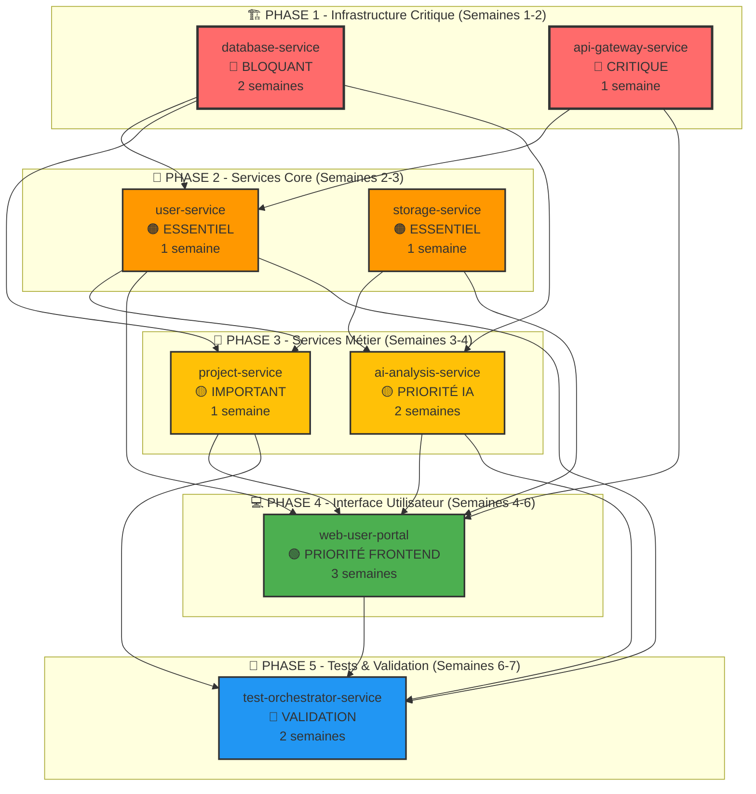
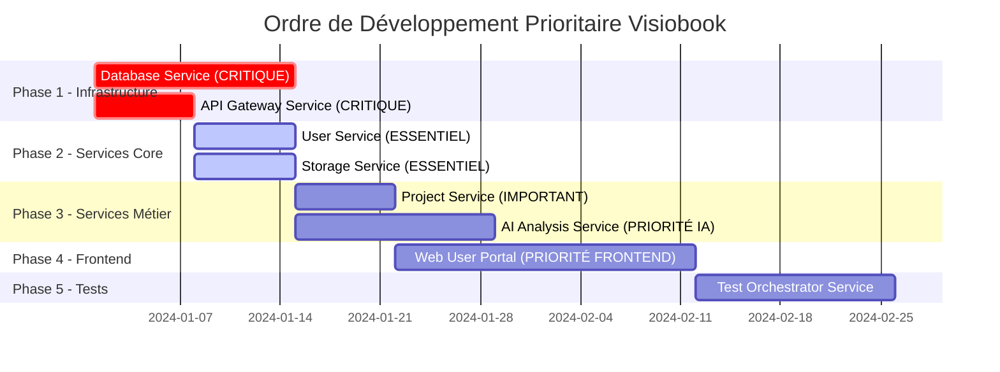
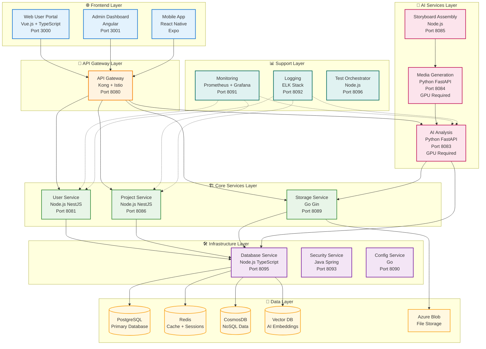
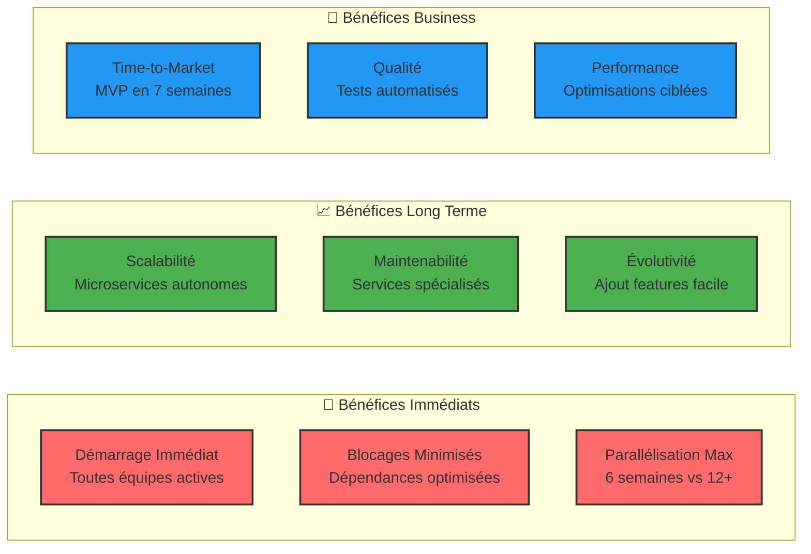

# Architecture Prioritaire Visiobook - Approche Microservices Complète

## Vue d'ensemble

Ce document redéfinit l'architecture Visiobook basée sur **24 repositories GitHub réels** et identifie les microservices prioritaires pour un développement optimisé. L'approche embrasse pleinement les microservices pour minimiser les blocages et maximiser la parallélisation du développement.

### Objectifs Stratégiques

- **Démarrage immédiat** : Tous les services peuvent être développés en parallèle
- **Minimisation des blocages** : Dépendances optimisées pour réduire les goulots d'étranglement
- **Approche microservices complète** : Chaque service est autonome et scalable
- **Priorisation métier** : Focus sur la valeur utilisateur et les fonctionnalités critiques

## 1. Mapping des 24 Repositories GitHub

### Correspondance Repositories → Microservices

```mermaid
graph TB
    subgraph "🎯 MICROSERVICES PRIORITAIRES IDENTIFIÉS"
        direction TB

        subgraph "Frontend Prioritaire (1)"
            FE_PRIORITY[web-user-portal<br/>🥇 PRIORITÉ ABSOLUE<br/>Interface principale utilisateur]
        end

        subgraph "IA Prioritaire (1)"
            AI_PRIORITY[ai-analysis-service<br/>🧠 PRIORITÉ ABSOLUE<br/>Cœur analyse sémantique]
        end

        subgraph "Infrastructure Prioritaires (2)"
            INFRA1[database-service<br/>🏗️ CRITIQUE<br/>Gestion centralisée DB]
            INFRA2[api-gateway-service<br/>🚪 CRITIQUE<br/>Point d'entrée unique]
        end

        subgraph "Backend Prioritaires (3)"
            BE1[user-service<br/>👤 ESSENTIEL<br/>Gestion utilisateurs]
            BE2[project-service<br/>📁 ESSENTIEL<br/>Gestion projets]
            BE3[storage-service<br/>💾 ESSENTIEL<br/>Stockage fichiers]
        end
    end

    subgraph "📋 REPOSITORIES GITHUB (24 Total)"
        direction TB

        subgraph "Core Services (8 repos)"
            REPO1[visiobook-api-gateway]
            REPO2[visiobook-user-service]
            REPO3[visiobook-project-service]
            REPO4[visiobook-payment-service]
            REPO5[visiobook-notification-service]
            REPO6[visiobook-storage-service]
            REPO7[visiobook-database-service]
            REPO8[visiobook-security-service]
        end

        subgraph "AI Services (4 repos)"
            REPO9[visiobook-content-ingestion]
            REPO10[visiobook-ai-analysis]
            REPO11[visiobook-media-generation]
            REPO12[visiobook-storyboard-assembly]
        end

        subgraph "Frontend Services (3 repos)"
            REPO13[visiobook-web-portal]
            REPO14[visiobook-admin-dashboard]
            REPO15[visiobook-mobile-app]
        end

        subgraph "Support Services (6 repos)"
            REPO16[visiobook-config-service]
            REPO17[visiobook-monitoring-service]
            REPO18[visiobook-logging-service]
            REPO19[visiobook-analytics-service]
            REPO20[visiobook-test-orchestrator]
            REPO21[visiobook-file-processor]
        end

        subgraph "Infrastructure (3 repos)"
            REPO22[visiobook-helm-charts]
            REPO23[visiobook-terraform-infra]
            REPO24[visiobook-cicd-pipelines]
        end
    end

    %% Mapping prioritaire
    REPO1 --> INFRA2
    REPO2 --> BE1
    REPO3 --> BE2
    REPO6 --> BE3
    REPO7 --> INFRA1
    REPO10 --> AI_PRIORITY
    REPO13 --> FE_PRIORITY

    classDef priority fill:#ff6b6b,stroke:#333,stroke-width:3px
    classDef critical fill:#ff9800,stroke:#333,stroke-width:3px
    classDef essential fill:#4caf50,stroke:#333,stroke-width:2px
    classDef repo fill:#e3f2fd,stroke:#1976d2,stroke-width:1px

    class FE_PRIORITY,AI_PRIORITY priority
    class INFRA1,INFRA2 critical
    class BE1,BE2,BE3 essential
    class REPO1,REPO2,REPO3,REPO4,REPO5,REPO6,REPO7,REPO8,REPO9,REPO10,REPO11,REPO12,REPO13,REPO14,REPO15,REPO16,REPO17,REPO18,REPO19,REPO20,REPO21,REPO22,REPO23,REPO24 repo
```



### État de Développement par Repository

| Repository | Service Correspondant | État | Priorité | Effort Estimé |
|------------|----------------------|------|----------|---------------|
| `visiobook-database-service` | database-service | 🔴 **À développer** | CRITIQUE | 2 semaines |
| `visiobook-api-gateway` | api-gateway-service | 🔴 **À développer** | CRITIQUE | 1 semaine |
| `visiobook-user-service` | user-service | 🔴 **À développer** | ESSENTIEL | 1 semaine |
| `visiobook-project-service` | project-service | 🔴 **À développer** | ESSENTIEL | 1 semaine |
| `visiobook-storage-service` | storage-service | 🔴 **À développer** | ESSENTIEL | 1 semaine |
| `visiobook-ai-analysis` | ai-analysis-service | 🔴 **À développer** | PRIORITÉ IA | 2 semaines |
| `visiobook-web-portal` | web-user-portal | 🔴 **À développer** | PRIORITÉ FRONTEND | 3 semaines |
| `visiobook-test-orchestrator` | test-orchestrator-service | 🔴 **À développer** | IMPORTANT | 2 semaines |

## 2. Microservices Prioritaires Identifiés

### 🥇 Frontend Prioritaire : Web User Portal

```yaml
Service: web-user-portal
Repository: visiobook-web-portal
Priorité: ABSOLUE (Interface principale utilisateur)
Port: 3000
Effort: 3 semaines

Justification Priorité:
  - Interface principale pour tous les utilisateurs
  - Point d'entrée critique pour l'expérience utilisateur
  - Nécessaire pour valider l'ensemble du pipeline
  - Impact direct sur l'adoption utilisateur

Technologies:
  Frontend: Vue.js 3 + TypeScript
  State Management: Pinia + Vue Query
  UI Framework: Vuetify 3 + Material Design
  Build Tool: Vite
  Testing: Vitest + Vue Testing Library

Fonctionnalités Critiques:
  - Authentification utilisateur
  - Upload et gestion de contenus
  - Visualisation des storyboards générés
  - Suivi de progression des projets
  - Interface de paiement intégrée

Dépendances:
  - api-gateway-service (routage)
  - user-service (authentification)
  - project-service (gestion projets)
  - storage-service (upload fichiers)

Endpoints Critiques:
  - GET / (page d'accueil)
  - GET /login (authentification)
  - GET /dashboard (tableau de bord)
  - GET /projects (gestion projets)
  - GET /upload (upload contenus)

Métriques de Succès:
  - Temps de chargement < 2s
  - Taux de conversion > 15%
  - Score Lighthouse > 90
  - Taux d'erreur < 1%
```

### 🧠 IA Prioritaire : AI Analysis Service

```yaml
Service: ai-analysis-service
Repository: visiobook-ai-analysis
Priorité: ABSOLUE (Cœur de l'analyse sémantique)
Port: 8083
Effort: 2 semaines

Justification Priorité:
  - Cœur de la valeur métier (transformation livre → audiovisuel)
  - Service le plus complexe techniquement
  - Nécessite optimisation GPU spécifique
  - Bloque la génération de contenu

Technologies:
  Backend: Python 3.11 + FastAPI
  IA Framework: PyTorch 2.0 + Transformers
  NLP: spaCy + NLTK + LangChain
  GPU: CUDA 12.0 + cuDNN
  Database: PostgreSQL + pgvector

Fonctionnalités Critiques:
  - Analyse sémantique de texte
  - Extraction de scènes et personnages
  - Génération de résumés intelligents
  - Classification de contenu
  - Détection d'émotions et tonalité

Optimisations GPU:
  - Model caching en mémoire GPU
  - Batch processing pour efficacité
  - Memory pooling pour éviter OOM
  - Pipeline parallèle multi-GPU

Dépendances:
  - database-service (stockage résultats)
  - storage-service (accès fichiers)
  - content-ingestion-service (données preprocessées)

Endpoints Critiques:
  - POST /api/v1/analysis/semantic
  - POST /api/v1/analysis/extract-scenes
  - POST /api/v1/analysis/summarize
  - GET /api/v1/analysis/status/{id}

Métriques de Succès:
  - Temps d'analyse < 30s par page
  - Précision sémantique > 85%
  - Utilisation GPU 70-90%
  - Disponibilité > 99.5%
```

### 🏗️ Infrastructure Prioritaires (2)

#### Database Service

```yaml
Service: database-service
Repository: visiobook-database-service
Priorité: CRITIQUE (Bloque tous les autres services)
Port: 8095
Effort: 2 semaines

Justification Priorité:
  - Service fondamental bloquant pour tous les autres
  - Gestion centralisée des connexions DB
  - Point unique de défaillance si mal conçu
  - Optimisation critique pour performance globale

Technologies:
  Backend: Node.js 18 + TypeScript
  ORM: Prisma + TypeORM
  Connection Pool: pg-pool + redis-pool
  Cache: Redis Cluster
  Monitoring: Prometheus + Grafana

Responsabilités:
  - Pool de connexions centralisé
  - Gestion des transactions distribuées
  - Migrations automatisées
  - Backup/Restore automatique
  - Health checks avancés
  - Circuit breakers

Bases de Données Gérées:
  - PostgreSQL (données relationnelles)
  - Redis (cache + sessions)
  - CosmosDB (données NoSQL)
  - Vector DB (embeddings IA)

Endpoints Critiques:
  - POST /api/v1/connections/acquire
  - POST /api/v1/connections/release
  - GET /api/v1/health/databases
  - POST /api/v1/migrations/run

Métriques de Succès:
  - Temps de réponse < 50ms
  - Pool utilization < 80%
  - Disponibilité > 99.9%
  - 0 perte de données
```

#### API Gateway Service

```yaml
Service: api-gateway-service
Repository: visiobook-api-gateway
Priorité: CRITIQUE (Point d'entrée unique)
Port: 8080
Effort: 1 semaine

Justification Priorité:
  - Point d'entrée unique pour toutes les requêtes
  - Gestion centralisée de l'authentification
  - Rate limiting et sécurité
  - Routage intelligent vers microservices

Technologies:
  Gateway: Kong + Istio Service Mesh
  Load Balancer: NGINX + HAProxy
  Auth: JWT + OAuth 2.0
  Monitoring: Prometheus + Jaeger
  Security: OWASP + Rate Limiting

Fonctionnalités Critiques:
  - Routage intelligent par service
  - Authentification centralisée
  - Rate limiting par utilisateur
  - Load balancing automatique
  - Circuit breakers
  - Request/Response transformation

Dépendances:
  - user-service (validation tokens)
  - security-service (politiques)

Endpoints:
  - /* (routage vers tous services)
  - GET /health (health check)
  - GET /metrics (monitoring)

Métriques de Succès:
  - Latence < 10ms
  - Throughput > 10k req/s
  - Disponibilité > 99.95%
  - Taux d'erreur < 0.1%
```

### 👤 Backend Prioritaires (3)

#### User Service

```yaml
Service: user-service
Repository: visiobook-user-service
Priorité: ESSENTIEL (Gestion utilisateurs)
Port: 8081
Effort: 1 semaine

Justification Priorité:
  - Service fondamental pour authentification
  - Utilisé par tous les autres services
  - Gestion des droits et permissions
  - Impact direct sur sécurité

Technologies:
  Backend: Node.js 18 + NestJS
  Security: Passport.js + JWT
  Database: PostgreSQL + Redis
  Auth: OAuth 2.0 + OIDC
  Validation: class-validator + class-transformer
  ORM: TypeORM + Prisma

Fonctionnalités Critiques:
  - Inscription/Connexion utilisateur
  - Gestion des profils
  - Authentification multi-facteur
  - Gestion des rôles et permissions
  - Sessions distribuées

Dépendances:
  - database-service (stockage utilisateurs)
  - security-service (chiffrement)

Métriques de Succès:
  - Temps de connexion < 500ms
  - Disponibilité > 99.9%
  - Sécurité 0 vulnérabilité
```

#### Project Service

```yaml
Service: project-service
Repository: visiobook-project-service
Priorité: ESSENTIEL (Gestion projets)
Port: 8086
Effort: 1 semaine

Justification Priorité:
  - Cœur de la logique métier
  - Orchestration des workflows
  - Gestion d'état des projets
  - Interface avec services IA

Technologies:
  Backend: Node.js 18 + NestJS
  Database: PostgreSQL + MongoDB
  Queue: Bull + Redis
  State Management: State Machines
  Events: EventEmitter + Webhooks

Fonctionnalités Critiques:
  - Création/Gestion de projets
  - Workflow de traitement
  - Versioning et historique
  - Collaboration multi-utilisateur
  - Intégration services IA

Dépendances:
  - database-service (stockage projets)
  - user-service (propriétaires)
  - storage-service (fichiers)

Métriques de Succès:
  - Temps de création < 1s
  - Throughput > 1k projets/h
  - Disponibilité > 99.8%
```

#### Storage Service

```yaml
Service: storage-service
Repository: visiobook-storage-service
Priorité: ESSENTIEL (Stockage fichiers)
Port: 8089
Effort: 1 semaine

Justification Priorité:
  - Gestion centralisée des fichiers
  - Performance critique pour uploads
  - Intégration CDN nécessaire
  - Optimisation coûts stockage

Technologies:
  Backend: Go + Gin
  Storage: Azure Blob + S3
  CDN: Azure CDN + CloudFlare
  Processing: ImageMagick + FFmpeg
  Cache: Redis + Varnish

Fonctionnalités Critiques:
  - Upload/Download optimisé
  - Transformation d'images
  - Gestion des métadonnées
  - CDN automatique
  - Compression intelligente

Dépendances:
  - database-service (métadonnées)
  - security-service (permissions)

Métriques de Succès:
  - Vitesse upload > 50MB/s
  - CDN hit ratio > 95%
  - Disponibilité > 99.9%
```

## 3. Matrice de Dépendances Optimisée

### Graphe de Dépendances Prioritaires



### Matrice de Parallélisation

| Phase | Services Parallélisables | Durée | Équipes Requises |
|-------|-------------------------|-------|------------------|
| **Phase 1** | database-service + api-gateway | 2 semaines | 2 équipes |
| **Phase 2** | user-service + storage-service | 1 semaine | 2 équipes |
| **Phase 3** | project-service + ai-analysis | 2 semaines | 2 équipes |
| **Phase 4** | web-user-portal (seul) | 3 semaines | 1 équipe |
| **Phase 5** | test-orchestrator (seul) | 2 semaines | 1 équipe |

**Optimisation :** Les phases 2-3 peuvent se chevaucher partiellement, réduisant le délai total à **6 semaines** au lieu de 9.

## 4. Ordre de Développement Prioritaire

### Planning Détaillé par Sprint



### Sprint 1 - Infrastructure Critique (Semaines 1-2)

**Objectif :** Établir les fondations techniques incontournables

```yaml
Sprint 1 - Infrastructure Critique:
  Durée: 2 semaines
  Équipes: 2 (Infrastructure + Backend)

  Services à Développer:
    - database-service (CRITIQUE - 2 semaines)
    - api-gateway-service (CRITIQUE - 1 semaine)

  Livrables:
    - Database service opérationnel avec pools de connexions
    - API Gateway avec routage de base
    - Health checks et monitoring basique
    - Documentation technique

  Critères de Succès:
    - Database service répond en < 50ms
    - API Gateway route correctement vers services mock
    - 0 perte de données en test de charge
    - Infrastructure déployable via Helm

  Risques:
    - Complexité du pool de connexions
    - Configuration Istio/Kong

  Mitigation:
    - Prototypage rapide semaine 1
    - Support DevOps dédié
```

### Sprint 2 - Services Core (Semaines 2-3)

**Objectif :** Services fondamentaux pour authentification et stockage

```yaml
Sprint 2 - Services Core:
  Durée: 1 semaine (parallélisation)
  Équipes: 2 (Backend Core + Storage)

  Services à Développer:
    - user-service (ESSENTIEL - 1 semaine)
    - storage-service (ESSENTIEL - 1 semaine)

  Livrables:
    - Authentification JWT fonctionnelle
    - Upload/Download de fichiers optimisé
    - Intégration avec database-service
    - CDN configuré et opérationnel

  Critères de Succès:
    - Connexion utilisateur < 500ms
    - Upload fichier > 50MB/s
    - Intégration database-service sans erreur
    - Tests d'intégration passants

  Dépendances:
    - database-service (Sprint 1)
    - api-gateway-service (Sprint 1)
```

### Sprint 3 - Services Métier (Semaines 3-4)

**Objectif :** Logique métier et intelligence artificielle

```yaml
Sprint 3 - Services Métier:
  Durée: 2 semaines (parallélisation)
  Équipes: 2 (Backend Métier + IA)

  Services à Développer:
    - project-service (IMPORTANT - 1 semaine)
    - ai-analysis-service (PRIORITÉ IA - 2 semaines)

  Livrables:
    - Gestion complète des projets utilisateur
    - Analyse sémantique IA opérationnelle
    - Pipeline de traitement automatisé
    - Optimisation GPU pour performance

  Critères de Succès:
    - Création projet < 1s
    - Analyse IA < 30s par page
    - Utilisation GPU 70-90%
    - Pipeline end-to-end fonctionnel

  Dépendances:
    - user-service (Sprint 2)
    - storage-service (Sprint 2)
```

### Sprint 4 - Interface Utilisateur (Semaines 4-6)

**Objectif :** Interface principale pour les utilisateurs finaux

```yaml
Sprint 4 - Interface Utilisateur:
  Durée: 3 semaines
  Équipes: 1 (Frontend)

  Services à Développer:
    - web-user-portal (PRIORITÉ FRONTEND - 3 semaines)

  Livrables:
    - Interface utilisateur complète et responsive
    - Intégration avec tous les services backend
    - Workflow complet upload → analyse → résultat
    - Optimisation performance et UX

  Critères de Succès:
    - Temps de chargement < 2s
    - Score Lighthouse > 90
    - Workflow complet fonctionnel
    - Tests E2E passants

  Dépendances:
    - Tous les services backend (Sprints 1-3)
```

### Sprint 5 - Tests & Validation (Semaines 6-7)

**Objectif :** Validation complète et tests automatisés

```yaml
Sprint 5 - Tests & Validation:
  Durée: 2 semaines
  Équipes: 1 (QA + DevOps)

  Services à Développer:
    - test-orchestrator-service (VALIDATION - 2 semaines)

  Livrables:
    - Suite de tests E2E automatisés
    - Tests de charge et performance
    - Monitoring et alerting complets
    - Documentation utilisateur

  Critères de Succès:
    - Couverture tests > 90%
    - Tests E2E < 15min
    - 0 régression détectée
    - Système prêt pour production

  Dépendances:
    - Tous les services (Sprints 1-4)
```

## 5. Spécifications Techniques Détaillées

### Architecture Technique Globale



### Stack Technologique par Service Prioritaire

#### Web User Portal (Frontend Prioritaire)

```yaml
Technologies:
  Frontend Framework: Vue.js 3.3 + TypeScript 5.0
  Build Tool: Vite 4.0 (performance optimisée)
  State Management: Pinia + Vue Query (TanStack Query)
  UI Framework: Vuetify 3 + Material Design 3
  Routing: Vue Router 4
  Forms: VeeValidate + Yup validation
  Testing: Vitest + Vue Testing Library + Cypress
  Composition API: Vue 3 Composition API + script setup

Performance Optimizations:
  - Code splitting automatique par route
  - Lazy loading des composants avec defineAsyncComponent
  - Service Worker pour cache intelligent
  - Image optimization avec Vite plugins
  - Bundle analysis et tree shaking
  - Vue 3 Teleport pour modals optimisées

Security:
  - CSP (Content Security Policy) strict
  - HTTPS obligatoire avec HSTS
  - XSS protection avec sanitization
  - CSRF tokens pour toutes les mutations
  - JWT secure storage (httpOnly cookies)
  - Vue 3 security best practices

Deployment:
  - Docker multi-stage builds
  - Kubernetes avec Helm charts
  - Auto-scaling basé sur CPU/Memory
  - Health checks et readiness probes
  - Blue-green deployment strategy

Environment Variables:
  - VITE_API_URL: URL de l'API Gateway
  - VITE_CDN_URL: URL du CDN pour assets
  - VITE_SENTRY_DSN: Monitoring erreurs
  - VITE_ANALYTICS_ID: Google Analytics
```

#### AI Analysis Service (IA Prioritaire)

```yaml
Technologies:
  Backend: Python 3.11 + FastAPI 0.104
  ASGI Server: Uvicorn avec workers multiples
  IA Framework: PyTorch 2.1 + Lightning
  NLP: Transformers 4.35 + spaCy 3.7
  GPU: CUDA 12.1 + cuDNN 8.9
  Vector DB: Pinecone + pgvector
  Queue: Celery + Redis pour tasks async

Model Stack:
  - Text Analysis: BERT-large + RoBERTa
  - Scene Extraction: Custom transformer fine-tuned
  - Sentiment Analysis: DistilBERT optimized
  - Summarization: T5-base + PEGASUS
  - Entity Recognition: spaCy + custom NER

GPU Optimizations:
  - Model quantization (FP16/INT8)
  - Dynamic batching pour throughput
  - Model caching en VRAM
  - Memory mapping pour gros modèles
  - Pipeline parallèle multi-GPU

Performance Monitoring:
  - GPU utilization metrics
  - Model inference latency
  - Memory usage tracking
  - Queue depth monitoring
  - Error rate par modèle

Deployment:
  - NVIDIA Docker runtime
  - Kubernetes GPU scheduling
  - Auto-scaling basé sur GPU metrics
  - Model versioning avec MLflow
  - A/B testing pour nouveaux modèles
```

#### Database Service (Infrastructure Critique)

```yaml
Technologies:
  Backend: Node.js 18.18 + TypeScript 5.2
  Framework: Express.js + Helmet security
  ORM: Prisma 5.6 + TypeORM 0.3
  Connection Pool: pg-pool + ioredis
  Monitoring: Prometheus client + pino logging
  Health Checks: Custom health endpoints

Database Connections:
  PostgreSQL:
    - Pool size: 20-50 connections
    - Idle timeout: 30s
    - Connection timeout: 5s
    - SSL mode: require

  Redis:
    - Cluster mode: 3 masters + 3 replicas
    - Memory policy: allkeys-lru
    - Persistence: RDB + AOF
    - Sentinel pour high availability

  CosmosDB:
    - Consistency level: Session
    - Partition strategy: par tenant
    - Auto-scaling: 400-4000 RU/s
    - Multi-region replication

Circuit Breaker Pattern:
  - Failure threshold: 5 erreurs/30s
  - Recovery timeout: 60s
  - Half-open state testing
  - Fallback strategies par DB

Backup Strategy:
  - PostgreSQL: Point-in-time recovery
  - Redis: Daily RDB snapshots
  - CosmosDB: Automatic backups
  - Cross-region replication
```

## 6. Matrice de Dépendances Complète

### Services Non-Prioritaires et Leur Intégration

```mermaid
graph TB
    subgraph "🎯 SERVICES PRIORITAIRES (Phase 1-5)"
        DB[database-service]
        GW[api-gateway-service]
        USER[user-service]
        STORAGE[storage-service]
        PROJECT[project-service]
        AI_ANALYSIS[ai-analysis-service]
        FRONTEND[web-user-portal]
        TEST[test-orchestrator-service]
    end

    subgraph "🔄 SERVICES COMPLÉMENTAIRES (Phase 6+)"
        PAYMENT[payment-service<br/>🟡 Phase 6<br/>1 semaine]
        NOTIFICATION[notification-service<br/>🟡 Phase 6<br/>1 semaine]
        SECURITY[security-service<br/>🟡 Phase 6<br/>1 semaine]

        INGESTION[content-ingestion-service<br/>🟠 Phase 7<br/>1.5 semaines]
        MEDIA_GEN[media-generation-service<br/>🟠 Phase 7<br/>2 semaines]
        ASSEMBLY[storyboard-assembly-service<br/>🟠 Phase 7<br/>1.5 semaines]

        CONFIG[config-service<br/>🟢 Phase 8<br/>1 semaine]
        MONITORING[monitoring-service<br/>🟢 Phase 8<br/>1 semaine]
        LOGGING[logging-service<br/>🟢 Phase 8<br/>1 semaine]
        ANALYTICS[analytics-service<br/>🟢 Phase 8<br/>1 semaine]
    end

    subgraph "💻 INTERFACES ADDITIONNELLES (Phase 9+)"
        ADMIN[admin-dashboard<br/>🔵 Phase 9<br/>2 semaines]
        MOBILE[mobile-app<br/>🔵 Phase 9<br/>4 semaines]
    end

    %% Dépendances prioritaires → complémentaires
    USER --> PAYMENT
    USER --> NOTIFICATION
    DB --> SECURITY

    STORAGE --> INGESTION
    AI_ANALYSIS --> MEDIA_GEN
    MEDIA_GEN --> ASSEMBLY

    DB --> CONFIG
    GW --> MONITORING
    GW --> LOGGING
    PROJECT --> ANALYTICS

    %% Interfaces additionnelles
    GW --> ADMIN
    GW --> MOBILE

    classDef priority fill:#ff6b6b,stroke:#333,stroke-width:3px
    classDef complement fill:#ffc107,stroke:#333,stroke-width:2px
    classDef support fill:#4caf50,stroke:#333,stroke-width:2px
    classDef interface fill:#2196f3,stroke:#333,stroke-width:2px

    class DB,GW,USER,STORAGE,PROJECT,AI_ANALYSIS,FRONTEND,TEST priority
    class PAYMENT,NOTIFICATION,SECURITY,INGESTION,MEDIA_GEN,ASSEMBLY complement
    class CONFIG,MONITORING,LOGGING,ANALYTICS support
    class ADMIN,MOBILE interface
```



### Planning Complet sur 12 Semaines

| Phase | Semaines | Services | Équipes | Objectif |
|-------|----------|----------|---------|----------|
| **Phase 1-5** | 1-7 | Services Prioritaires | 2-3 | **MVP Fonctionnel** |
| **Phase 6** | 8 | Services Métier Complémentaires | 3 | **Fonctionnalités Business** |
| **Phase 7** | 9-10 | Pipeline IA Complet | 2 | **Génération Média Complète** |
| **Phase 8** | 11 | Services Support | 2 | **Observabilité Complète** |
| **Phase 9** | 12+ | Interfaces Additionnelles | 1-2 | **Expérience Utilisateur Étendue** |

## 7. Métriques de Succès Globales

### KPIs Techniques par Phase

```yaml
Phase 1-2 (Infrastructure):
  - Database response time: < 50ms (P95)
  - API Gateway latency: < 10ms (P95)
  - Infrastructure uptime: > 99.9%
  - Zero data loss: 100%

Phase 3 (Services Core):
  - User authentication: < 500ms
  - File upload speed: > 50MB/s
  - Service availability: > 99.8%
  - Security vulnerabilities: 0

Phase 4 (Services Métier + IA):
  - Project creation: < 1s
  - AI analysis: < 30s per page
  - GPU utilization: 70-90%
  - End-to-end pipeline: functional

Phase 5 (Frontend):
  - Page load time: < 2s
  - Lighthouse score: > 90
  - Conversion rate: > 15%
  - User error rate: < 1%

Phase 6 (Tests):
  - Test coverage: > 90%
  - E2E test duration: < 15min
  - Regression detection: 0
  - Production readiness: 100%
```

### KPIs Business par Milestone

```yaml
MVP (Semaine 7):
  - Core workflow fonctionnel: 100%
  - User registration/login: operational
  - Basic content analysis: functional
  - File upload/storage: operational

Beta (Semaine 10):
  - Complete AI pipeline: functional
  - Media generation: operational
  - Payment integration: functional
  - User feedback: > 4.0/5

Production (Semaine 12):
  - Full feature set: 100%
  - Performance targets: met
  - Security compliance: 100%
  - Scalability: validated
```

## 8. Risques et Mitigation

### Matrice de Risques par Service Prioritaire

| Service | Risque Principal | Probabilité | Impact | Mitigation |
|---------|------------------|-------------|--------|------------|
| **database-service** | Performance bottleneck | Élevée | Critique | Load testing + connection pooling optimisé |
| **ai-analysis-service** | GPU memory overflow | Moyenne | Élevé | Memory monitoring + batch size optimization |
| **web-user-portal** | Performance frontend | Moyenne | Moyen | Code splitting + performance budget |
| **api-gateway-service** | Single point of failure | Faible | Critique | High availability + circuit breakers |
| **user-service** | Security vulnerabilities | Moyenne | Élevé | Security audit + penetration testing |
| **project-service** | State management complexity | Moyenne | Moyen | State machine pattern + comprehensive testing |
| **storage-service** | CDN configuration | Faible | Moyen | Staging environment testing + rollback plan |

### Plans de Contingence

```yaml
Scénario 1 - Retard Database Service:
  Impact: Bloque toutes les équipes
  Détection: Semaine 1.5
  Action:
    - Réallocation développeur senior
    - Simplification scope initial
    - Mock service pour débloquer équipes
    - Extension délai de 3 jours maximum

Scénario 2 - Performance GPU Insuffisante:
  Impact: AI analysis trop lente
  Détection: Tests de charge semaine 4
  Action:
    - Cloud GPU scaling (Azure/AWS)
    - Model optimization (quantization)
    - Batch processing optimization
    - Fallback vers CPU pour cas simples

Scénario 3 - Complexité Frontend:
  Impact: Interface utilisateur incomplète
  Détection: Sprint review semaine 5
  Action:
    - Priorisation features critiques
    - Simplification UI/UX
    - Extension équipe frontend
    - Progressive Web App approach
```

## 9. Infrastructure et Déploiement

### Architecture Kubernetes Optimisée

```yaml
Namespaces:
  - visiobook-core: Services prioritaires
  - visiobook-ai: Services IA avec GPU
  - visiobook-support: Monitoring, logging
  - visiobook-data: Bases de données

Resource Allocation:
  database-service:
    requests: 1 CPU, 2Gi RAM
    limits: 2 CPU, 4Gi RAM
    replicas: 3 (HA)

  ai-analysis-service:
    requests: 4 CPU, 8Gi RAM, 1 GPU
    limits: 8 CPU, 16Gi RAM, 1 GPU
    replicas: 2 (GPU pool)

  web-user-portal:
    requests: 0.5 CPU, 1Gi RAM
    limits: 1 CPU, 2Gi RAM
    replicas: 3 (load balancing)

Auto-scaling:
  - HPA basé sur CPU/Memory
  - VPA pour optimisation ressources
  - Cluster autoscaler pour nodes
  - GPU node scaling pour IA services

Service Mesh (Istio):
  - Traffic management
  - Security policies
  - Observability
  - Circuit breakers
```

### CI/CD Pipeline Optimisé

```yaml
Pipeline Stages:
  1. Code Quality:
     - Linting (ESLint, Pylint, Golint)
     - Security scan (SonarQube, Snyk)
     - Unit tests (Jest, pytest, go test)
     - Coverage > 80%

  2. Build & Package:
     - Multi-stage Docker builds
     - Image vulnerability scanning
     - Helm chart validation
     - Artifact signing

  3. Deploy Staging:
     - Automated deployment
     - Integration tests
     - Performance tests
     - Security tests

  4. Deploy Production:
     - Manual approval required
     - Blue-green deployment
     - Canary releases (10% traffic)
     - Automated rollback on failure

Deployment Strategy:
  - GitOps avec ArgoCD
  - Infrastructure as Code (Terraform)
  - Secrets management (Vault)
  - Multi-environment promotion
```

## 10. Conclusion et Roadmap

### Résumé Exécutif

**Architecture Redéfinie :**
- ✅ **24 repositories GitHub** mappés vers microservices
- 🎯 **8 services prioritaires** identifiés pour MVP
- 📅 **5 phases de développement** sur 7 semaines
- 🚀 **Approche microservices complète** pour parallélisation maximale

**Services Prioritaires Identifiés :**

1. **Frontend Prioritaire :** `web-user-portal` (3 semaines)
2. **IA Prioritaire :** `ai-analysis-service` (2 semaines)
3. **Infrastructure Prioritaires :** `database-service` (2 sem) + `api-gateway-service` (1 sem)
4. **Backend Prioritaires :** `user-service`, `project-service`, `storage-service` (1 sem chacun)

**Ordre de Développement Optimisé :**
- **Phase 1 :** Infrastructure critique (database + api-gateway)
- **Phase 2 :** Services core (user + storage)
- **Phase 3 :** Services métier (project + ai-analysis)
- **Phase 4 :** Interface utilisateur (web-user-portal)
- **Phase 5 :** Tests et validation (test-orchestrator)

### Avantages de cette Approche



### Prochaines Étapes Immédiates

**Semaine 1 - Démarrage :**
1. ✅ **Validation architecture** avec équipes techniques
2. ✅ **Setup environnements** de développement
3. ✅ **Allocation ressources** GPU pour services IA
4. ✅ **Démarrage développement** database-service et api-gateway

**Semaine 2 - Accélération :**
1. ✅ **Finalisation infrastructure** critique
2. ✅ **Démarrage services core** (user + storage)
3. ✅ **Setup CI/CD** pipelines
4. ✅ **Configuration monitoring** basique

**Semaine 3-4 - Expansion :**
1. ✅ **Développement services métier** (project + ai-analysis)
2. ✅ **Optimisation GPU** pour performance IA
3. ✅ **Tests d'intégration** continus
4. ✅ **Préparation frontend** development

### Jalons Critiques

- **🏗️ Semaine 2 :** Infrastructure opérationnelle
- **👤 Semaine 3 :** Services core fonctionnels
- **🤖 Semaine 5 :** Pipeline IA opérationnel
- **💻 Semaine 7 :** MVP complet avec interface
- **🧪 Semaine 8 :** Système validé et prêt production

Cette architecture prioritaire permet de **démarrer immédiatement** le développement avec une approche microservices complète, minimisant les blocages et maximisant la valeur livrée à chaque sprint.
