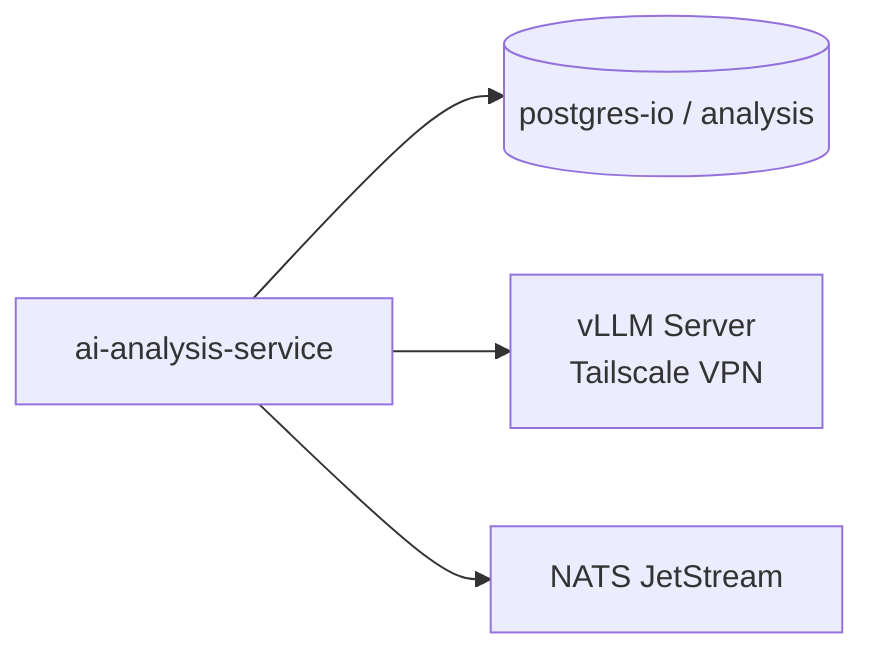
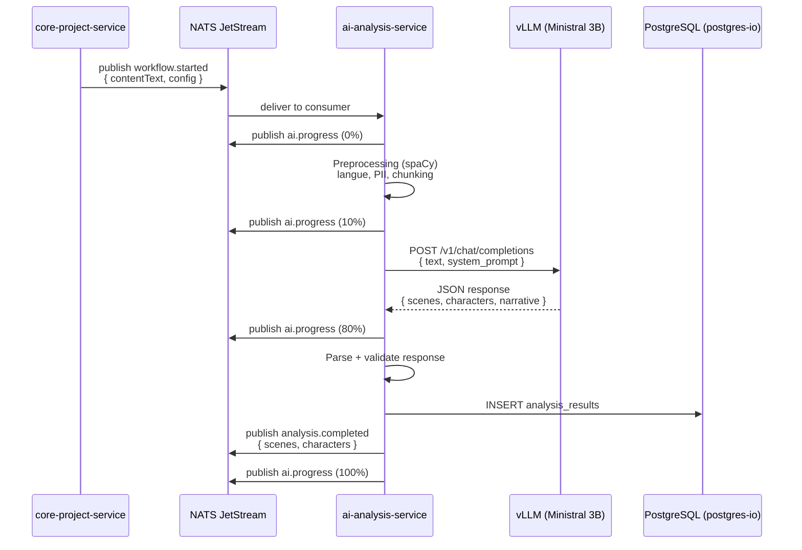

# ai-analysis-service

## Informations generales

| Propriete | Valeur |
|-----------|--------|
| **Repository** | ai-analysis-service |
| **Port** | 8083 |
| **Stack** | Python 3.12 / FastAPI / vLLM (Ministral 3B) / spaCy |
| **Phase** | 3 - Services Metier |
| **Priorite** | PRIORITE IA (coeur valeur metier) |

## Flows/Journeys concernes

| Flow | Role | Responsabilite |
|------|------|----------------|
| **Flow 5: Generation** | **Analyse** | Analyse semantique du texte (scenes, personnages, narratif, resume) |

> **Note**: Ce service ne gere que l'etape d'analyse (phase 1 du pipeline). La generation d'images, audio et assemblage sont delegues a d'autres services via NATS.

## Architecture interne

```mermaid
graph TB
    subgraph "ai-analysis-service"
        API[FastAPI App<br/>Port 8083]

        subgraph "Routes"
            ANALYZE[/api/v1/analyze<br/>POST async + batch]
            RESULTS[/api/v1/results<br/>GET stored results]
            JOBS[/api/v1/jobs<br/>GET job status]
            HEALTH[/health + /ready + /metrics]
        end

        subgraph "Processing Pipeline"
            PREPROCESS[TextPreprocessor<br/>spaCy + langdetect]
            LLM[LLMClient<br/>httpx → vLLM]
            PARSER[ResponseParser<br/>JSON validation]
        end

        subgraph "Messaging"
            NATS_SUB[NATS Subscriber<br/>workflow.started]
            NATS_PUB[NATS Publisher<br/>analysis.completed/failed]
            HANDLER[WorkflowHandler]
        end

        subgraph "Persistence"
            DB_CLIENT[DatabaseClient<br/>SQLAlchemy + asyncpg]
        end
    end

    subgraph "External"
        VLLM[vLLM Server<br/>Ministral 3B<br/>Tailscale VPN]
        PG[(postgres-io<br/>analysis)]
        NATS[NATS JetStream<br/>VISIOBOOK_PROJECT]
    end

    API --> ANALYZE
    API --> RESULTS
    API --> JOBS
    API --> HEALTH

    NATS_SUB --> HANDLER
    HANDLER --> PREPROCESS
    HANDLER --> LLM
    HANDLER --> PARSER
    HANDLER --> DB_CLIENT
    HANDLER --> NATS_PUB

    ANALYZE --> PREPROCESS
    ANALYZE --> LLM
    ANALYZE --> PARSER

    LLM --> VLLM
    DB_CLIENT --> PG
    NATS_SUB --> NATS
    NATS_PUB --> NATS
```

## Pipeline de traitement

Le texte passe par 4 etapes:

| Etape | Composant | Description | Duree |
|-------|-----------|-------------|-------|
| 1. Preprocessing | `TextPreprocessor` (spaCy) | Detection langue, nettoyage Unicode, masquage PII, segmentation en phrases, chunking avec overlap | ~50-500ms |
| 2. LLM Call | `LLMClient` (httpx) | Envoi au serveur vLLM (Ministral 3B) via API OpenAI-compatible | ~10-120s |
| 3. Parsing | `ResponseParser` | Validation JSON, normalisation champs manquants, extraction fallback | ~5ms |
| 4. Persistence | `DatabaseClient` | Upsert dans `analysis_results` (PostgreSQL) | ~10ms |

### Preprocessing (spaCy)

- **Modeles**: `fr_core_news_lg` (francais), `en_core_web_lg` (anglais)
- **Detection langue**: `langdetect` → choix automatique du modele spaCy
- **PII masking**: emails, telephones, IBANs → `***`
- **Segmentation**: spaCy sentencizer → phrases
- **Chunking**: max 512 tokens, overlap 64 tokens (pour contexte LLM)

### LLM (vLLM)

- **Modele**: `mistralai/Ministral-3-3B-Instruct-2512-BF16`
- **Serveur**: vLLM avec API OpenAI-compatible (Tailscale VPN)
- **Temperature**: 0.1 (deterministe)
- **Max tokens**: 4096
- **Timeout**: 120s
- **Output**: JSON structure (scenes, personnages, narratif, sentiment, resume)

## Controllers et Endpoints

### Analysis (`/api/v1`)

| Methode | Endpoint | Description | Auth |
|---------|----------|-------------|------|
| POST | `/analyze` | Analyse asynchrone (retourne job_id, status 202) | x-user-id |
| POST | `/analyze/batch` | Analyse synchrone batch (max 50 textes) | x-user-id |
| GET | `/jobs/{job_id}` | Status d'un job (pending/processing/completed/failed) | x-user-id |

### Results (`/api/v1/results`)

| Methode | Endpoint | Description | Auth |
|---------|----------|-------------|------|
| GET | `/{execution_id}` | Resultat d'analyse persiste (par execution workflow) | x-user-id |
| GET | `/project/{project_id}` | Liste des analyses d'un projet | x-user-id |

### Health

| Methode | Endpoint | Description | Auth |
|---------|----------|-------------|------|
| GET | `/health` | Liveness (toujours 200) | Non |
| GET | `/ready` | Readiness (verifie vLLM + DB) | Non |
| GET | `/metrics` | CPU, RAM, disque | Non |

## Base de donnees

### Cluster: postgres-io / Database: analysis

| Table | Description |
|-------|-------------|
| `analysis_results` | Resultats d'analyse persistes |

### Table: `analysis_results`

| Colonne | Type | Notes |
|---------|------|-------|
| id | UUID | PK, auto-generated |
| project_id | VARCHAR(255) | Indexe |
| version_id | VARCHAR(255) | Indexe |
| execution_id | VARCHAR(255) | Index unique |
| user_id | VARCHAR(255) | Indexe |
| status | VARCHAR(50) | `completed` ou `failed` |
| scenes | JSONB | Scenes extraites (format core-project-service) |
| characters | JSONB | Personnages extraits |
| narrative | JSONB | Analyse narrative (nullable) |
| sentiment | JSONB | Analyse sentiment (nullable) |
| summary | JSONB | Resume (nullable) |
| text_stats | JSONB | Statistiques texte (nullable) |
| language | VARCHAR(10) | Langue detectee |
| processing_time_ms | FLOAT | Duree traitement |
| error | TEXT | Message erreur si echec (nullable) |
| correlation_id | VARCHAR(255) | Tracabilite |
| created_at | TIMESTAMP(tz) | Auto |
| updated_at | TIMESTAMP(tz) | Auto on update |

**Migrations**: Alembic (`alembic/versions/001_create_analysis_results.py`)

## Communications NATS JetStream

### Stream: `VISIOBOOK_PROJECT`

### Evenements recus (subscribe)

| Sujet | Consumer durable | Description |
|-------|-----------------|-------------|
| `visiobook.project.workflow.started` | `ai-analysis-workflow-started` | Declenchement analyse par core-project-service |

**Payload recu:**
```json
{
  "projectId": "uuid",
  "versionId": "uuid",
  "executionId": "uuid",
  "userId": "uuid",
  "contentText": "Texte complet a analyser...",
  "config": { "language": "fr", "style": "realistic" },
  "correlationId": "uuid"
}
```

### Evenements emis (publish)

| Sujet | Description |
|-------|-------------|
| `visiobook.ai.analysis.completed` | Analyse terminee avec scenes + personnages |
| `visiobook.ai.analysis.failed` | Echec analyse avec message erreur |
| `visiobook.ai.progress` | Progression (0%, 10%, 80%, 100%) |

**Payload `analysis.completed`:**
```json
{
  "projectId": "uuid",
  "versionId": "uuid",
  "executionId": "uuid",
  "userId": "uuid",
  "scenes": [
    {
      "order": 0,
      "text": "extrait de texte",
      "description": "titre scene",
      "imagePrompt": "prompt detaille pour generation image",
      "duration": 5,
      "sentiment": "mysterious"
    }
  ],
  "characters": [
    {
      "name": "Alice",
      "description": "protagonist. jeune fille",
      "aliases": [],
      "traits": ["brave", "curious"]
    }
  ],
  "correlationId": "uuid"
}
```

**Payload `analysis.failed`:**
```json
{
  "projectId": "uuid",
  "versionId": "uuid",
  "executionId": "uuid",
  "userId": "uuid",
  "error": "LLM analysis failed: timeout",
  "correlationId": "uuid"
}
```

## Communications Inter-services

### Appels sortants



| Cible | Protocole | Objectif |
|-------|-----------|----------|
| postgres-io (analysis) | SQLAlchemy + asyncpg | Persistance resultats |
| vLLM (Ministral 3B) | HTTP (httpx) | Appel LLM pour analyse |
| NATS JetStream | nats-py | Pub/sub evenements workflow |

### Appels entrants

| Source | Protocole | Description |
|--------|-----------|-------------|
| core-project-service | NATS (`workflow.started`) | Declenchement analyse |
| Mobile/Web (via gateway) | HTTP (`/analyze`, `/results`) | Analyse directe + consultation |

## Diagramme de sequence

### Analyse via NATS (flow principal)



## Authentification

- **Pas de validation JWT** dans le service
- **Istio ingress gateway** valide le JWT et injecte `x-user-id`
- `GatewayAuthGuard` (FastAPI dependency `get_current_user`) rejette les requetes sans `x-user-id`
- **Retourne 404 (pas 403)** pour les ressources non-possedees (anti-enumeration)

## Deploiement

### Docker

- **Image**: `ghcr.io/visiobook-esp/ai-analysis-service-dev`
- **Workers**: 1 (single uvicorn worker — requis pour NATS durable consumer)
- **Startup**: `alembic upgrade head` → `uvicorn src.api.app:app`
- **spaCy models**: `fr_core_news_lg` + `en_core_web_lg` (telecharges au build)

### Helm / Kubernetes

- **Istio**: sidecar injection + mTLS
- **NATS bypass**: `traffic.sidecar.istio.io/excludeOutboundPorts: "4222"` (port NATS exclu du sidecar)
- **Service**: NodePort (port 80 → container 8083, nodePort 30083)

### Variables d'environnement

| Variable | Default | Description |
|----------|---------|-------------|
| `APP_PORT` | 8083 | Port du service |
| `VLLM_BASE_URL` | `http://localhost:8000` | URL serveur vLLM |
| `VLLM_MODEL_NAME` | Ministral 3B | Modele a utiliser |
| `VLLM_API_KEY` | EMPTY | Token bearer vLLM |
| `VLLM_TIMEOUT` | 120.0 | Timeout appel LLM (secondes) |
| `VLLM_MAX_TOKENS` | 4096 | Max tokens output |
| `VLLM_TEMPERATURE` | 0.1 | Determinisme |
| `DATABASE_URL` | - | PostgreSQL connection string |
| `DATABASE_POOL_SIZE` | 5 | Taille pool connexions |
| `NATS_URL` | nats://nats:4222 | URL NATS JetStream |
| `NATS_STREAM_NAME` | VISIOBOOK_PROJECT | Nom du stream |

## Metriques de succes

| Metrique | Objectif | Description |
|----------|----------|-------------|
| Analysis time | < 120s | Temps d'analyse (depend vLLM) |
| Availability | > 99.5% | Disponibilite service |
| NATS latency | < 100ms | Temps de traitement message NATS |
| DB write | < 50ms | Temps ecriture resultats |
