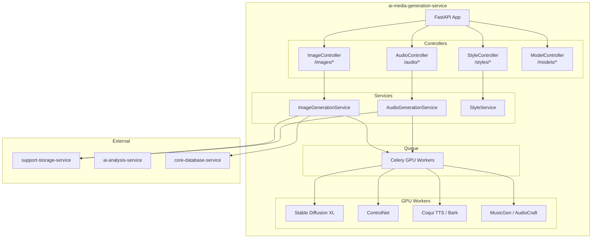
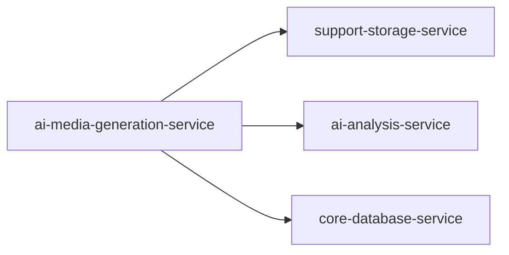
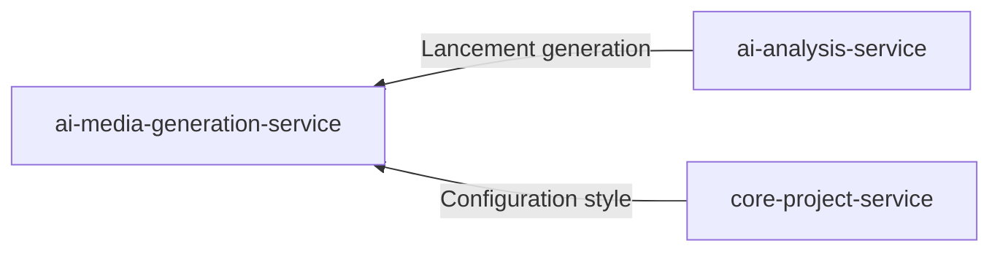
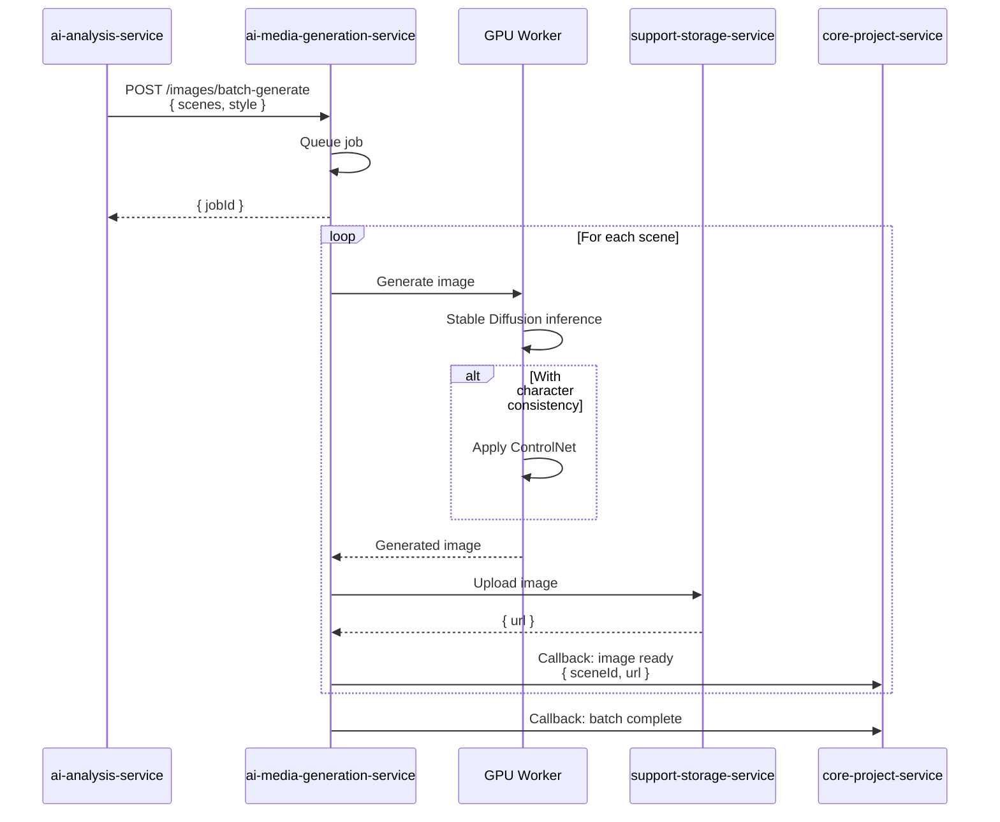
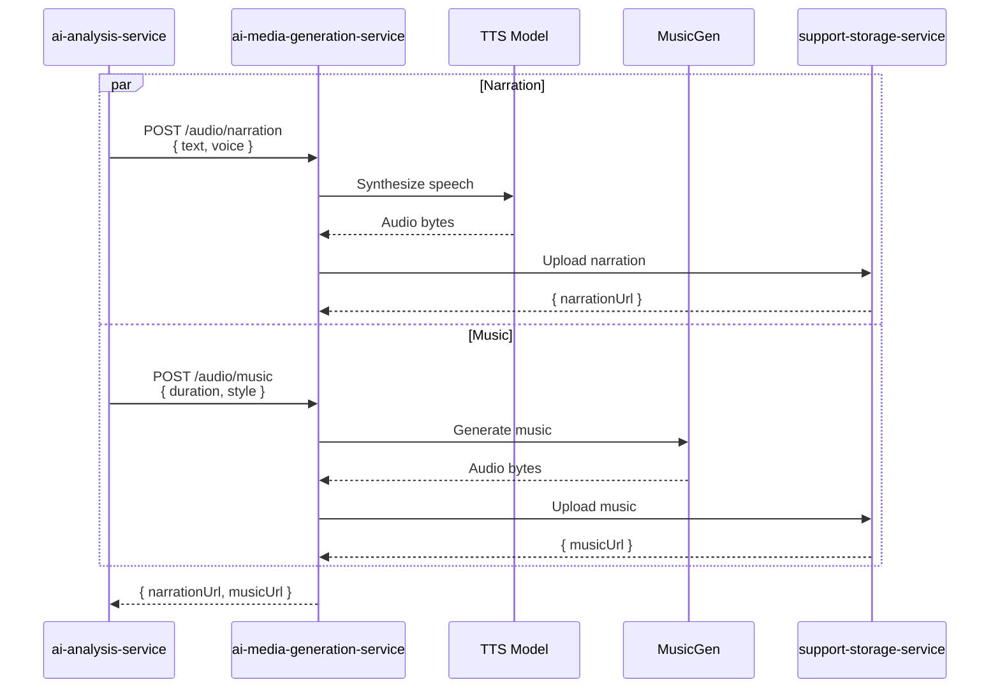

# ai-media-generation-service

## Informations generales

| Propriete | Valeur |
|-----------|--------|
| **Repository** | ai-media-generation-service |
| **Port** | 8084 |
| **Stack** | Python / FastAPI / GPU |
| **Phase** | 7 - Pipeline IA Complet |
| **Priorite** | Post-MVP (generation avancee) |

## Flows/Journeys concernes

| Flow | Role | Responsabilite |
|------|------|----------------|
| **Flow 5: Generation** | Owner partiel | Phase 2: Images (20-60%) |
| **Flow 5: Generation** | Owner partiel | Phase 3: Audio (60-80%) |

## Architecture interne



## Controllers et Endpoints

### ImageController (`/api/v1/images`)

| Methode | Endpoint | Description | Auth |
|---------|----------|-------------|------|
| POST | `/generate` | Generer une image | Service-only |
| POST | `/batch-generate` | Generer plusieurs images | Service-only |
| GET | `/status/:jobId` | Status generation | Service-only |
| POST | `/cancel/:jobId` | Annuler generation | Service-only |

```python
# POST /api/v1/images/generate
class ImageGenerationRequest(BaseModel):
    prompt: str
    negativePrompt: Optional[str] = None
    style: str = "default"
    width: int = 1024
    height: int = 1024
    steps: int = 30
    guidance: float = 7.5
    seed: Optional[int] = None

class ImageGenerationResponse(BaseModel):
    jobId: str
    status: Literal["queued", "processing", "completed", "failed"]

# POST /api/v1/images/batch-generate
class BatchGenerationRequest(BaseModel):
    scenes: List[SceneImageRequest]
    style: StyleConfig
    consistencyMode: bool = True  # Garder coherence visuelle

class SceneImageRequest(BaseModel):
    sceneId: str
    prompt: str
    characters: List[CharacterReference]

class BatchGenerationResponse(BaseModel):
    jobId: str
    totalImages: int
    status: str
```

### AudioController (`/api/v1/audio`)

| Methode | Endpoint | Description | Auth |
|---------|----------|-------------|------|
| POST | `/narration` | Generer narration | Service-only |
| POST | `/music` | Generer musique | Service-only |
| GET | `/voices` | Liste des voix | Oui |
| GET | `/status/:jobId` | Status generation | Service-only |

```python
# POST /api/v1/audio/narration
class NarrationRequest(BaseModel):
    text: str
    voice: str  # "fr-FR-Denise", "fr-FR-Henri", etc.
    speed: float = 1.0
    pitch: float = 1.0
    emotion: Optional[str] = None

class NarrationResponse(BaseModel):
    jobId: str
    estimatedDuration: float  # seconds

# POST /api/v1/audio/music
class MusicRequest(BaseModel):
    duration: float  # seconds
    style: str  # "ambient", "dramatic", "happy", etc.
    tempo: Optional[int] = None
    intensity: float = 0.5

class MusicResponse(BaseModel):
    jobId: str
    status: str
```

### StyleController (`/api/v1/styles`)

| Methode | Endpoint | Description | Auth |
|---------|----------|-------------|------|
| GET | `/` | Liste des styles | Oui |
| GET | `/:styleId` | Detail d'un style | Oui |
| GET | `/:styleId/preview` | Preview d'un style | Oui |

```python
# GET /api/v1/styles
class StyleInfo(BaseModel):
    id: str
    name: str
    description: str
    previewUrl: str
    category: str  # "cartoon", "realistic", "artistic"
    isPremium: bool

# Styles disponibles
styles = [
    {"id": "cartoon", "name": "Cartoon", "category": "cartoon"},
    {"id": "realistic", "name": "Realiste", "category": "realistic"},
    {"id": "watercolor", "name": "Aquarelle", "category": "artistic"},
    {"id": "anime", "name": "Anime", "category": "cartoon"},
    {"id": "oil-painting", "name": "Peinture a l'huile", "category": "artistic"},
    {"id": "pixel-art", "name": "Pixel Art", "category": "artistic"},
]
```

## Methodes et Fonctions

### ImageGenerationService

```python
class ImageGenerationService:
    def __init__(
        self,
        sd_model: StableDiffusionPipeline,
        controlnet: ControlNetModel,
        storage: StorageClient
    ):
        self.sd = sd_model
        self.controlnet = controlnet
        self.storage = storage

    async def generate_scene_images(
        self,
        scenes: List[SceneImageRequest],
        style: StyleConfig,
        consistency_mode: bool = True
    ) -> List[GeneratedImage]:
        """Generer les images pour toutes les scenes"""

        results = []
        character_embeddings = {}  # Pour coherence des personnages

        for scene in scenes:
            # Construire le prompt avec style
            full_prompt = self._build_prompt(scene.prompt, style)

            # Generer avec coherence
            if consistency_mode and scene.characters:
                image = await self._generate_with_consistency(
                    full_prompt,
                    scene.characters,
                    character_embeddings
                )
            else:
                image = await self._generate_image(full_prompt)

            # Upload vers storage
            url = await self.storage.upload(
                f"generated/{scene.sceneId}.png",
                image
            )

            results.append(GeneratedImage(
                sceneId=scene.sceneId,
                url=url,
                prompt=full_prompt
            ))

        return results

    async def _generate_image(self, prompt: str) -> bytes:
        """Generation simple avec Stable Diffusion"""
        image = self.sd(
            prompt=prompt,
            negative_prompt="blurry, bad quality, distorted",
            num_inference_steps=30,
            guidance_scale=7.5
        ).images[0]

        buffer = io.BytesIO()
        image.save(buffer, format='PNG')
        return buffer.getvalue()

    async def _generate_with_consistency(
        self,
        prompt: str,
        characters: List[CharacterReference],
        embeddings: dict
    ) -> bytes:
        """Generation avec coherence des personnages via ControlNet"""
        # Implementation avec IP-Adapter ou textual inversion
        pass
```

### AudioGenerationService

```python
class AudioGenerationService:
    def __init__(
        self,
        tts_model: CoquiTTS,
        music_model: MusicGen,
        storage: StorageClient
    ):
        self.tts = tts_model
        self.music = music_model
        self.storage = storage

    async def generate_narration(
        self,
        text: str,
        voice: str,
        speed: float = 1.0
    ) -> str:
        """Generer la narration audio"""
        audio = self.tts.synthesize(
            text=text,
            speaker=voice,
            speed=speed
        )

        url = await self.storage.upload(
            f"audio/narration_{uuid4()}.mp3",
            audio
        )
        return url

    async def generate_music(
        self,
        duration: float,
        style: str,
        intensity: float = 0.5
    ) -> str:
        """Generer la musique de fond"""
        prompt = self._build_music_prompt(style, intensity)

        audio = self.music.generate(
            prompt=prompt,
            duration=duration
        )

        url = await self.storage.upload(
            f"audio/music_{uuid4()}.mp3",
            audio
        )
        return url

    def _build_music_prompt(self, style: str, intensity: float) -> str:
        prompts = {
            "ambient": "calm ambient music, soft pads, peaceful",
            "dramatic": "epic orchestral music, dramatic tension",
            "happy": "upbeat happy music, cheerful melody",
            "sad": "melancholic piano, emotional strings",
        }
        return prompts.get(style, prompts["ambient"])
```

## Communications Inter-services

### Appels sortants



| Service cible | Endpoint | Objectif |
|---------------|----------|----------|
| support-storage-service | `/api/v1/storage/upload` | Stockage images/audio |
| ai-analysis-service | `/api/v1/analysis/*` | Recuperation scenes/personnages |
| core-database-service | `/api/v1/query` | Stockage metadata |

### Appels entrants



## Diagrammes de sequence

### Sequence: Generation images batch



### Sequence: Generation audio



## Configuration GPU

```python
# src/config/gpu_config.py
GPU_CONFIG = {
    "device": "cuda",
    "memory_fraction": 0.85,

    "stable_diffusion": {
        "model": "stabilityai/stable-diffusion-xl-base-1.0",
        "scheduler": "DPMSolverMultistepScheduler",
        "dtype": "float16",
        "enable_attention_slicing": True,
        "enable_vae_tiling": True,
    },

    "controlnet": {
        "model": "lllyasviel/sd-controlnet-canny",
        "conditioning_scale": 0.5,
    },

    "tts": {
        "model": "tts_models/fr/css10/vits",
        "vocoder": "vocoder_models/universal/libri-tts/wavegrad",
    },

    "musicgen": {
        "model": "facebook/musicgen-medium",
        "max_duration": 30,  # seconds
    }
}
```

## Mocks pour tests

### Mock Stable Diffusion

```python
class MockStableDiffusion:
    def __call__(self, prompt: str, **kwargs) -> MockOutput:
        # Retourner une image de test
        image = Image.new('RGB', (1024, 1024), color='blue')
        return MockOutput(images=[image])

class MockOutput:
    def __init__(self, images):
        self.images = images
```

### Mock TTS

```python
class MockTTS:
    def synthesize(self, text: str, speaker: str, speed: float) -> bytes:
        # Retourner un audio vide de la bonne duree
        duration = len(text.split()) * 0.5  # ~0.5s par mot
        return generate_silence(duration)
```

## Metriques de succes

| Metrique | Objectif | Description |
|----------|----------|-------------|
| Image generation | < 10s/image | Temps par image |
| Audio generation | < 5s/30s audio | Temps par 30s audio |
| GPU utilization | 70-90% | Utilisation GPU |
| Quality score | > 4/5 | Note qualite utilisateur |
| Consistency | > 90% | Coherence personnages |
