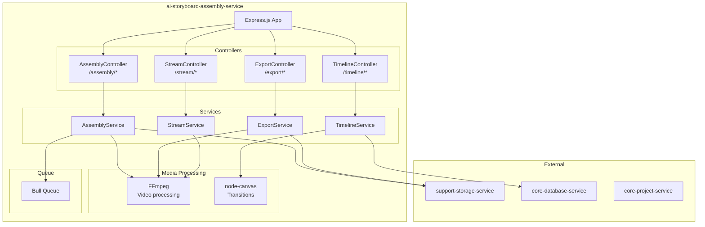
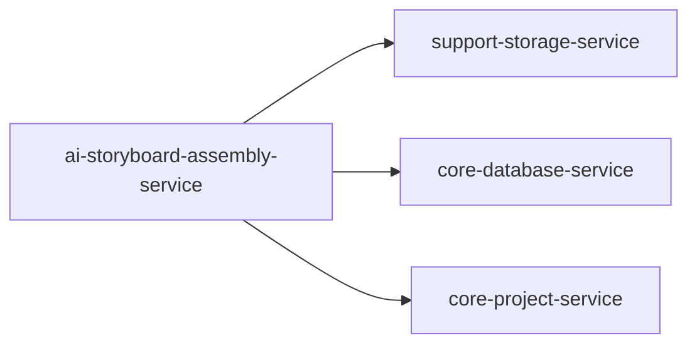
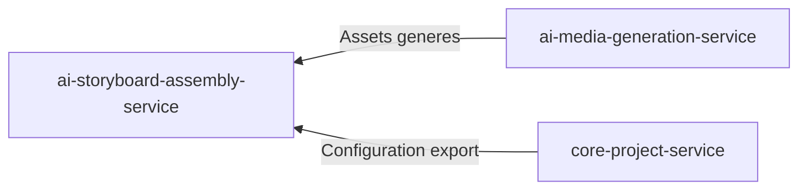
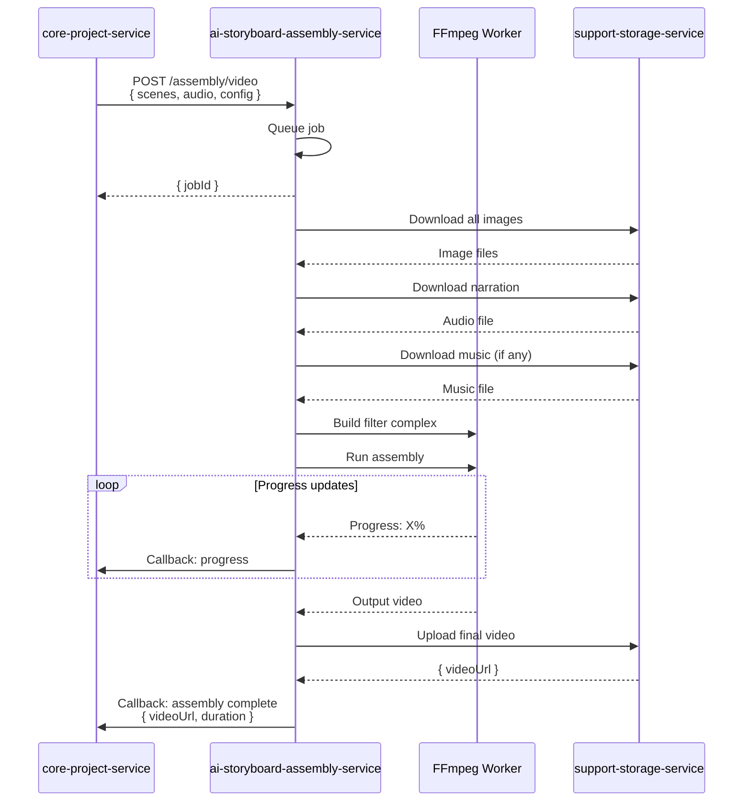
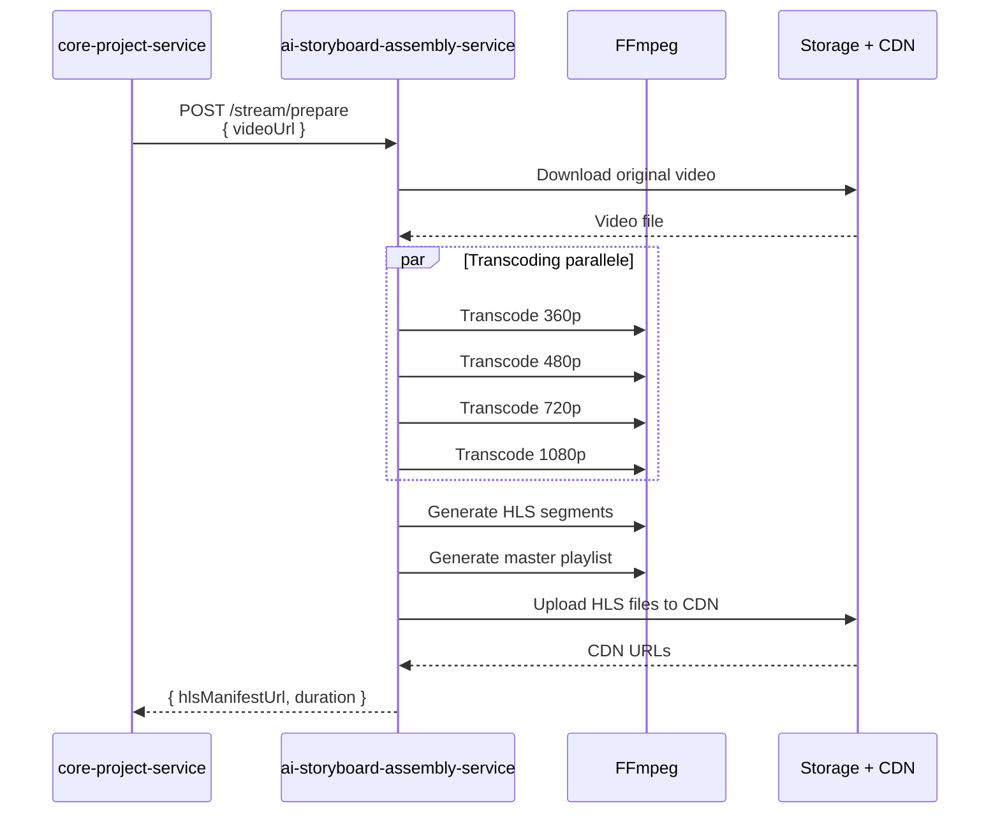

# ai-storyboard-assembly-service

## Informations generales

| Propriete | Valeur |
|-----------|--------|
| **Repository** | ai-storyboard-assembly-service |
| **Port** | 8085 |
| **Stack** | Node.js |
| **Phase** | 7 - Pipeline IA Complet |
| **Priorite** | Post-MVP (assemblage final) |

## Flows/Journeys concernes

| Flow | Role | Responsabilite |
|------|------|----------------|
| **Flow 5: Generation** | Owner partiel | Phase 4: Assemblage video (80-100%) |
| **Flow 6: Player** | Support | Preparation streaming |

## Architecture interne



## Controllers et Endpoints

### AssemblyController (`/api/v1/assembly`)

| Methode | Endpoint | Description | Auth |
|---------|----------|-------------|------|
| POST | `/video` | Assembler video complete | Service-only |
| GET | `/status/:jobId` | Status assemblage | Service-only |
| POST | `/preview` | Generer preview rapide | Service-only |

```typescript
// POST /api/v1/assembly/video
interface AssemblyRequest {
  projectId: string;
  scenes: SceneAsset[];
  audio: AudioAssets;
  config: AssemblyConfig;
}

interface SceneAsset {
  sceneId: string;
  imageUrl: string;
  duration: number;  // seconds
  transition?: TransitionConfig;
}

interface AudioAssets {
  narrationUrl: string;
  musicUrl?: string;
  musicVolume?: number;  // 0-1
}

interface AssemblyConfig {
  resolution: '720p' | '1080p' | '4k';
  fps: 24 | 30 | 60;
  format: 'mp4' | 'webm';
  watermark?: WatermarkConfig;
}

interface AssemblyResponse {
  jobId: string;
  estimatedDuration: number;
  status: 'queued' | 'processing' | 'completed' | 'failed';
}
```

### TimelineController (`/api/v1/timeline`)

| Methode | Endpoint | Description | Auth |
|---------|----------|-------------|------|
| POST | `/create` | Creer timeline | Service-only |
| PUT | `/:timelineId` | Modifier timeline | Service-only |
| GET | `/:timelineId` | Recuperer timeline | Service-only |
| POST | `/:timelineId/transitions` | Ajouter transitions | Service-only |

```typescript
// POST /api/v1/timeline/create
interface CreateTimelineRequest {
  projectId: string;
  scenes: TimelineScene[];
}

interface TimelineScene {
  sceneId: string;
  startTime: number;
  endTime: number;
  imageUrl: string;
  effects?: Effect[];
}

interface Effect {
  type: 'zoom' | 'pan' | 'fade' | 'kenburns';
  params: Record<string, number>;
}

// Transitions disponibles
type TransitionType =
  | 'fade'
  | 'dissolve'
  | 'wipe'
  | 'slide'
  | 'zoom';

interface TransitionConfig {
  type: TransitionType;
  duration: number;  // seconds
  params?: Record<string, any>;
}
```

### ExportController (`/api/v1/export`)

| Methode | Endpoint | Description | Auth |
|---------|----------|-------------|------|
| POST | `/video` | Exporter video finale | Service-only |
| POST | `/frames` | Exporter frames individuels | Service-only |
| GET | `/formats` | Formats disponibles | Oui |

```typescript
// POST /api/v1/export/video
interface ExportVideoRequest {
  timelineId: string;
  format: ExportFormat;
  quality: 'draft' | 'standard' | 'high';
}

interface ExportFormat {
  container: 'mp4' | 'webm' | 'mov';
  videoCodec: 'h264' | 'h265' | 'vp9';
  audioCodec: 'aac' | 'opus';
  resolution: Resolution;
  bitrate?: number;
}

interface Resolution {
  width: number;
  height: number;
}

// Presets
const RESOLUTION_PRESETS = {
  '720p': { width: 1280, height: 720 },
  '1080p': { width: 1920, height: 1080 },
  '4k': { width: 3840, height: 2160 },
};
```

### StreamController (`/api/v1/stream`)

| Methode | Endpoint | Description | Auth |
|---------|----------|-------------|------|
| POST | `/prepare` | Preparer pour streaming | Service-only |
| GET | `/:videoId/manifest` | Manifest HLS/DASH | Service-only |

```typescript
// POST /api/v1/stream/prepare
interface PrepareStreamRequest {
  videoUrl: string;
  projectId: string;
}

interface PrepareStreamResponse {
  hlsManifestUrl: string;
  dashManifestUrl: string;
  thumbnailUrl: string;
  duration: number;
}
```

## Methodes et Fonctions

### AssemblyService

```typescript
class AssemblyService {
  constructor(
    private ffmpeg: FFmpegWrapper,
    private storage: StorageClient,
    private queue: Queue
  ) {}

  async assembleVideo(request: AssemblyRequest): Promise<string> {
    const { scenes, audio, config } = request;

    // 1. Telecharger tous les assets
    const localPaths = await this.downloadAssets(scenes, audio);

    // 2. Creer la timeline FFmpeg
    const filterComplex = this.buildFilterComplex(scenes, config);

    // 3. Executer FFmpeg
    const outputPath = await this.runFFmpeg(localPaths, filterComplex, config);

    // 4. Uploader la video finale
    const videoUrl = await this.storage.upload(
      `videos/${request.projectId}/final.${config.format}`,
      outputPath
    );

    // 5. Nettoyer les fichiers temporaires
    await this.cleanup(localPaths);

    return videoUrl;
  }

  private buildFilterComplex(scenes: SceneAsset[], config: AssemblyConfig): string {
    const filters: string[] = [];

    scenes.forEach((scene, index) => {
      // Effet Ken Burns (zoom lent)
      filters.push(
        `[${index}:v]scale=8000:-1,` +
        `zoompan=z='min(zoom+0.0015,1.5)':x='iw/2-(iw/zoom/2)':y='ih/2-(ih/zoom/2)':` +
        `d=${scene.duration * config.fps}:s=${config.resolution}[v${index}]`
      );

      // Transition avec la scene suivante
      if (scene.transition && index < scenes.length - 1) {
        filters.push(
          this.buildTransition(index, index + 1, scene.transition)
        );
      }
    });

    return filters.join(';');
  }

  private buildTransition(from: number, to: number, transition: TransitionConfig): string {
    switch (transition.type) {
      case 'fade':
        return `[v${from}][v${to}]xfade=transition=fade:duration=${transition.duration}[vt${from}]`;
      case 'dissolve':
        return `[v${from}][v${to}]xfade=transition=dissolve:duration=${transition.duration}[vt${from}]`;
      case 'wipe':
        return `[v${from}][v${to}]xfade=transition=wipeleft:duration=${transition.duration}[vt${from}]`;
      default:
        return `[v${from}][v${to}]xfade=transition=fade:duration=${transition.duration}[vt${from}]`;
    }
  }

  private async runFFmpeg(
    assets: LocalAssets,
    filterComplex: string,
    config: AssemblyConfig
  ): Promise<string> {
    const outputPath = `/tmp/output_${Date.now()}.${config.format}`;

    const command = ffmpeg()
      // Ajouter les images
      .input(assets.imagesPattern)
      .inputOptions(['-framerate', '1'])

      // Ajouter la narration
      .input(assets.narrationPath)

      // Ajouter la musique (optionnel)
      .input(assets.musicPath)

      // Appliquer les filtres
      .complexFilter(filterComplex)

      // Configuration sortie
      .videoCodec('libx264')
      .audioCodec('aac')
      .outputOptions([
        '-pix_fmt', 'yuv420p',
        '-movflags', '+faststart',
      ])
      .output(outputPath);

    await new Promise((resolve, reject) => {
      command
        .on('end', resolve)
        .on('error', reject)
        .run();
    });

    return outputPath;
  }
}
```

### StreamService

```typescript
class StreamService {
  async prepareForStreaming(videoUrl: string): Promise<StreamingInfo> {
    // 1. Telecharger la video
    const localPath = await this.storage.download(videoUrl);

    // 2. Transcoder en plusieurs resolutions
    const variants = await this.transcodeVariants(localPath);

    // 3. Segmenter pour HLS
    const hlsPath = await this.generateHLS(variants);

    // 4. Generer manifest DASH
    const dashPath = await this.generateDASH(variants);

    // 5. Generer thumbnail
    const thumbnailUrl = await this.generateThumbnail(localPath);

    // 6. Uploader vers CDN
    const [hlsUrl, dashUrl] = await Promise.all([
      this.storage.uploadDirectory(hlsPath),
      this.storage.uploadDirectory(dashPath),
    ]);

    return {
      hlsManifestUrl: `${hlsUrl}/master.m3u8`,
      dashManifestUrl: `${dashUrl}/manifest.mpd`,
      thumbnailUrl,
      duration: await this.getVideoDuration(localPath),
    };
  }

  private async transcodeVariants(inputPath: string): Promise<VideoVariant[]> {
    const variants = [
      { resolution: '360p', bitrate: '800k' },
      { resolution: '480p', bitrate: '1400k' },
      { resolution: '720p', bitrate: '2800k' },
      { resolution: '1080p', bitrate: '5000k' },
    ];

    return Promise.all(
      variants.map(v => this.transcodeToResolution(inputPath, v))
    );
  }

  private async generateHLS(variants: VideoVariant[]): Promise<string> {
    const outputDir = `/tmp/hls_${Date.now()}`;
    await fs.mkdir(outputDir, { recursive: true });

    // Generer les segments pour chaque variant
    for (const variant of variants) {
      await this.segmentVideo(variant.path, outputDir, variant.resolution);
    }

    // Generer le master playlist
    const masterPlaylist = this.generateMasterPlaylist(variants);
    await fs.writeFile(`${outputDir}/master.m3u8`, masterPlaylist);

    return outputDir;
  }

  private generateMasterPlaylist(variants: VideoVariant[]): string {
    let playlist = '#EXTM3U\n#EXT-X-VERSION:3\n';

    variants.forEach(v => {
      const bandwidth = parseInt(v.bitrate) * 1000;
      playlist += `#EXT-X-STREAM-INF:BANDWIDTH=${bandwidth},RESOLUTION=${v.width}x${v.height}\n`;
      playlist += `${v.resolution}/playlist.m3u8\n`;
    });

    return playlist;
  }
}
```

## Communications Inter-services

### Appels sortants



| Service cible | Endpoint | Objectif |
|---------------|----------|----------|
| support-storage-service | `/api/v1/storage/*` | Upload video finale, recuperation assets |
| core-database-service | `/api/v1/query` | Metadata video |
| core-project-service | `/api/v1/projects/:id` | Callback completion |

### Appels entrants



## Diagrammes de sequence

### Sequence: Assemblage video complet



### Sequence: Preparation streaming HLS



## Mocks pour tests

### Mock FFmpeg

```typescript
// tests/mocks/ffmpeg.mock.ts
export const mockFFmpeg = {
  input: jest.fn().mockReturnThis(),
  inputOptions: jest.fn().mockReturnThis(),
  complexFilter: jest.fn().mockReturnThis(),
  videoCodec: jest.fn().mockReturnThis(),
  audioCodec: jest.fn().mockReturnThis(),
  outputOptions: jest.fn().mockReturnThis(),
  output: jest.fn().mockReturnThis(),
  on: jest.fn().mockImplementation(function(event, callback) {
    if (event === 'end') {
      setTimeout(callback, 100);
    }
    return this;
  }),
  run: jest.fn(),
};

jest.mock('fluent-ffmpeg', () => jest.fn(() => mockFFmpeg));
```

### Mock Storage

```typescript
export const mockStorage = {
  download: jest.fn().mockResolvedValue('/tmp/test-video.mp4'),
  upload: jest.fn().mockResolvedValue('https://cdn.visiobook.com/video.mp4'),
  uploadDirectory: jest.fn().mockResolvedValue('https://cdn.visiobook.com/hls/'),
};
```

## Configuration FFmpeg

```typescript
// src/config/ffmpeg.config.ts
export const FFMPEG_CONFIG = {
  // Chemins binaires
  ffmpegPath: process.env.FFMPEG_PATH || '/usr/bin/ffmpeg',
  ffprobePath: process.env.FFPROBE_PATH || '/usr/bin/ffprobe',

  // Presets d'encodage
  presets: {
    draft: {
      crf: 28,
      preset: 'ultrafast',
    },
    standard: {
      crf: 23,
      preset: 'medium',
    },
    high: {
      crf: 18,
      preset: 'slow',
    },
  },

  // Resolutions
  resolutions: {
    '360p': { width: 640, height: 360, bitrate: '800k' },
    '480p': { width: 854, height: 480, bitrate: '1400k' },
    '720p': { width: 1280, height: 720, bitrate: '2800k' },
    '1080p': { width: 1920, height: 1080, bitrate: '5000k' },
    '4k': { width: 3840, height: 2160, bitrate: '15000k' },
  },

  // HLS config
  hls: {
    segmentDuration: 6,  // seconds
    playlistType: 'vod',
  },
};
```

## Metriques de succes

| Metrique | Objectif | Description |
|----------|----------|-------------|
| Assembly time | < 2min pour 3min video | Temps d'assemblage |
| Video quality | > 4/5 | Note qualite utilisateur |
| Streaming start | < 3s | Temps avant lecture |
| Transcoding | < 1x realtime | Vitesse transcodage |
| Error rate | < 1% | Taux d'echec assemblage |
