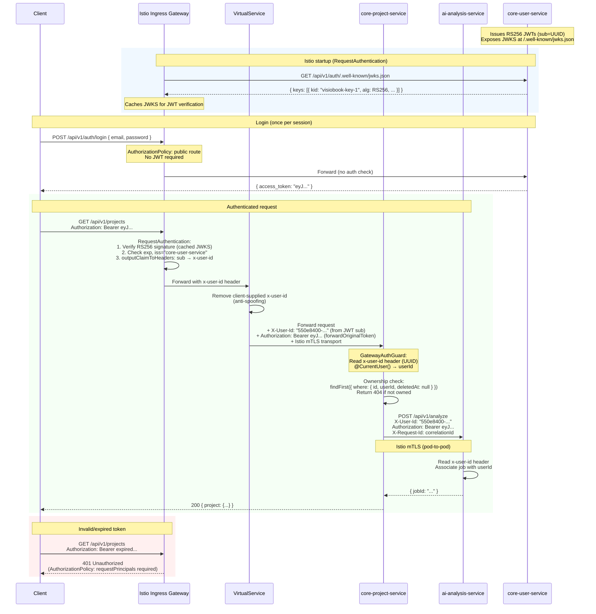
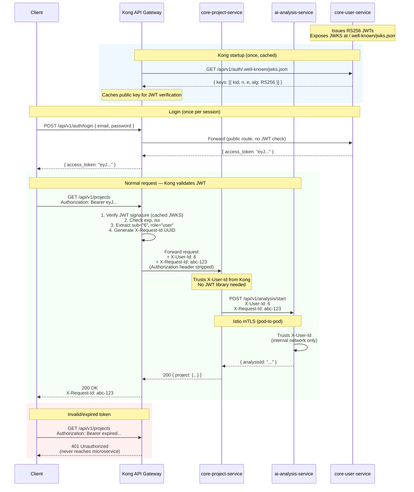
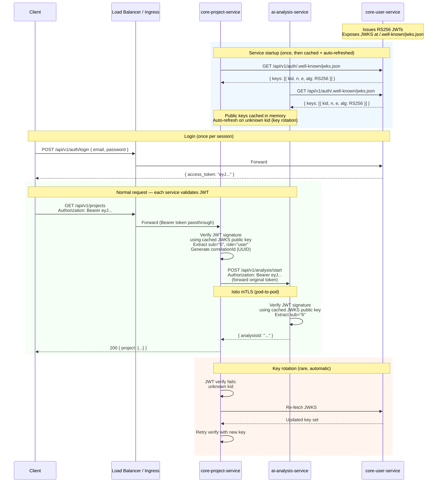

# Auth Flow Architecture — VisioBook Microservices

## Current State (Istio Gateway)

- **Istio ingress gateway** validates JWT and injects `X-User-Id` header (replacing Kong)
- core-user-service (FastAPI) issues RS256 JWTs (UUID `sub`) and exposes JWKS at `/api/v1/auth/.well-known/jwks.json`
- `RequestAuthentication` validates JWT signature against JWKS, extracts `sub` → `x-user-id` header
- VirtualServices strip client-supplied `x-user-id` to prevent header spoofing
- `AuthorizationPolicy` enforces `requestPrincipals: ["*"]` on protected routes
- Istio mTLS (`ISTIO_MUTUAL`) secures all pod-to-pod traffic

---

## Actual Flow — Istio Gateway (Current Implementation)

Istio validates JWT at the ingress, injects `x-user-id` from the `sub` claim, and forwards both the header and the original Bearer token to services.

### Istio Resources Required

| Resource | Purpose |
|----------|---------|
| **RequestAuthentication** | Validate RS256 JWT using JWKS from core-user-service. `outputClaimToHeaders: sub → x-user-id`. `forwardOriginalToken: true` |
| **AuthorizationPolicy (deny-all)** | Default deny on ingress gateway |
| **AuthorizationPolicy (public)** | Allow `/api/v1/auth/login`, `/api/v1/auth/register`, `/.well-known/*`, `/health/*` without JWT |
| **AuthorizationPolicy (per-service)** | Require `requestPrincipals: ["*"]` for protected routes |
| **VirtualService (per-service)** | Route to backend + strip client-supplied `x-user-id` header |
| **DestinationRule** | `ISTIO_MUTUAL` mTLS + connection pooling + outlier detection |
| **PeerAuthentication** | Enforce mTLS between pods |

### Security Layers

1. **Gateway-level** — Istio `RequestAuthentication` validates JWT signature, expiry, issuer
2. **Ingress-level** — `AuthorizationPolicy` enforces path-based access + requires valid principal
3. **Anti-spoofing** — VirtualService removes client-supplied `x-user-id`; only Istio-injected header reaches services
4. **Transport** — `ISTIO_MUTUAL` mTLS between all pods (only pods with valid certs can communicate)
5. **Service-level** — Application ownership enforcement (`userId == resource.userId`, return 404 not 403)

### What Each Service Needs

- Read `x-user-id` header for user identity (no JWT library needed)
- Auth guard/middleware rejecting requests without `x-user-id` on protected routes
- Ownership enforcement: verify userId owns the resource before access
- Forward both `X-User-Id` AND `Authorization: Bearer` on outbound S2S HTTP calls
- Self-generate `X-Request-Id` (UUID) for request correlation

---

## Reference: Kong Gateway Flow (Not Deployed)

Kong validates JWT centrally, injects identity headers, and forwards to services. Services never touch JWT validation.

### Kong Plugins Required

| Plugin | Purpose |
|--------|---------|
| **jwt** | Validate RS256 signature using JWKS from core-user-service |
| **request-transformer** | Add `X-User-Id` (from JWT `sub`), generate `X-Request-Id` (UUID) |
| **cors** | Handle CORS headers, expose `X-Request-Id` |
| **rate-limiting** | Per-user rate limits (keyed by `sub` claim) |

### Pros
- Services are simple — no JWT libraries, just read headers
- Auth logic centralized in one place
- Invalid tokens rejected before reaching any service

### Cons
- Full trust of internal network required (anyone on the network can forge `X-User-Id`)
- Istio mTLS mitigates this (only pods with valid certs can communicate)

---

## Current Reality Flow — No Kong, Services Validate JWT

Without Kong, each service must validate JWT itself using the JWKS endpoint. The Bearer token is forwarded on inter-service calls.

### What Each Service Needs (without Kong)
- `jose` library (or equivalent) for JWT verification
- JWKS URL config pointing to core-user-service
- Auth guard that reads `Authorization: Bearer` header
- Forward the original Bearer token on inter-service HTTP calls
- Self-generate correlationId (no gateway to do it)

### Pros
- Defense in depth — each service independently verifies identity
- No single point of auth failure
- Works without Kong

### Cons
- JWT library needed in every service
- Token verification overhead on every request (minimal — RSA verify is ~0.1ms with cached key)
- Every service must know the JWKS URL

---

## Comparison

| Aspect | Istio (current) | Kong (not deployed) | No gateway |
|--------|-----------------|---------------------|------------|
| JWT validation | Istio ingress (centralized) | Kong (centralized) | Each service (distributed) |
| User identity | `X-User-Id` from Istio `outputClaimToHeaders` | `X-User-Id` from Kong `request-transformer` | Decoded from JWT `sub` claim |
| Anti-spoofing | VirtualService strips client `x-user-id` | Kong strips/overwrites | N/A (each service validates JWT) |
| Request tracing | Self-generated UUID per service | `X-Request-Id` from Kong | Self-generated UUID per service |
| Inter-service auth | Forward `X-User-Id` + Bearer token | Forward `X-User-Id` header | Forward `Authorization: Bearer` token |
| Transport security | `ISTIO_MUTUAL` mTLS (built-in) | Requires Istio mTLS alongside | Requires Istio mTLS alongside |
| Service complexity | Simple (read headers) | Simple (read headers) | Moderate (JWT + JWKS logic) |
| Failure mode | Istio ingress down = everything down | Kong down = everything down | User-service JWKS down = new services can't start |
