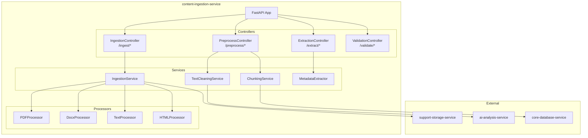
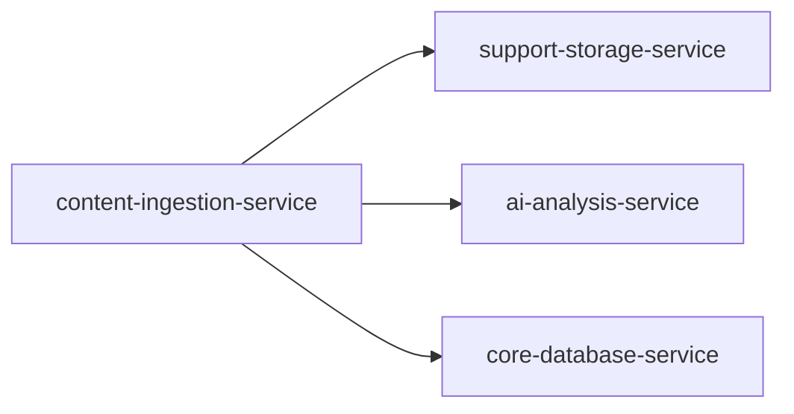
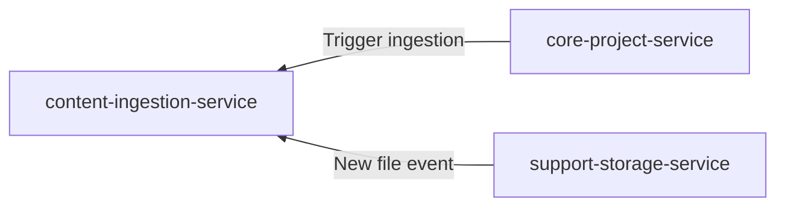
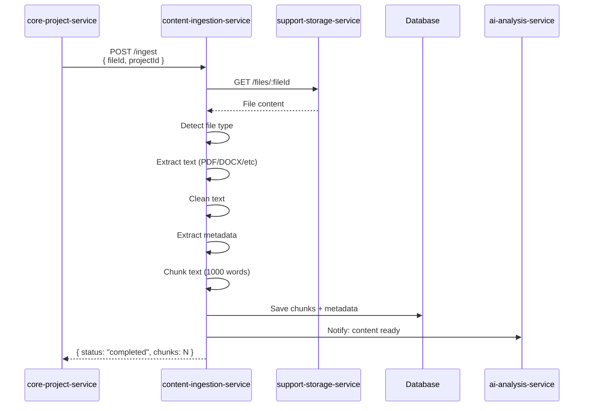

# content-ingestion-service

## Informations generales

| Propriete | Valeur |
|-----------|--------|
| **Repository** | content-ingestion-service |
| **Port** | 8082 |
| **Stack** | Python / FastAPI |
| **Phase** | 7 - Pipeline IA Complet |
| **Priorite** | Post-MVP (optimisation) |

## Flows/Journeys concernes

| Flow | Role | Responsabilite |
|------|------|----------------|
| Flow 2: Import fichier | Support | Pre-processing contenu |
| Flow 3: OCR Scanner | Support | Post-OCR processing |
| Pre-AI Analysis | Owner | Preparation donnees pour IA |

## Architecture interne



## Controllers et Endpoints

### IngestionController (`/api/v1/ingest`)

| Methode | Endpoint | Description | Auth |
|---------|----------|-------------|------|
| POST | `/` | Ingerer un fichier | Service-only |
| GET | `/status/:jobId` | Status ingestion | Service-only |
| POST | `/cancel/:jobId` | Annuler ingestion | Service-only |

```python
# POST /api/v1/ingest
class IngestionRequest(BaseModel):
    fileId: str
    projectId: str
    options: Optional[IngestionOptions] = None

class IngestionOptions(BaseModel):
    cleanText: bool = True
    extractMetadata: bool = True
    chunkSize: int = 1000  # words
    overlap: int = 100

class IngestionResponse(BaseModel):
    jobId: str
    status: Literal["queued", "processing", "completed", "failed"]
```

### PreprocessController (`/api/v1/preprocess`)

| Methode | Endpoint | Description | Auth |
|---------|----------|-------------|------|
| POST | `/text-clean` | Nettoyer texte | Service-only |
| POST | `/normalize` | Normaliser format | Service-only |
| POST | `/chunk` | Decouper en chunks | Service-only |

```python
# POST /api/v1/preprocess/text-clean
class TextCleanRequest(BaseModel):
    text: str
    options: CleanOptions

class CleanOptions(BaseModel):
    removeExtraSpaces: bool = True
    normalizeQuotes: bool = True
    fixEncoding: bool = True
    removeHeaders: bool = False
    removeFooters: bool = False

class TextCleanResponse(BaseModel):
    cleanedText: str
    changesApplied: List[str]
```

### ExtractionController (`/api/v1/extract`)

| Methode | Endpoint | Description | Auth |
|---------|----------|-------------|------|
| POST | `/text` | Extraire texte de fichier | Service-only |
| POST | `/metadata` | Extraire metadata | Service-only |

```python
# POST /api/v1/extract/metadata
class MetadataResponse(BaseModel):
    title: Optional[str]
    author: Optional[str]
    language: str
    wordCount: int
    pageCount: Optional[int]
    createdAt: Optional[datetime]
    customFields: dict
```

## Communications Inter-services

### Appels sortants



### Appels entrants



## Diagramme de sequence: Ingestion complete



## Mocks pour tests

### Mock PDF Processor

```python
class MockPDFProcessor:
    def extract_text(self, file_path: str) -> str:
        return "Texte extrait du PDF mock pour les tests."

    def extract_metadata(self, file_path: str) -> dict:
        return {
            "title": "Test Document",
            "author": "Test Author",
            "pages": 10
        }
```

## Metriques de succes

| Metrique | Objectif | Description |
|----------|----------|-------------|
| Processing time | < 5s/page | Temps par page |
| Extraction accuracy | > 98% | Qualite extraction texte |
| Format support | PDF, DOCX, TXT, HTML | Formats supportes |
