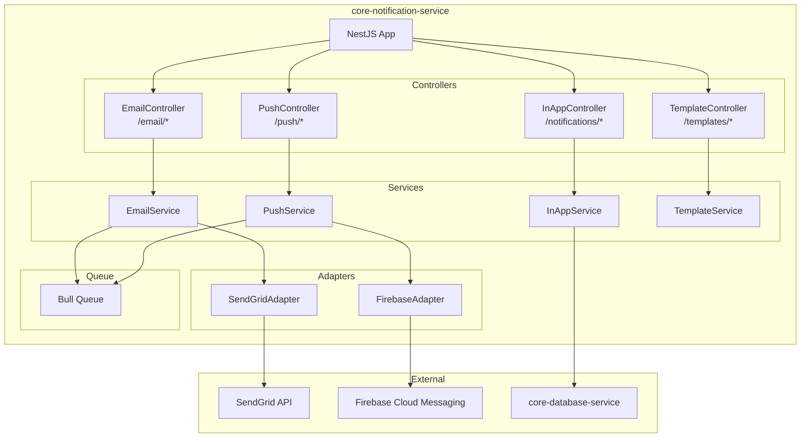
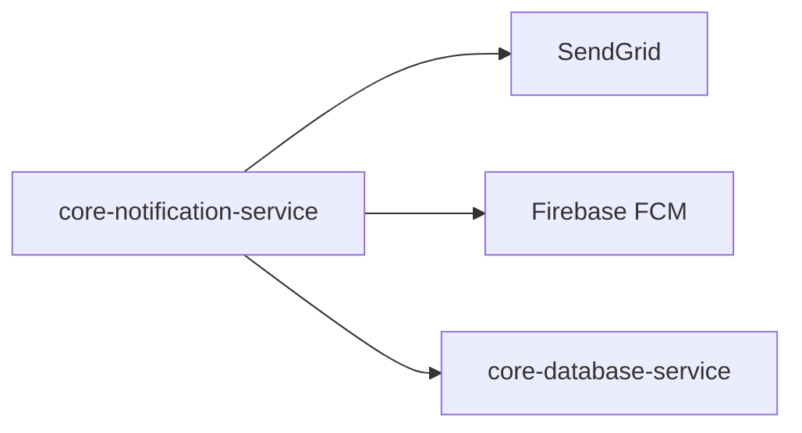
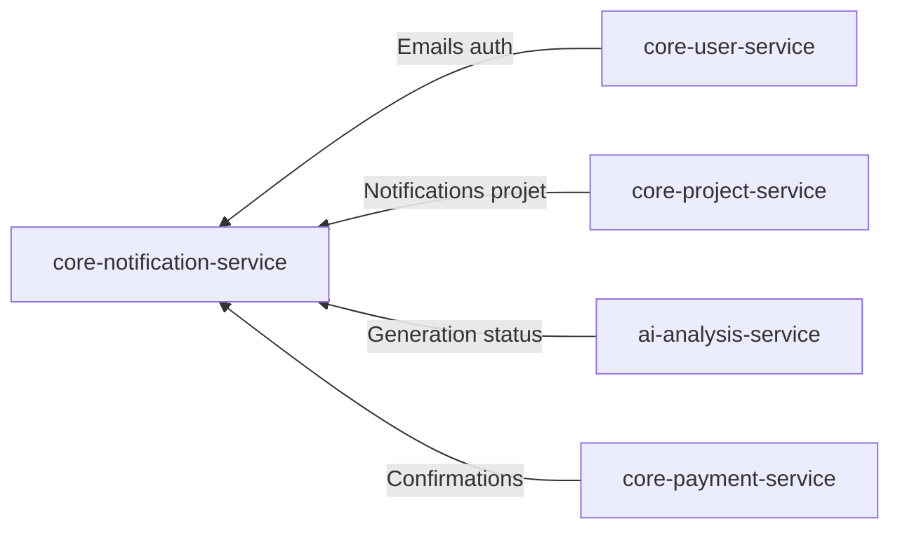
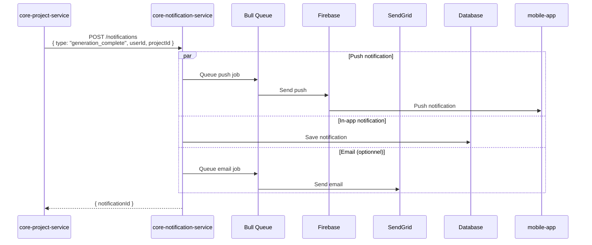

# core-notification-service

## Informations generales

| Propriete | Valeur |
|-----------|--------|
| **Repository** | core-notification-service |
| **Port** | 8088 |
| **Stack** | Node.js / NestJS |
| **Phase** | 6 - Services Complementaires |
| **Priorite** | Important (UX) |

## Flows/Journeys concernes

| Flow | Role | Types de notifications |
|------|------|------------------------|
| Flow 1: Auth | Support | Email verification, password reset |
| Flow 5: Generation | Support | Generation complete, echec |
| Flow Payment | Support | Confirmation paiement, factures |
| Tous flows | Support | Notifications in-app |

## Architecture interne



## Controllers et Endpoints

### EmailController (`/api/v1/email`)

| Methode | Endpoint | Description | Auth |
|---------|----------|-------------|------|
| POST | `/send` | Envoyer email | Service-only |
| POST | `/send-template` | Envoyer avec template | Service-only |
| GET | `/status/:messageId` | Status d'un email | Service-only |

```typescript
// POST /api/v1/email/send-template
interface SendTemplateRequest {
  to: string | string[];
  templateId: string;
  data: Record<string, any>;
  attachments?: Attachment[];
}

// Templates disponibles
type EmailTemplate =
  | 'email_verification'
  | 'password_reset'
  | 'welcome'
  | 'generation_complete'
  | 'generation_failed'
  | 'payment_confirmation'
  | 'subscription_cancelled';

interface SendEmailResponse {
  messageId: string;
  status: 'queued' | 'sent' | 'delivered' | 'failed';
}
```

### PushController (`/api/v1/push`)

| Methode | Endpoint | Description | Auth |
|---------|----------|-------------|------|
| POST | `/send` | Envoyer push notification | Service-only |
| POST | `/subscribe` | Enregistrer device token | Oui |
| DELETE | `/unsubscribe` | Supprimer device token | Oui |
| POST | `/topic/subscribe` | S'abonner a un topic | Oui |

```typescript
// POST /api/v1/push/send
interface SendPushRequest {
  userId: string;
  title: string;
  body: string;
  data?: Record<string, string>;
  imageUrl?: string;
}

// POST /api/v1/push/subscribe
interface SubscribeRequest {
  token: string;
  platform: 'ios' | 'android' | 'web';
  deviceId: string;
}
```

### InAppController (`/api/v1/notifications`)

| Methode | Endpoint | Description | Auth |
|---------|----------|-------------|------|
| GET | `/` | Liste notifications | Oui |
| POST | `/` | Creer notification | Service-only |
| PATCH | `/:id/read` | Marquer comme lu | Oui |
| PATCH | `/read-all` | Tout marquer comme lu | Oui |
| DELETE | `/:id` | Supprimer notification | Oui |

```typescript
// GET /api/v1/notifications
interface Notification {
  id: string;
  type: NotificationType;
  title: string;
  body: string;
  data?: Record<string, any>;
  read: boolean;
  createdAt: string;
}

type NotificationType =
  | 'generation_complete'
  | 'generation_failed'
  | 'share_received'
  | 'payment_confirmed'
  | 'system_announcement';
```

## Communications Inter-services

### Appels sortants



### Appels entrants



## Diagramme de sequence: Notification generation complete



## Mocks pour tests

### Mock SendGrid

```typescript
export const mockSendGrid = {
  send: jest.fn().mockResolvedValue([
    { statusCode: 202, body: '', headers: {} },
  ]),
};

jest.mock('@sendgrid/mail', () => ({
  setApiKey: jest.fn(),
  send: mockSendGrid.send,
}));
```

### Mock Firebase

```typescript
export const mockFirebaseAdmin = {
  messaging: () => ({
    send: jest.fn().mockResolvedValue('message-id-123'),
    sendMulticast: jest.fn().mockResolvedValue({
      successCount: 1,
      failureCount: 0,
    }),
  }),
};
```

## Metriques de succes

| Metrique | Objectif | Description |
|----------|----------|-------------|
| Delivery rate | > 99% | Taux de livraison |
| Push latency | < 5s | Temps de livraison push |
| Email open rate | > 30% | Taux d'ouverture emails |
| Unsubscribe rate | < 1% | Taux desabonnement |
