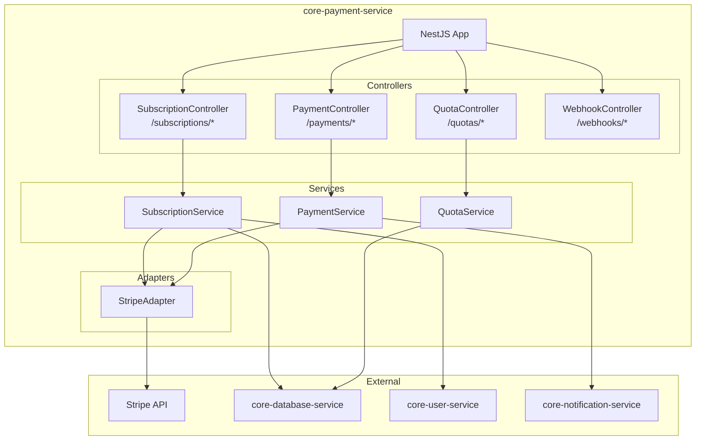
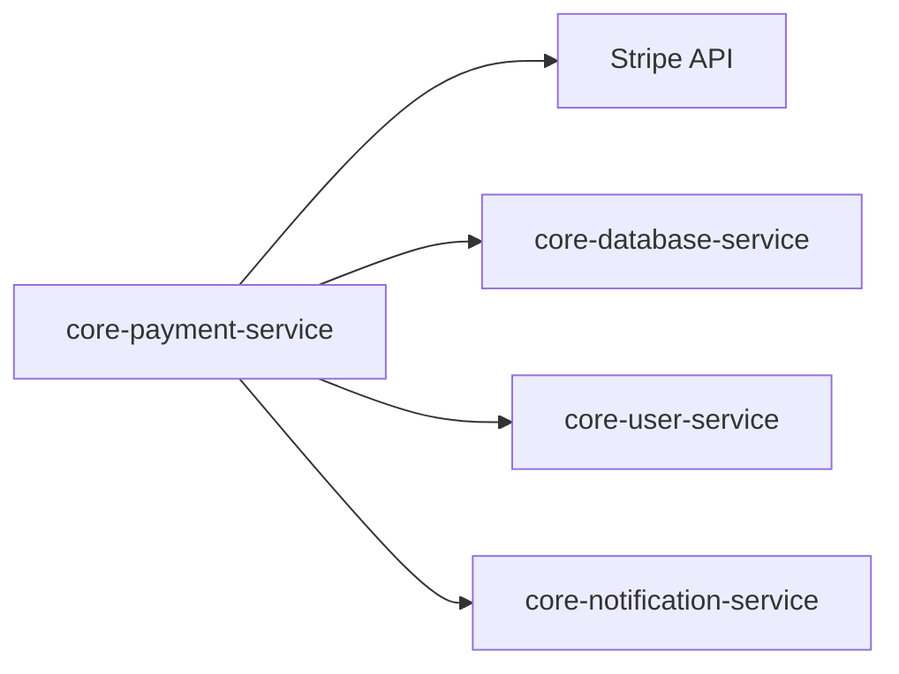
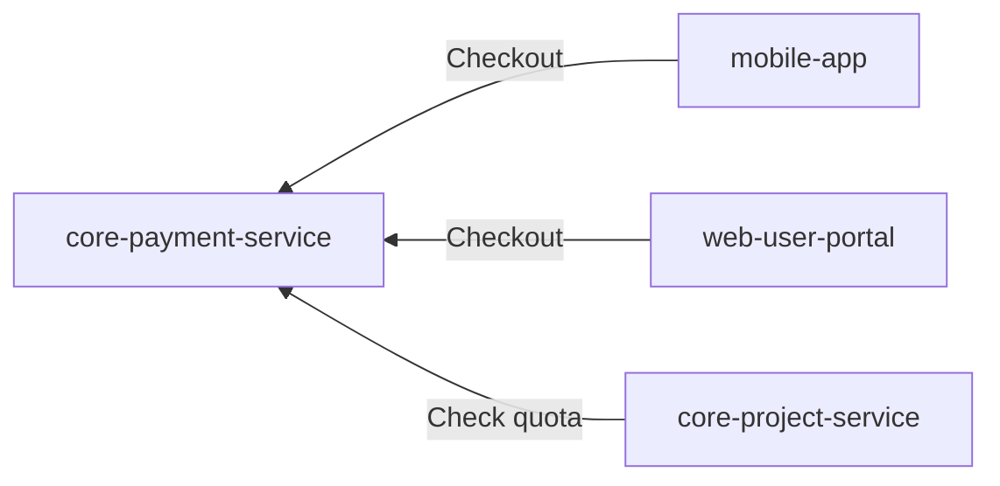
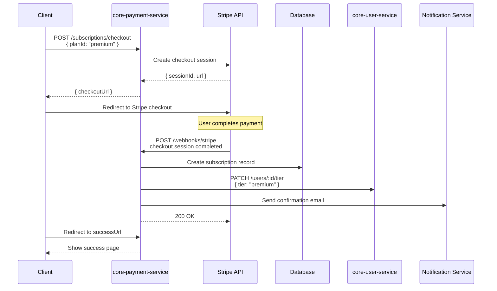

# core-payment-service

## Informations generales

| Propriete | Valeur |
|-----------|--------|
| **Repository** | core-payment-service |
| **Port** | 8087 |
| **Stack** | Node.js / NestJS |
| **Phase** | 6 - Services Complementaires |
| **Priorite** | Post-MVP (monetisation) |

## Flows/Journeys concernes

| Flow | Role | Responsabilite |
|------|------|----------------|
| Flow Premium | Owner | Gestion abonnements |
| Flow Quota | Owner | Verification/consommation credits |

## Architecture interne



## Controllers et Endpoints

### SubscriptionController (`/api/v1/subscriptions`)

| Methode | Endpoint | Description | Auth |
|---------|----------|-------------|------|
| GET | `/plans` | Liste des plans disponibles | Non |
| GET | `/current` | Abonnement actuel | Oui |
| POST | `/checkout` | Creer session checkout | Oui |
| POST | `/cancel` | Annuler abonnement | Oui |
| POST | `/upgrade` | Upgrade plan | Oui |
| POST | `/downgrade` | Downgrade plan | Oui |

```typescript
// GET /api/v1/subscriptions/plans
interface Plan {
  id: string;
  name: 'free' | 'premium' | 'enterprise';
  price: number;
  currency: string;
  interval: 'month' | 'year';
  features: PlanFeature[];
  limits: PlanLimits;
}

interface PlanLimits {
  generationsPerMonth: number;
  storageGB: number;
  maxProjectSize: number;
  exportQuality: '720p' | '1080p' | '4k';
  watermark: boolean;
}

// POST /api/v1/subscriptions/checkout
interface CheckoutRequest {
  planId: string;
  successUrl: string;
  cancelUrl: string;
}

interface CheckoutResponse {
  sessionId: string;
  checkoutUrl: string;
}
```

### QuotaController (`/api/v1/quotas`)

| Methode | Endpoint | Description | Auth |
|---------|----------|-------------|------|
| GET | `/` | Quotas utilisateur | Oui |
| POST | `/consume` | Consommer quota | Service-only |
| POST | `/reset` | Reset quotas (admin) | Admin |

```typescript
// GET /api/v1/quotas
interface UserQuota {
  userId: string;
  plan: string;
  generations: {
    used: number;
    limit: number;
    resetDate: string;
  };
  storage: {
    used: number;  // bytes
    limit: number;
  };
}

// POST /api/v1/quotas/consume (internal)
interface ConsumeQuotaRequest {
  userId: string;
  type: 'generation' | 'storage';
  amount: number;
}

interface ConsumeQuotaResponse {
  success: boolean;
  remaining: number;
  error?: string;
}
```

### WebhookController (`/api/v1/webhooks`)

| Methode | Endpoint | Description | Auth |
|---------|----------|-------------|------|
| POST | `/stripe` | Webhook Stripe | Stripe signature |

```typescript
// Stripe webhook events handled
type StripeWebhookEvent =
  | 'checkout.session.completed'
  | 'customer.subscription.created'
  | 'customer.subscription.updated'
  | 'customer.subscription.deleted'
  | 'invoice.paid'
  | 'invoice.payment_failed';
```

## Communications Inter-services

### Appels sortants



| Service cible | Objectif |
|---------------|----------|
| Stripe API | Traitement paiements |
| core-user-service | Mise a jour tier utilisateur |
| core-notification-service | Emails confirmation |
| core-database-service | Stockage transactions |

### Appels entrants



## Diagramme de sequence: Checkout Stripe



## Mocks pour tests

### Mock Stripe

```typescript
// tests/mocks/stripe.mock.ts
export const mockStripe = {
  checkout: {
    sessions: {
      create: jest.fn().mockResolvedValue({
        id: 'cs_test_123',
        url: 'https://checkout.stripe.com/test',
      }),
    },
  },
  subscriptions: {
    retrieve: jest.fn().mockResolvedValue({
      id: 'sub_123',
      status: 'active',
      current_period_end: Date.now() / 1000 + 30 * 24 * 3600,
    }),
    cancel: jest.fn().mockResolvedValue({ status: 'canceled' }),
  },
  webhooks: {
    constructEvent: jest.fn().mockReturnValue({
      type: 'checkout.session.completed',
      data: { object: { subscription: 'sub_123' } },
    }),
  },
};

jest.mock('stripe', () => jest.fn(() => mockStripe));
```

## Metriques de succes

| Metrique | Objectif | Description |
|----------|----------|-------------|
| Conversion rate | > 5% | Free -> Premium |
| Payment success | > 99% | Taux succes paiements |
| Churn rate | < 5%/mois | Annulations |
| MRR growth | > 10%/mois | Croissance revenus |
