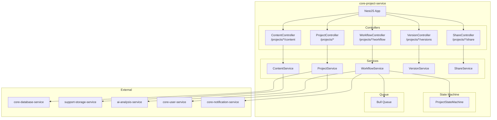
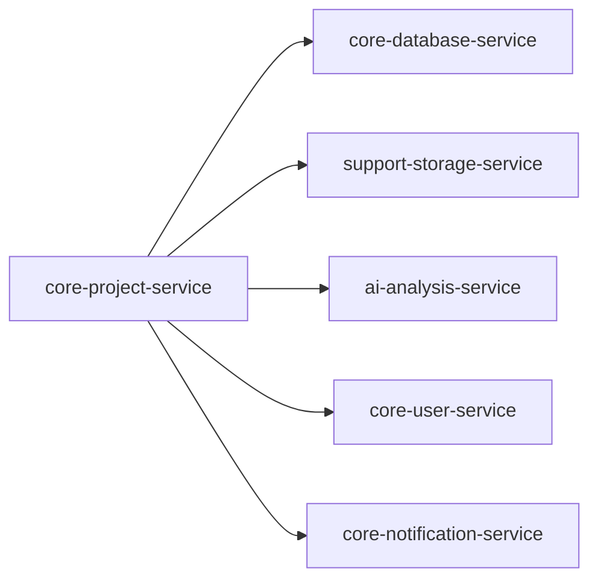
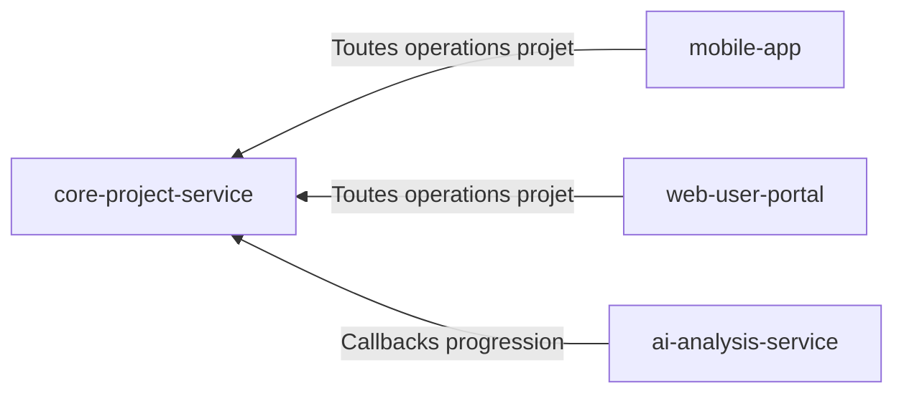
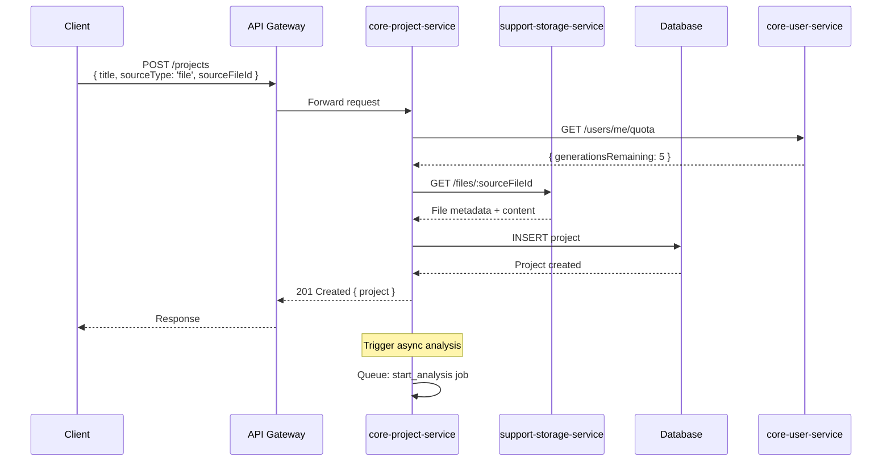
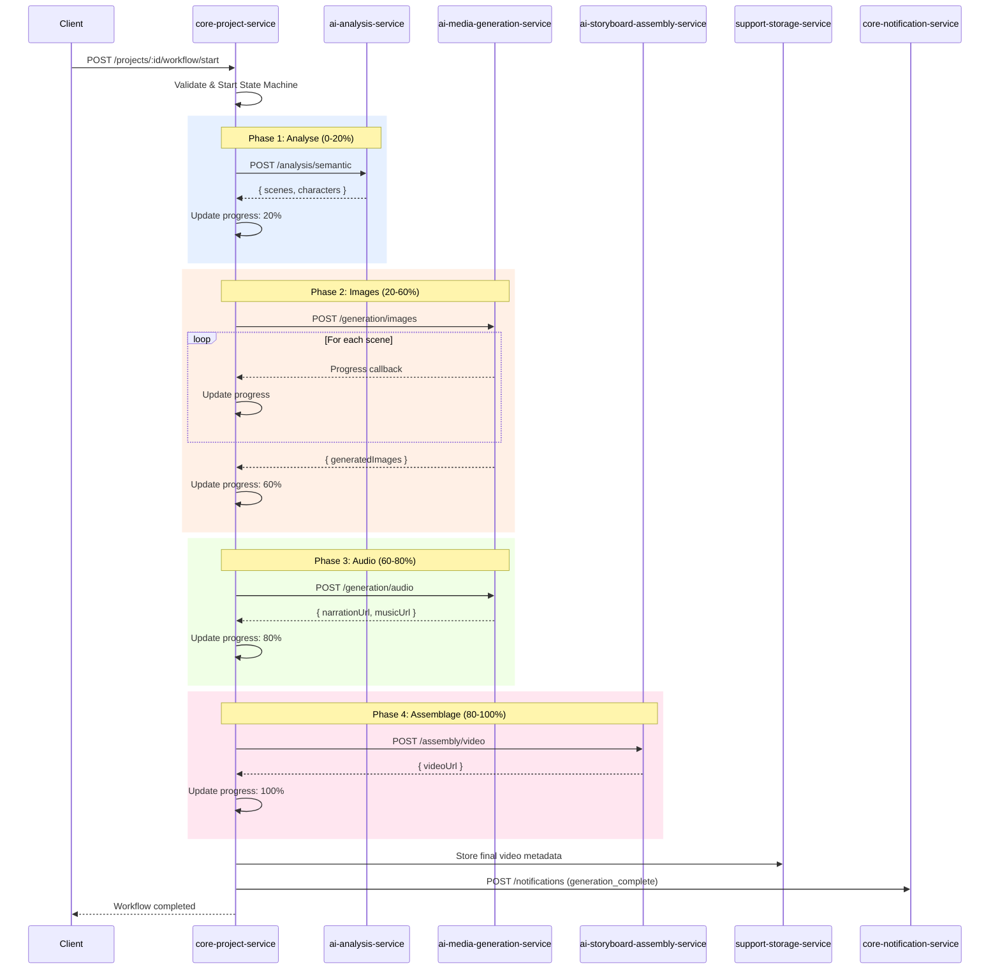
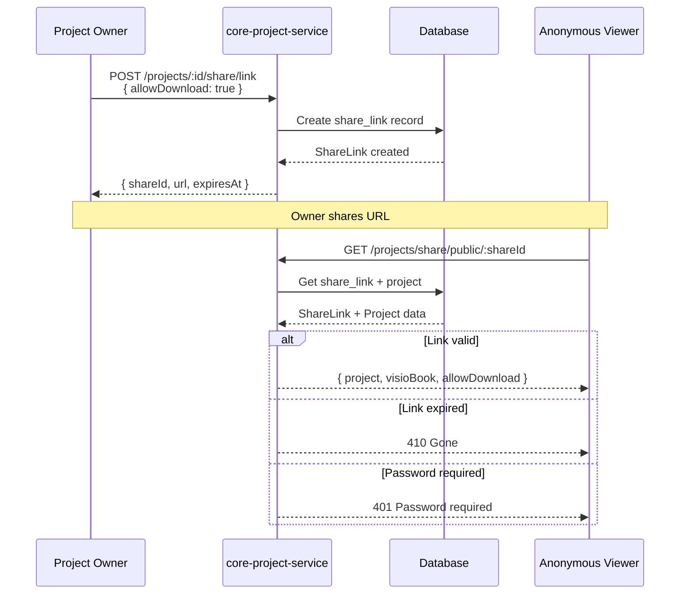

# core-project-service

## Informations generales

| Propriete | Valeur |
|-----------|--------|
| **Repository** | core-project-service |
| **Port** | 8086 |
| **Stack** | Node.js / NestJS |
| **Phase** | 3 - Services Metier |
| **Priorite** | IMPORTANT (coeur logique metier) |

## Flows/Journeys concernes

| Flow | Role | Responsabilite |
|------|------|----------------|
| **Flow 2: Import fichier** | Owner | Creation projet depuis fichier |
| **Flow 3: OCR Scanner** | Owner | Creation projet depuis scan |
| **Flow 4: Configuration** | Owner | Parametrage style, options |
| **Flow 5: Generation** | Owner | Orchestration du workflow IA |
| **Flow 7: Export/Partage** | Owner | Liens de partage |
| **Flow 8: Historique** | Owner | Liste et recherche projets |

## Architecture interne



## Controllers et Endpoints

### ProjectController (`/api/v1/projects`)

| Methode | Endpoint | Description | Auth |
|---------|----------|-------------|------|
| GET | `/` | Lister projets utilisateur | Oui |
| POST | `/` | Creer un projet | Oui |
| GET | `/:id` | Detail projet | Oui |
| PATCH | `/:id` | Modifier projet | Oui |
| DELETE | `/:id` | Supprimer projet | Oui |
| GET | `/search` | Rechercher projets | Oui |

```typescript
// POST /api/v1/projects
interface CreateProjectRequest {
  title: string;
  sourceType: 'file' | 'scan' | 'text';
  sourceFileId?: string;  // Si sourceType === 'file'
  sourceText?: string;    // Si sourceType === 'text'
}

interface ProjectResponse {
  id: string;
  title: string;
  status: ProjectStatus;
  sourceType: 'file' | 'scan' | 'text';
  content?: ContentSummary;
  config?: ProjectConfig;
  visioBook?: VisioBookInfo;
  createdAt: string;
  updatedAt: string;
}

type ProjectStatus =
  | 'draft'
  | 'analyzing'
  | 'ready'
  | 'generating'
  | 'completed'
  | 'failed';

// GET /api/v1/projects
interface ProjectListResponse {
  projects: ProjectResponse[];
  pagination: {
    total: number;
    page: number;
    pageSize: number;
    hasMore: boolean;
  };
}
```

### WorkflowController (`/api/v1/projects/:id/workflow`)

| Methode | Endpoint | Description | Auth |
|---------|----------|-------------|------|
| POST | `/start` | Demarrer generation | Oui |
| GET | `/status` | Status du workflow | Oui |
| POST | `/cancel` | Annuler generation | Oui |
| POST | `/retry` | Relancer apres echec | Oui |

```typescript
// POST /api/v1/projects/:id/workflow/start
interface StartWorkflowRequest {
  config: ProjectConfig;
}

interface ProjectConfig {
  style: StyleConfig;
  audio: AudioConfig;
  output: OutputConfig;
}

interface StyleConfig {
  preset: string;  // 'cartoon', 'realistic', 'watercolor', etc.
  customPrompt?: string;
}

interface AudioConfig {
  voice: string;  // 'fr-FR-Denise', 'fr-FR-Henri', etc.
  music: 'none' | 'ambient' | 'dramatic';
  speed: number;  // 0.5 - 2.0
}

interface OutputConfig {
  resolution: '720p' | '1080p' | '4k';
  format: 'mp4' | 'webm';
  duration: 'auto' | number;  // seconds
}

// GET /api/v1/projects/:id/workflow/status
interface WorkflowStatus {
  status: 'idle' | 'running' | 'completed' | 'failed' | 'cancelled';
  currentStep: WorkflowStep;
  progress: number;  // 0-100
  steps: StepStatus[];
  startedAt?: string;
  completedAt?: string;
  error?: string;
}

type WorkflowStep =
  | 'analyzing'     // 0-20%
  | 'generating_images'  // 20-60%
  | 'generating_audio'   // 60-80%
  | 'assembling'    // 80-100%
  | 'completed';

interface StepStatus {
  step: WorkflowStep;
  status: 'pending' | 'running' | 'completed' | 'failed';
  progress: number;
  details?: string;
}
```

### ContentController (`/api/v1/projects/:id/content`)

| Methode | Endpoint | Description | Auth |
|---------|----------|-------------|------|
| GET | `/` | Contenu du projet | Oui |
| PUT | `/` | Modifier contenu | Oui |
| GET | `/summary` | Resume du contenu | Oui |
| GET | `/scenes` | Scenes extraites | Oui |
| PUT | `/scenes/:sceneId` | Modifier scene | Oui |

```typescript
// GET /api/v1/projects/:id/content
interface ProjectContent {
  text: string;
  wordCount: number;
  summary?: string;
  scenes?: Scene[];
  characters?: Character[];
}

interface Scene {
  id: string;
  order: number;
  text: string;
  description?: string;
  imagePrompt?: string;
  generatedImageUrl?: string;
  duration?: number;
}

interface Character {
  id: string;
  name: string;
  description: string;
  appearances: number[];  // Scene IDs
}
```

### ShareController (`/api/v1/projects/:id/share`)

| Methode | Endpoint | Description | Auth |
|---------|----------|-------------|------|
| POST | `/link` | Creer lien de partage | Oui |
| GET | `/link` | Info lien existant | Oui |
| DELETE | `/link` | Supprimer lien | Oui |
| GET | `/public/:shareId` | Acceder via lien (public) | Non |

```typescript
// POST /api/v1/projects/:id/share/link
interface CreateShareLinkRequest {
  expiresIn?: number;  // hours, default 48
  password?: string;
  allowDownload: boolean;
}

interface ShareLinkResponse {
  shareId: string;
  url: string;
  expiresAt: string;
  hasPassword: boolean;
  allowDownload: boolean;
}
```

## Methodes et Fonctions

### ProjectService

```typescript
@Injectable()
export class ProjectService {
  async create(userId: string, data: CreateProjectRequest): Promise<Project> {
    // 1. Verifier quotas utilisateur
    // 2. Creer projet en draft
    // 3. Si fichier, recuperer contenu depuis storage
    // 4. Sauvegarder en DB
  }

  async findAll(userId: string, options: ListOptions): Promise<PaginatedResult<Project>> {
    // Liste paginee avec filtres
  }

  async findById(id: string, userId: string): Promise<Project> {
    // Recuperer projet avec verification ownership
  }

  async update(id: string, userId: string, data: UpdateProjectRequest): Promise<Project> {
    // Mise a jour partielle
  }

  async delete(id: string, userId: string): Promise<void> {
    // Suppression avec cleanup fichiers
  }
}
```

### WorkflowService

```typescript
@Injectable()
export class WorkflowService {
  async startGeneration(projectId: string, config: ProjectConfig): Promise<WorkflowStatus> {
    // 1. Verifier projet est pret
    // 2. Verifier quotas utilisateur
    // 3. Demarrer state machine
    // 4. Ajouter job a la queue
    // 5. Retourner status initial
  }

  async processWorkflow(jobId: string): Promise<void> {
    // Executed by Bull worker
    // 1. Analyse semantique (AI service)
    // 2. Generation images (Media service)
    // 3. Generation audio (Media service)
    // 4. Assemblage video (Assembly service)
    // 5. Notification utilisateur
  }

  async getStatus(projectId: string): Promise<WorkflowStatus> {
    // Retourner status actuel du workflow
  }

  async cancel(projectId: string): Promise<void> {
    // Annuler workflow en cours
  }
}
```

### State Machine

```typescript
// src/workflow/project.state-machine.ts
import { createMachine } from 'xstate';

export const projectWorkflowMachine = createMachine({
  id: 'projectWorkflow',
  initial: 'draft',
  states: {
    draft: {
      on: { START_ANALYSIS: 'analyzing' }
    },
    analyzing: {
      on: {
        ANALYSIS_COMPLETE: 'ready',
        ANALYSIS_FAILED: 'failed'
      }
    },
    ready: {
      on: { START_GENERATION: 'generating' }
    },
    generating: {
      on: {
        GENERATION_COMPLETE: 'completed',
        GENERATION_FAILED: 'failed',
        CANCEL: 'cancelled'
      }
    },
    completed: {
      type: 'final'
    },
    failed: {
      on: { RETRY: 'analyzing' }
    },
    cancelled: {
      on: { RETRY: 'draft' }
    }
  }
});
```

## Communications Inter-services

### Appels sortants



| Service cible | Endpoint | Objectif |
|---------------|----------|----------|
| core-database-service | `/api/v1/query` | CRUD projets |
| support-storage-service | `/api/v1/storage/files/*` | Gestion fichiers |
| ai-analysis-service | `/api/v1/analysis/*` | Lancement analyse/generation |
| core-user-service | `/api/v1/users/:id/quota` | Verification quotas |
| core-notification-service | `/api/v1/notifications/*` | Notifications utilisateur |

### Appels entrants



## Diagrammes de sequence

### Sequence: Creation projet depuis fichier



### Sequence: Workflow generation complet



### Sequence: Partage par lien



## Mocks pour tests

### Mock AI Analysis Service

```typescript
// tests/mocks/ai-analysis.mock.ts
export const mockAIAnalysisService = {
  analyzeContent: jest.fn().mockResolvedValue({
    scenes: [
      { id: '1', text: 'Scene 1 text', description: 'Description' },
      { id: '2', text: 'Scene 2 text', description: 'Description' },
    ],
    characters: [
      { name: 'Hero', description: 'Main character' }
    ],
    summary: 'Story summary'
  }),

  getJobStatus: jest.fn().mockResolvedValue({
    status: 'completed',
    progress: 100
  })
};
```

### Mock Storage Service

```typescript
// tests/mocks/storage.mock.ts
export const mockStorageService = {
  getFile: jest.fn().mockResolvedValue({
    id: 'file-123',
    filename: 'test.pdf',
    contentType: 'application/pdf',
    content: 'Extracted text content'
  }),

  uploadFile: jest.fn().mockResolvedValue({
    id: 'file-456',
    url: 'https://storage.example.com/file-456'
  })
};
```

### Mock User Service

```typescript
// tests/mocks/user.mock.ts
export const mockUserService = {
  getQuota: jest.fn().mockResolvedValue({
    generationsRemaining: 5,
    generationsTotal: 10,
    storageUsed: 1000000,
    storageLimit: 10000000
  }),

  consumeQuota: jest.fn().mockResolvedValue(true)
};
```

## Exemple d'implementation

### Configuration NestJS

```typescript
// src/main.ts
import { NestFactory } from '@nestjs/core';
import { ValidationPipe } from '@nestjs/common';
import { AppModule } from './app.module';

async function bootstrap() {
  const app = await NestFactory.create(AppModule);

  app.setGlobalPrefix('api/v1');
  app.useGlobalPipes(new ValidationPipe({
    whitelist: true,
    transform: true,
  }));

  await app.listen(8086);
}
bootstrap();
```

### Bull Queue Configuration

```typescript
// src/workflow/workflow.processor.ts
import { Processor, Process } from '@nestjs/bull';
import { Job } from 'bull';

@Processor('workflow')
export class WorkflowProcessor {
  constructor(
    private workflowService: WorkflowService,
    private aiService: AIAnalysisClient,
    private mediaService: MediaGenerationClient,
    private assemblyService: StoryboardAssemblyClient,
  ) {}

  @Process('generate')
  async handleGeneration(job: Job<{ projectId: string; config: ProjectConfig }>) {
    const { projectId, config } = job.data;

    try {
      // Phase 1: Analysis
      await job.progress(10);
      const analysis = await this.aiService.analyze(projectId);

      // Phase 2: Images
      await job.progress(30);
      const images = await this.mediaService.generateImages(analysis.scenes);

      // Phase 3: Audio
      await job.progress(70);
      const audio = await this.mediaService.generateAudio(analysis, config.audio);

      // Phase 4: Assembly
      await job.progress(90);
      const video = await this.assemblyService.assemble(images, audio);

      await job.progress(100);
      await this.workflowService.complete(projectId, video);

    } catch (error) {
      await this.workflowService.fail(projectId, error.message);
      throw error;
    }
  }
}
```

## Metriques de succes

| Metrique | Objectif | Description |
|----------|----------|-------------|
| Project creation | < 1s | Temps de creation projet |
| Workflow throughput | > 100/h | Projets traites par heure |
| Success rate | > 95% | Taux de succes generation |
| Availability | > 99.8% | Disponibilite du service |
