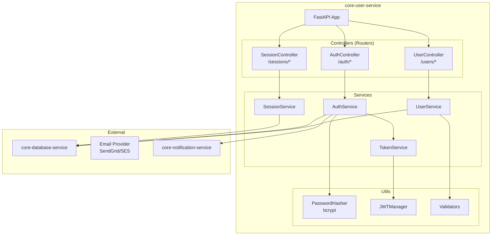
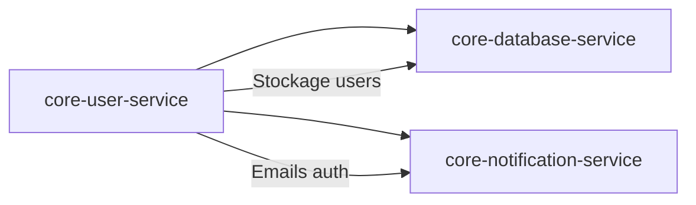
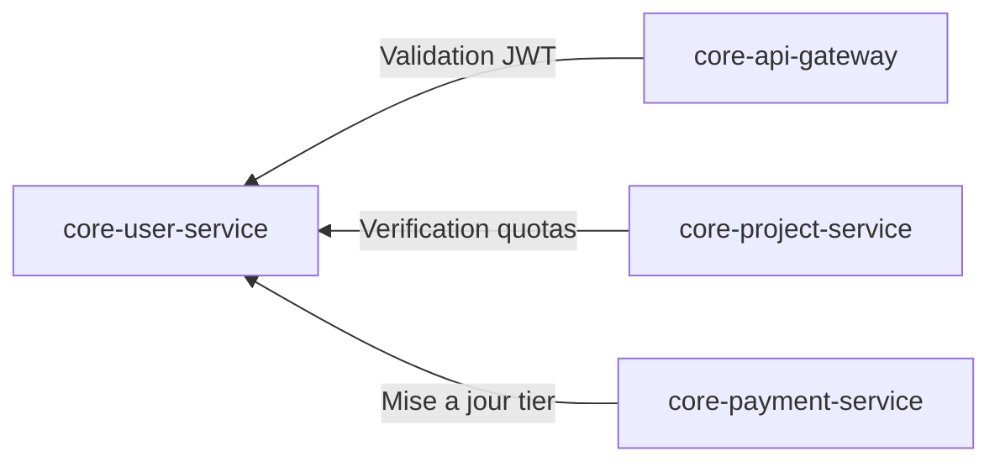
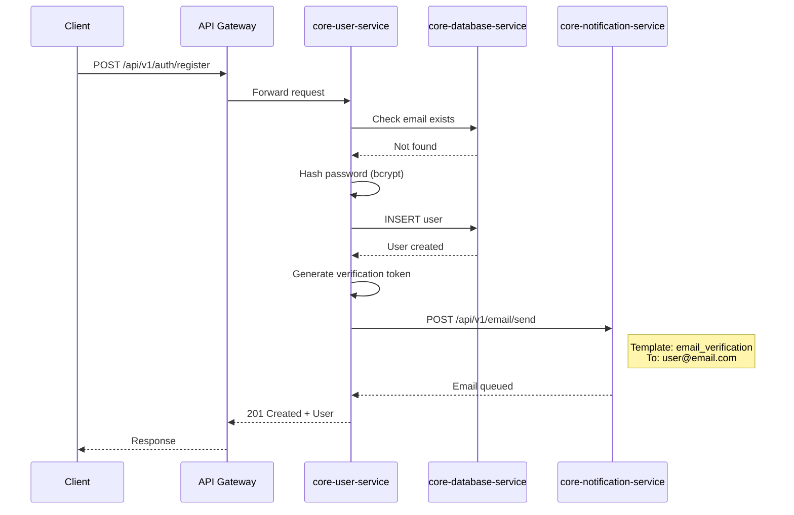
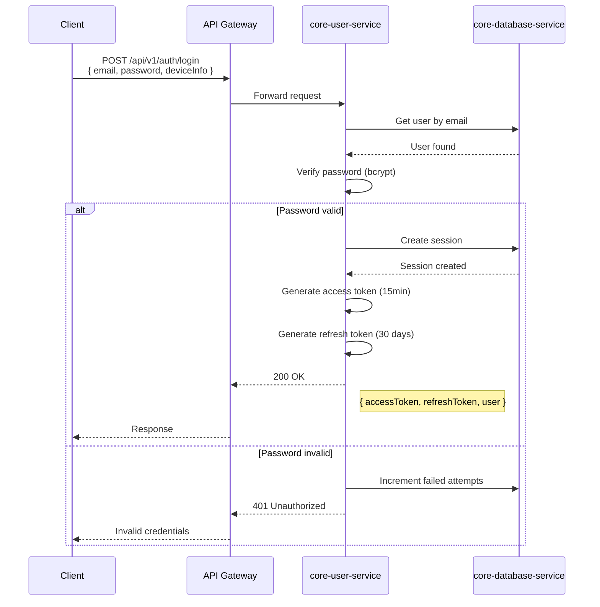
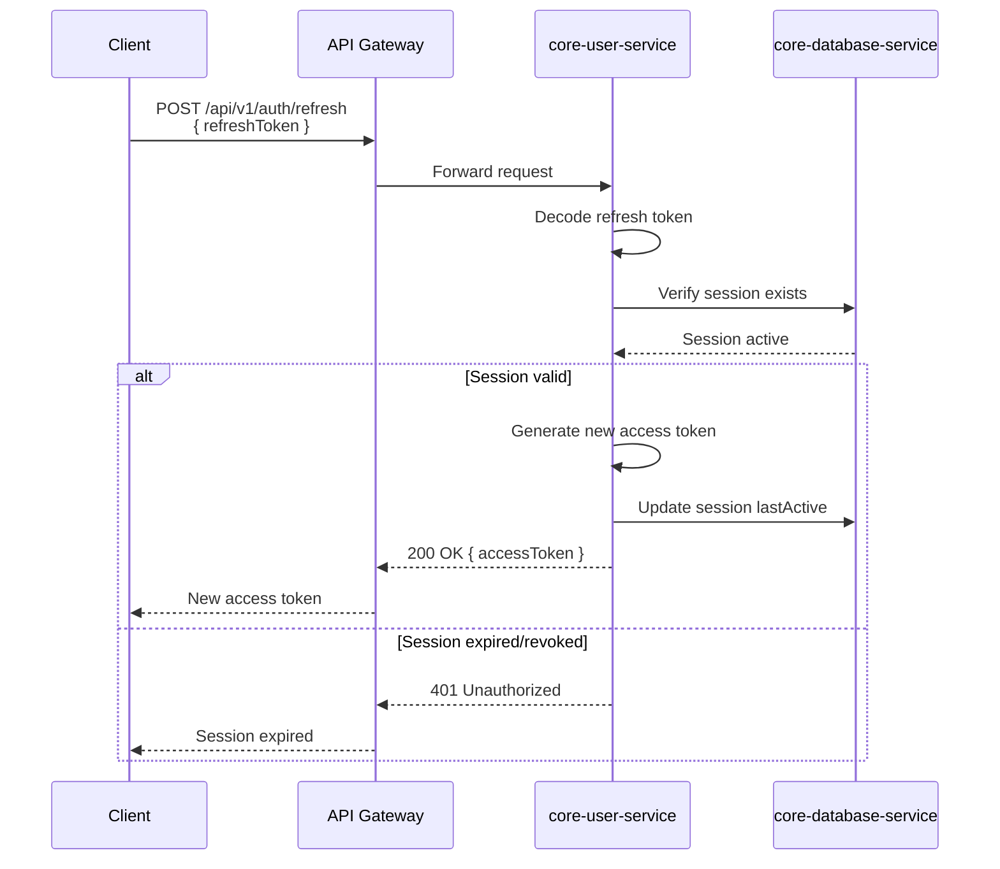

# core-user-service

## Informations generales

| Propriete | Valeur |
|-----------|--------|
| **Repository** | core-user-service |
| **Port** | 8081 |
| **Stack** | Python / FastAPI |
| **Phase** | 2 - Services Core |
| **Priorite** | ESSENTIEL (authentification) |

## Flows/Journeys concernes

| Flow | Role | Responsabilite |
|------|------|----------------|
| **Flow 1: Auth** | **Owner principal** | Inscription, connexion, gestion sessions |
| Flow 2-8 | Support | Validation tokens, infos utilisateur |

## Architecture interne



## Controllers et Endpoints

### AuthController (`/api/v1/auth`)

| Methode | Endpoint | Description | Auth |
|---------|----------|-------------|------|
| POST | `/register` | Inscription nouvel utilisateur | Non |
| POST | `/login` | Connexion utilisateur | Non |
| POST | `/logout` | Deconnexion | Oui |
| POST | `/refresh` | Renouveler le token | Non (refresh token) |
| POST | `/verify-email` | Verifier email | Non |
| POST | `/forgot-password` | Demande reset password | Non |
| POST | `/reset-password` | Reset password | Non |
| GET | `/verify` | Verifier token (pour gateway) | Oui |

```python
# POST /api/v1/auth/register
class RegisterRequest(BaseModel):
    email: EmailStr
    password: str = Field(min_length=8)
    firstName: str = Field(min_length=1)
    lastName: str = Field(min_length=1)

class RegisterResponse(BaseModel):
    id: str
    email: str
    firstName: str
    lastName: str
    emailVerified: bool = False
    createdAt: datetime

# POST /api/v1/auth/login
class LoginRequest(BaseModel):
    email: EmailStr
    password: str
    deviceInfo: Optional[DeviceInfo] = None

class LoginResponse(BaseModel):
    accessToken: str
    refreshToken: str
    expiresIn: int  # seconds
    user: UserResponse

# POST /api/v1/auth/refresh
class RefreshRequest(BaseModel):
    refreshToken: str

class RefreshResponse(BaseModel):
    accessToken: str
    expiresIn: int
```

### UserController (`/api/v1/users`)

| Methode | Endpoint | Description | Auth |
|---------|----------|-------------|------|
| GET | `/me` | Profil utilisateur courant | Oui |
| PATCH | `/me` | Modifier profil | Oui |
| PUT | `/me/password` | Changer mot de passe | Oui |
| GET | `/me/quota` | Quotas utilisateur | Oui |
| DELETE | `/me` | Supprimer compte | Oui |

```python
# GET /api/v1/users/me
class UserResponse(BaseModel):
    id: str
    email: str
    firstName: str
    lastName: str
    avatar: Optional[str]
    tier: Literal["free", "premium", "enterprise"]
    quota: QuotaInfo
    createdAt: datetime

class QuotaInfo(BaseModel):
    generationsRemaining: int
    generationsTotal: int
    storageUsed: int  # bytes
    storageLimit: int  # bytes
    resetDate: Optional[datetime]

# PATCH /api/v1/users/me
class UpdateProfileRequest(BaseModel):
    firstName: Optional[str]
    lastName: Optional[str]
    avatar: Optional[str]
```

### SessionController (`/api/v1/sessions`)

| Methode | Endpoint | Description | Auth |
|---------|----------|-------------|------|
| GET | `/` | Liste des sessions actives | Oui |
| DELETE | `/:id` | Revoquer une session | Oui |
| DELETE | `/all` | Revoquer toutes les sessions | Oui |

```python
# GET /api/v1/sessions
class SessionResponse(BaseModel):
    id: str
    deviceInfo: DeviceInfo
    ipAddress: str
    lastActive: datetime
    createdAt: datetime
    isCurrent: bool

class DeviceInfo(BaseModel):
    type: Literal["mobile", "web", "desktop"]
    os: str
    browser: Optional[str]
    appVersion: Optional[str]
```

## Methodes et Fonctions

### AuthService

```python
class AuthService:
    async def register(self, data: RegisterRequest) -> User:
        """Inscription d'un nouvel utilisateur"""
        # 1. Verifier email unique
        # 2. Hasher password
        # 3. Creer user en DB
        # 4. Envoyer email verification
        pass

    async def login(self, data: LoginRequest) -> LoginResponse:
        """Connexion utilisateur"""
        # 1. Verifier credentials
        # 2. Creer session
        # 3. Generer tokens
        pass

    async def logout(self, user_id: str, session_id: str) -> None:
        """Deconnexion"""
        # 1. Invalider session
        # 2. Blacklist refresh token
        pass

    async def refresh_token(self, refresh_token: str) -> RefreshResponse:
        """Renouveler access token"""
        # 1. Verifier refresh token
        # 2. Verifier session active
        # 3. Generer nouveau access token
        pass

    async def verify_token(self, token: str) -> TokenPayload:
        """Verifier et decoder un token (pour gateway)"""
        pass
```

### TokenService

```python
class TokenService:
    def create_access_token(self, user_id: str, role: str) -> str:
        """Creer un access token JWT"""
        payload = {
            "sub": user_id,
            "role": role,
            "type": "access",
            "exp": datetime.utcnow() + timedelta(minutes=15),
            "iat": datetime.utcnow(),
        }
        return jwt.encode(payload, self.secret_key, algorithm="HS256")

    def create_refresh_token(self, user_id: str, session_id: str) -> str:
        """Creer un refresh token"""
        payload = {
            "sub": user_id,
            "session_id": session_id,
            "type": "refresh",
            "exp": datetime.utcnow() + timedelta(days=30),
        }
        return jwt.encode(payload, self.refresh_secret, algorithm="HS256")

    def decode_token(self, token: str, token_type: str = "access") -> dict:
        """Decoder et verifier un token"""
        secret = self.secret_key if token_type == "access" else self.refresh_secret
        return jwt.decode(token, secret, algorithms=["HS256"])
```

### UserService

```python
class UserService:
    async def get_user(self, user_id: str) -> User:
        """Recuperer un utilisateur"""
        pass

    async def update_profile(self, user_id: str, data: UpdateProfileRequest) -> User:
        """Mettre a jour le profil"""
        pass

    async def change_password(self, user_id: str, old_password: str, new_password: str) -> None:
        """Changer le mot de passe"""
        # 1. Verifier ancien password
        # 2. Hasher nouveau password
        # 3. Invalider toutes les sessions
        pass

    async def get_quota(self, user_id: str) -> QuotaInfo:
        """Recuperer les quotas utilisateur"""
        pass

    async def consume_quota(self, user_id: str, quota_type: str, amount: int = 1) -> bool:
        """Consommer du quota (appele par project-service)"""
        pass
```

## Communications Inter-services

### Appels sortants



| Service cible | Endpoint | Objectif |
|---------------|----------|----------|
| core-database-service | `/api/v1/query` | CRUD utilisateurs, sessions |
| core-notification-service | `/api/v1/email/send` | Emails verification, reset |

### Appels entrants



| Service source | Endpoint appele | Objectif |
|----------------|-----------------|----------|
| core-api-gateway | `GET /api/v1/auth/verify` | Validation tokens |
| core-project-service | `GET /api/v1/users/:id/quota` | Verification quotas |
| core-payment-service | `PATCH /api/v1/users/:id/tier` | Upgrade/downgrade |

## Diagrammes de sequence

### Sequence: Inscription complete



### Sequence: Login avec creation session



### Sequence: Refresh token



## Mocks pour tests

### Mock Database Service

```python
# tests/mocks/database_mock.py
from unittest.mock import AsyncMock

class MockDatabaseService:
    def __init__(self):
        self.users = {}
        self.sessions = {}

    async def query(self, sql: str, params: list = None):
        # Simuler les requetes SQL
        if "SELECT * FROM users WHERE email" in sql:
            email = params[0]
            return {"rows": [self.users.get(email)]} if email in self.users else {"rows": []}

        if "INSERT INTO users" in sql:
            user = {"id": "user-123", "email": params[0]}
            self.users[params[0]] = user
            return {"rows": [user], "rowCount": 1}

        return {"rows": [], "rowCount": 0}

# Usage
@pytest.fixture
def mock_db():
    return MockDatabaseService()
```

### Mock Notification Service

```python
# tests/mocks/notification_mock.py
class MockNotificationService:
    def __init__(self):
        self.sent_emails = []

    async def send_email(self, to: str, template: str, data: dict):
        self.sent_emails.append({
            "to": to,
            "template": template,
            "data": data,
            "sent_at": datetime.utcnow()
        })
        return {"success": True, "messageId": f"msg-{len(self.sent_emails)}"}

    def get_sent_emails(self):
        return self.sent_emails

# Usage dans les tests
@pytest.fixture
def mock_notification():
    return MockNotificationService()

async def test_register_sends_verification_email(mock_db, mock_notification):
    service = AuthService(db=mock_db, notification=mock_notification)

    await service.register(RegisterRequest(
        email="test@example.com",
        password="password123",
        firstName="Test",
        lastName="User"
    ))

    assert len(mock_notification.sent_emails) == 1
    assert mock_notification.sent_emails[0]["template"] == "email_verification"
```

## Exemple d'implementation

### Configuration FastAPI

```python
# src/main.py
from fastapi import FastAPI
from fastapi.middleware.cors import CORSMiddleware
from src.routers import auth_router, user_router, session_router
from src.config import settings

app = FastAPI(
    title="core-user-service",
    version="1.0.0",
    docs_url="/docs" if settings.DEBUG else None,
)

app.add_middleware(
    CORSMiddleware,
    allow_origins=settings.CORS_ORIGINS,
    allow_credentials=True,
    allow_methods=["*"],
    allow_headers=["*"],
)

app.include_router(auth_router, prefix="/api/v1/auth", tags=["auth"])
app.include_router(user_router, prefix="/api/v1/users", tags=["users"])
app.include_router(session_router, prefix="/api/v1/sessions", tags=["sessions"])

@app.get("/health")
async def health_check():
    return {"status": "healthy"}
```

### Auth Router

```python
# src/routers/auth.py
from fastapi import APIRouter, Depends, HTTPException, status
from src.services import AuthService
from src.schemas import RegisterRequest, LoginRequest, RefreshRequest
from src.dependencies import get_auth_service

router = APIRouter()

@router.post("/register", status_code=status.HTTP_201_CREATED)
async def register(
    data: RegisterRequest,
    auth_service: AuthService = Depends(get_auth_service)
):
    try:
        user = await auth_service.register(data)
        return user
    except EmailAlreadyExistsError:
        raise HTTPException(
            status_code=status.HTTP_409_CONFLICT,
            detail="Email already registered"
        )

@router.post("/login")
async def login(
    data: LoginRequest,
    auth_service: AuthService = Depends(get_auth_service)
):
    try:
        return await auth_service.login(data)
    except InvalidCredentialsError:
        raise HTTPException(
            status_code=status.HTTP_401_UNAUTHORIZED,
            detail="Invalid email or password"
        )
```

## Metriques de succes

| Metrique | Objectif | Description |
|----------|----------|-------------|
| Login time | < 500ms | Temps de connexion complet |
| Token validation | < 10ms | Verification JWT |
| Registration | < 2s | Inscription complete avec email |
| Availability | > 99.9% | Disponibilite du service |
| Security | 0 vulnerabilities | Aucune faille de securite |
