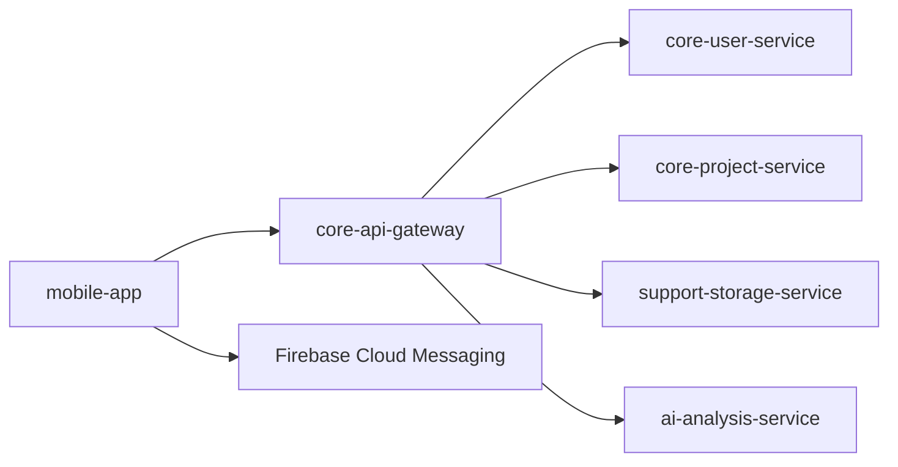
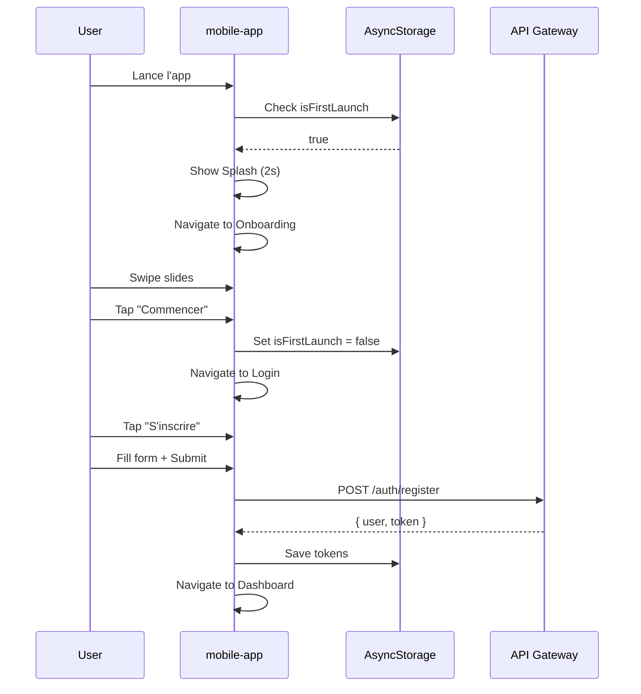
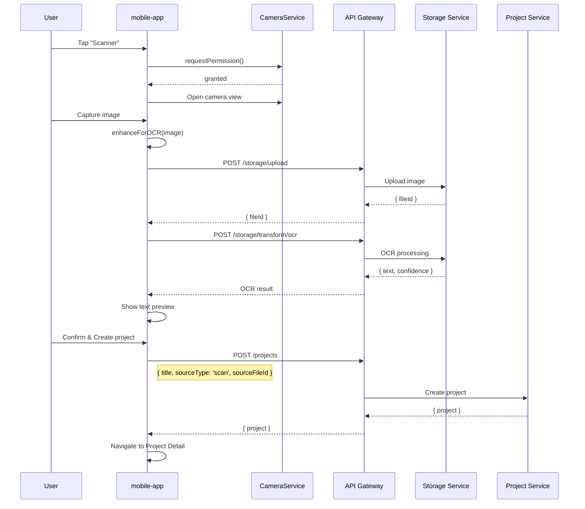
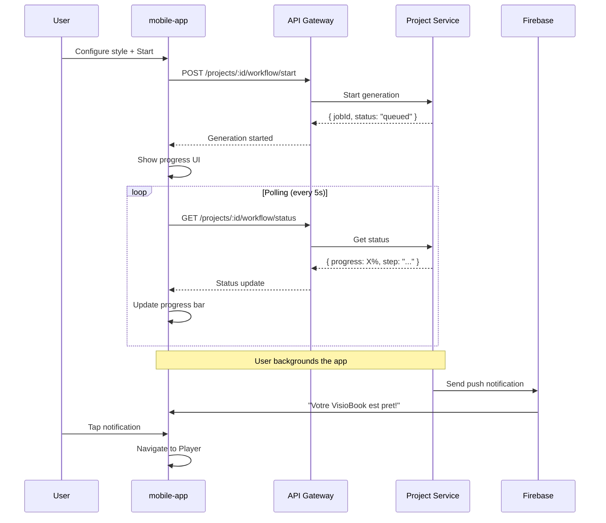

# mobile-app

## Informations generales

| Propriete | Valeur |
|-----------|--------|
| **Repository** | mobile-app |
| **Port** | - (Application native) |
| **Stack** | Mobile natif (iOS/Android) |
| **Phase** | **4 - PRIORITAIRE** |
| **Priorite** | **ABSOLUE (Mobile-First)** |

## Flows/Journeys concernes

L'application mobile est le **point d'entree principal** pour tous les flows utilisateur:

| Flow | Role | Screens impliques |
|------|------|-------------------|
| Flow 1: Auth | Owner UI | Splash, Onboarding, Login, Register |
| Flow 2: Import fichier | Owner UI | Dashboard, Input Scanner |
| Flow 3: OCR Scanner | Owner UI | Input Scanner (Camera) |
| Flow 4: Configuration | Owner UI | Project Detail |
| Flow 5: Generation | Owner UI | Project Detail (Progress) |
| Flow 6: Player | Owner UI | Player VisioBook |
| Flow 7: Export/Partage | Owner UI | Player (Share) |
| Flow 8: Historique | Owner UI | Historique Inputs, Historique VisioBooks |

## Architecture interne

```mermaid
graph TB
    subgraph "mobile-app"
        subgraph "Screens"
            SPLASH[SplashScreen]
            ONBOARD[OnboardingScreen]
            LOGIN[LoginScreen]
            REGISTER[RegisterScreen]
            DASH[DashboardScreen]
            INPUT[InputScannerScreen]
            HIST_IN[HistoryInputsScreen]
            HIST_VB[HistoryVisioBookScreen]
            DETAIL[ProjectDetailScreen]
            PLAYER[PlayerScreen]
        end

        subgraph "State Management"
            AUTH_STORE[authStore]
            PROJECT_STORE[projectStore]
            UPLOAD_STORE[uploadStore]
            GEN_STORE[generationStore]
            OFFLINE_STORE[offlineStore]
        end

        subgraph "Services"
            API[APIClient]
            CAMERA[CameraService]
            PUSH[PushNotificationService]
            BIOMETRIC[BiometricService]
            CACHE[CacheService]
        end

        subgraph "Navigation"
            NAV[NavigationController]
            DEEP[DeepLinkHandler]
        end
    end

    subgraph "External"
        GW[core-api-gateway]
        FIREBASE[Firebase Cloud Messaging]
    end

    SPLASH --> NAV
    NAV --> ONBOARD
    NAV --> LOGIN
    NAV --> DASH
    NAV --> INPUT
    NAV --> DETAIL
    NAV --> PLAYER

    DASH --> AUTH_STORE
    INPUT --> UPLOAD_STORE
    DETAIL --> PROJECT_STORE
    PLAYER --> PROJECT_STORE

    API --> GW
    PUSH --> FIREBASE
    DEEP --> NAV

    CAMERA --> INPUT
    BIOMETRIC --> LOGIN
```



## Screens MVP

### Screen 1: Splash Screen

| Propriete | Valeur |
|-----------|--------|
| Route | `/` |
| Duree | < 2 secondes |

**Responsabilites:**
- Afficher logo et animation de marque
- Verifier token d'authentification en cache
- Rediriger vers Onboarding (1er lancement) ou Dashboard (authentifie)

```typescript
interface SplashScreenState {
  isCheckingAuth: boolean;
  animationComplete: boolean;
}

// Logique
onMount:
  1. Demarrer animation logo
  2. authStore.checkStoredToken()
  3. if (isFirstLaunch) -> navigate('/onboarding')
  4. if (hasValidToken) -> navigate('/dashboard')
  5. else -> navigate('/login')
```

### Screen 2: Onboarding (3 slides)

| Propriete | Valeur |
|-----------|--------|
| Route | `/onboarding` |
| Condition | Premier lancement uniquement |

**Slides:**
1. "Transformez vos livres en experiences visuelles"
2. "Scannez, personnalisez, generez"
3. "Partagez vos creations"

```typescript
interface OnboardingSlide {
  title: string;
  description: string;
  image: string;
  action?: 'skip' | 'next' | 'start';
}

// Actions
onSkip: navigate('/login')
onComplete: markOnboardingComplete() && navigate('/login')
```

### Screen 3: Login / Register

| Propriete | Valeur |
|-----------|--------|
| Route | `/login`, `/register` |

**Composants:**
- Social login buttons (Google, Apple)
- Email/Password form
- Biometric login option (si disponible)
- Forgot password link

```typescript
interface LoginScreenState {
  email: string;
  password: string;
  isLoading: boolean;
  error: string | null;
  biometricAvailable: boolean;
}

// API calls
authStore.login({ email, password, deviceInfo })
authStore.loginWithBiometric()
authStore.loginWithGoogle()
authStore.loginWithApple()
```

### Screen 4: Dashboard

| Propriete | Valeur |
|-----------|--------|
| Route | `/dashboard` |
| Tab | Home |

**Sections:**
- Header avec avatar et notifications
- Quick actions (Scanner, Importer)
- Projets recents (3-5 derniers)
- Statistiques utilisateur

```typescript
interface DashboardState {
  user: User;
  recentProjects: Project[];
  stats: UserStats;
  notifications: Notification[];
}

interface UserStats {
  totalProjects: number;
  generationsThisMonth: number;
  quotaRemaining: number;
}
```

### Screen 5: Input Scanner

| Propriete | Valeur |
|-----------|--------|
| Route | `/scanner` |
| Tab | Scanner |

**Modes:**
- Camera scan (OCR)
- File picker (PDF, images)
- Text input manuel

```typescript
interface InputScannerState {
  mode: 'camera' | 'file' | 'text';
  capturedImage: ImageData | null;
  selectedFile: File | null;
  textInput: string;
  ocrResult: OCRResult | null;
  isProcessing: boolean;
}

// Flow Camera
1. openCamera()
2. captureImage()
3. uploadStore.uploadForOCR(image)
4. displayOCRResult()
5. confirmAndCreateProject()

// Flow File
1. openFilePicker()
2. selectFile()
3. uploadStore.uploadFile(file)
4. projectStore.createProject({ sourceFileId })
```

### Screen 6: Historique Inputs

| Propriete | Valeur |
|-----------|--------|
| Route | `/history/inputs` |
| Tab | Mes Textes |

**Fonctionnalites:**
- Liste des textes importes
- Filtres (date, type, status)
- Search
- Pull to refresh

```typescript
interface HistoryInputsState {
  inputs: InputItem[];
  filters: InputFilters;
  searchQuery: string;
  isLoading: boolean;
  pagination: Pagination;
}

interface InputItem {
  id: string;
  title: string;
  type: 'file' | 'scan' | 'text';
  preview: string;
  projectCount: number;
  createdAt: Date;
}
```

### Screen 7: Historique VisioBooks

| Propriete | Valeur |
|-----------|--------|
| Route | `/history/visiobooks` |
| Tab | Mes VisioBooks |

**Fonctionnalites:**
- Grille/Liste de VisioBooks generes
- Thumbnail video
- Status (generating, ready, failed)
- Quick play button

```typescript
interface HistoryVisioBookState {
  visioBooks: VisioBook[];
  viewMode: 'grid' | 'list';
  filters: VisioBookFilters;
  isLoading: boolean;
}

interface VisioBook {
  id: string;
  projectId: string;
  title: string;
  thumbnailUrl: string;
  videoUrl: string;
  duration: number;
  status: 'generating' | 'ready' | 'failed';
  createdAt: Date;
}
```

### Screen 8: Project Detail

| Propriete | Valeur |
|-----------|--------|
| Route | `/projects/:id` |

**Sections:**
- Header avec titre et status
- Content preview (texte, scenes)
- Configuration panel (style, audio)
- Generate button avec progression
- VisioBook preview (si genere)

```typescript
interface ProjectDetailState {
  project: Project;
  content: ProjectContent;
  config: ProjectConfig;
  workflowStatus: WorkflowStatus | null;
  isEditing: boolean;
}

// Actions
projectStore.updateConfig(projectId, config)
projectStore.startGeneration(projectId)
projectStore.cancelGeneration(projectId)
```

### Screen 9: Player VisioBook

| Propriete | Valeur |
|-----------|--------|
| Route | `/player/:projectId` |

**Fonctionnalites:**
- Video player fullscreen
- Controles (play/pause, seek, volume)
- Chapitrage par scene
- Actions (share, download, regenerate)

```typescript
interface PlayerState {
  visioBook: VisioBook;
  isPlaying: boolean;
  currentTime: number;
  duration: number;
  currentScene: number;
  isFullscreen: boolean;
}

// Actions
share(): openShareSheet()
download(): downloadVideo()
regenerate(): navigate('/projects/:id')
```

## State Management (Stores)

### authStore

```typescript
interface AuthStore {
  // State
  user: User | null;
  accessToken: string | null;
  refreshToken: string | null;
  isAuthenticated: boolean;
  isLoading: boolean;

  // Actions
  login(credentials: LoginCredentials): Promise<void>;
  loginWithBiometric(): Promise<void>;
  loginWithSocial(provider: 'google' | 'apple'): Promise<void>;
  register(data: RegisterData): Promise<void>;
  logout(): Promise<void>;
  refreshAccessToken(): Promise<void>;
  checkStoredToken(): Promise<boolean>;
}
```

### projectStore

```typescript
interface ProjectStore {
  // State
  projects: Project[];
  currentProject: Project | null;
  isLoading: boolean;
  error: string | null;

  // Actions
  fetchProjects(filters?: ProjectFilters): Promise<void>;
  fetchProject(id: string): Promise<void>;
  createProject(data: CreateProjectData): Promise<Project>;
  updateProject(id: string, data: UpdateProjectData): Promise<void>;
  deleteProject(id: string): Promise<void>;
  startGeneration(id: string, config: ProjectConfig): Promise<void>;
  cancelGeneration(id: string): Promise<void>;
}
```

### uploadStore

```typescript
interface UploadStore {
  // State
  uploads: Upload[];
  currentUpload: Upload | null;

  // Actions
  uploadFile(file: File): Promise<UploadResult>;
  uploadForOCR(image: ImageData): Promise<OCRResult>;
  cancelUpload(uploadId: string): void;
  getUploadProgress(uploadId: string): number;
}

interface Upload {
  id: string;
  filename: string;
  progress: number;
  status: 'uploading' | 'processing' | 'completed' | 'failed';
}
```

### generationStore

```typescript
interface GenerationStore {
  // State
  activeGenerations: Map<string, WorkflowStatus>;

  // Actions
  subscribeToGeneration(projectId: string): void;
  unsubscribeFromGeneration(projectId: string): void;
  getGenerationStatus(projectId: string): WorkflowStatus | null;
}
```

### offlineStore

```typescript
interface OfflineStore {
  // State
  cachedProjects: Project[];
  cachedVisioBooks: VisioBook[];
  pendingSync: PendingSyncItem[];
  isOnline: boolean;

  // Actions
  cacheProject(project: Project): Promise<void>;
  cacheVisioBook(visioBook: VisioBook): Promise<void>;
  syncPendingChanges(): Promise<void>;
  clearCache(): Promise<void>;
}
```

## Services

### APIClient

```typescript
class APIClient {
  private baseUrl: string;
  private authStore: AuthStore;

  async request<T>(
    method: string,
    path: string,
    data?: any,
    options?: RequestOptions
  ): Promise<T>;

  // Auto-refresh token on 401
  private async handleUnauthorized(): Promise<void>;

  // Interceptors
  private addAuthHeader(headers: Headers): Headers;
  private handleNetworkError(error: Error): void;
}
```

### CameraService

```typescript
class CameraService {
  async requestPermission(): Promise<boolean>;
  async captureImage(): Promise<ImageData>;
  async startVideoRecording(): Promise<void>;
  async stopVideoRecording(): Promise<VideoData>;

  // Image processing
  async cropImage(image: ImageData, rect: Rect): Promise<ImageData>;
  async enhanceForOCR(image: ImageData): Promise<ImageData>;
}
```

### PushNotificationService

```typescript
class PushNotificationService {
  async requestPermission(): Promise<boolean>;
  async getToken(): Promise<string>;
  async subscribeToTopic(topic: string): Promise<void>;
  async unsubscribeFromTopic(topic: string): Promise<void>;

  // Handlers
  onNotificationReceived(callback: (notification: Notification) => void): void;
  onNotificationTapped(callback: (notification: Notification) => void): void;
}
```

### BiometricService

```typescript
class BiometricService {
  async isAvailable(): Promise<boolean>;
  async getBiometricType(): Promise<'fingerprint' | 'faceId' | 'none'>;
  async authenticate(reason: string): Promise<boolean>;

  // Secure storage
  async storeCredentials(credentials: Credentials): Promise<void>;
  async getStoredCredentials(): Promise<Credentials | null>;
}
```

## Communications avec Backend

### Appels sortants



| Service | Endpoints utilises |
|---------|-------------------|
| core-user-service | `/auth/*`, `/users/*` |
| core-project-service | `/projects/*` |
| support-storage-service | `/storage/*` |
| ai-analysis-service | `/jobs/*` (status polling) |

## Diagrammes de sequence

### Sequence: Premier lancement et onboarding



### Sequence: Scan OCR et creation projet



### Sequence: Generation avec notifications



## Mocks pour tests

### Mock API Client

```typescript
// __mocks__/APIClient.ts
export const mockAPIClient = {
  request: jest.fn(),
};

// Usage in tests
mockAPIClient.request.mockResolvedValueOnce({
  user: { id: 'user-123', email: 'test@example.com' },
  accessToken: 'mock-token',
});
```

### Mock Camera Service

```typescript
// __mocks__/CameraService.ts
export const mockCameraService = {
  requestPermission: jest.fn().mockResolvedValue(true),
  captureImage: jest.fn().mockResolvedValue({
    uri: 'file://mock-image.jpg',
    width: 1920,
    height: 1080,
  }),
};
```

## Metriques de succes

| Metrique | Objectif | Description |
|----------|----------|-------------|
| Time-to-scan | < 10s | Du lancement au debut scan |
| Time-to-generate | < 30s | De la validation au lancement IA |
| App launch | < 2s | Temps de demarrage cold |
| Crash rate | < 0.1% | Taux de crash |
| Retention J7 | > 40% | Utilisateurs revenant a J+7 |
