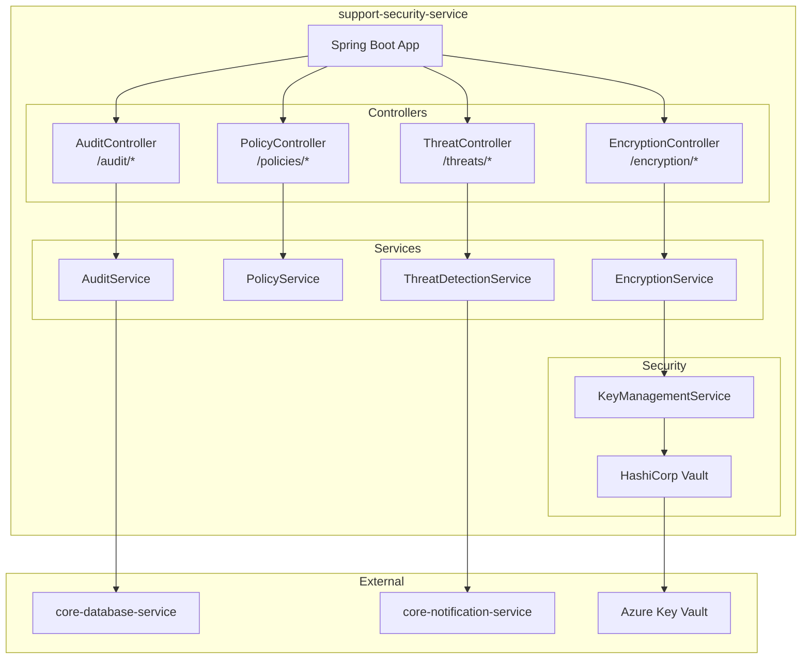
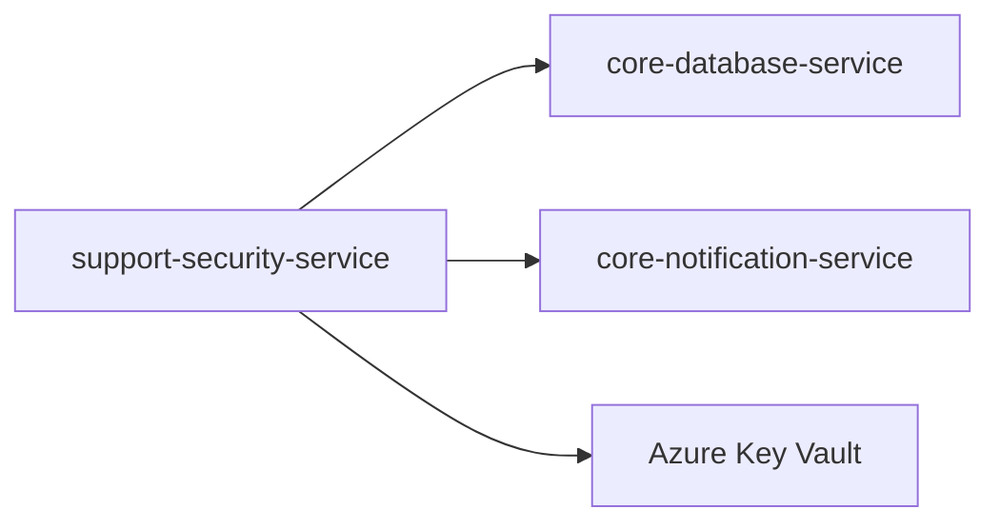
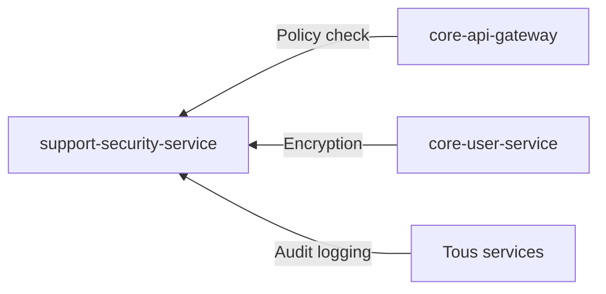

# support-security-service

## Informations generales

| Propriete | Valeur |
|-----------|--------|
| **Repository** | support-security-service |
| **Port** | 8093 |
| **Stack** | Java / Spring Boot |
| **Phase** | 6 - Services Complementaires |
| **Priorite** | Transversal (securite) |

## Flows/Journeys concernes

| Flow | Role | Responsabilite |
|------|------|----------------|
| Tous flows | Transversal | Securite globale |
| Flow 1: Auth | Support | Encryption credentials |

## Architecture interne



## Controllers et Endpoints

### EncryptionController (`/api/v1/encryption`)

| Methode | Endpoint | Description | Auth |
|---------|----------|-------------|------|
| POST | `/encrypt` | Chiffrer donnees | Service-only |
| POST | `/decrypt` | Dechiffrer donnees | Service-only |
| POST | `/hash` | Hash (one-way) | Service-only |
| POST | `/verify` | Verifier hash | Service-only |

```java
// POST /api/v1/encryption/encrypt
public class EncryptRequest {
    private String data;
    private String keyId;  // Optional, uses default
    private String algorithm;  // AES-256-GCM default
}

public class EncryptResponse {
    private String encryptedData;
    private String iv;
    private String keyId;
}
```

### PolicyController (`/api/v1/policies`)

| Methode | Endpoint | Description | Auth |
|---------|----------|-------------|------|
| POST | `/check` | Verifier une policy | Service-only |
| GET | `/` | Liste des policies | Admin |
| POST | `/` | Creer policy | Admin |

```java
// POST /api/v1/policies/check
public class PolicyCheckRequest {
    private String userId;
    private String resource;
    private String action;
    private Map<String, Object> context;
}

public class PolicyCheckResponse {
    private boolean allowed;
    private String reason;
}
```

### AuditController (`/api/v1/audit`)

| Methode | Endpoint | Description | Auth |
|---------|----------|-------------|------|
| POST | `/log` | Logger un evenement | Service-only |
| GET | `/` | Rechercher logs | Admin |
| GET | `/export` | Exporter logs | Admin |

```java
// POST /api/v1/audit/log
public class AuditLogRequest {
    private String userId;
    private String action;
    private String resource;
    private String resourceId;
    private Map<String, Object> metadata;
    private String ipAddress;
    private String userAgent;
}
```

### ThreatController (`/api/v1/threats`)

| Methode | Endpoint | Description | Auth |
|---------|----------|-------------|------|
| POST | `/analyze` | Analyser une requete | Service-only |
| POST | `/block` | Bloquer IP/User | Admin |
| GET | `/blocked` | Liste des blocages | Admin |

```java
// POST /api/v1/threats/analyze
public class ThreatAnalysisRequest {
    private String ipAddress;
    private String userId;
    private String endpoint;
    private Map<String, Object> requestData;
}

public class ThreatAnalysisResponse {
    private double riskScore;  // 0-1
    private List<String> flags;
    private boolean shouldBlock;
}
```

## Communications Inter-services

### Appels sortants



### Appels entrants



## Mocks pour tests

### Mock Key Vault

```java
@MockBean
public class MockKeyVaultClient {
    public String encrypt(String data, String keyId) {
        return Base64.encode("encrypted:" + data);
    }

    public String decrypt(String encryptedData, String keyId) {
        return encryptedData.replace("encrypted:", "");
    }
}
```

## Metriques de succes

| Metrique | Objectif | Description |
|----------|----------|-------------|
| Encryption latency | < 10ms | Temps chiffrement |
| Audit log rate | 100% | Completude logs |
| Threat detection | > 95% | Detection menaces |
| False positive rate | < 1% | Faux positifs |
