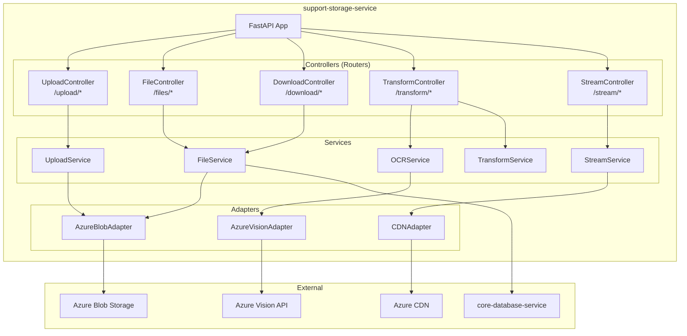
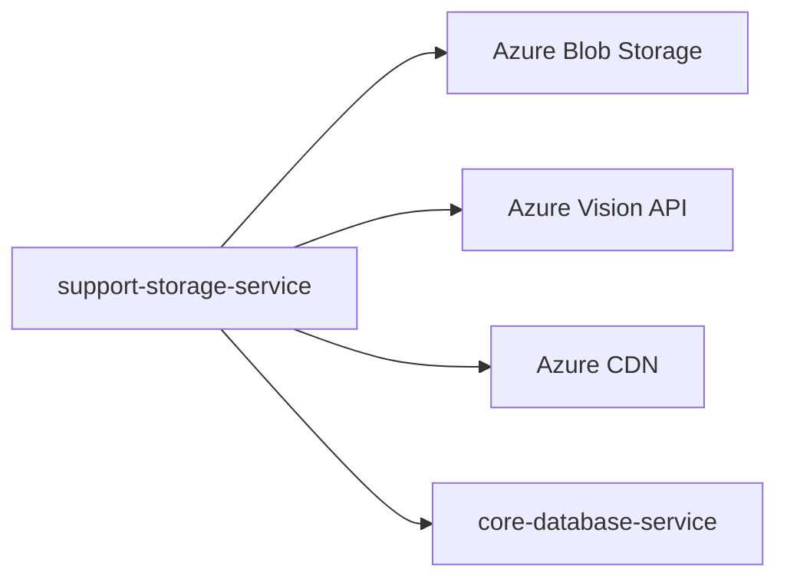
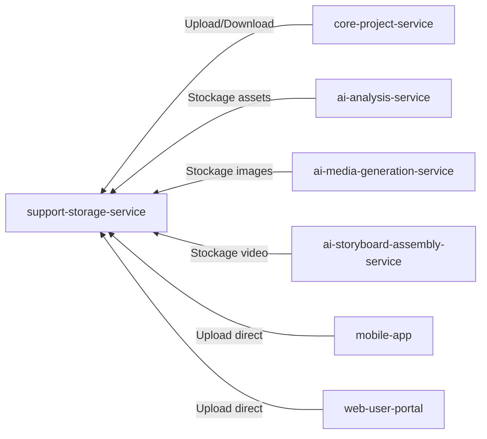
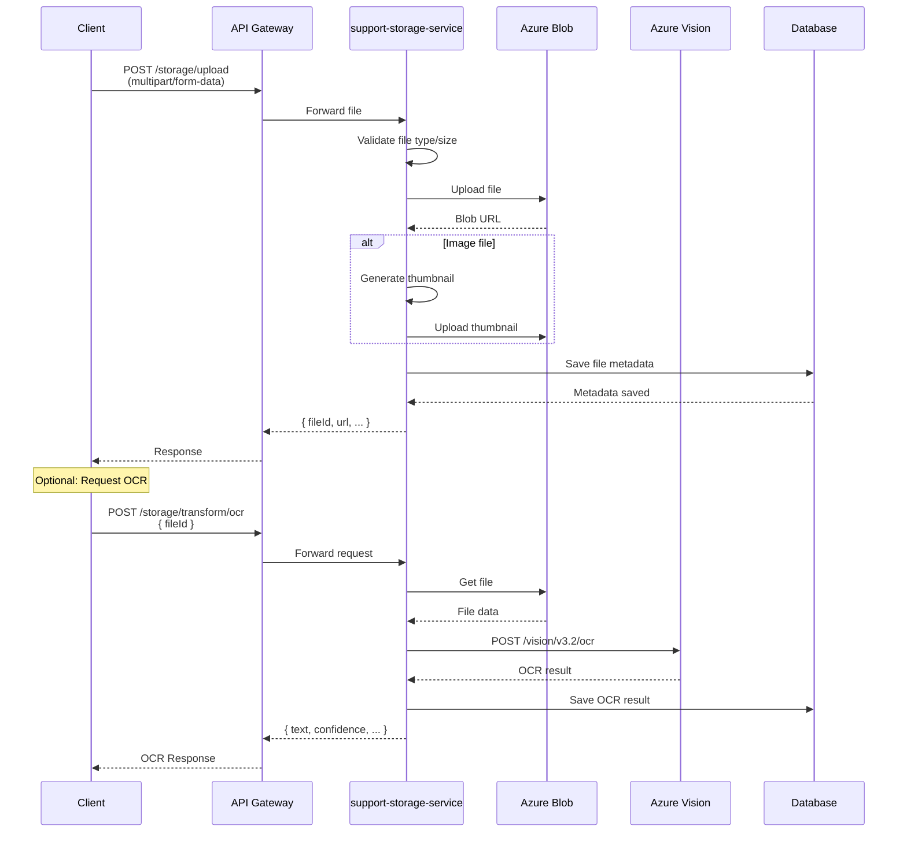
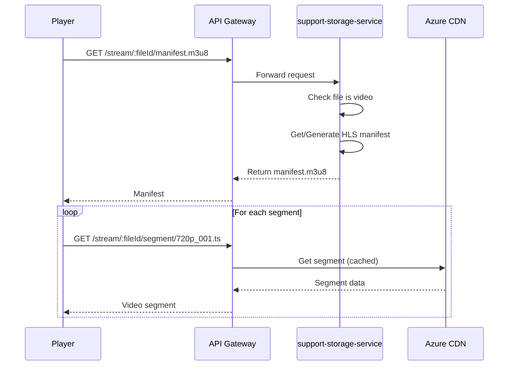
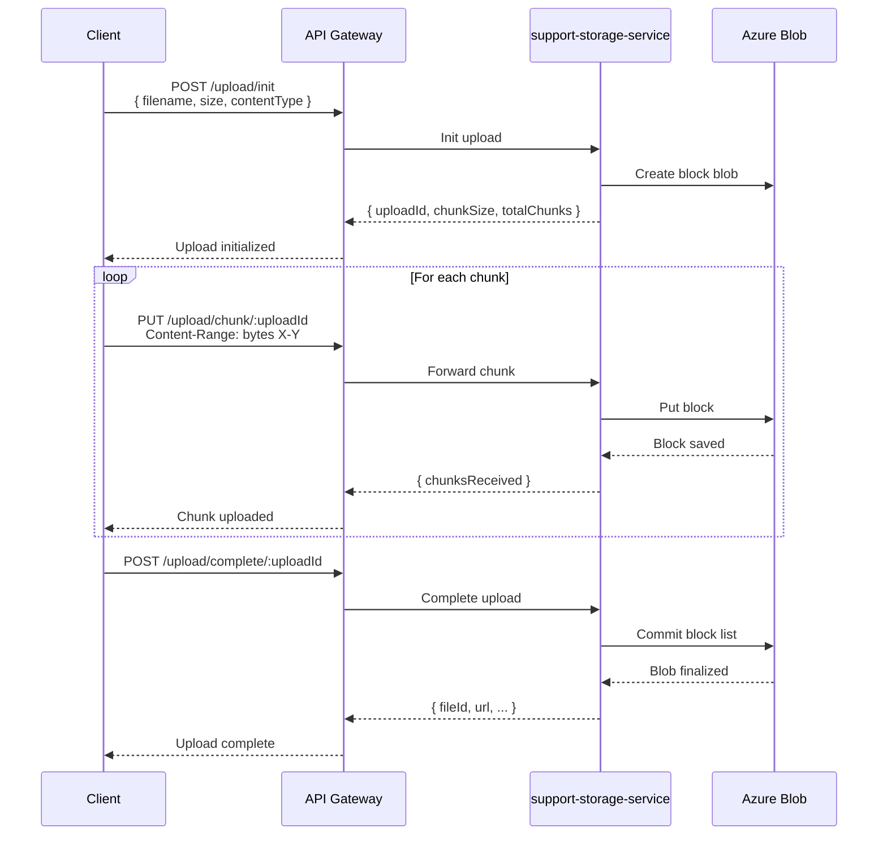

# support-storage-service

## Informations generales

| Propriete | Valeur |
|-----------|--------|
| **Repository** | support-storage-service |
| **Port** | 8089 |
| **Stack** | Python / FastAPI |
| **Phase** | 2 - Services Core |
| **Priorite** | ESSENTIEL (stockage fichiers) |

## Flows/Journeys concernes

| Flow | Role | Responsabilite |
|------|------|----------------|
| **Flow 2: Import fichier** | Owner | Upload fichiers, extraction texte |
| **Flow 3: OCR Scanner** | Owner | Upload images, OCR via Azure Vision |
| Flow 5: Generation | Support | Stockage images/audio/video generes |
| **Flow 6: Player** | Owner | Streaming video adaptatif |
| **Flow 7: Export** | Owner | Download videos |

## Architecture interne



## Controllers et Endpoints

### UploadController (`/api/v1/storage/upload`)

| Methode | Endpoint | Description | Auth |
|---------|----------|-------------|------|
| POST | `/` | Upload simple | Oui |
| POST | `/init` | Initier upload resumable | Oui |
| PUT | `/chunk/:uploadId` | Envoyer un chunk | Oui |
| POST | `/complete/:uploadId` | Finaliser upload | Oui |
| DELETE | `/abort/:uploadId` | Annuler upload | Oui |

```python
# POST /api/v1/storage/upload
# Content-Type: multipart/form-data
class UploadResponse(BaseModel):
    fileId: str
    filename: str
    contentType: str
    size: int
    url: str
    thumbnailUrl: Optional[str]
    createdAt: datetime

# POST /api/v1/storage/upload/init (Resumable upload)
class InitUploadRequest(BaseModel):
    filename: str
    contentType: str
    size: int  # Total size
    chunkSize: int = 5242880  # 5MB default

class InitUploadResponse(BaseModel):
    uploadId: str
    chunkSize: int
    totalChunks: int
    expiresAt: datetime
```

### FileController (`/api/v1/storage/files`)

| Methode | Endpoint | Description | Auth |
|---------|----------|-------------|------|
| GET | `/` | Lister fichiers utilisateur | Oui |
| GET | `/:fileId` | Metadata fichier | Oui |
| PATCH | `/:fileId` | Modifier metadata | Oui |
| DELETE | `/:fileId` | Supprimer fichier | Oui |
| POST | `/:fileId/copy` | Copier fichier | Oui |

```python
# GET /api/v1/storage/files/:fileId
class FileMetadata(BaseModel):
    id: str
    filename: str
    contentType: str
    size: int
    url: str
    thumbnailUrl: Optional[str]
    projectId: Optional[str]
    userId: str
    metadata: dict  # Custom metadata
    createdAt: datetime
    updatedAt: datetime
```

### DownloadController (`/api/v1/storage/download`)

| Methode | Endpoint | Description | Auth |
|---------|----------|-------------|------|
| GET | `/:fileId` | Download fichier | Oui |
| GET | `/:fileId/signed-url` | URL signee temporaire | Oui |

```python
# GET /api/v1/storage/download/:fileId/signed-url
class SignedUrlResponse(BaseModel):
    url: str
    expiresAt: datetime
    contentType: str
    size: int
```

### TransformController (`/api/v1/storage/transform`)

| Methode | Endpoint | Description | Auth |
|---------|----------|-------------|------|
| POST | `/ocr` | Extraction texte (OCR) | Oui |
| POST | `/resize` | Redimensionner image | Oui |
| POST | `/convert` | Convertir format | Oui |
| POST | `/extract-text` | Extraire texte de PDF | Oui |

```python
# POST /api/v1/storage/transform/ocr
class OCRRequest(BaseModel):
    fileId: str
    language: str = "fr"

class OCRResponse(BaseModel):
    text: str
    confidence: float
    pages: List[OCRPage]
    processingTime: float  # seconds

class OCRPage(BaseModel):
    pageNumber: int
    text: str
    blocks: List[OCRBlock]

class OCRBlock(BaseModel):
    text: str
    boundingBox: BoundingBox
    confidence: float
```

### StreamController (`/api/v1/storage/stream`)

| Methode | Endpoint | Description | Auth |
|---------|----------|-------------|------|
| GET | `/:fileId/manifest.m3u8` | Manifest HLS | Oui |
| GET | `/:fileId/segment/:segmentId` | Segment video | Oui |
| GET | `/:fileId/thumbnail` | Thumbnail video | Oui |

```python
# GET /api/v1/storage/stream/:fileId/manifest.m3u8
# Returns HLS manifest with adaptive bitrate options

# Example manifest
"""
#EXTM3U
#EXT-X-VERSION:3
#EXT-X-STREAM-INF:BANDWIDTH=800000,RESOLUTION=640x360
360p.m3u8
#EXT-X-STREAM-INF:BANDWIDTH=1400000,RESOLUTION=854x480
480p.m3u8
#EXT-X-STREAM-INF:BANDWIDTH=2800000,RESOLUTION=1280x720
720p.m3u8
"""
```

## Methodes et Fonctions

### UploadService

```python
class UploadService:
    async def upload_file(
        self,
        file: UploadFile,
        user_id: str,
        project_id: Optional[str] = None
    ) -> FileMetadata:
        """Upload simple d'un fichier"""
        # 1. Valider le fichier (type, taille)
        # 2. Generer unique filename
        # 3. Upload vers Azure Blob
        # 4. Generer thumbnail si image/video
        # 5. Sauvegarder metadata en DB
        pass

    async def init_resumable_upload(
        self,
        user_id: str,
        request: InitUploadRequest
    ) -> InitUploadResponse:
        """Initier un upload resumable pour gros fichiers"""
        pass

    async def upload_chunk(
        self,
        upload_id: str,
        chunk_number: int,
        chunk_data: bytes
    ) -> ChunkResponse:
        """Upload un chunk"""
        pass

    async def complete_upload(self, upload_id: str) -> FileMetadata:
        """Finaliser upload resumable"""
        pass
```

### OCRService

```python
class OCRService:
    async def extract_text(
        self,
        file_id: str,
        language: str = "fr"
    ) -> OCRResponse:
        """Extraire le texte d'une image via Azure Vision"""
        # 1. Recuperer l'image depuis Blob Storage
        # 2. Appeler Azure Vision API
        # 3. Parser et structurer le resultat
        pass

    async def extract_from_pdf(
        self,
        file_id: str,
        language: str = "fr"
    ) -> OCRResponse:
        """Extraire texte d'un PDF (avec OCR si necessaire)"""
        # 1. Convertir PDF en images
        # 2. OCR chaque page
        # 3. Combiner les resultats
        pass
```

### StreamService

```python
class StreamService:
    async def prepare_for_streaming(self, file_id: str) -> StreamingInfo:
        """Preparer une video pour le streaming HLS"""
        # 1. Transcoder en plusieurs resolutions
        # 2. Segmenter la video
        # 3. Generer manifests HLS
        # 4. Uploader vers CDN
        pass

    async def get_manifest(self, file_id: str) -> str:
        """Retourner le manifest HLS"""
        pass

    async def get_segment(
        self,
        file_id: str,
        resolution: str,
        segment_number: int
    ) -> bytes:
        """Retourner un segment video"""
        pass
```

## Communications Inter-services

### Appels sortants



| Service cible | Endpoint | Objectif |
|---------------|----------|----------|
| Azure Blob Storage | SDK | Stockage fichiers |
| Azure Vision API | `/vision/v3.2/ocr` | Extraction texte OCR |
| Azure CDN | SDK | Streaming video |
| core-database-service | `/api/v1/query` | Metadata fichiers |

### Appels entrants



## Diagrammes de sequence

### Sequence: Upload fichier avec OCR



### Sequence: Streaming video HLS



### Sequence: Upload resumable (gros fichier)



## Mocks pour tests

### Mock Azure Blob Storage

```python
# tests/mocks/azure_blob_mock.py
class MockBlobServiceClient:
    def __init__(self):
        self.blobs = {}

    def get_container_client(self, container_name):
        return MockContainerClient(self.blobs, container_name)

class MockContainerClient:
    def __init__(self, blobs, container_name):
        self.blobs = blobs
        self.container_name = container_name

    def get_blob_client(self, blob_name):
        return MockBlobClient(self.blobs, f"{self.container_name}/{blob_name}")

class MockBlobClient:
    def __init__(self, blobs, key):
        self.blobs = blobs
        self.key = key

    async def upload_blob(self, data, overwrite=True):
        self.blobs[self.key] = data
        return {"url": f"https://mock.blob.core.windows.net/{self.key}"}

    async def download_blob(self):
        return MockDownloadStream(self.blobs.get(self.key, b""))

class MockDownloadStream:
    def __init__(self, data):
        self.data = data

    async def readall(self):
        return self.data
```

### Mock Azure Vision API

```python
# tests/mocks/azure_vision_mock.py
class MockVisionClient:
    async def read(self, url: str, language: str = "fr"):
        return MockOCRResult()

class MockOCRResult:
    def __init__(self):
        self.status = "succeeded"
        self.analyze_result = MockAnalyzeResult()

class MockAnalyzeResult:
    def __init__(self):
        self.read_results = [
            MockReadResult(
                page=1,
                lines=[
                    MockLine("Texte extrait de l'image", confidence=0.95),
                    MockLine("Deuxieme ligne de texte", confidence=0.92),
                ]
            )
        ]

class MockReadResult:
    def __init__(self, page, lines):
        self.page = page
        self.lines = lines

class MockLine:
    def __init__(self, text, confidence):
        self.text = text
        self.confidence = confidence
        self.bounding_box = [0, 0, 100, 0, 100, 20, 0, 20]
```

## Exemple d'implementation

### Configuration Azure Blob

```python
# src/adapters/azure_blob.py
from azure.storage.blob.aio import BlobServiceClient
from azure.identity.aio import DefaultAzureCredential

class AzureBlobAdapter:
    def __init__(self):
        self.credential = DefaultAzureCredential()
        self.service_client = BlobServiceClient(
            account_url=f"https://{settings.AZURE_STORAGE_ACCOUNT}.blob.core.windows.net",
            credential=self.credential
        )
        self.container_client = self.service_client.get_container_client(
            settings.AZURE_STORAGE_CONTAINER
        )

    async def upload(self, filename: str, data: bytes, content_type: str) -> str:
        blob_client = self.container_client.get_blob_client(filename)
        await blob_client.upload_blob(
            data,
            content_settings=ContentSettings(content_type=content_type),
            overwrite=True
        )
        return blob_client.url

    async def download(self, filename: str) -> bytes:
        blob_client = self.container_client.get_blob_client(filename)
        stream = await blob_client.download_blob()
        return await stream.readall()

    async def delete(self, filename: str) -> None:
        blob_client = self.container_client.get_blob_client(filename)
        await blob_client.delete_blob()

    async def get_signed_url(self, filename: str, expires_in: int = 3600) -> str:
        blob_client = self.container_client.get_blob_client(filename)
        sas_token = generate_blob_sas(
            account_name=settings.AZURE_STORAGE_ACCOUNT,
            container_name=settings.AZURE_STORAGE_CONTAINER,
            blob_name=filename,
            credential=self.credential,
            permission=BlobSasPermissions(read=True),
            expiry=datetime.utcnow() + timedelta(seconds=expires_in)
        )
        return f"{blob_client.url}?{sas_token}"
```

## Metriques de succes

| Metrique | Objectif | Description |
|----------|----------|-------------|
| Upload speed | > 50MB/s | Vitesse upload |
| OCR time | < 5s/page | Temps OCR par page |
| CDN hit ratio | > 95% | Cache hit pour streaming |
| Availability | > 99.9% | Disponibilite du service |
| Error rate | < 0.5% | Taux d'erreur uploads |
